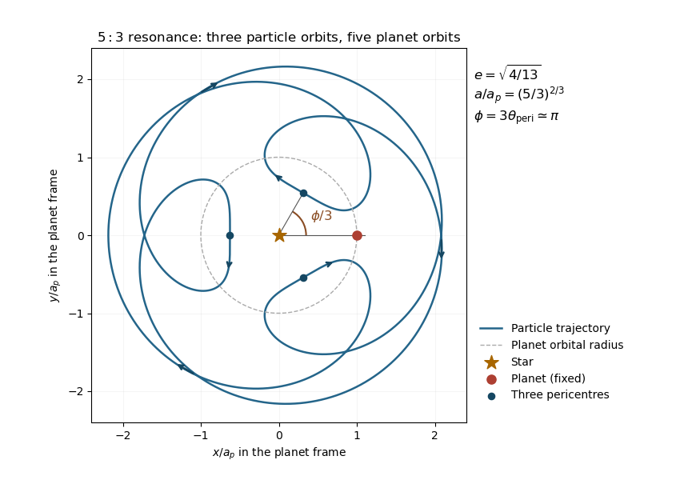

<h1 id="1/vii/solution">Solution</h1>

↑ **Parent:** [Vii](../vii.md)

For the $5:3$ [exterior mean-motion resonance](../../../../../../exterior-mean-motion-resonance.md), $p=3$, $q=2$. The truncated [dissipative resonant eccentricity equilibrium](../../../../../../dissipative-resonant-eccentricity-equilibrium.md) gives

$$
e=\sqrt{4/13}\simeq0.555,\qquad a/a_p=(5/3)^{2/3}\simeq1.406.
$$

For weak drag and $C>0$, take the [resonant-argument libration](../../../../../../resonant-argument-libration.md) centre $\phi_0\simeq\pi$. The [pericentre geometry of an exterior resonance](../../../../../../pericentre-geometry-of-an-exterior-resonance.md) then places the three pericentres at angles $\pi/3$, $\pi$, and $5\pi/3$ relative to the planet. The trajectory closes after three particle orbits and five planet orbits. It moves retrograde in the rotating frame on average but develops a prograde loop near each [periapsis](../../../../../../periapsis.md), because the [periapsis angular speed](../../../../../../periapsis-angular-speed.md) exceeds the planet's angular speed.

**[Figure 1](#1/vii/image-five-to-three-resonance-in-the-planet-s-rotating-frame). Five-to-three resonance in the planet's rotating frame**. A Keplerian geometric sketch with the planet fixed on the positive horizontal axis. The marked geometric angle is the pericentre angle, one third of the resonant argument. Arrows show the particle's direction of motion.

For a finite drag offset $\phi_0=\pi+\arcsin S$, rotate the whole particle pattern through $\arcsin S/3$. The sketch uses the eccentricity requested by the second-order model; $e\simeq0.555$ is not small, so the curve is an illustration of that approximation rather than a quantitatively accurate integration of the full dissipative resonance.

## ↑ Ancestors (11)

1. [Vii](../vii.md)
2. [1](../../1.md)
3. [Paper 316](../../../paper-316-split.md)
4. [Iii](../../../split.md)
5. [2019](../../../../split.md)
6. [Past exam of the mathematics course of the University of Cambridge](../../../../../split.md)
7. [Mathematics course of the University of Cambridge](../../../../../../mathematics-course-of-the-university-of-cambridge.md)
8. [Course of the University of Cambridge](../../../../../../course-of-the-university-of-cambridge.md)
9. [University of Cambridge](../../../../../../university-of-cambridge-split.md)
10. [List of universities](../../../../../../list-of-universities.md)
11. [Codex Wiki](../../../../../../split.md)
