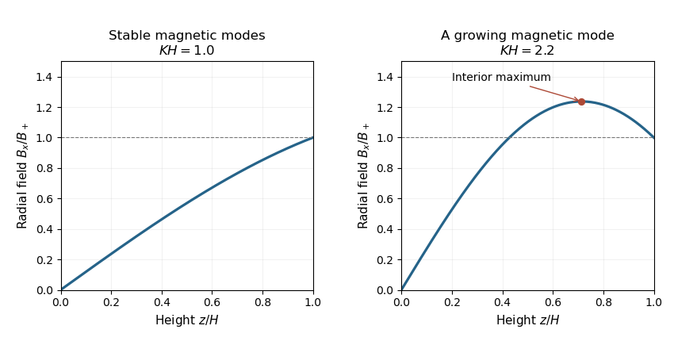

<h1 id="3/d/solution">Solution</h1>

↑ **Parent:** [D](../d.md)

Using $K^2=2q\mu_0\rho\Omega^2/B_z^2$, the [finite-thickness magnetorotational instability criterion](../../../../../../finite-thickness-magnetorotational-instability-criterion.md) is precisely

$$
\boxed{KH>\frac\pi2}.
$$

For the midplane-symmetric equilibrium with $B_+\ne0$, the absolute radial [magnetic field](../../../../../../magnetic-field.md) is

$$
|B_x(z)|=\frac{|B_+|}{|\sin(KH)|}|\sin(Kz)|,\qquad 0\leq z\leq H.
$$

Its first maximum occurs at $z_* =\pi/(2K)$. The instability condition puts $z_*$ strictly inside the disc: $z_*<H$. The magnitude rises from zero to this maximum, then decreases on a nonempty interval before the surface. Thus the unstable equilibrium exhibits [nonmonotonic magnetic bending](../../../../../../nonmonotonic-magnetic-bending.md), as illustrated below.

**[Figure 1](#3/d/image-monotonic-and-nonmonotonic-magnetic-bending). Monotonic and nonmonotonic magnetic bending**. The symmetric equilibrium profiles have $B_x(H)=B_+$. The weak-field example has an interior maximum and admits a growing magnetic mode.

The link between bending and instability concerns a nonzero imposed surface inclination. If $B_+=0$, the unbent equilibrium $B_x=0$ can still have [magnetorotational instability](../../../../../../magnetorotational-instability.md); the literal nonmonotonic-bending conclusion does not apply to that degenerate case. Resonances with $\sin(KH)=0$ also require the separate equilibrium analysis in part (b).

## ↑ Ancestors (11)

1. [D](../d.md)
2. [3](../../3.md)
3. [Paper 321](../../../paper-321-split.md)
4. [Iii](../../../split.md)
5. [2019](../../../../split.md)
6. [Past exam of the mathematics course of the University of Cambridge](../../../../../split.md)
7. [Mathematics course of the University of Cambridge](../../../../../../mathematics-course-of-the-university-of-cambridge.md)
8. [Course of the University of Cambridge](../../../../../../course-of-the-university-of-cambridge.md)
9. [University of Cambridge](../../../../../../university-of-cambridge-split.md)
10. [List of universities](../../../../../../list-of-universities.md)
11. [Codex Wiki](../../../../../../split.md)
