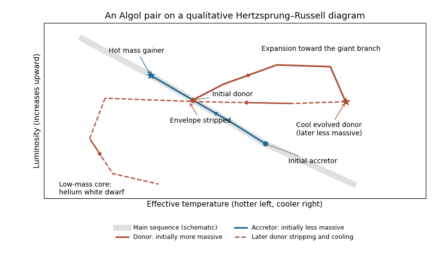

<h1 id="3/solution">Solution</h1>

↑ **Parent:** [3](../3.md)

An [Algol binary](../../../../../algol-binary.md) is a [semidetached binary](../../../../../semidetached-binary.md): a cool evolved donor fills its [Roche lobe](../../../../../roche-lobe.md), while a hotter and more massive [mass gainer](../../../../../mass-gaining-star.md) remains on or near the [main sequence](../../../../../main-sequence.md). [Roche-lobe overflow](../../../../../roche-lobe-overflow.md) feeds the companion through a stream, sometimes forming an [accretion disk](../../../../../accretion-disk.md). A suitably inclined system is an [eclipsing binary](../../../../../eclipsing-binary.md). The prototype's periodic dimming led John Goodricke to propose an occulting companion in 1783; his [original observations](https://doi.org/10.1098/rstl.1783.0027) record an early eclipse interpretation.

The [Algol paradox](../../../../../algol-paradox.md) arises if the present masses are assumed to have been constant: the lower-mass star is the more evolved one, even though coeval isolated stars of higher mass normally exhaust core fuel sooner. The [mass-luminosity relation](../../../../../mass-luminosity-relation.md) gives the rough nuclear-lifetime scaling $t_{\rm nuc}\propto M/L$, decreasing strongly with mass. The resolution is [binary mass-ratio reversal](../../../../../binary-mass-ratio-reversal.md). The present donor began as the more massive star, evolved first, and expanded into its [Roche lobe](../../../../../roche-lobe.md). Transferring much of its envelope made it less massive and made its initially less massive companion the present mass gainer. Their current masses therefore do not reveal their original evolutionary ordering.

On a [Hertzsprung-Russell diagram](../../../../../hertzsprung-russell-diagram.md), both components start on the [zero-age main sequence](../../../../../zero-age-main-sequence.md). The initially more massive donor leaves the [main sequence](../../../../../main-sequence.md) first, moving toward lower [effective temperature](../../../../../effective-temperature.md) and higher [luminosity](../../../../../luminosity.md) as a [subgiant](../../../../../subgiant.md) or [red giant](../../../../../red-giant.md). During envelope stripping, it remains oversized and overluminous for its decreasing mass because its evolved core continues to supply energy. The accretor gains mass, moves to higher [effective temperature](../../../../../effective-temperature.md) and [luminosity](../../../../../luminosity.md), and can undergo [stellar rejuvenation](../../../../../stellar-rejuvenation.md) if fresh hydrogen mixes into its core. After substantial envelope removal, the donor contracts to a hot stripped star; a sufficiently low-mass helium core ultimately becomes a [helium white dwarf](../../../../../helium-white-dwarf.md). The schematic below separates the two identities through the transfer episode rather than relabelling them when their masses cross.

**[Figure 1](#3/image-schematic-evolution-of-an-algol-pair). Schematic evolution of an Algol pair**. The donor begins more massive, evolves first, and loses its envelope. The accretor gains mass and moves to a hotter, more luminous main-sequence position. Dashed late donor evolution is illustrative; the diagram is not a numerical stellar-evolution track.

During the long-lived slow-transfer phase, [conservative binary mass transfer](../../../../../conservative-binary-mass-transfer.md) from the lighter donor to the heavier accretor widens the orbit: $d\log a=-2(1-q)d\log M_d>0$ for $q=M_d/M_a<1$ and $dM_d<0$. Transfer eventually stops when the donor's shrinking envelope can no longer maintain contact. The remnant can be a [helium white dwarf](../../../../../helium-white-dwarf.md) if it never ignites helium, or a more massive helium-burning stripped star if it does. Later the mass gainer also leaves the [main sequence](../../../../../main-sequence.md). Reverse [Roche-lobe overflow](../../../../../roche-lobe-overflow.md) onto the compact remnant can lead to a [common envelope](../../../../../common-envelope.md), leaving a close double remnant after successful envelope ejection, or to merger. The detailed outcome depends on both masses, the separation, and how much matter and [angular momentum](../../../../../angular-momentum.md) escaped during earlier transfer.

The approximate mass-ratio boundary in the question has a stability interpretation. For an ideal fully convective [donor star](../../../../../donor-star.md) with adiabatic [stellar radius response exponent](../../../../../stellar-radius-response-exponent.md) $\zeta_{\rm ad}=-1/3$, the conservative Roche-radius approximation gives $\zeta_L=2q-5/3$. [Dynamical stability of binary mass transfer](../../../../../dynamical-stability-of-binary-mass-transfer.md) requires $\zeta_{\rm ad}>\zeta_L$, so a long-lived stable system has

$$
\boxed{q<\frac23\simeq0.7}.
$$

A more massive convective donor expands relative to its shrinking lobe under mass loss, favouring runaway transfer and a [common envelope](../../../../../common-envelope.md) instead of a persistent Algol phase. This explains the approximate [Algol mass-ratio stability limit](../../../../../algol-mass-ratio-stability-limit.md) in that model. It is not a universal observational boundary: a donor with a [radiative envelope](../../../../../radiative-envelope.md) or a substantial evolved core has a different adiabatic response, and nonconservative loss changes the Roche-lobe response. [Van Rensbergen and collaborators' observed and modelled Algol distributions](https://arxiv.org/abs/1008.2620) include reported mass ratios above $0.7$ and discuss uncertainties in their determination. The literal claim that all Algols obey the same cutoff is therefore too strong.

A sufficiently wide system first reaches [Roche-lobe overflow](../../../../../roche-lobe-overflow.md) on the [red giant](../../../../../red-giant.md) branch, when the original donor is likely to have a deep [convective envelope](../../../../../convective-envelope.md). Straightforward conservative overflow while that donor is still more massive is then prone to dynamical runaway and orbital contraction in a [common envelope](../../../../../common-envelope.md); it does not naturally yield a wide, long-lived Algol-like configuration. A plausible route is substantial earlier envelope loss through a [stellar wind](../../../../../stellar-wind.md), possibly [tidally enhanced stellar wind](../../../../../tidally-enhanced-stellar-wind.md) loss, reducing or reversing the mass ratio before contact. [Wind mass transfer in a binary star](../../../../../wind-mass-transfer-in-a-binary-star.md) can also increase the companion's mass. The lower donor mass, reduced envelope and larger core fraction make later transfer easier to stabilize. Alternatively, a detached pair with the same reversed evolutionary appearance may be interacting only through a wind and need never have undergone overflow. Its current width alone does not uniquely determine the initial orbit, but it indicates that prior mass loss or a more general nonconservative history must be considered, rather than applying the simple conservative convective-donor picture unchanged.

## ↑ Ancestors (10)

1. [3](../3.md)
2. [Paper 322](../../paper-322-split.md)
3. [Iii](../../split.md)
4. [2019](../../../split.md)
5. [Past exam of the mathematics course of the University of Cambridge](../../../../split.md)
6. [Mathematics course of the University of Cambridge](../../../../../mathematics-course-of-the-university-of-cambridge.md)
7. [Course of the University of Cambridge](../../../../../course-of-the-university-of-cambridge.md)
8. [University of Cambridge](../../../../../university-of-cambridge-split.md)
9. [List of universities](../../../../../list-of-universities.md)
10. [Codex Wiki](../../../../../split.md)
