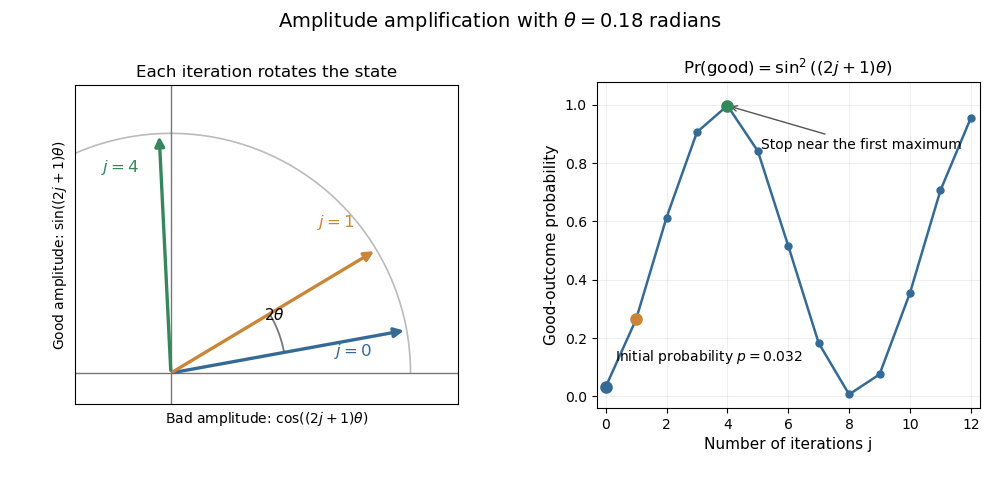

# Paper 324

↑ **Parent:** [Iii](../iii.md)

[https://www.maths.cam.ac.uk/postgrad/part-iii/files/pastpapers/2019/paper_324.pdf](https://www.maths.cam.ac.uk/postgrad/part-iii/files/pastpapers/2019/paper_324.pdf)

**Table of contents**

- [1](#1)
  - [a](#1/a)
    - [i](#1/a/i)
      - [Solution](#1/a/i/solution)
    - [ii](#1/a/ii)
      - [Solution](#1/a/ii/solution)
    - [iii](#1/a/iii)
      - [Solution](#1/a/iii/solution)
  - [b](#1/b)
    - [Solution](#1/b/solution)
- [2](#2)
  - [a](#2/a)
    - [Solution](#2/a/solution)
  - [b](#2/b)
    - [i](#2/b/i)
      - [Solution](#2/b/i/solution)
    - [ii](#2/b/ii)
      - [Solution](#2/b/ii/solution)
    - [iii](#2/b/iii)
      - [Solution](#2/b/iii/solution)
    - [iv](#2/b/iv)
      - [Solution](#2/b/iv/solution)
- [3](#3)
  - [a](#3/a)
    - [i](#3/a/i)
      - [Solution](#3/a/i/solution)
    - [ii](#3/a/ii)
      - [Solution](#3/a/ii/solution)
    - [iii](#3/a/iii)
      - [Solution](#3/a/iii/solution)
  - [b](#3/b)
    - [i](#3/b/i)
      - [Solution](#3/b/i/solution)
    - [ii](#3/b/ii)
      - [Solution](#3/b/ii/solution)
- [4](#4)
  - [a](#4/a)
    - [i](#4/a/i)
      - [Solution](#4/a/i/solution)
    - [ii](#4/a/ii)
      - [Solution](#4/a/ii/solution)
  - [b](#4/b)
    - [Solution](#4/b/solution)

## 1

↑ **Parent:** [Paper 324](paper-324.md)

<h3 id="1/a">a</h3>

↑ **Parent:** [1](#1)

<h4 id="1/a/i">i</h4>

↑ **Parent:** [A](#1/a)

<h5 id="1/a/i/solution">Solution</h5>

↑ **Parent:** [I](#1/a/i)

The [hidden subgroup problem](../../../quantum-theory.md#hidden-subgroup-problem) is to recover a [subgroup](../../../group.md#subgroup) $K\leq G$, usually by giving [generators of a group](../../../group.md#generator-of-a-group), from an [oracle machine](../../../computer-science.md#oracle-machine) providing $f:G\to Y$ with the promise

$$
\boxed{f(g)=f(h)\iff gK=hK.}
$$

Thus $f$ is constant on each left [coset](../../../group-theory.md#coset) and distinguishes different left [cosets](../../../group-theory.md#coset). The input includes an effective representation of elements of the [group](../../../group.md) and access to the group operations; the desired efficiency is measured against the number of bits describing an element, rather than necessarily against $|G|$.

<h4 id="1/a/ii">ii</h4>

↑ **Parent:** [A](#1/a)

<h5 id="1/a/ii/solution">Solution</h5>

↑ **Parent:** [Ii](#1/a/ii)

Write the [finite abelian group](../../../group.md#finite-abelian-group) additively. Its [group shift operator](../../../quantum-theory.md#group-shift-operator) is

$$
\boxed{U(h)|g\rangle=|g+h\rangle.}
$$

These [unitary operators](../../../vector-space.md#unitary-operator) form the [regular representation](../../../representation-theory.md#regular-representation) and commute. The representation-theoretic facts we use are that every [irreducible representation of a finite abelian group](../../../representation-theory.md#irreducible-representation-of-a-finite-abelian-group) is one-dimensional, there are $|G|$ such [characters of a representation](../../../representation-theory.md#character-of-a-representation), and their [character orthogonality](../../../representation-theory.md#character-orthogonality) gives an [orthonormal basis](../../../linear-algebra.md#orthonormal-basis) of functions on $G$. Each [linear character](../../../representation-theory.md#linear-character) here is a [group homomorphism](../../../group-theory.md#group-homomorphism) $\chi:G\to U(1)$, with $|\chi(g)|=1$.

For $\chi\in\widehat G$, the [character group of a finite abelian group](../../../group.md#character-group-of-a-finite-abelian-group), put

$$
|v_\chi\rangle=\frac1{\sqrt{|G|}}\sum_{g\in G}\overline{\chi(g)}|g\rangle.
$$

Changing variables to $u=g+h$ gives

$$
U(h)|v_\chi\rangle
=\frac1{\sqrt{|G|}}\sum_u\overline{\chi(u-h)}|u\rangle
=\boxed{\chi(h)|v_\chi\rangle}.
$$

The $|G|$ vectors $|v_\chi\rangle$ are therefore a common [eigenbasis](../../../linear-operator-theory.md#eigenbasis). Using $\chi(g)$ instead of its [complex conjugate](../../../complex-analysis.md#complex-conjugate) in their definition reverses every [eigenphase](../../../vector-space.md#eigenphase); this is merely the [quantum Fourier transform](../../../quantum-theory.md#quantum-fourier-transform) sign convention.

<h4 id="1/a/iii">iii</h4>

↑ **Parent:** [A](#1/a)

<h5 id="1/a/iii/solution">Solution</h5>

↑ **Parent:** [Iii](#1/a/iii)

Measure the [coset state](../../../quantum-theory.md#coset-state) in the common [eigenbasis](../../../linear-operator-theory.md#eigenbasis) $\{|v_\chi\rangle\}$ of the [group shift operators](../../../quantum-theory.md#group-shift-operator). Its overlap is

$$
\langle v_\chi|g_0+K\rangle
=\frac{\chi(g_0)}{\sqrt{|G||K|}}\sum_{k\in K}\chi(k).
$$

The [character-sum cancellation lemma](../../../group.md#character-sum-cancellation-lemma) makes this sum $|K|$ when $\chi$ is trivial on $K$, and zero otherwise. Hence, with $K^\perp$ the [annihilator of a subgroup of a finite abelian group](../../../group.md#annihilator-of-a-subgroup-of-a-finite-abelian-group),

$$
\boxed{\Pr(\chi)=\begin{cases}|K|/|G|,&\chi\in K^\perp,\\0,&\chi\notin K^\perp.\end{cases}}
$$

Since $|K^\perp|=|G|/|K|$, this is the [uniform distribution on a finite set](../../../discrete-probability-distribution.md#discrete-uniform-distribution) $K^\perp$. The factor $\chi(g_0)$ has [modulus](../../../complex-analysis.md#modulus) one, so the distribution is independent of $g_0$. This is [abelian hidden-subgroup Fourier sampling](../../../quantum-theory.md#abelian-hidden-subgroup-fourier-sampling).

<h3 id="1/b">b</h3>

↑ **Parent:** [1](#1)

<h4 id="1/b/solution">Solution</h4>

↑ **Parent:** [B](#1/b)

The distinct values in one period imply that $r$ is the least positive period, $r\mid N$, and $|Y|=r$. Write $x=j+tr$, where $0\leq j<r$ and $0\leq t<N/r$. Use the positive-exponent [quantum Fourier transform](../../../quantum-theory.md#quantum-fourier-transform) convention already used in the concept article. The amplitude of first-register value $y$ is

$$
\frac1N\sum_{j=0}^{r-1}e^{2\pi ijy/N}|f(j)\rangle
\sum_{t=0}^{N/r-1}e^{2\pi itry/N}.
$$

By the [root-of-unity filter](../../../algebra.md#root-of-unity-filter), the inner sum vanishes unless $y=mN/r$. Define

$$
\boxed{M=\{mN/r:0\leq m<r\},\qquad
|e_{mN/r}\rangle=\frac1{\sqrt r}\sum_{j=0}^{r-1}e^{2\pi imj/r}|f(j)\rangle.}
$$

The distinct $f(j)$ give an [orthonormal basis](../../../linear-algebra.md#orthonormal-basis) of the second register, and the transformed state is

$$
|\xi\rangle=\frac1{\sqrt r}\sum_{m=0}^{r-1}|mN/r\rangle|e_{mN/r}\rangle.
$$

Reindexing $j+l$ modulo $r$ shows

$$
\boxed{U_l|e_{mN/r}\rangle=e^{-2\pi iml/r}|e_{mN/r}\rangle.}
$$

Consequently measurement in this common [eigenbasis](../../../linear-operator-theory.md#eigenbasis) returns each $m$ with probability $1/r$; the corresponding [eigenvalue](../../../linear-operator-theory.md#eigenvalue) of $U_1$ is a uniformly sampled $r$th [root of unity](../../../algebra.md#root-of-unity). A single measured phase $-m/r$ reveals the denominator $r/\gcd(m,r)$, which need not be $r$. Repeated samples permit [exact period recovery from a Fourier sample](../../../quantum-theory.md#exact-period-recovery-from-a-fourier-sample), for example by taking the [least common multiple](../../../number-theory.md#least-common-multiple) of their reduced denominators. The simultaneous eigenspaces and their probabilities depend on $r$, not on the particular labels $f(j)$.

## 2

↑ **Parent:** [Paper 324](paper-324.md)

<h3 id="2/a">a</h3>

↑ **Parent:** [2](#2)

<h4 id="2/a/solution">Solution</h4>

↑ **Parent:** [A](#2/a)

Let $\Pi$ be the [orthogonal projection](../../../hilbert-space.md#orthogonal-projection) onto the good [linear subspace](../../../vector-space.md#vector-subspace) $\mathcal G$, and let $|\psi\rangle$ be a prepared unit vector with $p=\langle\psi|\Pi|\psi\rangle$. For $0<p<1$, define

$$
\sin\theta=\sqrt p,\qquad
|g\rangle=\frac{\Pi|\psi\rangle}{\sqrt p},\qquad
|b\rangle=\frac{(I-\Pi)|\psi\rangle}{\sqrt{1-p}}.
$$

The [amplitude amplification theorem](../../../quantum-theory.md#amplitude-amplification) states that, if the [reflection operators](../../../quantum-theory.md#reflection-operator) about the initial state and the good subspace can be implemented, the iteration

$$
Q=(2|\psi\rangle\langle\psi|-I)(I-2\Pi)
$$

satisfies

$$
\boxed{Q^j|\psi\rangle=\sin((2j+1)\theta)|g\rangle+\cos((2j+1)\theta)|b\rangle.}
$$

To prove it, the two reflections preserve the [linear span](../../../vector-space.md#linear-span) of $|g\rangle,|b\rangle$. In this ordered [orthonormal basis](../../../linear-algebra.md#orthonormal-basis), direct multiplication gives

$$
Q=\begin{pmatrix}\cos2\theta&\sin2\theta\\-\sin2\theta&\cos2\theta\end{pmatrix}.
$$

Multiplying this [rotation matrix](../../../linear-algebra.md#rotation-matrix) by $(\sin\alpha,\cos\alpha)^T$ replaces $\alpha$ by $\alpha+2\theta$, proving the formula by [mathematical induction](../../../foundations-of-mathematics.md#mathematical-induction).

For known $0<p\leq1/2$, choose $j$ to be a nearest nonnegative integer to $\pi/(4\theta)-1/2$. Then $|(2j+1)\theta-\pi/2|\leq\theta$, so measurement finds the good subspace with probability at least $1-p$, using $O(p^{-1/2})$ iterations. For $p>1/2$, measurement of the initial state already has constant success probability. If $p=1$ success is certain; if $p=0$ these reflections cannot create any good component. If $|\psi\rangle=A|0\rangle$, the initial-state reflection is $A(2|0\rangle\langle0|-I)A^\dagger$, implemented using [quantum state preparation](../../../quantum-circuit.md#quantum-state-preparation) and its [inverse quantum circuit](../../../quantum-theory.md#inverse-quantum-circuit).

**[Figure 1](#2/a/image-amplitude-amplification-as-a-rotation). Amplitude amplification as a rotation**. Each iteration adds the angle $2\theta$ in the good-bad plane. The probability rises near one and then falls again, so the stopping time matters.

<h3 id="2/b">b</h3>

↑ **Parent:** [2](#2)

<h4 id="2/b/i">i</h4>

↑ **Parent:** [B](#2/b)

<h5 id="2/b/i/solution">Solution</h5>

↑ **Parent:** [I](#2/b/i)

The map $x\mapsto-x\pmod K$ is a [bijection](../../../function.md#bijection) and an [involution](../../../group-theory.md#involution), so its [permutation matrix](../../../vector-space.md#permutation-matrix) satisfies

$$
\boxed{S^\dagger=S,\qquad S^2=I.}
$$

In particular $S^\dagger S=I$, which proves that $S$ is a [unitary operator](../../../vector-space.md#unitary-operator). Equivalently, it permutes the [computational basis](../../../quantum-theory.md#computational-basis) and therefore preserves every [inner product](../../../linear-algebra.md#inner-product).

<h4 id="2/b/ii">ii</h4>

↑ **Parent:** [B](#2/b)

<h5 id="2/b/ii/solution">Solution</h5>

↑ **Parent:** [Ii](#2/b/ii)

Applying the two [modular-addition quantum oracles](../../../quantum-theory.md#modular-addition-quantum-oracle) consecutively adds $h(x)+r(x)=0\pmod M$ to the answer register. Thus

$$
\boxed{U_r=U_h^{-1}.}
$$

Let $S_M|y\rangle=|-y\pmod M\rangle$. Applying $I\otimes S_M$, then $U_h$, then $I\otimes S_M$ gives

$$
|x,y\rangle\longmapsto|x,-y\rangle
\longmapsto|x,-y+h(x)\rangle
\longmapsto|x,y-h(x)\rangle.
$$

Therefore

$$
\boxed{U_h^{-1}=(I\otimes S_M)U_h(I\otimes S_M),}
$$

using one query and two [unitary operators](../../../vector-space.md#unitary-operator) independent of $h$. This is [modular-oracle inversion by negation](../../../quantum-theory.md#modular-oracle-inversion-by-negation).

<h4 id="2/b/iii">iii</h4>

↑ **Parent:** [B](#2/b)

<h5 id="2/b/iii/solution">Solution</h5>

↑ **Parent:** [Iii](#2/b/iii)

Let the known [phase gate](../../../quantum-theory.md#phase-gate) on the answer register be

$$
P|y\rangle=(-1)^{[y^4\leq N]}|y\rangle,
$$

where the comparison uses ordinary [integers](../../../number-theory.md#integer), not [modular arithmetic](../../../number-theory.md#modular-arithmetic). A [reversible circuit](../../../computer-science.md#reversible-circuit) computes the predicate, applies a [Pauli Z gate](../../../quantum-theory.md#pauli-z-gate) to its flag, then performs [uncomputation](../../../quantum-theory.md#uncomputation).

The [compute-phase-uncompute construction](../../../quantum-theory.md#compute-phase-uncompute-construction) now gives

$$
|x,0\rangle\xrightarrow{U_f}|x,f(x)\rangle
\xrightarrow{I\otimes P}(-1)^{[f(x)^4\leq N]}|x,f(x)\rangle
\xrightarrow{U_f^{-1}}(-1)^{[f(x)^4\leq N]}|x,0\rangle.
$$

Use [modular-oracle inversion by negation](../../../quantum-theory.md#modular-oracle-inversion-by-negation) to realize the last operation with one further $U_f$ query. **Exactly two oracle queries implement $I_g$, returning the answer register and comparison workspace to their initial states.**

<h4 id="2/b/iv">iv</h4>

↑ **Parent:** [B](#2/b)

<h5 id="2/b/iv/solution">Solution</h5>

↑ **Parent:** [Iv](#2/b/iv)

An injective self-map of the finite set $\mathbb Z_N$ is a [bijection](../../../function.md#bijection). For sufficiently large $N$, exactly

$$
m=\lfloor N^{1/4}\rfloor+1
$$

outputs satisfy the integer comparison, so there are exactly $m$ good inputs. Prepare the [uniform superposition state](../../../quantum-circuit.md#uniform-superposition-state) $|\psi\rangle=N^{-1/2}\sum_x|x\rangle$, whose good probability is

$$
p=\frac mN=\Theta(N^{-3/4}).
$$

Use the phase oracle from the previous part and the reflection $2|\psi\rangle\langle\psi|-I$. The [amplitude amplification theorem](../../../quantum-theory.md#amplitude-amplification) requires $O(p^{-1/2})$ iterations; each uses two $U_f$ queries, while the state preparation and its reflection are independent of $f$. With the nearest-integer iteration count from that theorem, the failure probability is at most $p$, tending to zero. Therefore the success probability eventually exceeds $0.9$, with

$$
\boxed{O(N^{3/8})\text{ queries to }U_f.}
$$

This is a bound on [quantum query complexity](../../../computer-science.md#quantum-query-complexity); implementation costs of the known gates are not counted as oracle queries.

## 3

↑ **Parent:** [Paper 324](paper-324.md)

<h3 id="3/a">a</h3>

↑ **Parent:** [3](#3)

<h4 id="3/a/i">i</h4>

↑ **Parent:** [A](#3/a)

<h5 id="3/a/i/solution">Solution</h5>

↑ **Parent:** [I](#3/a/i)

The [spectral norm](../../../continuous-dual-space.md#matrix-2-norm) is the [operator norm](../../../continuous-dual-space.md#operator-norm) induced by the [Euclidean norm](../../../functional-analysis.md#euclidean-norm):

$$
\|A\|=\sup_{v\ne0}\frac{\|Av\|_2}{\|v\|_2}
=\sqrt{\lambda_{\max}(A^\dagger A)}.
$$

The [Pauli operators](../../../quantum-circuit.md#pauli-operator) $X_1$ and $Z_2$ act on different [qubits](../../../quantum-mechanics.md#qubit), and each is a [unitary operator](../../../vector-space.md#unitary-operator). Their product is therefore unitary and preserves the norm of every vector. Hence

$$
\boxed{\|X_1Z_2\|=1.}
$$

<h4 id="3/a/ii">ii</h4>

↑ **Parent:** [A](#3/a)

<h5 id="3/a/ii/solution">Solution</h5>

↑ **Parent:** [Ii](#3/a/ii)

For finite-dimensional [matrices](../../../vector-space.md#matrix) $A_1,\ldots,A_m$, the [Lie-Trotter product formula](../../../numerical-analysis.md#lie-product-formula) states

$$
\boxed{e^{t\sum_{j=1}^m A_j}
=\lim_{k\to\infty}\left(e^{tA_1/k}\cdots e^{tA_m/k}\right)^k,}
$$

where convergence is in [operator norm](../../../continuous-dual-space.md#operator-norm). In particular, for [Hermitian matrices](../../../hilbert-space.md#hermitian-operator) $H_j$, set $A_j=-iH_j$ to obtain a product of [unitary operators](../../../vector-space.md#unitary-operator) approximating $e^{-it\sum_jH_j}$.

<h4 id="3/a/iii">iii</h4>

↑ **Parent:** [A](#3/a)

<h5 id="3/a/iii/solution">Solution</h5>

↑ **Parent:** [Iii](#3/a/iii)

The printed sum contains $Z_n$ although the stated labels end at $n-1$. We use the natural periodic convention $Z_n=Z_0$, with $n\geq3$. If an open chain was intended, omitting the final term gives the same asymptotic bound.

Set $H_j=X_{j-1}Z_j$, with indices modulo $n$, and implement the [product-formula Hamiltonian simulation](../../../quantum-theory.md#product-formula-hamiltonian-simulation)

$$
\widetilde U=\left(\prod_{j=1}^n e^{-iH_j/k}\right)^k.
$$

Each factor acts on two [qubits](../../../quantum-mechanics.md#qubit), so it is a two-qubit [unitary operator](../../../vector-space.md#unitary-operator). More explicitly, if $a=j-1$, $b=j$, and $C_{a\to b}$ is a [controlled-NOT gate](../../../quantum-theory.md#controlled-not-gate),

$$
e^{-i\delta X_aZ_b}
=\mathsf H_a C_{a\to b}\,e^{-i\delta Z_b}\,C_{a\to b}\mathsf H_a,
$$

where $\mathsf H_a$ is a [Hadamard gate](../../../quantum-theory.md#hadamard-gate). This gives a constant number of one-qubit and two-qubit gates per factor; one-qubit gates can also be viewed as two-qubit gates tensored with the identity.

The [spectral norm](../../../continuous-dual-space.md#matrix-2-norm) obeys the [triangle inequality](../../../topological-analysis.md#triangle-inequality), [submultiplicativity of the operator norm](../../../continuous-dual-space.md#submultiplicativity-of-the-operator-norm), and invariance under multiplication by [unitary operators](../../../vector-space.md#unitary-operator). In particular, the [telescoping bound for products of operators](../../../continuous-dual-space.md#telescoping-bound-for-products-of-operators) gives $\|V^k-W^k\|\leq k\|V-W\|$ for unitary $V,W$. The [first-order unitary product-formula error bound](../../../numerical-analysis.md#first-order-unitary-product-formula-error-bound) consequently yields

$$
\|U-\widetilde U\|\leq\frac1{2k}\sum_{j<l}\|[H_j,H_l]\|.
$$

Only neighboring terms can have a nonzero [commutator](../../../lie-algebra.md#commutator), because all other supports are disjoint. There are $n$ neighboring unordered pairs, and $\|[H_j,H_l]\|\leq2\|H_j\|\|H_l\|=2$. Thus $\|U-\widetilde U\|\leq n/k$. Choosing $k>n/\varepsilon$ gives

$$
\boxed{O(n^2/\varepsilon)\text{ gates},\qquad\text{degree }2\text{ in }n\text{ for fixed }\varepsilon.}
$$

The coarser bound that counts all $\binom n2$ pairs also proves the often-used $O(n^3/\varepsilon)$ construction. Locality improves that cubic estimate to the quadratic bound above; neither assertion is a lower bound on the best possible circuit.

<h3 id="3/b">b</h3>

↑ **Parent:** [3](#3)

<h4 id="3/b/i">i</h4>

↑ **Parent:** [B](#3/b)

<h5 id="3/b/i/solution">Solution</h5>

↑ **Parent:** [I](#3/b/i)

Use a clean [quantum ancilla](../../../quantum-information-theory.md#quantum-ancilla) and apply the [quantum circuit](../../../quantum-circuit.md) $C$, then the [Pauli Z gate](../../../quantum-theory.md#pauli-z-gate) on the ancilla, then the [inverse quantum circuit](../../../quantum-theory.md#inverse-quantum-circuit) $C^\dagger$:

$$
|x,0\rangle\xrightarrow{C}|x,f(x)\rangle
\xrightarrow{I\otimes Z}(-1)^{f(x)}|x,f(x)\rangle
\xrightarrow{C^\dagger}(-1)^{f(x)}|x,0\rangle.
$$

This [compute-phase-uncompute construction](../../../quantum-theory.md#compute-phase-uncompute-construction) implements $A\otimes I$ on every input with the ancilla initially $|0\rangle$, and by [linearity](../../../vector-space.md#linearity) on any superposition of those inputs. The action on ancilla-$|1\rangle$ inputs need not coincide with $A\otimes I$; the question only requires the clean-ancilla subspace.

<h4 id="3/b/ii">ii</h4>

↑ **Parent:** [B](#3/b)

<h5 id="3/b/ii/solution">Solution</h5>

↑ **Parent:** [Ii](#3/b/ii)

Since $A|x\rangle=(-1)^{f(x)}|x\rangle$, the [spectral decomposition](../../../linear-operator-theory.md#spectral-decomposition) gives

$$
e^{iA}|x\rangle=e^{i(-1)^{f(x)}}|x\rangle.
$$

Replace the middle gate of the previous [compute-phase-uncompute construction](../../../quantum-theory.md#compute-phase-uncompute-construction) by

$$
e^{iZ}=\operatorname{diag}(e^i,e^{-i})=R_z(-2),
$$

a one-qubit [rotation about the z-axis](../../../quantum-circuit.md#rotation-about-the-z-axis). Then

$$
\boxed{C^\dagger(I\otimes e^{iZ})C\,|x,0\rangle
=e^{i(-1)^{f(x)}}|x,0\rangle.}
$$

The circuit uses the gates of $C$, their inverses, and one fixed rotation; it returns the [quantum ancilla](../../../quantum-information-theory.md#quantum-ancilla) to $|0\rangle$. The same construction implements $e^{itA}$ with middle gate $e^{itZ}$, an instance of [simulation of a computable diagonal Hamiltonian](../../../quantum-theory.md#simulation-of-a-computable-diagonal-hamiltonian).

## 4

↑ **Parent:** [Paper 324](paper-324.md)

<h3 id="4/a">a</h3>

↑ **Parent:** [4](#4)

<h4 id="4/a/i">i</h4>

↑ **Parent:** [A](#4/a)

<h5 id="4/a/i/solution">Solution</h5>

↑ **Parent:** [I](#4/a/i)

The usual sufficient input promises for the [HHL algorithm](../../../quantum-theory.md#hhl-algorithm) are efficient [quantum state preparation](../../../quantum-circuit.md#quantum-state-preparation) of the nonzero vector $b$, efficient access to a [sparse matrix](../../../vector-space.md#sparse-matrix) $A$ with at most $\operatorname{poly}(n)$ nonzero entries per row, and a [condition number](../../../linear-algebra.md#condition-number) $\kappa=\lambda_{\max}/\lambda_{\min}=\operatorname{poly}(n)$ after an efficiently known normalization. Both the positions and values of the nonzero [matrix elements](../../../vector-space.md#matrix-element) must be computable coherently in [polynomial time](../../../computer-science.md#polynomial-time). More generally, efficient [Hamiltonian simulation](../../../quantum-theory.md#hamiltonian-simulation) can replace the sparsity promise. We assume $A$ is invertible; if zero [eigenvalues](../../../linear-operator-theory.md#eigenvalue) occur, one must instead restrict $b$ to their [orthogonal complement](../../../hilbert-space.md#orthogonal-complement) and specify the desired inverse on that support.

With $a=\lambda_{\max}$ and a known bound $\kappa$, choose $c=a/\kappa\leq\lambda_{\min}$. The [HHL controlled reciprocal rotation](../../../quantum-theory.md#hhl-controlled-reciprocal-rotation) then succeeds with probability

$$
p_{\rm succ}=c^2\|A^{-1}|b\rangle\|^2\geq\frac{c^2}{a^2}=\boxed{\kappa^{-2}}.
$$

This is the required inverse-polynomial lower bound. In the usual approximate algorithm, inverse-polynomial requested error also gives polynomial runtime under these input promises. The original [HHL paper](https://arxiv.org/abs/0811.3171) states the dependence on sparsity, conditioning, and accuracy.

There is a qualification for a literally exact version. Representability of the [eigenvalues](../../../linear-operator-theory.md#eigenvalue) in $n$ bits does not itself make exact [quantum phase estimation](../../../quantum-theory.md#quantum-phase-estimation) efficient: using $e^{2\pi iA}$ requires controlled powers corresponding to evolution times as large as $2\pi2^{n-1}$. Under the paper's idealization we may describe their exact action, but polynomial runtime for that exact circuit additionally requires efficient implementations of those controlled powers, or equivalent efficient exact spectral access. Assuming an operation executes exactly does not bound its cost. This distinction is recorded in [cost of exact phase estimation on a dyadic spectrum](../../../quantum-theory.md#cost-of-exact-phase-estimation-on-a-dyadic-spectrum).

<h4 id="4/a/ii">ii</h4>

↑ **Parent:** [A](#4/a)

<h5 id="4/a/ii/solution">Solution</h5>

↑ **Parent:** [Ii](#4/a/ii)

Write the normalized input as $|b\rangle=\sum_j\beta_j|u_j\rangle$, where $A|u_j\rangle=\lambda_j|u_j\rangle$ and $\lambda_j>0$. Use a data register, an $n$-qubit eigenvalue register, and a flag [quantum ancilla](../../../quantum-information-theory.md#quantum-ancilla). Begin with $|b\rangle|0^n\rangle|0\rangle$.

Apply [exact quantum phase estimation](../../../quantum-theory.md#exact-quantum-phase-estimation) to $e^{2\pi iA}$. Its controlled evolutions and inverse [quantum Fourier transform](../../../quantum-theory.md#quantum-fourier-transform) produce

$$
\sum_j\beta_j|u_j\rangle|\ell_j\rangle|0\rangle,
\qquad \lambda_j=\ell_j/2^n.
$$

Apply the [HHL controlled reciprocal rotation](../../../quantum-theory.md#hhl-controlled-reciprocal-rotation), with $0<c\leq\lambda_{\min}$:

$$
|\ell_j\rangle|0\rangle\longmapsto
|\ell_j\rangle\left(\sqrt{1-c^2/\lambda_j^2}|0\rangle
+\frac c{\lambda_j}|1\rangle\right).
$$

The function of $\ell_j$ is computed by [quantum arithmetic](../../../quantum-circuit.md#quantum-arithmetic); the rotation is a [quantum variable rotation](../../../quantum-theory.md#quantum-variable-rotation). On a zero eigenvalue label with no input amplitude, define any unitary action, for example no rotation.

Run the inverse phase-estimation circuit. Because each amplitude multiplier depends only on $\lambda_j$, the eigenvalue register is reset to $|0^n\rangle$ on both flag branches. Measuring the flag and conditioning on outcome one leaves

$$
\boxed{|\xi\rangle=\frac{\sum_j\beta_j\lambda_j^{-1}|u_j\rangle}
{\sqrt{\sum_j|\beta_j|^2\lambda_j^{-2}}}
=\frac{A^{-1}b}{\|A^{-1}b\|}.}
$$

The successful unnormalized branch is $cA^{-1}|b\rangle$, giving the probability in the preceding part. The operations independent of $A,b$ are the [Hadamard gates](../../../quantum-theory.md#hadamard-gate) preparing the phase register, the inverse [quantum Fourier transform](../../../quantum-theory.md#quantum-fourier-transform), the reversible reciprocal/angle arithmetic, the controlled fixed-angle rotations, and the final flag measurement. [Uncomputation](../../../quantum-theory.md#uncomputation) removes all arithmetic workspace; the $A$-dependent controlled evolutions and the $b$-dependent state-preparation circuit supply the input-specific operations.

<h3 id="4/b">b</h3>

↑ **Parent:** [4](#4)

<h4 id="4/b/solution">Solution</h4>

↑ **Parent:** [B](#4/b)

Use a [reversible circuit](../../../computer-science.md#reversible-circuit) $T$ to compute an $L=O(n)$-bit representation of the angle into a workspace register, with all additional work bits retained:

$$
|x\rangle|0^L\rangle|0\rangle\xrightarrow{T}
|x\rangle|\theta_x\rangle|0\rangle.
$$

Write that representation as $\theta_x=\sum_{l=1}^L b_l(x)\alpha_l$, with known binary place values $\alpha_l$ (including the fixed scale and any integer bit). On the target, apply a [controlled unitary gate](../../../quantum-theory.md#controlled-unitary-gate) $R_y(2\alpha_l)$ controlled by each angle bit $b_l$. Rotations about the same axis add their angles, so their product is

$$
\prod_{l=1}^LR_y(2b_l\alpha_l)=R_y(2\theta_x),\qquad
R_y(2\theta_x)|0\rangle=\cos\theta_x|0\rangle+\sin\theta_x|1\rangle.
$$

Finally apply $T^\dagger$ to perform [uncomputation](../../../quantum-theory.md#uncomputation). The workspace returns to zero while the control register and rotated target remain unchanged; the construction works coherently on every superposition of $x$.

A [polynomial time](../../../computer-science.md#polynomial-time) classical calculation has a polynomial-size [reversible circuit](../../../computer-science.md#reversible-circuit) with [Toffoli gates](../../../quantum-theory.md#toffoli-gate), and each Toffoli gate has a constant-size decomposition into one-qubit and two-qubit gates. The $L$ controlled rotations are themselves two-qubit gates. Thus the total [quantum circuit](../../../quantum-circuit.md) size is **$\operatorname{poly}(n)$**. This is the [binary-angle implementation of a quantum variable rotation](../../../quantum-theory.md#binary-angle-implementation-of-a-quantum-variable-rotation); the stipulated angle precision is understood.

## ↑ Ancestors (8)

1. [Iii](../iii.md)
2. [2019](../../2019.md)
3. [Past exam of the mathematics course of the University of Cambridge](../../../past-exam-of-the-mathematics-course-of-the-university-of-cambridge.md)
4. [Mathematics course of the University of Cambridge](../../../university-of-cambridge.md#mathematics-course-of-the-university-of-cambridge)
5. [Course of the University of Cambridge](../../../university-of-cambridge.md#course-of-the-university-of-cambridge)
6. [University of Cambridge](../../../university-of-cambridge.md)
7. [List of universities](../../../README.md#list-of-universities)
8. [Codex Wiki](../../../README.md)
