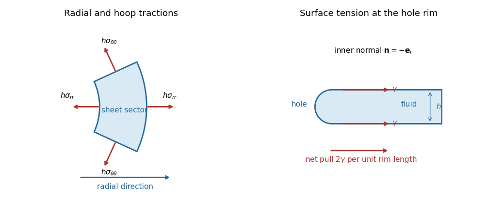

<h1 id="2/solution">Solution</h1>

↑ **Parent:** [2](../2.md)

For the stated [axisymmetric flow](../../../../../axisymmetric-flow.md), the diagonal components of the [rate-of-strain tensor](../../../../../strain-rate-tensor.md) are

$$
e_{rr}=u_r,\qquad e_{\theta\theta}=u/r,\qquad e_{zz}=w_z.
$$

Their sum is $u_r+u/r+w_z=0$, the [incompressibility condition](../../../../../incompressible-flow.md). In the leading thin-sheet approximation, vanishing tangential [traction](../../../../../traction.md) makes $u$ independent of $z$. The normal [stress boundary condition](../../../../../stress-boundary-condition.md) is $\sigma_{zz}=-p_{\rm ext}$, so the [Newtonian fluid stress tensor](../../../../../newtonian-fluid-stress-tensor.md) gives

$$
p=p_{\rm ext}+2\mu w_z=p_{\rm ext}-2\mu(u_r+u/r).
$$

Therefore

$$
\boxed{\sigma_{rr}=-p_{\rm ext}+4\mu u_r+2\mu u/r,\qquad
\sigma_{\theta\theta}=-p_{\rm ext}+2\mu u_r+4\mu u/r.}
$$

For the small annular sector, the inner and outer radial faces contribute $2\delta\theta\,\partial_r(rh\sigma_{rr})\delta r$ in the radial direction. The two azimuthal faces contribute $-2\delta\theta\,h\sigma_{\theta\theta}\delta r$: their hoop [tractions](../../../../../traction.md) have inward radial components. The combined radial force of the external pressure on the sloping upper and lower surfaces is $2\delta\theta\,r p_{\rm ext}h_r\delta r$.

**[Figure 1](#2/image-forces-on-an-annular-viscous-sheet-sector-and-capillary-traction-at-a-hole-edge). Forces on an annular viscous-sheet sector and capillary traction at a hole edge**. The left panel shows the radial and hoop tractions on the four vertical faces. The right panel shows the two surface-tension forces pulling the rounded hole edge into the sheet. The separate radial pressure force on the sloping broad surfaces is proportional to $p_{\rm ext}h_r$.

Neglecting inertia, [force balance](../../../../../force-balance.md) is thus

$$
\partial_r(rh\sigma_{rr})-h\sigma_{\theta\theta}+rp_{\rm ext}h_r=0.
$$

Substituting the two [stresses](../../../../../stress.md) cancels the terms involving $p_{\rm ext}h_r$ and gives the [axisymmetric viscous-sheet stretching equations](../../../../../axisymmetric-viscous-sheet-stretching-equations.md):

$$
\boxed{2\mu\left[\partial_r(2rhu_r+hu)-h(2u/r+u_r)\right]=rh\,\partial_rp_{\rm ext}.}
$$

Finally, [conservation of mass](../../../../../mass-conservation.md) in the sector gives

$$
\boxed{h_t+\frac1r\partial_r(rhu)=0.}
$$

## ↑ Ancestors (10)

1. [2](../2.md)
2. [Paper 329](../../paper-329-split.md)
3. [Iii](../../split.md)
4. [2019](../../../split.md)
5. [Past exam of the mathematics course of the University of Cambridge](../../../../split.md)
6. [Mathematics course of the University of Cambridge](../../../../../mathematics-course-of-the-university-of-cambridge.md)
7. [Course of the University of Cambridge](../../../../../course-of-the-university-of-cambridge.md)
8. [University of Cambridge](../../../../../university-of-cambridge-split.md)
9. [List of universities](../../../../../list-of-universities.md)
10. [Codex Wiki](../../../../../split.md)
