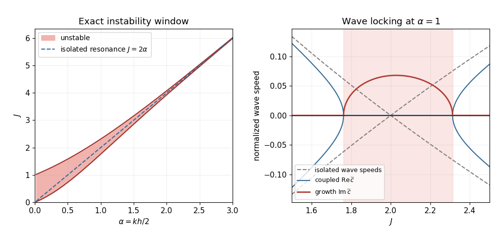

<h1 id="2/b/iii/solution">Solution</h1>

↑ **Parent:** [Iii](../iii.md)

For large $\alpha$, the coupling $e^{-kh}=e^{-2\alpha}$ is exponentially weak. If each interface were isolated, its [interfacial gravity waves](../../../../../../../interfacial-gravity-wave.md) would have dimensional [phase velocities](../../../../../../../phase-velocity.md) $U(z_\pm)\pm\sqrt d$, or

$$
\widetilde c=1\pm\sqrt{\frac J{2\alpha}},\qquad
\widetilde c=-1\pm\sqrt{\frac J{2\alpha}}.
$$

The upper-interface wave travelling against its positive local current has speed $1-\sqrt{J/(2\alpha)}$. The lower-interface wave travelling against its negative current has speed $-1+\sqrt{J/(2\alpha)}$. Their laboratory speeds match at zero when $J=2\alpha$. Weak interaction then produces [counterpropagating wave instability](../../../../../../../counterpropagating-wave-instability.md) rather than two independent travelling waves.

**[Figure 1](#2/b/iii/image-instability-band-and-resonance-of-the-two-interface-waves). Instability band and resonance of the two interface waves**. The shaded band lies between the exact neutral curves. The second panel fixes $\alpha=1$ and compares the isolated counterpropagating [phase velocities](../../../../../../../phase-velocity.md) with the imaginary [phase velocity](../../../../../../../phase-velocity.md) of the coupled unstable mode.

The band has the large-wavenumber form $J=2\alpha\pm2\alpha e^{-2\alpha}+O(\alpha e^{-4\alpha})$. Exactly at resonance, $\operatorname{Im}\widetilde c\sim e^{-2\alpha}/2$, so

$$
\boxed{k c_i\sim\frac{k\Delta U}{4}e^{-kh}.}
$$

Thus the instability window and [growth rate](../../../../../../../growth-rate.md) both become exponentially small as the interfaces become weakly coupled.

## ↑ Ancestors (12)

1. [Iii](../iii.md)
2. [B](../../b.md)
3. [2](../../../2.md)
4. [Paper 331](../../../../paper-331-split.md)
5. [Iii](../../../../split.md)
6. [2019](../../../../../split.md)
7. [Past exam of the mathematics course of the University of Cambridge](../../../../../../split.md)
8. [Mathematics course of the University of Cambridge](../../../../../../../mathematics-course-of-the-university-of-cambridge.md)
9. [Course of the University of Cambridge](../../../../../../../course-of-the-university-of-cambridge.md)
10. [University of Cambridge](../../../../../../../university-of-cambridge-split.md)
11. [List of universities](../../../../../../../list-of-universities.md)
12. [Codex Wiki](../../../../../../../split.md)
