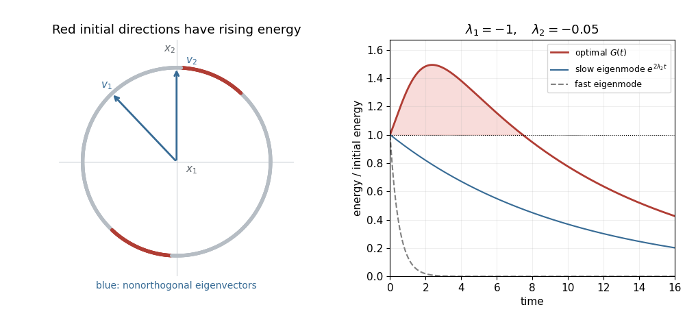

<h1 id="3/e/solution">Solution</h1>

↑ **Parent:** [E](../e.md)

At each fixed time, the maximum over nonzero initial conditions is the [optimal energy amplification of a linear system](../../../../../../optimal-energy-amplification-of-a-linear-system.md):

$$
G(t)=\max_{x_0\ne0}\frac{\|A(t)x_0\|_2^2}{\|x_0\|_2^2}=\sigma_{\max}(A(t))^2.
$$

Write $a=e^{\lambda_1t}$, $d=e^{\lambda_2t}$ and $b=(a-d)/(\lambda_1-\lambda_2)$. The [symmetric matrix](../../../../../../symmetric-matrix.md) $A^TA$ has [trace](../../../../../../matrix-trace.md) $\tau=a^2+b^2+d^2$ and [determinant](../../../../../../determinant.md) $a^2d^2$. Its largest [eigenvalue](../../../../../../eigenvalue.md) is

$$
\boxed{G(t)=\frac{\tau+\sqrt{\tau^2-4a^2d^2}}2.}
$$

An optimal initial condition is a [right singular vector](../../../../../../right-singular-vector.md) of $A(t)$ associated with its largest [singular value](../../../../../../singular-value.md).

**[Figure 2](#3/e/image-stable-eigenmodes-can-combine-to-produce-transient-energy-growth). Stable eigenmodes can combine to produce transient energy growth**. For $\lambda_1=-1$ and $\lambda_2=-0.05$, the red directions on the unit circle have positive instantaneous energy derivative. The [eigenvectors](../../../../../../eigenvector.md) are [nonorthogonal](../../../../../../nonorthogonal-vectors.md). The right panel compares the [optimal energy amplification of a linear system](../../../../../../optimal-energy-amplification-of-a-linear-system.md) with the monotonically decaying [energy](../../../../../../energy.md) of each eigenmode.

If $\lambda_2>\lambda_1$, let $\alpha=1/(\lambda_2-\lambda_1)$. Then $A(t)/e^{\lambda_2t}\to\begin{pmatrix}0&0\\\alpha&1\end{pmatrix}$, so the precise long-time asymptotic statement is

$$
\boxed{G(t)\sim(1+\alpha^2)e^{2\lambda_2t},\qquad \alpha^2=\frac1{(\lambda_2-\lambda_1)^2}.}
$$

The [Cauchy-Schwarz inequality](../../../../../../cauchy-schwarz-inequality.md) shows that the unit initial conditions achieving this leading factor are

$$
\boxed{x(0)=\pm\frac1{\sqrt{1+\alpha^2}}\begin{pmatrix}\alpha\\1\end{pmatrix}.}
$$

This is an [adjoint eigenvector](../../../../../../left-eigenvector.md), since $L^T(\alpha,1)^T=\lambda_2(\alpha,1)^T$. It differs from the right [eigenvector](../../../../../../eigenvector.md) $v_2=(0,1)^T$: the initial condition maximizes the projection onto the slow mode, whereas the eventual state aligns with that right eigenvector. For $\lambda_2<0$, even the optimal [energy](../../../../../../energy.md) ultimately decays to zero; the prefactor describes enhanced excitation of the slow mode.

## ↑ Ancestors (11)

1. [E](../e.md)
2. [3](../../3.md)
3. [Paper 331](../../../paper-331-split.md)
4. [Iii](../../../split.md)
5. [2019](../../../../split.md)
6. [Past exam of the mathematics course of the University of Cambridge](../../../../../split.md)
7. [Mathematics course of the University of Cambridge](../../../../../../mathematics-course-of-the-university-of-cambridge.md)
8. [Course of the University of Cambridge](../../../../../../course-of-the-university-of-cambridge.md)
9. [University of Cambridge](../../../../../../university-of-cambridge-split.md)
10. [List of universities](../../../../../../list-of-universities.md)
11. [Codex Wiki](../../../../../../split.md)
