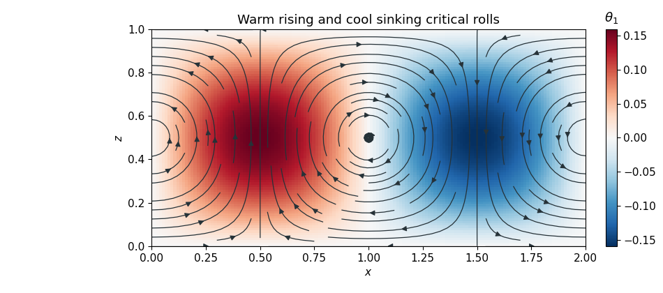

<h1 id="4/d/solution">Solution</h1>

↑ **Parent:** [D](../d.md)

At first order, $\nabla^2\psi_1+R_c\theta_{1x}=0$ and $\nabla^2\theta_1-\psi_{1x}=0$. Since $\nabla^2\psi_1=-2\pi^2\psi_1$ and $R_c=4\pi^2$, the first equation fixes $\theta_{1x}=\psi_1/2$. The homogeneous temperature boundary conditions and the second equation remove any horizontally uniform term, giving

$$
\boxed{\theta_1=\frac1{2\pi}\sin(\pi x)\sin(\pi z).}
$$

At second order,

$$
\nabla^2\psi_2+R_c\theta_{2x}=0,\qquad
\nabla^2\theta_2-\psi_{2x}=J(\psi_1,\theta_1)=\frac\pi4\sin(2\pi z).
$$

The forcing is horizontally uniform. Taking no additional critical-mode component, a solution satisfying the homogeneous boundaries is

$$
\boxed{\psi_2=0,\qquad\theta_2=-\frac1{16\pi}\sin(2\pi z).}
$$

This [mean-temperature correction in weakly nonlinear Darcy convection](../../../../../../mean-temperature-correction-in-weakly-nonlinear-darcy-convection.md) modifies the vertical temperature gradient and provides the feedback that saturates the convection.

**[Figure 3](#4/d/image-critical-darcy-convection-rolls-and-their-temperature-perturbation). Critical Darcy convection rolls and their temperature perturbation**. Arrows show the [velocity](../../../../../../velocity.md) generated by the [streamfunction](../../../../../../stream-function.md) $\psi_1=\cos(\pi x)\sin(\pi z)$. Colour shows $\theta_1$ on a horizontal period of length two: warm perturbations rise and cool perturbations sink.

## ↑ Ancestors (11)

1. [D](../d.md)
2. [4](../../4.md)
3. [Paper 331](../../../paper-331-split.md)
4. [Iii](../../../split.md)
5. [2019](../../../../split.md)
6. [Past exam of the mathematics course of the University of Cambridge](../../../../../split.md)
7. [Mathematics course of the University of Cambridge](../../../../../../mathematics-course-of-the-university-of-cambridge.md)
8. [Course of the University of Cambridge](../../../../../../course-of-the-university-of-cambridge.md)
9. [University of Cambridge](../../../../../../university-of-cambridge-split.md)
10. [List of universities](../../../../../../list-of-universities.md)
11. [Codex Wiki](../../../../../../split.md)
