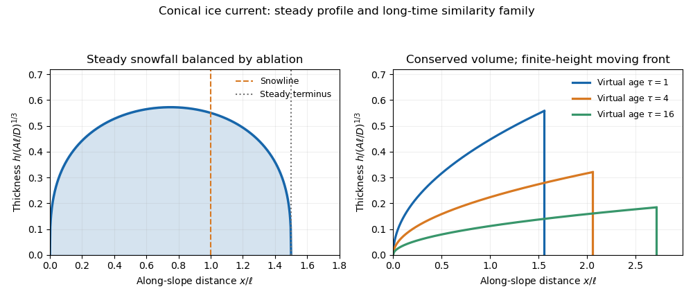

# Paper 332

↑ **Parent:** [Iii](../iii.md)

[https://www.maths.cam.ac.uk/postgrad/part-iii/files/pastpapers/2019/paper_332.pdf](https://www.maths.cam.ac.uk/postgrad/part-iii/files/pastpapers/2019/paper_332.pdf)

**Table of contents**

- [1](#1)
  - [Solution](#1/solution)
  - [a](#1/a)
    - [Solution](#1/a/solution)
  - [b](#1/b)
    - [Solution](#1/b/solution)
  - [c](#1/c)
    - [Solution](#1/c/solution)
- [2](#2)
  - [a](#2/a)
    - [Solution](#2/a/solution)
  - [b](#2/b)
    - [i](#2/b/i)
      - [Solution](#2/b/i/solution)
    - [ii](#2/b/ii)
      - [Solution](#2/b/ii/solution)
    - [iii](#2/b/iii)
      - [Solution](#2/b/iii/solution)
    - [iv](#2/b/iv)
      - [Solution](#2/b/iv/solution)
- [3](#3)
  - [a](#3/a)
    - [Solution](#3/a/solution)
  - [b](#3/b)
    - [Solution](#3/b/solution)
  - [c](#3/c)
    - [Solution](#3/c/solution)
- [4](#4)
  - [a](#4/a)
    - [Solution](#4/a/solution)
  - [b](#4/b)
    - [Solution](#4/b/solution)
  - [c](#4/c)
    - [Solution](#4/c/solution)

## 1

↑ **Parent:** [Paper 332](paper-332.md)

<h3 id="1/solution">Solution</h3>

↑ **Parent:** [1](#1)

Use the [Dupuit approximation](../../../porous-media-flow.md#dupuit-approximation): the saturated region is shallow enough that [hydrostatic pressure](../../../fluid-mechanics.md#hydrostatic-pressure) is $p=\rho g(h-z)$ and flow is predominantly horizontal. [Darcy's law](../../../porous-media-flow.md#darcy-law) then gives the horizontal [Darcy velocity](../../../porous-media-flow.md#darcy-velocity) $u_x=-u_b(1+\beta z)h_x$, where $u_b=k_0\rho g/\mu$. Integrating through the saturated depth gives the [volume flux per unit width](../../../fluid-mechanics.md#volume-flux-per-unit-width)

$$
q=\int_0^h u_x\,dz=-u_b\left(h+\frac\beta2h^2\right)h_x.
$$

The stored water volume per unit area is $\phi h$, so [mass conservation](../../../continuum-mechanics.md#mass-conservation) yields the [unconfined aquifer with depth-dependent permeability](../../../porous-media-flow.md#unconfined-aquifer-with-depth-dependent-permeability) equation

$$
\boxed{\phi h_t=u_b\partial_x\left[\left(h+\frac\beta2h^2\right)h_x\right]+R,\qquad h(0,t)=0,\qquad q(L,t)=0.}
$$

Define the positive river discharge by $Q(t)=-q(0,t)$. A useful check on all subsequent results is the integrated [mass conservation](../../../continuum-mechanics.md#mass-conservation) law

$$
\phi\frac d{dt}\int_0^Lh\,dx=RL-Q.
$$

<h3 id="1/a">a</h3>

↑ **Parent:** [1](#1)

<h4 id="1/a/solution">Solution</h4>

↑ **Parent:** [A](#1/a)

In the steady state, [mass conservation](../../../continuum-mechanics.md#mass-conservation) reduces to $q_x=R$. The zero-flux condition at the divide gives $q=R(x-L)$. Substituting the [Darcy flux](../../../porous-media-flow.md#darcy-velocity) and integrating from the absorbing river boundary yields

$$
u_b\left(\frac{h^2}{2}+\frac{\beta h^3}{6}\right)=R\left(Lx-\frac{x^2}{2}\right).
$$

Thus the nonnegative groundwater height is the unique nonnegative root of

$$
\boxed{h^2+\frac\beta3h^3=\frac R{u_b}(2Lx-x^2).}
$$

The height increases toward the divide, where $h_x=0$. The river receives all the rainfall, so its steady [volume flux per unit width](../../../fluid-mechanics.md#volume-flux-per-unit-width) is $\boxed{Q=RL}$.

<h3 id="1/b">b</h3>

↑ **Parent:** [1](#1)

<h4 id="1/b/solution">Solution</h4>

↑ **Parent:** [B](#1/b)

Before drainage reaches the divide, most of the aquifer fills locally to height $H=Rt/\phi$. Only a growing [boundary layer](../../../continuum-mechanics.md#boundary-layer) beside the river departs substantially from this height. Write $D=u_b\beta/2$.

At early times $H\ll2/\beta$, the mobility is $u_bh$. The balance between storage and [nonlinear diffusion](../../../diffusion-equation.md#nonlinear-diffusion-equation) gives

$$
\ell_e(t)=\frac{\sqrt{u_bR}}{\phi}t,\qquad h=\frac{Rt}{\phi}F_e(\eta),\qquad \eta=x/\ell_e.
$$

Substitution into the governing equation gives the [forced filling similarity for power-law diffusion](../../../diffusion-equation.md#forced-filling-similarity-for-power-law-diffusion) with exponent $m=1$:

$$
(F_eF_e')'+1-F_e+\eta F_e'=0,\qquad F_e(0)=0,\qquad F_e(\infty)=1.
$$

The positive outward [volume flux per unit width](../../../fluid-mechanics.md#volume-flux-per-unit-width) is

$$
\boxed{Q_e=c_e\frac{\sqrt{u_b}\,R^{3/2}}{\phi}t,\qquad c_e=\lim_{\eta\downarrow0}F_eF_e'=2\int_0^\infty(1-F_e)\,d\eta.}
$$

The boundary slope is singular, but $F_e\sim(2c_e\eta)^{1/2}$ gives a finite flux.

At intermediate times $H\gg2/\beta$, the large-depth mobility is $Dh^2$. The corresponding [similarity solution](../../../partial-differential-equation.md#similarity-solution) is

$$
\ell_i(t)=\left(\frac{DR^2t^3}{\phi^3}\right)^{1/2},\qquad h=\frac{Rt}{\phi}F_i(\eta),\qquad \eta=x/\ell_i,
$$

with

$$
(F_i^2F_i')'+1-F_i+\frac32\eta F_i'=0,\qquad F_i(0)=0,\qquad F_i(\infty)=1.
$$

Consequently,

$$
\boxed{Q_i=c_i\frac{\sqrt D\,R^2}{\phi^{3/2}}t^{3/2},\qquad c_i=\lim_{\eta\downarrow0}F_i^2F_i'=\frac52\int_0^\infty(1-F_i)\,d\eta.}
$$

Here $F_i\sim(3c_i\eta)^{1/3}$ is the outer outlet profile. The height actually vanishes at the river, so an [outlet layer in a deep unconfined aquifer](../../../porous-media-flow.md#outlet-layer-in-a-deep-unconfined-aquifer) restores the $u_bh$ mobility extremely close to the boundary while transmitting this same leading discharge.

The mobility changes when $H\sim2/\beta$, whereas the divide first affects the deep filling solution when $\ell_i\sim L$. Thus

$$
\boxed{t_\beta=\frac{2\phi}{R\beta},\qquad t_{\rm fill}=\phi\left(\frac LR\right)^{2/3}D^{-1/3}.}
$$

A distinct intermediate regime requires $t_\beta\ll t_{\rm fill}$. If the divide is reached while the aquifer is still shallow, the early filling law instead crosses directly toward the steady state, at a time of order $\phi L/\sqrt{u_bR}$. The faster intermediate discharge growth comes from increasing [permeability of a porous medium](../../../porous-media-flow.md#permeability-of-a-porous-medium) as deeper parts of the aquifer become saturated; once the finite domain is felt, the discharge approaches $RL$.

<h3 id="1/c">c</h3>

↑ **Parent:** [1](#1)

<h4 id="1/c/solution">Solution</h4>

↑ **Parent:** [C](#1/c)

After recharge stops, the finite interval sets the horizontal scale. Apply the [separable draining profile for power-law diffusion](../../../diffusion-equation.md#separable-draining-profile-for-power-law-diffusion) to each limiting equation

$$
\phi h_t=D_m(h^m h_x)_x,\qquad (m,D_m)=(2,D)\ \hbox{or}\ (1,u_b),\qquad D=u_b\beta/2.
$$

With $\xi=x/L$ and virtual age $\tau=t+t_0$, the [similarity solution](../../../partial-differential-equation.md#similarity-solution) is

$$
h=\left(\frac{\phi L^2}{mD_m\tau}\right)^{1/m}F_m(\xi),\qquad (F_m^mF_m')'+F_m=0,\qquad F_m(0)=0,\qquad F_m'(1)=0.
$$

The positive profile fixes $c_m=\lim_{\xi\downarrow0}F_m^mF_m'=\int_0^1F_m\,d\xi$. The discharge follows either from the boundary [Darcy flux](../../../porous-media-flow.md#darcy-velocity) or integrated [mass conservation](../../../continuum-mechanics.md#mass-conservation):

$$
Q_m=\frac{D_m}{L}\left(\frac{\phi L^2}{mD_m\tau}\right)^{(m+1)/m}c_m.
$$

In the deep regime this gives

$$
\boxed{h\propto\tau^{-1/2},\qquad Q_2=\frac{c_2\phi^{3/2}L^2}{2\sqrt{u_b\beta}}\tau^{-3/2}.}
$$

In the final shallow regime,

$$
\boxed{h\propto\tau^{-1},\qquad Q_1=\frac{c_1\phi^2L^3}{u_b}\tau^{-2}.}
$$

The deep profile contains the thin [outlet layer in a deep unconfined aquifer](../../../porous-media-flow.md#outlet-layer-in-a-deep-unconfined-aquifer) described above. The whole aquifer eventually becomes shallow, and its nonzero basal permeability controls the ultimate $\tau^{-2}$ discharge.

Estimating the mobility crossover by a typical height $2/\beta$ gives

$$
\boxed{\tau_{\rm cross}\sim\frac{\phi\beta L^2}{u_b}.}
$$

Using the deep profile's height at the divide makes this $\tau_{\rm cross}\simeq\phi\beta L^2F_2(1)^2/(4u_b)$. These are regime-dependent similarity approximations: the virtual origins are set by matching to the initial drainage and crossover, and a deep regime occurs only if the aquifer is initially sufficiently deep.

## 2

↑ **Parent:** [Paper 332](paper-332.md)

<h3 id="2/a">a</h3>

↑ **Parent:** [2](#2)

<h4 id="2/a/solution">Solution</h4>

↑ **Parent:** [A](#2/a)

Let a representative fixed volume have mixture [mass density](../../../fluid-mechanics.md#density) $\bar\rho=\rho_s\varphi+\rho_l(1-\varphi)$. Since the crystal framework is rigid and stationary, the liquid mass flux is $\rho_l\mathbf u$, where $\mathbf u$ is [Darcy velocity](../../../porous-media-flow.md#darcy-velocity). [Mass conservation](../../../continuum-mechanics.md#mass-conservation) gives

$$
\partial_t\bar\rho+\nabla\cdot(\rho_l\mathbf u)=0.
$$

The constant phase densities therefore imply the [phase-change volume source in a rigid mush](../../../geophysics.md#phase-change-volume-source-in-a-rigid-mush)

$$
\boxed{\nabla\cdot\mathbf u=(1-r)\varphi_t,\qquad r=\rho_s/\rho_l.}
$$

For ice less dense than brine, increasing [solid fraction](../../../geophysics.md#solid-fraction) creates an expansion flow; when the phase densities agree, this source vanishes.

<h3 id="2/b">b</h3>

↑ **Parent:** [2](#2)

<h4 id="2/b/i">i</h4>

↑ **Parent:** [B](#2/b)

<h5 id="2/b/i/solution">Solution</h5>

↑ **Parent:** [I](#2/b/i)

In the heat-exchanger frame the crystal velocity is $\mathbf v_s=-V\mathbf e_z$, while the liquid velocity is $\mathbf v_l=\mathbf v_s+\mathbf u/(1-\varphi)$. The steady vertical mass flux is constant and equals $-\rho_sV$ in the fully solid eutectic material. Hence

$$
-V[\rho_s\varphi+\rho_l(1-\varphi)]+\rho_l u_z=-\rho_sV.
$$

This gives the [density-change flow in a pulled mushy layer](../../../geophysics.md#density-change-flow-in-a-pulled-mushy-layer)

$$
\boxed{\mathbf u=(1-r)V(1-\varphi)\mathbf e_z,\qquad \mathbf v_l=-rV\mathbf e_z.}
$$

The laboratory mixture volume flux is $-V[r+(1-r)\varphi]\mathbf e_z$. In the pure liquid $\mathbf u=(1-r)V\mathbf e_z$, while in the fully solid region $\mathbf u=0$ and the material moves at $-V\mathbf e_z$. The liquid velocity formula applies wherever liquid exists; at solid fraction one there is no liquid phase to assign a velocity.

<h4 id="2/b/ii">ii</h4>

↑ **Parent:** [B](#2/b)

<h5 id="2/b/ii/solution">Solution</h5>

↑ **Parent:** [Ii](#2/b/ii)

For a steady field in the apparatus frame, the time derivative in the translating crystal frame is $-V\partial_z$. The given solute equation therefore becomes

$$
[u_z-V(1-\varphi)]C_z=-rVC\varphi_z.
$$

Substituting the [density-change flow in a pulled mushy layer](../../../geophysics.md#density-change-flow-in-a-pulled-mushy-layer) reduces this to $(1-\varphi)C_z=C\varphi_z$. Thus the [solute conservation in a steadily pulled mush](../../../geophysics.md#solute-conservation-in-a-steadily-pulled-mush) integrates to $(1-\varphi)C=C_0$, using the zero [solid fraction](../../../geophysics.md#solid-fraction) at the top boundary.

Set $\mathcal C=mC_0/\Delta T$. The [liquidus](../../../thermodynamics.md#liquidus) gives $C=C_0(1-\theta/\mathcal C)$, so

$$
\boxed{\varphi=-\frac{\theta}{\mathcal C-\theta},\qquad 1-\varphi=\frac{\mathcal C}{\mathcal C-\theta}.}
$$

In particular, $\varphi=0$ at $\theta=0$, and immediately above the [eutectic temperature](../../../thermodynamics.md#eutectic-temperature), where $\theta=-1$, the mush has $\varphi=1/(\mathcal C+1)$. It becomes fully solid across the eutectic front below.

<h4 id="2/b/iii">iii</h4>

↑ **Parent:** [B](#2/b)

<h5 id="2/b/iii/solution">Solution</h5>

↑ **Parent:** [Iii](#2/b/iii)

Use $\zeta=Vz/\kappa$, $H=Vh/\kappa$, and $S=L/(c_p\Delta T)$, the [latent-to-sensible heat ratio](../../../thermodynamics.md#latent-to-sensible-heat-ratio). Transforming the heat equation to the fixed apparatus frame and substituting [Darcy flux](../../../porous-media-flow.md#darcy-velocity) gives the exact steady mush equation

$$
\theta_{\zeta\zeta}+[r+(1-r)\varphi]\theta_\zeta-S\varphi_\zeta=0.
$$

For $\mathcal C\gg1$, the [solid fraction](../../../geophysics.md#solid-fraction) is $\varphi=-\theta/\mathcal C+O(\mathcal C^{-2})$. Since $S/\mathcal C=O(1)$, the latent term remains leading order, whereas the correction $(1-r)\varphi\theta_\zeta$ is small. Define $\Omega=1+S/(r\mathcal C)$. The [large-concentration thermal profile of a pulled mush](../../../geophysics.md#large-concentration-thermal-profile-of-a-pulled-mush) then obeys

$$
\theta_{\zeta\zeta}+r\Omega\theta_\zeta=0\quad(0<\zeta<H),\qquad \theta_{\zeta\zeta}+r\theta_\zeta=0\quad(\zeta>H).
$$

With $\theta(H)=0$ and $\theta\to\theta_\infty$ in the liquid,

$$
\boxed{\theta_l(\zeta)=\theta_\infty\left[1-e^{-r(\zeta-H)}\right].}
$$

The [thermal conductivity](../../../thermodynamics.md#thermal-conductivity) agrees on both sides and the [solid fraction](../../../geophysics.md#solid-fraction) vanishes at the mush–liquid interface, so there is no jump in latent production there: continuity of [heat flux](../../../thermodynamics.md#heat-flux-density) gives $\theta_m'(H)=\theta_l'(H)=r\theta_\infty$. Thus

$$
\boxed{\theta_m(\zeta)=-\frac{\theta_\infty}{\Omega}\left[e^{r\Omega(H-\zeta)}-1\right].}
$$

The boundary value $\theta_m(0)=-1$ determines $H$, as calculated next. The crystal fraction is obtained from the previous part's formula, with the temperature field understood to this leading asymptotic accuracy.

**[Figure 1](#2/b/iii/image-temperature-and-crystal-fraction-in-a-steadily-pulled-mush). Temperature and crystal fraction in a steadily pulled mush**. The leading large-concentration temperature field matches smoothly to the liquid at the top of the mush. The crystal fraction tends to zero there; the remaining liquid freezes at the eutectic front at the bottom.

<h4 id="2/b/iv">iv</h4>

↑ **Parent:** [B](#2/b)

<h5 id="2/b/iv/solution">Solution</h5>

↑ **Parent:** [Iv](#2/b/iv)

Impose the [eutectic temperature](../../../thermodynamics.md#eutectic-temperature) at $\zeta=0$ in the [large-concentration thermal profile of a pulled mush](../../../geophysics.md#large-concentration-thermal-profile-of-a-pulled-mush):

$$
-1=-\frac{\theta_\infty}{\Omega}(e^{r\Omega H}-1).
$$

Therefore

$$
\boxed{\frac{Vh}{\kappa}=H=\frac1{r\Omega}\log\left(1+\frac\Omega{\theta_\infty}\right),\qquad \Omega=1+\frac S{r\mathcal C}.}
$$

The thickness is proportional to [thermal diffusivity](../../../thermodynamics.md#thermal-diffusivity) divided by pulling speed. Latent-heat release modifies the exponential decay rate through $\Omega$, while the far-liquid temperature fixes how far the profile can remain below the [liquidus](../../../thermodynamics.md#liquidus).

## 3

↑ **Parent:** [Paper 332](paper-332.md)

<h3 id="3/a">a</h3>

↑ **Parent:** [3](#3)

<h4 id="3/a/solution">Solution</h4>

↑ **Parent:** [A](#3/a)

Use the common-density, equal-volume-heat-capacity model implicit in the stated speed law. Let the [liquid fraction](../../../geophysics.md#liquid-fraction) be $\phi$ ahead of the melting front and $\phi+\Delta\phi$ behind it. Melting adds exactly the liquid needed to fill the newly created pores, so total [mass conservation](../../../continuum-mechanics.md#mass-conservation) makes [Darcy flux](../../../porous-media-flow.md#darcy-velocity) continuous. Consequently,

$$
\boxed{u_{\rm ahead}=U,\qquad v_{\rm ahead}=U/\phi,\qquad v_{\rm behind}=U/(\phi+\Delta\phi).}
$$

Here $u$ denotes [Darcy velocity](../../../porous-media-flow.md#darcy-velocity) and $v$ the pore-liquid velocity in the stationary rock frame. Treating the pore-space increase as storage without its simultaneous melting source would incorrectly change the Darcy flux.

Relative to the cold unmelted material, the bulk [enthalpy](../../../thermodynamics.md#enthalpy) increase behind the front is $\rho c_p\Delta T+\rho L\Delta\phi$: all phases gain sensible heat and the melted ice consumes [latent heat](../../../thermodynamics.md#latent-heat). The advective heat-flux difference is $\rho c_pU\Delta T$. Applying the [Rankine-Hugoniot condition](../../../partial-differential-equation.md#rankine-hugoniot-conditions) to this energy balance therefore gives

$$
V(\rho c_p\Delta T+\rho L\Delta\phi)=\rho c_pU\Delta T,
$$

so the [advection-driven melting front in a porous matrix](../../../geophysics.md#advection-driven-melting-front-in-a-porous-matrix) moves at

$$
\boxed{V=\frac{U}{1+S\Delta\phi},\qquad S=\frac{L}{c_p\Delta T}.}
$$

The advected latent contribution of the liquid is the same on both sides and cancels; the denominator measures sensible heating plus phase-change energy per unit bulk volume.

<h3 id="3/b">b</h3>

↑ **Parent:** [3](#3)

<h4 id="3/b/solution">Solution</h4>

↑ **Parent:** [B](#3/b)

Put $k_a=k$ ahead of the front and $k_b=k+\Delta k$ behind. With viscosity $\mu$, [Darcy's law](../../../porous-media-flow.md#darcy-law) gives the planar pressure gradients $p_{a0}'=-\mu U/k_a$ and $p_{b0}'=-\mu U/k_b$. Write the displacement as $\eta e^{\sigma t+i\alpha y}$ with $\alpha>0$, and take the unperturbed interface to be $x=0$ in its translating frame.

The liquid flux is divergence-free away from the interface, so the pressure perturbations are [harmonic](../../../partial-differential-equation.md#harmonic-function). The decaying [normal modes](../../../wave-equation.md#normal-mode) are

$$
\delta p_b=B e^{\alpha x}e^{\sigma t+i\alpha y},\qquad \delta p_a=A e^{-\alpha x}e^{\sigma t+i\alpha y}.
$$

Expanding [pressure continuity](../../../fluid-mechanics.md#pressure-continuity) at the displaced interface and matching normal [Darcy flux](../../../porous-media-flow.md#darcy-velocity) gives

$$
B-A=\mu U\left(\frac1{k_b}-\frac1{k_a}\right)\eta=-\frac{\mu U\Delta k}{k_ak_b}\eta,\qquad -k_bB=k_aA.
$$

Hence

$$
B=-\frac{\mu U\Delta k}{k_b(k_a+k_b)}\eta,\qquad A=\frac{\mu U\Delta k}{k_a(k_a+k_b)}\eta.
$$

The common normal-flux perturbation is $\delta u_n=-k_b\alpha B/\mu=\alpha U\Delta k\,\eta/(k_a+k_b)$. The local [enthalpy](../../../thermodynamics.md#enthalpy) balance converts it into a front-speed perturbation, $\sigma\eta=\delta u_n/(1+S\Delta\phi)$. Thus the [melting-front instability due to permeability contrast](../../../porous-media-flow.md#melting-front-instability-due-to-permeability-contrast) has

$$
\boxed{\sigma=\frac{\alpha U}{1+S\Delta\phi}\frac{\Delta k}{2k+\Delta k}.}
$$

For a signed transverse [wavenumber](../../../wave-equation.md#wavenumber), replace $\alpha$ by $|\alpha|$.

<h3 id="3/c">c</h3>

↑ **Parent:** [3](#3)

<h4 id="3/c/solution">Solution</h4>

↑ **Parent:** [C](#3/c)

Melting raises [permeability of a porous medium](../../../porous-media-flow.md#permeability-of-a-porous-medium). An advancing protrusion therefore offers a less resistive path to hot liquid, attracting larger [Darcy flux](../../../porous-media-flow.md#darcy-velocity) and receiving more heat. The resulting faster melting reinforces the protrusion: this is a [reactive infiltration instability](../../../porous-media-flow.md#reactive-infiltration-instability). A permeability decrease would reverse this feedback, while zero contrast gives no growth in this ideal model.

For positive contrast, the [growth rate](../../../wave-equation.md#growth-rate) is proportional to transverse [wavenumber](../../../wave-equation.md#wavenumber), so **the model has no finite fastest-growing wavelength**. The [latent-to-sensible heat ratio](../../../thermodynamics.md#latent-to-sensible-heat-ratio) slows the front but supplies no short-wave cutoff. Finite thermal transport and a resolved melting zone can introduce a length scale; pore geometry eventually limits the continuum description. If interface curvature changes the equilibrium melting temperature through the [Gibbs--Thomson relation](../../../fluid-mechanics.md#gibbs-thomson-relation), that can also oppose short-wave corrugations. The modified [dispersion relation](../../../wave-equation.md#dispersion-relation) must include such effects before a preferred wavelength can be calculated; a length scale alone does not guarantee that every added mechanism selects one.

## 4

↑ **Parent:** [Paper 332](paper-332.md)

<h3 id="4/a">a</h3>

↑ **Parent:** [4](#4)

<h4 id="4/a/solution">Solution</h4>

↑ **Parent:** [A](#4/a)

Let $\ell=(H_m-H_0)/\sin\alpha$ be the along-slope distance to the [snowline](../../../geophysics.md#snowline), so $H(x)=H_m-x\sin\alpha$ and $a(x)=A(1-x/\ell)$. Define $D=g\sin\alpha/(3\nu)$.

Treat ice as an incompressible [Newtonian fluid](../../../viscous-fluid-flow.md#newtonian-fluid), neglect inertia, and use [lubrication theory](../../../viscous-fluid-flow.md#lubrication-theory) with thickness measured normal to the slope. The bed has a [no-slip boundary condition](../../../viscous-fluid-flow.md#no-slip-boundary-condition), the [free surface](../../../fluid-mechanics.md#free-surface) has zero tangential stress, and normal pressure is hydrostatic. The small thickness slope allows its pressure-gradient contribution to be neglected against gravity along the mountain. With normal coordinate $y$, the tangential equation and boundary conditions are

$$
\nu u_{yy}=-g\sin\alpha,\qquad u(0)=0,\qquad u_y(h)=0.
$$

Integration gives

$$
u=\frac{g\sin\alpha}{\nu}\left(hy-\frac{y^2}{2}\right),\qquad q=\int_0^h u\,dy=Dh^3.
$$

The horizontal radius of a ring is $x\cos\alpha$, so [mass conservation](../../../continuum-mechanics.md#mass-conservation) gives the [gravity-driven ice flow on a conical slope](../../../geophysics.md#gravity-driven-ice-flow-on-a-conical-slope) equation

$$
\boxed{h_t+\frac1x\partial_x(xDh^3)=A\left(1-\frac x\ell\right).}
$$

Negative accumulation is [ice ablation](../../../geophysics.md#ice-ablation) and applies only where ice exists; the ice-free region has $h=0$.

In a steady state, regularity and zero total flux at the apex require $xDh^3\to0$ as $x\to0$. Integrating gives

$$
Dx h_s^3=A\left(\frac{x^2}{2}-\frac{x^3}{3\ell}\right).
$$

Requiring a continuous zero-thickness steady terminus yields the [steady conical ice cap with a linear accumulation gradient](../../../geophysics.md#steady-conical-ice-cap-with-a-linear-accumulation-gradient):

$$
\boxed{h_s(x)=\left[\frac AD\left(\frac x2-\frac{x^2}{3\ell}\right)\right]^{1/3},\qquad x_N=\frac32\ell.}
$$

The terminus lies below the [snowline](../../../geophysics.md#snowline), allowing the ablation region to balance snowfall. The maximum thickness occurs at $x=3\ell/4$.

The volume follows from integrating the ring areas. With $s=x/\ell$,

$$
V_0=2\pi\cos\alpha\left(\frac AD\right)^{1/3}\ell^{7/3}\int_0^{3/2}s\left(\frac s2-\frac{s^2}{3}\right)^{1/3}ds.
$$

Substituting $D$ and $\ell=\Delta H/\sin\alpha$ gives

$$
\boxed{V_0=\lambda\left(\frac{\nu A\Delta H^7}{g\sin^8\alpha}\right)^{1/3}\cos\alpha,\qquad \lambda=2\pi3^{1/3}\int_0^{3/2}s\left(\frac s2-\frac{s^2}{3}\right)^{1/3}ds.}
$$

The ideal outer profile has steep slopes very close to the apex and terminus. Those small regions require local corrections to the assumed slope balance, while the bulk profile and leading volume follow from the stated approximation.

<h3 id="4/b">b</h3>

↑ **Parent:** [4](#4)

<h4 id="4/b/solution">Solution</h4>

↑ **Parent:** [B](#4/b)

With both [ice accumulation](../../../geophysics.md#ice-accumulation) and [ice ablation](../../../geophysics.md#ice-ablation) removed, the equation is $h_t+x^{-1}(xDh^3)_x=0$ and the conserved volume is $V_0=2\pi\cos\alpha\,M$, where $M=\int_0^{x_N}xh\,dx$.

If the thickness and extent scales are $H(t)$ and $X(t)$, [mass conservation](../../../continuum-mechanics.md#mass-conservation) gives $HX^2\sim M$, while the flow equation gives $H/t\sim DH^3/X$. Therefore $X\propto t^{1/5}$ and $H\propto t^{-2/5}$. Set $h=\tau^{-2/5}f(\xi)$, $\xi=x\tau^{-1/5}$, with a possible virtual time origin $\tau=t+t_0$. The [similarity solution](../../../partial-differential-equation.md#similarity-solution) satisfies

$$
-\frac25 f-\frac15\xi f'+\frac D\xi(\xi f^3)'=0.
$$

Integration and regular zero total flux at the apex give $D\xi f^3=\xi^2f/5$, hence the positive profile is

$$
\boxed{h(x,\tau)=\sqrt{\frac{x}{5D\tau}},\qquad 0<x<x_N(\tau),}
$$

with dry bed beyond the front. Volume normalization gives

$$
M=\frac{2x_N^{5/2}}{5\sqrt{5D\tau}},
$$

so the [volume-conserving conical ice-current similarity solution](../../../geophysics.md#volume-conserving-conical-ice-current-similarity-solution) has

$$
\boxed{x_N=\left(\frac{125}{4}DM^2\tau\right)^{1/5}=\left(\frac{125g\sin\alpha\,V_0^2\tau}{48\pi^2\nu\cos^2\alpha}\right)^{1/5},\qquad h_N=\sqrt{\frac{x_N}{5D\tau}}.}
$$

The terminus has finite thickness and is a [shock wave](../../../partial-differential-equation.md#shock-wave) in the gravity-only [kinematic wave](../../../partial-differential-equation.md#kinematic-wave) equation. The [Rankine-Hugoniot condition](../../../partial-differential-equation.md#rankine-hugoniot-conditions) gives $\dot x_N=q_N/h_N=Dh_N^2=x_N/(5\tau)$, exactly agreeing with the similarity extent. The characteristic speed behind the front is $3Dh_N^2$, larger than its speed, while the dry-bed characteristic speed is zero, so the front is compressive and gives an [entropy solution](../../../partial-differential-equation.md#entropy-solution).

This solution describes the long-time spreading, rather than exactly matching the earlier steady profile at the instant snowfall stops. The initial transient can be described by the [characteristic transformation for conical ice drainage](../../../geophysics.md#characteristic-transformation-for-conical-ice-drainage): with starting point $s$, put $K(s)=s^{1/3}h_s(s)$; then

$$
h(x,t)x^{1/3}=K(s),\qquad x^{5/3}=s^{5/3}+5DK(s)^2t
$$

where characteristics remain smooth. Subsequent crossings are resolved by the same conservation and entropy conditions. Restoring the neglected local pressure gradient would smooth the idealized front.

**[Figure 2](#4/b/image-steady-accumulation-profile-and-volume-conserving-spreading-on-a-cone). Steady accumulation profile and volume-conserving spreading on a cone**. The steady ice cap ends at three halves of the snowline distance. After accumulation and ablation cease, the long-time gravity-only similarity profile spreads outward and has a finite-thickness front. Both panels use the same conserved ice volume.

<h3 id="4/c">c</h3>

↑ **Parent:** [4](#4)

<h4 id="4/c/solution">Solution</h4>

↑ **Parent:** [C](#4/c)

Initially, away from the apex and [snowline](../../../geophysics.md#snowline), transport is small and local [ice accumulation](../../../geophysics.md#ice-accumulation) dominates:

$$
\boxed{h(x,t)\simeq At\left(1-\frac x\ell\right)\quad(0<x<\ell),\qquad h=0\quad(x>\ell).}
$$

The early ice volume is $V(t)\simeq\pi A\ell^2\cos\alpha\,t/3$. Balancing radial transport $D(At)^3/\ell$ with $A$ identifies the global transition scales

$$
\boxed{t_*\sim\left(\frac{\ell}{DA^2}\right)^{1/3},\qquad H_*\sim\left(\frac{A\ell}{D}\right)^{1/3}.}
$$

There is also an earlier local adjustment near the apex: the factor $1/x$ makes the same flux significant at distance $x_a\sim DA^2t^3$. The [apex filling layer of a conical ice cap](../../../geophysics.md#apex-filling-layer-of-a-conical-ice-cap) is described by

$$
h=AtF(\eta),\qquad \eta=\frac{x}{DA^2t^3},\qquad F-3\eta F'=1-\frac1\eta(\eta F^3)',\qquad F(\infty)=1.
$$

At the apex, $F\sim(\eta/2)^{1/3}$ gives the local steady profile $h\sim(Ax/(2D))^{1/3}$. Thus gravity-driven redistribution reaches a fixed position $x$ on a time of order $[x/(DA^2)]^{1/3}$, and its region grows out to the [snowline](../../../geophysics.md#snowline) when $t\sim t_*$.

At times comparable to $t_*$, ice transport becomes important across the mountain's accumulation region, carries ice below the [snowline](../../../geophysics.md#snowline), and establishes an ablation zone. The cap then approaches the [steady conical ice cap with a linear accumulation gradient](../../../geophysics.md#steady-conical-ice-cap-with-a-linear-accumulation-gradient), with $x_N\to3\ell/2$. For a moving ice-covered disk, [mass conservation](../../../continuum-mechanics.md#mass-conservation) and its front condition give

$$
\frac{dV}{dt}=2\pi A\cos\alpha\left(\frac{x_N^2}{2}-\frac{x_N^3}{3\ell}\right).
$$

The total input vanishes at $x_N=3\ell/2$, explaining the final extent. The narrow apex and front regions are governed by local adjustments to the bulk approximation; they do not create a further distinct large-scale time regime in this scaling description.

## ↑ Ancestors (8)

1. [Iii](../iii.md)
2. [2019](../../2019.md)
3. [Past exam of the mathematics course of the University of Cambridge](../../../past-exam-of-the-mathematics-course-of-the-university-of-cambridge.md)
4. [Mathematics course of the University of Cambridge](../../../university-of-cambridge.md#mathematics-course-of-the-university-of-cambridge)
5. [Course of the University of Cambridge](../../../university-of-cambridge.md#course-of-the-university-of-cambridge)
6. [University of Cambridge](../../../university-of-cambridge.md)
7. [List of universities](../../../README.md#list-of-universities)
8. [Codex Wiki](../../../README.md)
