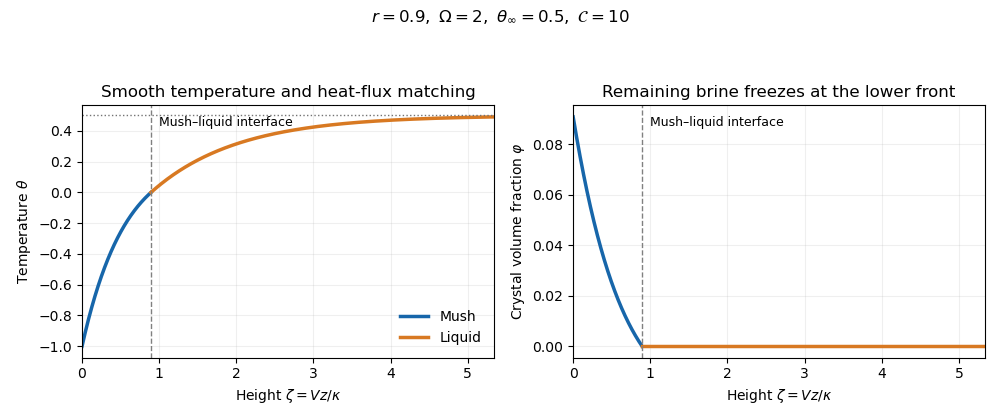

<h1 id="2/b/iii/solution">Solution</h1>

↑ **Parent:** [Iii](../iii.md)

Use $\zeta=Vz/\kappa$, $H=Vh/\kappa$, and $S=L/(c_p\Delta T)$, the [latent-to-sensible heat ratio](../../../../../../../latent-to-sensible-heat-ratio.md). Transforming the heat equation to the fixed apparatus frame and substituting [Darcy flux](../../../../../../../darcy-velocity.md) gives the exact steady mush equation

$$
\theta_{\zeta\zeta}+[r+(1-r)\varphi]\theta_\zeta-S\varphi_\zeta=0.
$$

For $\mathcal C\gg1$, the [solid fraction](../../../../../../../solid-fraction.md) is $\varphi=-\theta/\mathcal C+O(\mathcal C^{-2})$. Since $S/\mathcal C=O(1)$, the latent term remains leading order, whereas the correction $(1-r)\varphi\theta_\zeta$ is small. Define $\Omega=1+S/(r\mathcal C)$. The [large-concentration thermal profile of a pulled mush](../../../../../../../large-concentration-thermal-profile-of-a-pulled-mush.md) then obeys

$$
\theta_{\zeta\zeta}+r\Omega\theta_\zeta=0\quad(0<\zeta<H),\qquad \theta_{\zeta\zeta}+r\theta_\zeta=0\quad(\zeta>H).
$$

With $\theta(H)=0$ and $\theta\to\theta_\infty$ in the liquid,

$$
\boxed{\theta_l(\zeta)=\theta_\infty\left[1-e^{-r(\zeta-H)}\right].}
$$

The [thermal conductivity](../../../../../../../thermal-conductivity.md) agrees on both sides and the [solid fraction](../../../../../../../solid-fraction.md) vanishes at the mush–liquid interface, so there is no jump in latent production there: continuity of [heat flux](../../../../../../../heat-flux-density.md) gives $\theta_m'(H)=\theta_l'(H)=r\theta_\infty$. Thus

$$
\boxed{\theta_m(\zeta)=-\frac{\theta_\infty}{\Omega}\left[e^{r\Omega(H-\zeta)}-1\right].}
$$

The boundary value $\theta_m(0)=-1$ determines $H$, as calculated next. The crystal fraction is obtained from the previous part's formula, with the temperature field understood to this leading asymptotic accuracy.

**[Figure 1](#2/b/iii/image-temperature-and-crystal-fraction-in-a-steadily-pulled-mush). Temperature and crystal fraction in a steadily pulled mush**. The leading large-concentration temperature field matches smoothly to the liquid at the top of the mush. The crystal fraction tends to zero there; the remaining liquid freezes at the eutectic front at the bottom.

## ↑ Ancestors (12)

1. [Iii](../iii.md)
2. [B](../../b.md)
3. [2](../../../2.md)
4. [Paper 332](../../../../paper-332-split.md)
5. [Iii](../../../../split.md)
6. [2019](../../../../../split.md)
7. [Past exam of the mathematics course of the University of Cambridge](../../../../../../split.md)
8. [Mathematics course of the University of Cambridge](../../../../../../../mathematics-course-of-the-university-of-cambridge.md)
9. [Course of the University of Cambridge](../../../../../../../course-of-the-university-of-cambridge.md)
10. [University of Cambridge](../../../../../../../university-of-cambridge-split.md)
11. [List of universities](../../../../../../../list-of-universities.md)
12. [Codex Wiki](../../../../../../../split.md)
