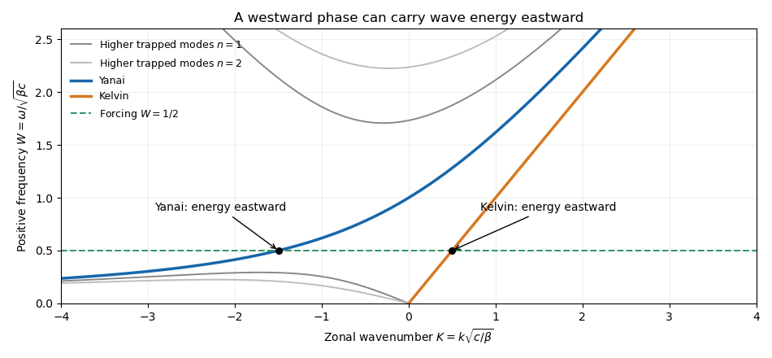

<h1 id="4/solution">Solution</h1>

↑ **Parent:** [4](../4.md)

Assume $\beta>0$, $c=\sqrt{gH}$, and use complex [normal mode](../../../../../normal-mode.md) amplitudes. The zonal momentum and continuity equations give

$$
\omega\widehat u-kg\widehat\eta=i\beta y\widehat v,\qquad \omega\widehat\eta-kH\widehat u=-iH\widehat v'.
$$

When $\omega^2\ne k^2c^2$, solving these two linear equations gives

$$
\boxed{\widehat u=\frac{i(\omega\beta y\widehat v-kc^2\widehat v')}{\omega^2-k^2c^2},\qquad \widehat\eta=\frac{iH(k\beta y\widehat v-\omega\widehat v')}{\omega^2-k^2c^2}.}
$$

For $\widehat v=0$, a nonzero solution requires $\omega=\pm kc$ and $\widehat\eta=\pm c\widehat u/g$. The remaining momentum equation gives $\widehat u'=\mp\beta y\widehat u/c$. Only the positive sign decays at both infinities, so the [equatorial Kelvin wave](../../../../../equatorial-kelvin-wave.md) is

$$
\boxed{\omega=kc,\qquad \widehat u=U_0e^{-\beta y^2/(2c)},\qquad \widehat\eta=\frac cg\widehat u,\qquad \widehat v=0.}
$$

Its phase and [group velocities](../../../../../group-velocity.md) are both eastward with speed $c$.

For nonzero meridional velocity, substitute the eliminated amplitudes into $-i\omega\widehat v+\beta y\widehat u=-g\widehat\eta'$. The result is

$$
\widehat v''+\left(\frac{\omega^2}{c^2}-k^2-\frac{\beta k}{\omega}-\frac{\beta^2y^2}{c^2}\right)\widehat v=0.
$$

Set $Y=y\sqrt{\beta/c}$. The decaying [Hermite polynomial](../../../../../hermite-polynomial.md) modes have $\widehat v=V_nH_n(Y)e^{-Y^2/2}$, up to normalization, and their eigenvalue gives the [equatorial shallow-water dispersion relation](../../../../../equatorial-shallow-water-dispersion-relation.md)

$$
\boxed{\omega^2-c^2k^2-\frac{\beta kc^2}{\omega}=(2n+1)\beta c.}
$$

For $n=0$, the quadratic in $k$ factors as

$$
(k+\omega/c)(k-\omega/c+\beta/\omega)=0.
$$

The admissible [Yanai wave](../../../../../rossby-gravity-waves.md) root is $k=\omega/c-\beta/\omega$. With $\widehat v(0)=1$, substitution and cancellation give

$$
\boxed{\widehat v=e^{-\beta y^2/(2c)},\qquad \widehat u=i\frac{\omega y}{c}\widehat v,\qquad \widehat\eta=i\frac{\omega y}{g}\widehat v.}
$$

These expressions satisfy the original equations even at the isolated point where the two algebraic roots coincide and the earlier elimination formula has a zero denominator. The other root is not an independent admissible branch: its generic singular reconstruction fails the trapping conditions.

In the zonal momentum equation, the acceleration term is $-i\omega\widehat u=(\omega^2y/c)\widehat v$, the Coriolis term is $-\beta y\widehat v$, and the pressure term is $-ikg\widehat\eta=k\omega y\widehat v$. When $\omega^2\ll\beta c$, acceleration is small and the leading balance is between [Coriolis acceleration](../../../../../coriolis-acceleration.md) and the [pressure gradient](../../../../../pressure-gradient.md). When $\omega^2\gg\beta c$, acceleration balances pressure and the Coriolis term is small; the branch tends to an eastward [gravity wave](../../../../../gravity-wave-split.md).

For $n\geq1$, the fixed-frequency zonal roots are

$$
k=-\frac\beta{2\omega}\pm\sqrt{\frac{\beta^2}{4\omega^2}+\frac{\omega^2}{c^2}-\frac{(2n+1)\beta}{c}}.
$$

The radicand is nonnegative exactly when $s=\omega^2/(\beta c)$ satisfies $s^2-(2n+1)s+1/4\geq0$. This gives the [frequency gap for higher equatorial wave modes](../../../../../frequency-gap-for-higher-equatorial-wave-modes.md):

$$
\boxed{s\leq n+\frac12-\sqrt{n(n+1)}\quad\hbox{or}\quad s\geq n+\frac12+\sqrt{n(n+1)}.}
$$

For the forcing frequency $\omega=\tfrac12\sqrt{\beta c}$, we have $s=1/4$. Already the $n=1$ low-frequency upper bound is $3/2-\sqrt2<1/4$, and that bound decreases with $n$, while the high-frequency bound increases. Hence no $n\geq1$ mode propagates. The available real-wavenumber branches are

$$
\boxed{k_K=\frac12\sqrt{\frac\beta c},\qquad k_Y=-\frac32\sqrt{\frac\beta c}.}
$$

For the [equatorial Kelvin wave](../../../../../equatorial-kelvin-wave.md), $c_{g,K}=c$. For the [Yanai wave](../../../../../rossby-gravity-waves.md), differentiating $k=\omega/c-\beta/\omega$ gives

$$
\boxed{c_{g,Y}=\frac{c\omega^2}{\omega^2+\beta c}=\frac c5>0.}
$$

Thus **both propagating responses are detected east of the localized forcing**, provided it has nonzero projection onto their meridional structures. The Yanai phase travels westward at this frequency, but its wave packet and energy travel eastward. Higher modes contribute only an evanescent response near the forcing.

**[Figure 1](#4/image-equatorial-dispersion-branches-at-the-specified-forcing-frequency). Equatorial dispersion branches at the specified forcing frequency**. The horizontal line at dimensionless frequency one half meets the Kelvin and Yanai branches. Both intersections have positive group velocity; higher trapped modes have no real zonal wavenumber at this frequency.

## ↑ Ancestors (10)

1. [4](../4.md)
2. [Paper 333](../../paper-333-split.md)
3. [Iii](../../split.md)
4. [2019](../../../split.md)
5. [Past exam of the mathematics course of the University of Cambridge](../../../../split.md)
6. [Mathematics course of the University of Cambridge](../../../../../mathematics-course-of-the-university-of-cambridge.md)
7. [Course of the University of Cambridge](../../../../../course-of-the-university-of-cambridge.md)
8. [University of Cambridge](../../../../../university-of-cambridge-split.md)
9. [List of universities](../../../../../list-of-universities.md)
10. [Codex Wiki](../../../../../split.md)
