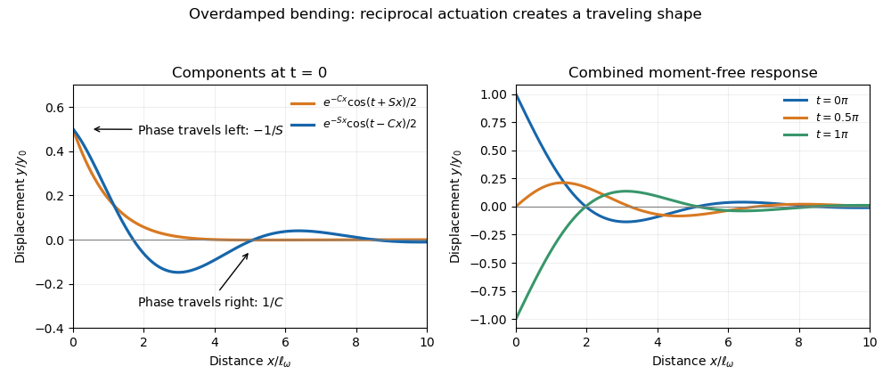

# Paper 334

↑ **Parent:** [Iii](../iii.md)

[https://www.maths.cam.ac.uk/postgrad/part-iii/files/pastpapers/2019/paper_334.pdf](https://www.maths.cam.ac.uk/postgrad/part-iii/files/pastpapers/2019/paper_334.pdf)

**Table of contents**

- [1](#1)
  - [a](#1/a)
    - [Solution](#1/a/solution)
  - [b](#1/b)
    - [Solution](#1/b/solution)
  - [c](#1/c)
    - [Solution](#1/c/solution)
  - [d](#1/d)
    - [Solution](#1/d/solution)
  - [e](#1/e)
    - [Solution](#1/e/solution)
  - [f](#1/f)
    - [Solution](#1/f/solution)
  - [g](#1/g)
    - [Solution](#1/g/solution)
- [2](#2)
  - [a](#2/a)
    - [Solution](#2/a/solution)
  - [b](#2/b)
    - [Solution](#2/b/solution)
  - [c](#2/c)
    - [Solution](#2/c/solution)
  - [d](#2/d)
    - [Solution](#2/d/solution)

## 1

↑ **Parent:** [Paper 334](paper-334.md)

<h3 id="1/a">a</h3>

↑ **Parent:** [1](#1)

<h4 id="1/a/solution">Solution</h4>

↑ **Parent:** [A](#1/a)

Use the [Cartesian streamfunction](../../../fluid-mechanics.md#cartesian-streamfunction) convention $u=\psi_y$, $v=-\psi_x$. Taking the [curl](../../../calculus.md#curl) of the incompressible [Stokes equation](../../../stokes-flow.md#stokes-equation) eliminates pressure and gives the [biharmonic stream function for planar Stokes flow](../../../stokes-flow.md#biharmonic-stream-function-for-planar-stokes-flow) equation

$$
\boxed{\nabla^4\psi=0\quad\hbox{for }y>\epsilon\sin\theta,\qquad \theta=x-t.}
$$

The material points have no horizontal velocity in the swimming frame and have vertical velocity $-\epsilon\cos\theta$. The [no-slip boundary condition](../../../viscous-fluid-flow.md#no-slip-boundary-condition) is therefore

$$
\boxed{\psi_y(x,\epsilon\sin\theta,t)=0,\qquad \psi_x(x,\epsilon\sin\theta,t)=\epsilon\cos\theta.}
$$

At infinity the laboratory fluid is at rest, so in this translating frame it moves with $U\mathbf e_x$:

$$
\boxed{\psi_y\to U,\qquad \psi_x\to0\quad(y\to\infty).}
$$

Velocity and its perturbations are periodic in $x$, with period $2\pi$, and the pressure has no imposed mean gradient. The [Taylor swimming sheet](../../../stokes-flow.md#taylor-swimming-sheet) is [force-free](../../../stokes-flow.md#force-free); the unbounded problem's bounded far-field velocity enforces the absence of mean shear. An additive constant in the streamfunction has no physical effect.

<h3 id="1/b">b</h3>

↑ **Parent:** [1](#1)

<h4 id="1/b/solution">Solution</h4>

↑ **Parent:** [B](#1/b)

Expand $\psi=\epsilon\psi_1+\epsilon^2\psi_2+\cdots$ and $U=\epsilon U_1+\epsilon^2U_2+\cdots$. A [Taylor expansion](../../../calculus.md#taylor-expansion) of the sheet boundary conditions about $y=0$ gives

$$
\nabla^4\psi_1=0,\qquad \psi_{1y}(0)=0,\qquad \psi_{1x}(0)=\cos\theta.
$$

The first-order [Fourier mode](../../../fourier-analysis.md#fourier-mode) is $\psi_1=f(y)\sin\theta$, with $(\partial_y^2-1)^2f=0$, $f(0)=1$, and $f'(0)=0$. Decay excludes the growing exponentials, leaving $f=(a+by)e^{-y}$. The two boundary values give $a=b=1$:

$$
\boxed{\psi_1=(1+y)e^{-y}\sin\theta,\qquad u_1=-ye^{-y}\sin\theta,\qquad v_1=-(1+y)e^{-y}\cos\theta.}
$$

There is no first-order mean boundary motion. Boundedness excludes mean shear, so $\boxed{U_1=0}$.

<h3 id="1/c">c</h3>

↑ **Parent:** [1](#1)

<h4 id="1/c/solution">Solution</h4>

↑ **Parent:** [C](#1/c)

At second order the [Taylor-expanded no-slip boundary condition](../../../viscous-fluid-flow.md#taylor-expanded-no-slip-boundary-condition) is

$$
\psi_{2y}(0)=-\sin\theta\,\psi_{1yy}(0)=\sin^2\theta=\frac12(1-\cos2\theta),\qquad \psi_{2x}(0)=-\sin\theta\,\psi_{1xy}(0)=0,
$$

with $\nabla^4\psi_2=0$, $\psi_{2y}\to U_2$, and $\psi_{2x}\to0$ at infinity. Set the irrelevant boundary constant to zero. The general relevant solution contains a zero [Fourier mode](../../../fourier-analysis.md#fourier-mode) and a second harmonic:

$$
\psi_2=A+By+Cy^2+Dy^3+\operatorname{Re}\{[E e^{-2y}+F e^{2y}+y(G e^{-2y}+J e^{2y})]e^{2i\theta}\}.
$$

Bounded velocity eliminates $C,D$ and growing harmonics. Averaging the tangential boundary condition gives $B=\langle\sin^2\theta\rangle=1/2$. This is the [mean boundary velocity determines Taylor-sheet swimming speed](../../../stokes-flow.md#mean-boundary-velocity-determines-taylor-sheet-swimming-speed) principle: the remaining mean velocity is uniform and equals the far-field velocity. Therefore

$$
\boxed{U_2=\frac12,\qquad \mathbf V_{\rm swim}=-\frac{\epsilon^2}{2}\mathbf e_x+O(\epsilon^4).}
$$

The absence of odd powers follows because changing the amplitude sign is just a half-wavelength translation. Although unnecessary for the speed, the oscillatory solution can also be written explicitly as $\psi_2=y/2-(y/2)e^{-2y}\cos2\theta$.

<h3 id="1/d">d</h3>

↑ **Parent:** [1](#1)

<h4 id="1/d/solution">Solution</h4>

↑ **Parent:** [D](#1/d)

The wall is stationary in the laboratory and moves with velocity $+U\mathbf e_x$ in the sheet frame. Its [no-slip boundary condition](../../../viscous-fluid-flow.md#no-slip-boundary-condition) is therefore

$$
\boxed{\psi_y(x,d,t)=U,\qquad \psi_x(x,d,t)=0.}
$$

The first equation prescribes wall tangential velocity; the second imposes zero normal velocity. The streamfunction may have a constant mean value on the wall, set by the fluid transport, and that constant need not equal its value at the sheet.

<h3 id="1/e">e</h3>

↑ **Parent:** [1](#1)

<h4 id="1/e/solution">Solution</h4>

↑ **Parent:** [E](#1/e)

The wall removes the far-field decay condition and instead imposes $\psi_{1x}(d)=0$, $\psi_{1y}(d)=U_1$. The [force-free](../../../stokes-flow.md#force-free) condition eliminates any first-order mean shear; since mean sheet tangential velocity is zero, $U_1=0$. Thus $\psi_1=f_d(y)\sin\theta$, where

$$
(\partial_y^2-1)^2f_d=0,\qquad f_d(0)=1,\quad f_d'(0)=0,\quad f_d(d)=f_d'(d)=0.
$$

Start with the [hyperbolic function](../../../calculus.md#hyperbolic-function) form $f_d=(a+by)\cosh y+(c+ey)\sinh y$. The lower conditions give $a=1$, $c=-b$. Defining $\Delta=\sinh^2d-d^2$, the wall conditions give

$$
b=\frac{d+\sinh d\cosh d}{\Delta},\qquad e=-\frac{\sinh^2d}{\Delta}.
$$

Consequently the first-order flow for [Taylor-sheet swimming next to a rigid wall](../../../stokes-flow.md#taylor-sheet-swimming-next-to-a-rigid-wall) is

$$
\boxed{\psi_1=\left[\cosh y+\frac{d+\sinh d\cosh d}{\Delta}(y\cosh y-\sinh y)-\frac{\sinh^2d}{\Delta}y\sinh y\right]\sin\theta.}
$$

For $d>0$, $\sinh d>d$ ensures a nonzero denominator; as $d\to\infty$, this reduces to the unbounded first-order field on every fixed height interval.

<h3 id="1/f">f</h3>

↑ **Parent:** [1](#1)

<h4 id="1/f/solution">Solution</h4>

↑ **Parent:** [F](#1/f)

At the sheet, the second-order conditions are $\psi_{2x}(0)=0$ and $\psi_{2y}(0)=-f_d''(0)\sin^2\theta$. At the wall, $\psi_{2x}(d)=0$ and $\psi_{2y}(d)=\overline U_2$. The general solution has a polynomial mean mode and a second harmonic with exponentials $e^{\pm2y}$, as in the unbounded calculation.

Let $\overline u_2(y)=\langle\psi_{2y}\rangle$. The averaged [Stokes equation](../../../stokes-flow.md#stokes-equation), with periodic pressure and no imposed mean pressure gradient, gives $\overline u_2''=0$. The total horizontal hydrodynamic force on the sheet is opposite to the mean shear force on the flat wall. Since the swimmer is [force-free](../../../stokes-flow.md#force-free), $\overline u_2'(d)=0$, making the mean velocity constant. Matching its values at the sheet and wall therefore gives

$$
\overline U_2=-\frac12 f_d''(0).
$$

The previous part gives $f_d''(0)=1-2\sinh^2d/\Delta=-(\sinh^2d+d^2)/\Delta$, hence

$$
\boxed{\overline U_2=\frac{\sinh^2d+d^2}{2(\sinh^2d-d^2)}.}
$$

This determines the speed without solving the second-harmonic flow. The force constraint matters: prescribing a translating sheet without imposing zero net force would allow a mean shear and would not determine a unique swimming speed.

<h3 id="1/g">g</h3>

↑ **Parent:** [1](#1)

<h4 id="1/g/solution">Solution</h4>

↑ **Parent:** [G](#1/g)

Since $U_2=1/2$, the speed enhancement is

$$
\boxed{\frac{\overline U_2}{U_2}=\frac{\sinh^2d+d^2}{\sinh^2d-d^2}=1+\frac{2d^2}{\sinh^2d-d^2}>1\quad(d>0).}
$$

The strict inequality follows from $\sinh d>d$. It tends to one as the wall recedes, while $\sinh^2d-d^2\sim d^4/3$ gives $\overline U_2\sim3/d^2$ in a narrow gap. The wall enhances the mean pumping generated by transverse boundary motion. This small-amplitude limit requires $\epsilon\ll d$; letting the wall collide with a wave crest falls outside the expansion.

**[Figure 1](#1/g/image-wall-enhancement-of-transverse-sheet-swimming). Wall enhancement of transverse-sheet swimming**. The leading swimming-speed ratio is greater than one for every finite gap and approaches one for a distant wall. The narrow-gap divergence is used only while the wave amplitude remains much smaller than the gap.

## 2

↑ **Parent:** [Paper 334](paper-334.md)

<h3 id="2/a">a</h3>

↑ **Parent:** [2](#2)

<h4 id="2/a/solution">Solution</h4>

↑ **Parent:** [A](#2/a)

The first term is the local viscous force per unit length from [resistive-force theory](../../../mathematical-biology.md#resistive-force-theory). With [unit tangent vector](../../../differential-geometry.md#unit-tangent-vector) $\mathbf t=\mathbf r_s$, the drag tensor gives $-c_\parallel\mathbf v_\parallel-c_\perp\mathbf v_\perp$, where $\mathbf v=\mathbf r_t$ is velocity relative to the fluid.

The second term is the bending force of an [inextensible filament](../../../mathematical-biology.md#inextensible-filament). Varying its energy $E_b=(B/2)\int|\mathbf r_{ss}|^2ds$ gives bulk force density $-B\mathbf r_{ssss}$. The final term, $\partial_s(T\mathbf r_s)$, is the force density from [filament tension](../../../mathematical-biology.md#filament-tension); $T$ is the [Lagrange multiplier](../../../mathematical-optimization.md#lagrange-multiplier) enforcing $|\mathbf r_s|=1$. At low [Reynolds number](../../../fluid-mechanics.md#reynolds-number), these forces balance without a filament acceleration term.

With mass, length, and time dimensions $M,\mathsf L,\mathsf T$, the coefficients have

$$
\boxed{[c_\perp]=[c_\parallel]=M\mathsf L^{-1}\mathsf T^{-1},\qquad [B]=M\mathsf L^3\mathsf T^{-2},\qquad [T]=M\mathsf L\mathsf T^{-2}.}
$$

Thus the drag coefficients have the dimensions of [dynamic viscosity](../../../fluid-mechanics.md#dynamic-viscosity), the [filament bending modulus](../../../mathematical-biology.md#filament-bending-modulus) has dimensions force times length squared, and tension has dimensions force.

<h3 id="2/b">b</h3>

↑ **Parent:** [2](#2)

<h4 id="2/b/solution">Solution</h4>

↑ **Parent:** [B](#2/b)

In the small-slope [Monge representation](../../../mathematical-biology.md#monge-representation), $s=x+O(y_x^2)$, $\mathbf t=(1,y_x)+O(y_x^2)$, and the leading transverse velocity is $y_t$. With no imposed axial prestress, the induced [filament tension](../../../mathematical-biology.md#filament-tension) is second order in transverse amplitude, so its transverse contribution is higher order. The transverse component of force balance reduces to the [small-slope elastohydrodynamic filament equation](../../../mathematical-biology.md#small-slope-elastohydrodynamic-filament-equation)

$$
\boxed{c_\perp y_t=-By_{xxxx}.}
$$

An externally imposed zeroth-order tension would instead add $Ty_{xx}$.

For the transverse motion, the off-diagonal part of the [resistive-force theory](../../../mathematical-biology.md#resistive-force-theory) tensor gives axial propulsive force density $(c_\perp-c_\parallel)y_xy_t$ to second order. Its integral is

$$
\boxed{F=(c_\perp-c_\parallel)\int_0^L y_xy_t\,dx.}
$$

Substitute the bending equation and integrate by parts:

$$
\int_0^L y_xy_{xxxx}\,dx=\left[y_xy_{xxx}\right]_0^L-\int_0^L y_{xx}y_{xxx}\,dx=\left[y_xy_{xxx}-\frac12y_{xx}^2\right]_0^L.
$$

The [boundary expression for transverse filament thrust](../../../mathematical-biology.md#boundary-expression-for-transverse-filament-thrust) is therefore

$$
\boxed{F=B\left(1-\frac{c_\parallel}{c_\perp}\right)\left[\frac12y_{xx}^2-y_xy_{xxx}\right]_0^L.}
$$

Only endpoint slope, bending moment, and shear enter this expression. Exact [inextensibility](../../../mathematical-biology.md#inextensible-filament) also generates second-order longitudinal material motion; if that motion is retained in instantaneous total axial drag, it adds $-c_\parallel\int v_x\,dx$. For a periodic deformation with fixed axial base position, that additional term has zero cycle average. Thus the displayed formula is the transverse propulsive contribution and also gives the cycle-averaged propulsive force.

<h3 id="2/c">c</h3>

↑ **Parent:** [2](#2)

<h4 id="2/c/solution">Solution</h4>

↑ **Parent:** [C](#2/c)

A periodic displacement with angular frequency $\omega$ has $y_t\sim\omega y$. Balancing this viscous forcing with bending over length $\ell_\omega$ gives $c_\perp\omega y\sim By/\ell_\omega^4$. Thus the [elastohydrodynamic penetration length](../../../mathematical-biology.md#elastohydrodynamic-penetration-length) and [sperm number](../../../mathematical-biology.md#sperm-number) are

$$
\boxed{\ell_\omega=\left(\frac B{c_\perp\omega}\right)^{1/4},\qquad \operatorname{Sp}=\frac L{\ell_\omega}=L\left(\frac{c_\perp\omega}{B}\right)^{1/4}.}
$$

Since $[B/(c_\perp\omega)]=\mathsf L^4$, the fourth root has dimensions length, as required.

With $X=x/\ell_\omega$, $\tau=\omega t$, and $Y=y/\ell_\omega$, the bending equation becomes

$$
c_\perp\omega\ell_\omega Y_\tau=-\frac B{\ell_\omega^3}Y_{XXXX}.
$$

The defining balance cancels both coefficients, giving $\boxed{Y_\tau=-Y_{XXXX}}$. A large [sperm number](../../../mathematical-biology.md#sperm-number) means that the periodically forced response decays before reaching the distant end.

<h3 id="2/d">d</h3>

↑ **Parent:** [2](#2)

<h4 id="2/d/solution">Solution</h4>

↑ **Parent:** [D](#2/d)

For the long filament, take the time-periodic solution of the dimensionless bending equation, after transients have decayed. Write $y=\operatorname{Re}[Y(x)e^{it}]$. Then $Y^{(4)}=-iY$, so the spatial exponents satisfy $\lambda^4=-i$. Define $C=\cos(\pi/8)$ and $S=\sin(\pi/8)$. The two roots with negative real part are $\lambda_1=-C+iS$ and $\lambda_2=-S-iC$; the other roots violate decay at infinity.

Hence $Y=Ae^{\lambda_1x}+Be^{\lambda_2x}$. The driven displacement gives $A+B=y_0$, while the zero bending moment gives $\lambda_1^2A+\lambda_2^2B=0$. Since $\lambda_2^2=-\lambda_1^2$, $A=B=y_0/2$. The [oscillatory bending of a moment-free semi-infinite filament](../../../mathematical-biology.md#oscillatory-bending-of-a-moment-free-semi-infinite-filament) is

$$
\boxed{y(x,t)=\frac{y_0}{2}\left[e^{-Cx}\cos(t+Sx)+e^{-Sx}\cos(t-Cx)\right].}
$$

Holding each wave phase constant gives its dimensionless [phase velocity](../../../wave-equation.md#phase-velocity):

$$
\boxed{v_1=-\frac1S\simeq-2.6131,\qquad v_2=\frac1C\simeq1.0824.}
$$

The first travels toward the actuator and attenuates over length $1/C$; the second travels away and attenuates over the longer length $1/S$. These are spatially damped phase patterns in an overdamped bending equation, not two undamped inertial beam waves. Their combination satisfies both displacement and zero-moment conditions at the driven end.

**[Figure 2](#2/d/image-two-oppositely-traveling-damped-bending-waves). Two oppositely traveling damped bending waves**. The two components have different attenuation lengths and opposite phase velocities. Their sum gives the long-filament response to a periodically moved, moment-free endpoint.

## ↑ Ancestors (8)

1. [Iii](../iii.md)
2. [2019](../../2019.md)
3. [Past exam of the mathematics course of the University of Cambridge](../../../past-exam-of-the-mathematics-course-of-the-university-of-cambridge.md)
4. [Mathematics course of the University of Cambridge](../../../university-of-cambridge.md#mathematics-course-of-the-university-of-cambridge)
5. [Course of the University of Cambridge](../../../university-of-cambridge.md#course-of-the-university-of-cambridge)
6. [University of Cambridge](../../../university-of-cambridge.md)
7. [List of universities](../../../README.md#list-of-universities)
8. [Codex Wiki](../../../README.md)
