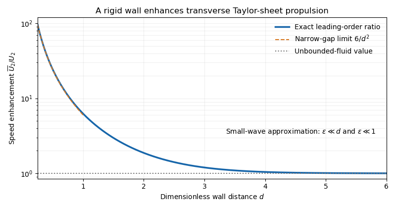

<h1 id="1/g/solution">Solution</h1>

↑ **Parent:** [G](../g.md)

Since $U_2=1/2$, the speed enhancement is

$$
\boxed{\frac{\overline U_2}{U_2}=\frac{\sinh^2d+d^2}{\sinh^2d-d^2}=1+\frac{2d^2}{\sinh^2d-d^2}>1\quad(d>0).}
$$

The strict inequality follows from $\sinh d>d$. It tends to one as the wall recedes, while $\sinh^2d-d^2\sim d^4/3$ gives $\overline U_2\sim3/d^2$ in a narrow gap. The wall enhances the mean pumping generated by transverse boundary motion. This small-amplitude limit requires $\epsilon\ll d$; letting the wall collide with a wave crest falls outside the expansion.

**[Figure 1](#1/g/image-wall-enhancement-of-transverse-sheet-swimming). Wall enhancement of transverse-sheet swimming**. The leading swimming-speed ratio is greater than one for every finite gap and approaches one for a distant wall. The narrow-gap divergence is used only while the wave amplitude remains much smaller than the gap.

## ↑ Ancestors (11)

1. [G](../g.md)
2. [1](../../1.md)
3. [Paper 334](../../../paper-334-split.md)
4. [Iii](../../../split.md)
5. [2019](../../../../split.md)
6. [Past exam of the mathematics course of the University of Cambridge](../../../../../split.md)
7. [Mathematics course of the University of Cambridge](../../../../../../mathematics-course-of-the-university-of-cambridge.md)
8. [Course of the University of Cambridge](../../../../../../course-of-the-university-of-cambridge.md)
9. [University of Cambridge](../../../../../../university-of-cambridge-split.md)
10. [List of universities](../../../../../../list-of-universities.md)
11. [Codex Wiki](../../../../../../split.md)
