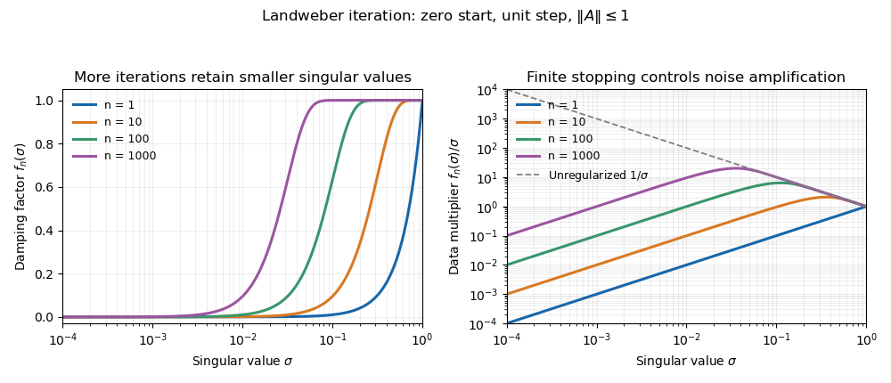

<h1 id="3/iv/solution">Solution</h1>

↑ **Parent:** [Iv](../iv.md)

On each [left singular vector](../../../../../../left-singular-vector.md) $u_j$, use $A^*u_j=\sigma_jv_j$ and $(I-A^*A)v_j=(1-\sigma_j^2)v_j$. The finite [geometric series](../../../../../../geometric-series.md) gives

$$
x_n=\sum_j\sigma_j\left[\sum_{m=0}^{n-1}(1-\sigma_j^2)^m\right]\langle y,u_j\rangle v_j=\sum_j\frac{1-(1-\sigma_j^2)^n}{\sigma_j}\langle y,u_j\rangle v_j.
$$

Thus with $\alpha=1/n$, the dimensionless [Landweber spectral filter](../../../../../../landweber-spectral-filter.md) is

$$
\boxed{f_\alpha(\sigma)=1-(1-\sigma^2)^{1/\alpha}.}
$$

The full inverse-coefficient convention instead uses $[1-(1-\sigma^2)^{1/\alpha}]/\sigma$. With general step $\tau$, replace $\sigma^2$ inside the power by $\tau\sigma^2$.

In the normalized problem, $0\leq f_n(\sigma)\leq\min(n\sigma^2,1)$, so the inverse coefficient is at most $\min(n\sigma,1/\sigma)\leq\sqrt n$. This verifies directly why finite iteration is stable and why admitting progressively smaller [singular values](../../../../../../singular-value.md) eventually amplifies noise.

**[Figure 1](#3/iv/image-landweber-filters-and-progressive-noise-amplification). Landweber filters and progressive noise amplification**. More iterations admit smaller singular-value components. The damping factor tends toward one, while the coefficient applied to measured data approaches the unstable reciprocal singular value.

## ↑ Ancestors (11)

1. [Iv](../iv.md)
2. [3](../../3.md)
3. [Paper 335](../../../paper-335-split.md)
4. [Iii](../../../split.md)
5. [2019](../../../../split.md)
6. [Past exam of the mathematics course of the University of Cambridge](../../../../../split.md)
7. [Mathematics course of the University of Cambridge](../../../../../../mathematics-course-of-the-university-of-cambridge.md)
8. [Course of the University of Cambridge](../../../../../../course-of-the-university-of-cambridge.md)
9. [University of Cambridge](../../../../../../university-of-cambridge-split.md)
10. [List of universities](../../../../../../list-of-universities.md)
11. [Codex Wiki](../../../../../../split.md)
