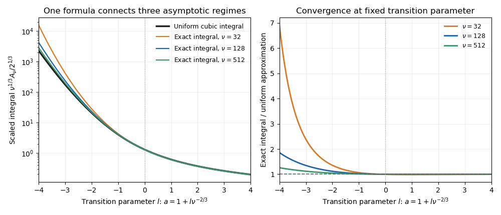

<h1 id="1/b/solution">Solution</h1>

↑ **Parent:** [B](../b.md)

The three fixed-$a$ estimates below cease to be uniform as the minimum of the phase approaches the endpoint. For the [cubic endpoint-to-saddle transition](../../../../../../cubic-endpoint-to-saddle-transition.md), write

$$
a=1+l\nu^{-2/3},\qquad t=2^{1/3}\nu^{-1/3}s.
$$

The [Taylor series](../../../../../../taylor-series.md) of the [hyperbolic sine](../../../../../../hyperbolic-sine.md) gives, for bounded $s$ and fixed $l$,

$$
\nu(a\sinh t-t)=2^{1/3}ls+\frac{s^3}3+O(\nu^{-2/3}).
$$

The cubic term controls the tail, so localization of the [Laplace integral](../../../../../../laplace-integral.md) gives the uniform leading formula

$$
\boxed{A_\nu(\nu+l\nu^{1/3})\sim2^{1/3}\nu^{-1/3}I(-2^{1/3}l),\qquad I(x)=\int_0^\infty e^{xs-s^3/3}\,ds.}
$$

Here $I$ is the [cubic Laplace transition integral](../../../../../../cubic-laplace-transition-integral.md), equal to $\pi\operatorname{Hi}$ in terms of the [Scorer Hi function](../../../../../../scorer-hi-function.md).

To recover the endpoint regime, let $l\to+\infty$. Scale $s=v/(2^{1/3}l)$ in $I$; the cubic term becomes negligible and $I(-2^{1/3}l)\sim(2^{1/3}l)^{-1}$. Therefore

$$
A_\nu\sim\frac{\nu^{-1/3}}l=\frac1{\nu(a-1)},
$$

which agrees with part (i) in the overlap $1\ll l\ll\nu^{2/3}$. At $l=0$, the [Gamma integral](../../../../../../gamma-integral.md) gives $I(0)=3^{-2/3}\Gamma(1/3)$, recovering part (iii).

For $l\to-\infty$, set $M=-2^{1/3}l>0$. The exponent $Ms-s^3/3$ has its maximum at $s=\sqrt M$, with second [derivative](../../../../../../derivative.md) $-2\sqrt M$. Thus [Laplace's method](../../../../../../laplace-s-method.md) gives

$$
I(M)\sim\sqrt\pi M^{-1/4}e^{2M^{3/2}/3},
$$

and the transition formula becomes

$$
A_\nu\sim2^{1/4}\sqrt\pi\nu^{-1/3}(-l)^{-1/4}\exp\left[\frac{2\sqrt2}3(-l)^{3/2}\right].
$$

For $a=1-\eta$ with $\eta\downarrow0$, part (ii) has

$$
\operatorname{arcosh}(1/a)-\sqrt{1-a^2}=\frac{2\sqrt2}3\eta^{3/2}+O(\eta^{5/2}),\qquad (1-a^2)^{-1/4}\sim(2\eta)^{-1/4}.
$$

Putting $\eta=(-l)\nu^{-2/3}$ reproduces both the exponential and its prefactor. For relative agreement of these leading exponentials, one may use the overlap $1\ll-l\ll\nu^{4/15}$, which makes $\nu\eta^{5/2}\to0$. Thus the same transition integral connects all three regimes.

**[Figure 1](#1/b/image-the-cubic-endpoint-to-saddle-transition). The cubic endpoint-to-saddle transition**. Direct numerical integration of the original phase approaches the same cubic transition function as the large parameter increases. Negative transition parameter places the minimum inside the interval; positive parameter leaves an ordinary endpoint minimum.

## ↑ Ancestors (11)

1. [B](../b.md)
2. [1](../../1.md)
3. [Paper 336](../../../paper-336-split.md)
4. [Iii](../../../split.md)
5. [2019](../../../../split.md)
6. [Past exam of the mathematics course of the University of Cambridge](../../../../../split.md)
7. [Mathematics course of the University of Cambridge](../../../../../../mathematics-course-of-the-university-of-cambridge.md)
8. [Course of the University of Cambridge](../../../../../../course-of-the-university-of-cambridge.md)
9. [University of Cambridge](../../../../../../university-of-cambridge-split.md)
10. [List of universities](../../../../../../list-of-universities.md)
11. [Codex Wiki](../../../../../../split.md)
