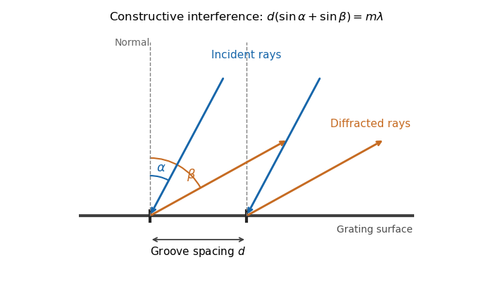

<h1 id="1/a/i/solution">Solution</h1>

↑ **Parent:** [I](../i.md)

The bright peaks occur when contributions from adjacent grooves have equal phase modulo $2\pi$, so all illuminated grooves contribute by [constructive interference](../../../../../../../constructive-interference.md). Use the reflection-grating convention shown below: $\alpha$ and $\beta$ are positive angles of the incident and outgoing ray lines on the same side of the normal. The incoming and outgoing path differences between neighboring grooves are $d\sin\alpha$ and $d\sin\beta$, respectively. Hence the [grating equation](../../../../../../../grating-equation.md) is

$$
\boxed{g(\alpha,\beta,\lambda,d,m)=d(\sin\alpha+\sin\beta)-m\lambda=0.}
$$

The integer $m$ labels the [diffraction order](../../../../../../../diffraction-order.md). With a different signed-angle convention, the same physical condition contains a difference of sines.

**[Figure 1](#1/a/i/image-reflection-grating-angle-convention). Reflection-grating angle convention**. The incident ray and selected outgoing ray are both drawn on the positive side of the surface normal. Adjacent groove spacing contributes the sum of their two projected path differences.

## ↑ Ancestors (12)

1. [I](../i.md)
2. [A](../../a.md)
3. [1](../../../1.md)
4. [Paper 338](../../../../paper-338-split.md)
5. [Iii](../../../../split.md)
6. [2019](../../../../../split.md)
7. [Past exam of the mathematics course of the University of Cambridge](../../../../../../split.md)
8. [Mathematics course of the University of Cambridge](../../../../../../../mathematics-course-of-the-university-of-cambridge.md)
9. [Course of the University of Cambridge](../../../../../../../course-of-the-university-of-cambridge.md)
10. [University of Cambridge](../../../../../../../university-of-cambridge-split.md)
11. [List of universities](../../../../../../../list-of-universities.md)
12. [Codex Wiki](../../../../../../../split.md)
