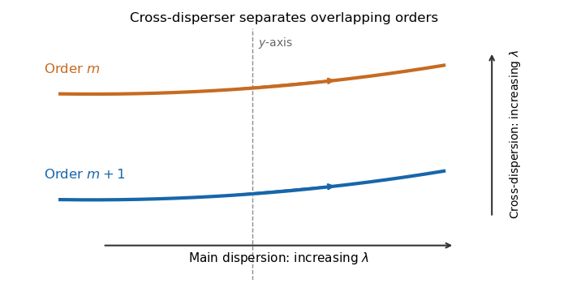

<h1 id="1/b/i/solution">Solution</h1>

↑ **Parent:** [I](../i.md)

The [echellogram](../../../../../../../echellogram.md) contains nearly parallel traces, one for each [diffraction order](../../../../../../../diffraction-order.md). Choose the main [echelle grating](../../../../../../../echelle-grating.md) dispersion to increase [wavelength](../../../../../../../wavelength.md) toward the right and the [cross-disperser](../../../../../../../cross-disperser.md) to increase wavelength upward. At a fixed horizontal coordinate, order $m+1$ has a shorter wavelength than order $m$, so it lies below order $m$ in this convention.

**[Figure 2](#1/b/i/image-adjacent-orders-in-a-cross-dispersed-echellogram). Adjacent orders in a cross-dispersed echellogram**. Order m+1 is bluer than order m at the same main-dispersion coordinate. Within either order, wavelength increases along the trace to the right; the chosen cross-dispersion orientation puts longer wavelengths higher on the detector.

## ↑ Ancestors (12)

1. [I](../i.md)
2. [B](../../b.md)
3. [1](../../../1.md)
4. [Paper 338](../../../../paper-338-split.md)
5. [Iii](../../../../split.md)
6. [2019](../../../../../split.md)
7. [Past exam of the mathematics course of the University of Cambridge](../../../../../../split.md)
8. [Mathematics course of the University of Cambridge](../../../../../../../mathematics-course-of-the-university-of-cambridge.md)
9. [Course of the University of Cambridge](../../../../../../../course-of-the-university-of-cambridge.md)
10. [University of Cambridge](../../../../../../../university-of-cambridge-split.md)
11. [List of universities](../../../../../../../list-of-universities.md)
12. [Codex Wiki](../../../../../../../split.md)
