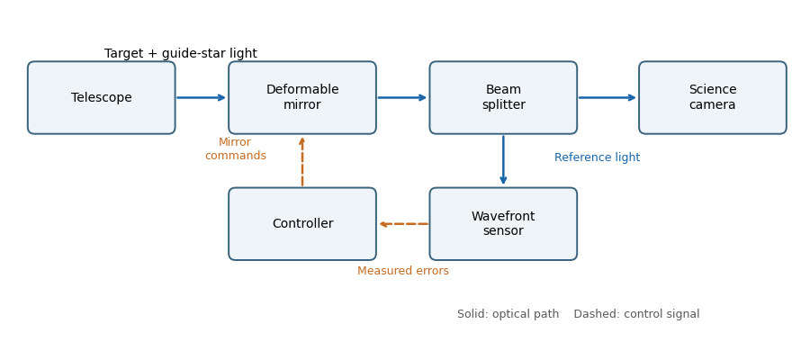

<h1 id="2/a/ii/solution">Solution</h1>

↑ **Parent:** [Ii](../ii.md)

The main optical path is telescope to [deformable mirror](../../../../../../../deformable-mirror.md) to [beam splitter](../../../../../../../beam-splitter.md) to science camera. The splitter also directs reference light to a [wavefront sensor](../../../../../../../wavefront-sensor.md); a controller reconstructs the [wavefront error](../../../../../../../wavefront-error.md) and feeds mirror commands back to the deformable mirror. The mirror is normally conjugate to a pupil so its actuators address the corresponding pupil phase. A separate steering mirror can handle overall image motion.

**[Figure 3](#2/a/ii/image-an-adaptive-optics-feedback-loop). An adaptive-optics feedback loop**. Solid arrows show optical paths. The wavefront sensor observes the corrected reference beam; dashed arrows return measured errors and actuator commands through the controller. The science beam shares the deformable mirror.

## ↑ Ancestors (12)

1. [Ii](../ii.md)
2. [A](../../a.md)
3. [2](../../../2.md)
4. [Paper 338](../../../../paper-338-split.md)
5. [Iii](../../../../split.md)
6. [2019](../../../../../split.md)
7. [Past exam of the mathematics course of the University of Cambridge](../../../../../../split.md)
8. [Mathematics course of the University of Cambridge](../../../../../../../mathematics-course-of-the-university-of-cambridge.md)
9. [Course of the University of Cambridge](../../../../../../../course-of-the-university-of-cambridge.md)
10. [University of Cambridge](../../../../../../../university-of-cambridge-split.md)
11. [List of universities](../../../../../../../list-of-universities.md)
12. [Codex Wiki](../../../../../../../split.md)
