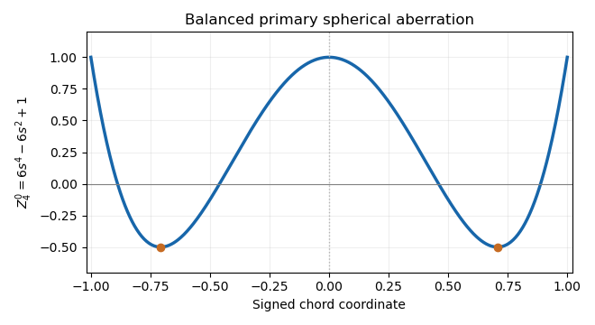

<h1 id="2/a/vii/solution">Solution</h1>

↑ **Parent:** [Vii](../vii.md)

For the unnormalized [Zernike polynomial](../../../../../../../zernike-polynomials.md) with $n=4,m=0$, the three radial terms are

$$
\frac{4!}{2!2!}\rho^4-\frac{3!}{1!1!1!}\rho^2+\frac{2!}{2!0!0!}=6\rho^4-6\rho^2+1.
$$

Since $\cos0\phi=1$,

$$
\boxed{Z_4^0(\rho,\phi)=6\rho^4-6\rho^2+1.}
$$

Along a central chord with signed coordinate $s\in[-1,1]$, replace $\rho$ by $|s|$. The profile is even, equals one at the center and both edges, and has minima $-1/2$ at $s=\pm1/\sqrt2$. This [Zernike spherical mode](../../../../../../../zernike-spherical-mode.md) corresponds to **primary [spherical aberration](../../../../../../../spherical-aberration.md)**, balanced by defocus and piston terms rather than simply the raw quartic Seidel term.

**[Figure 4](#2/a/vii/image-the-unnormalized-zernike-spherical-mode-on-a-central-chord). The unnormalized Zernike spherical mode on a central chord**. The even quartic has central and edge values one and two minima of minus one half. Its lower-order terms remove its projections onto piston and defocus.

## ↑ Ancestors (12)

1. [Vii](../vii.md)
2. [A](../../a.md)
3. [2](../../../2.md)
4. [Paper 338](../../../../paper-338-split.md)
5. [Iii](../../../../split.md)
6. [2019](../../../../../split.md)
7. [Past exam of the mathematics course of the University of Cambridge](../../../../../../split.md)
8. [Mathematics course of the University of Cambridge](../../../../../../../mathematics-course-of-the-university-of-cambridge.md)
9. [Course of the University of Cambridge](../../../../../../../course-of-the-university-of-cambridge.md)
10. [University of Cambridge](../../../../../../../university-of-cambridge-split.md)
11. [List of universities](../../../../../../../list-of-universities.md)
12. [Codex Wiki](../../../../../../../split.md)
