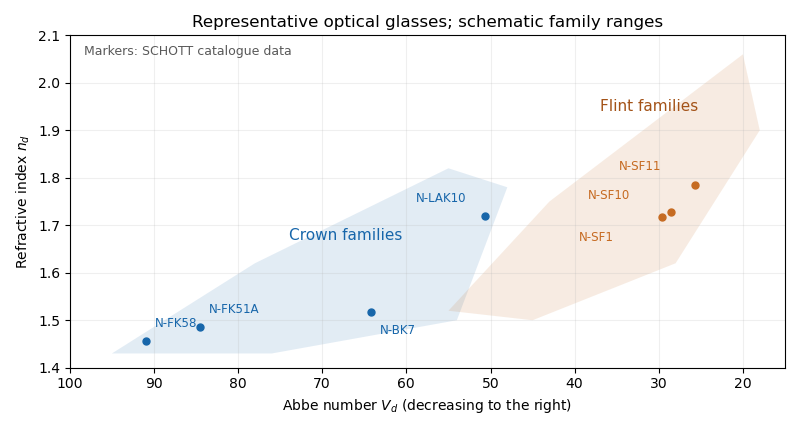

<h1 id="3/b/iv/solution">Solution</h1>

↑ **Parent:** [Iv](../iv.md)

**$V_d$ is the [Abbe number](../../../../../../../abbe-number.md)**, a measure of inverse relative [optical dispersion](../../../../../../../dispersion-optics.md). Ordinary [crown glasses](../../../../../../../crown-glass-optics.md) have comparatively large $V_d$ and lower [refractive index](../../../../../../../refractive-index.md), while ordinary [flint glasses](../../../../../../../flint-glass.md) have smaller $V_d$ and often higher index. The [Abbe diagram](../../../../../../../abbe-diagram.md) below spans typical optical-glass values; the shaded family ranges are schematic, and the marked examples are catalogue data. Modern glass compositions broaden and overlap the simple crown/flint picture.

**[Figure 5](#3/b/iv/image-refractive-index-and-abbe-number-for-representative-optical-glasses). Refractive index and Abbe number for representative optical glasses**. Markers use refractive indices and Abbe numbers from the SCHOTT Optical Glass pocket catalogue. Shaded regions are schematic family ranges rather than a catalogue boundary. The horizontal axis follows the traditional convention of decreasing Abbe number toward the right.

For a positive doublet with $V_{1d}>V_{2d}$, the preceding formulas require $f_{1d}>0$ and $f_{2d}<0$: a converging [crown glass](../../../../../../../crown-glass-optics.md) element and a diverging [flint glass](../../../../../../../flint-glass.md) element. Their dispersion corrections cancel, while their net [optical power](../../../../../../../optical-power.md) is positive. A small difference in Abbe numbers requires large opposing component powers, which makes the design harder to correct for other [optical aberrations](../../../../../../../optical-aberration.md).

## ↑ Ancestors (12)

1. [Iv](../iv.md)
2. [B](../../b.md)
3. [3](../../../3.md)
4. [Paper 338](../../../../paper-338-split.md)
5. [Iii](../../../../split.md)
6. [2019](../../../../../split.md)
7. [Past exam of the mathematics course of the University of Cambridge](../../../../../../split.md)
8. [Mathematics course of the University of Cambridge](../../../../../../../mathematics-course-of-the-university-of-cambridge.md)
9. [Course of the University of Cambridge](../../../../../../../course-of-the-university-of-cambridge.md)
10. [University of Cambridge](../../../../../../../university-of-cambridge-split.md)
11. [List of universities](../../../../../../../list-of-universities.md)
12. [Codex Wiki](../../../../../../../split.md)
