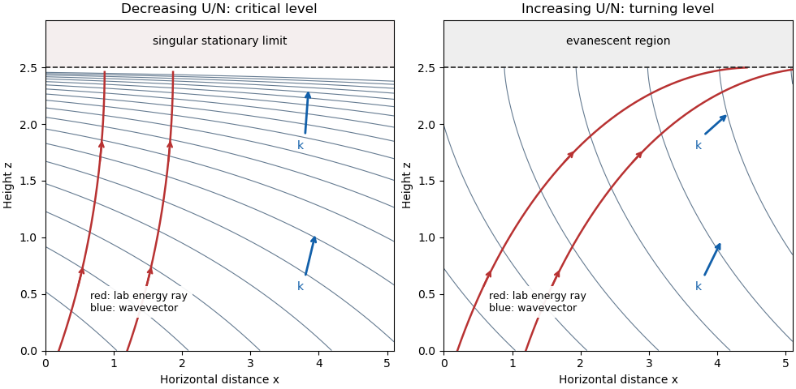

<h1 id="1/b/solution">Solution</h1>

↑ **Parent:** [B](../b.md)

Take $U_0,N_0,k>0$ and assume an initially propagating mode, $k<N_0/U_0$. Put $s=N_0/U_0$ and $\delta(z)=1+\gamma z$. Neglecting $U''/U$ as stipulated, the [Scorer parameter](../../../../../../scorer-parameter.md) and [stationary internal-wave WKB solution](../../../../../../stationary-internal-wave-wkb-solution.md) are

$$
m(z)^2=\frac{s^2}{\delta(z)^2}-k^2,\qquad
w\simeq C\,m^{-1/2}\exp\left(i kx+i\int_0^z m(\zeta)\,d\zeta\right).
$$

The positive root $m>0$ selects upward [group velocity](../../../../../../group-velocity.md) for the negative [intrinsic frequency](../../../../../../intrinsic-frequency.md) branch $\widehat\omega=-kU$. The [WKB approximation](../../../../../../wkb-approximation.md) needs a slowly varying background relative to the local vertical [wavelength](../../../../../../wavelength.md), in particular $|m'|\ll m^2$ and $|m''|\ll |m|^3$, away from a turning level or singular mean profile.

The local [dispersion relation](../../../../../../dispersion-relation.md) is $\omega=kU-Nk/(k^2+m^2)^{1/2}=0$. Its intrinsic and laboratory [group velocities](../../../../../../group-velocity.md) are, with $K=(k^2+m^2)^{1/2}$,

$$
\mathbf c_{g,\mathrm{int}}=\frac{N}{K^3}(-m^2,km),\qquad
\boxed{\mathbf c_g=\frac{U}{K^2}(k^2,km).}
$$

Thus intrinsic energy propagation is upstream and upward, while laboratory energy propagation is downstream and upward, parallel to $(k,m)$. [Constant-phase lines of an internal gravity wave](../../../../../../constant-phase-line-of-an-internal-gravity-wave.md) have slope $dz/dx=-k/m$ and normal spacing $2\pi/K$; the horizontal spacing remains $2\pi/k$.

If $\gamma<0$, $m$ grows with height. The [wavevector](../../../../../../wavevector.md) and laboratory energy ray become more vertical; phase lines become flatter and closer together. For finite nonzero $N$, the height

$$
\boxed{z_c=-1/\gamma}
$$

is a [critical level of an internal gravity wave](../../../../../../critical-level-of-an-internal-gravity-wave.md): $U\to0$ and the vertical [wavenumber](../../../../../../wavenumber.md) diverges. The laboratory [group velocity](../../../../../../group-velocity.md) tends to zero. Importantly, $|m'|/m^2\to|\gamma|/s$, so the formal WKB condition need not deteriorate before this level if that ratio is small. Nevertheless the stationary equation is singular at the level, the phase has no finite limit, and the horizontal perturbation velocity grows as $m^{1/2}$; the inviscid linear wave cannot be continued uniformly through it without additional physics.

If $\gamma>0$, $m$ decreases to zero at

$$
\boxed{z_t=\frac{s/k-1}{\gamma}.}
$$

The [wavevector](../../../../../../wavevector.md) and laboratory ray become horizontal, the phase lines become vertical, and the normal spacing increases. Above $z_t$, $m^2<0$ and the disturbance is an [evanescent wave](../../../../../../evanescent-wave.md). Here $|m'|/m^2$ diverges, so the [WKB approximation](../../../../../../wkb-approximation.md) fails in a turning region and must be replaced by a local connection solution.

**[Figure 1](#1/b/image-rays-of-a-stationary-wave-pattern). Rays of a stationary wave pattern**. Original WKB phase contours for decreasing and increasing $U/N$. Red curves and arrows show laboratory energy rays; blue arrows show the local [wavevector](../../../../../../wavevector.md). The dashed levels mark the critical level and turning level, where a propagating WKB description cannot be continued unchanged.

## ↑ Ancestors (11)

1. [B](../b.md)
2. [1](../../1.md)
3. [Paper 345](../../../paper-345-split.md)
4. [Iii](../../../split.md)
5. [2019](../../../../split.md)
6. [Past exam of the mathematics course of the University of Cambridge](../../../../../split.md)
7. [Mathematics course of the University of Cambridge](../../../../../../mathematics-course-of-the-university-of-cambridge.md)
8. [Course of the University of Cambridge](../../../../../../course-of-the-university-of-cambridge.md)
9. [University of Cambridge](../../../../../../university-of-cambridge-split.md)
10. [List of universities](../../../../../../list-of-universities.md)
11. [Codex Wiki](../../../../../../split.md)
