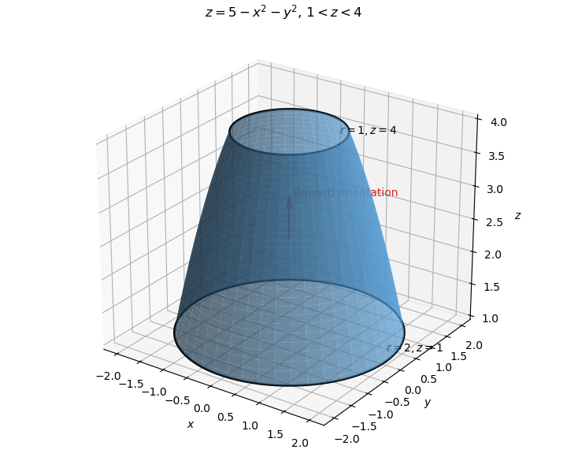

<h1 id="9b/a/solution">Solution</h1>

↑ **Parent:** [A](../a.md)

The surface is an annular band of the downward-opening paraboloid, bounded by the circles $r=1,z=4$ and $r=2,z=1$. Choose the upward orientation.

**[Figure 1](#9b/a/image-an-annular-surface-cut-from-a-paraboloid). An annular surface cut from a paraboloid**.

The [curl](../../../../../../curl.md) of $\mathbf A=(3y,-xz,yz^2)$ is

$$
\nabla\times\mathbf A=(z^2+x,0,-z-3).
$$

For the graph $z=5-x^2-y^2$, the upward vector [surface integral](../../../../../../surface-integral.md) element is

$$
d\mathbf S=(2x,2y,1)\,dx\,dy.
$$

Over the annulus $1<r<2$, the odd term $2xz^2$ integrates to zero. Therefore

$$
\begin{aligned}
I&=\iint_{1<r<2}(2x^2-z-3)\,dx\,dy\\
&=\int_1^2\int_0^{2\pi}
(2r^2\cos^2\theta+r^2-8)r\,d\theta\,dr\\
&=\int_1^2(4\pi r^3-16\pi r)\,dr
=\boxed{-9\pi}.
\end{aligned}
$$

## ↑ Ancestors (11)

1. [A](../a.md)
2. [9B](../../9b.md)
3. [Paper 2](../../../paper-2-split.md)
4. [Ia](../../../split.md)
5. [2020](../../../../split.md)
6. [Past exam of the mathematics course of the University of Cambridge](../../../../../split.md)
7. [Mathematics course of the University of Cambridge](../../../../../../mathematics-course-of-the-university-of-cambridge.md)
8. [Course of the University of Cambridge](../../../../../../course-of-the-university-of-cambridge.md)
9. [University of Cambridge](../../../../../../university-of-cambridge-split.md)
10. [List of universities](../../../../../../list-of-universities.md)
11. [Codex Wiki](../../../../../../split.md)
