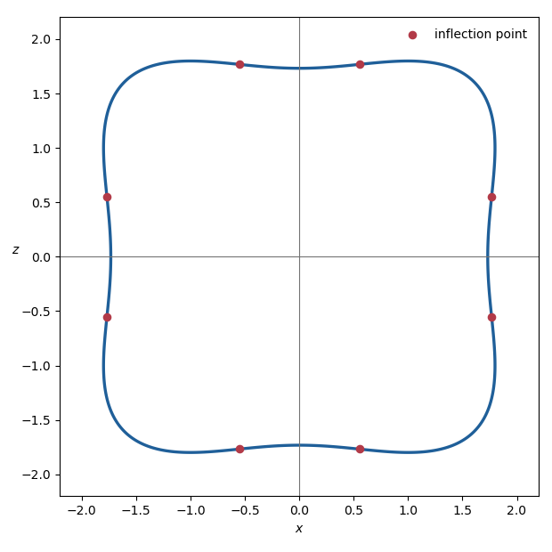

# Paper 1

↑ **Parent:** [Ib](../ib.md)

[https://www.maths.cam.ac.uk/undergrad/pastpapers/files/2020/paperib_1_2020.pdf](https://www.maths.cam.ac.uk/undergrad/pastpapers/files/2020/paperib_1_2020.pdf)

**Table of contents**

- [1F](#1f)
  - [Solution](#1f/solution)
- [2E](#2e)
  - [Solution](#2e/solution)
- [3G](#3g)
  - [Solution](#3g/solution)
- [4A](#4a)
  - [Solution](#4a/solution)
- [5C](#5c)
  - [a](#5c/a)
    - [Solution](#5c/a/solution)
  - [b](#5c/b)
    - [Solution](#5c/b/solution)
- [6H](#6h)
  - [Solution](#6h/solution)
- [7H](#7h)
  - [Solution](#7h/solution)
- [8F](#8f)
  - [Solution](#8f/solution)
- [9G](#9g)
  - [Solution](#9g/solution)
- [10E](#10e)
  - [Solution](#10e/solution)
- [11E](#11e)
  - [Solution](#11e/solution)
- [12G](#12g)
  - [Solution](#12g/solution)
- [13D](#13d)
  - [Solution](#13d/solution)
- [14B](#14b)
  - [Solution](#14b/solution)
- [15A](#15a)
  - [Solution](#15a/solution)
- [16D](#16d)
  - [Solution](#16d/solution)
- [17C](#17c)
  - [a](#17c/a)
    - [Solution](#17c/a/solution)
  - [b](#17c/b)
    - [Solution](#17c/b/solution)
  - [c](#17c/c)
    - [Solution](#17c/c/solution)
- [18C](#18c)
  - [a](#18c/a)
    - [Solution](#18c/a/solution)
  - [b](#18c/b)
    - [Solution](#18c/b/solution)
  - [c](#18c/c)
    - [Solution](#18c/c/solution)
- [19H](#19h)
  - [a](#19h/a)
    - [Solution](#19h/a/solution)
  - [b](#19h/b)
    - [Solution](#19h/b/solution)
  - [c](#19h/c)
    - [Solution](#19h/c/solution)
  - [d](#19h/d)
    - [Solution](#19h/d/solution)
- [20H](#20h)
  - [a](#20h/a)
    - [Solution](#20h/a/solution)
  - [b](#20h/b)
    - [Solution](#20h/b/solution)

## 1F

↑ **Parent:** [Paper 1](paper-1.md)

<h3 id="1f/solution">Solution</h3>

↑ **Parent:** [1F](#1f)

Two square matrices are [similar](../../../linear-algebra.md#matrix-similarity) when $B=P^{-1}AP$ for some invertible matrix $P$. A [Jordan normal form](../../../linear-operator-theory.md#jordan-normal-form) is a block-diagonal matrix whose blocks have one eigenvalue on the diagonal, ones on the superdiagonal, and zeros elsewhere; over an algebraically closed field every matrix is similar to such a form, unique up to reordering its [Jordan blocks](../../../linear-operator-theory.md#jordan-block).

Both displayed matrices have [characteristic polynomial](../../../linear-operator-theory.md#characteristic-polynomial)

$$
\chi_A(t)=\chi_B(t)=(t-1)^3.
$$

However,

$$
\operatorname{rank}(A-I)=1,\qquad
\operatorname{rank}(B-I)=2,
$$

so their eigenspace dimensions are respectively two and one. Thus $A$ has Jordan form $J_2(1)\oplus J_1(1)$, whereas $B$ has Jordan form $J_3(1)$. By uniqueness of Jordan normal form,

$$
\boxed{A\text{ and }B\text{ are not similar}}.
$$

## 2E

↑ **Parent:** [Paper 1](paper-1.md)

<h3 id="2e/solution">Solution</h3>

↑ **Parent:** [2E](#2e)

For an oriented smooth embedded surface, the [Gauss map](../../../differential-geometry.md#gauss-map) sends each point to its chosen unit normal. This surface is the ring torus with major radius two and minor radius one. Its outward Gauss map is

$$
\boxed{f(u,v)=(\cos v\cos u,\cos v\sin u,\sin v)}.
$$

On the $y=0$ cross-section, the normal points radially away from the center of each generating circle, which gives this formula for $u=0,\pi$ and then rotational symmetry gives it for all $u$.

The upper hemisphere condition is $\sin v>0$, hence $0<v<\pi$. For this torus, the [Gaussian curvature](../../../second-fundamental-form.md#gaussian-curvature) and area element are

$$
K=\frac{\cos v}{2+\cos v},
\qquad
dA=(2+\cos v)\,du\,dv.
$$

Therefore the positive outer and negative inner contributions cancel:

$$
\boxed{\int_{f^{-1}(U)}K\,dA
=\int_0^{2\pi}\int_0^\pi\cos v\,dv\,du=0}.
$$

## 3G

↑ **Parent:** [Paper 1](paper-1.md)

<h3 id="3g/solution">Solution</h3>

↑ **Parent:** [3G](#3g)

The boundary arcs meet at $0$ and $1$. The [Möbius transformation](../../../group-theory.md#mobius-transformation)

$$
w=\frac{z}{1-z}
$$

sends these points to $0$ and infinity, sends the real boundary segment to the positive real axis, and sends the circular boundary arc to the ray of argument $-\pi/6$. Hence it maps $D\cap L$ onto the sector

$$
-\frac{\pi}{6}<\arg w<0.
$$

The power $\zeta=w^6$ maps this sector conformally onto the lower half-plane. Finally, the Cayley map $\zeta\mapsto(\zeta+i)/(\zeta-i)$ maps the lower half-plane onto the unit disc. Thus a requested [conformal equivalence](../../../geometry-and-topology.md#conformal-equivalence) is

$$
\boxed{F(z)=
\frac{\left(\dfrac{z}{1-z}\right)^6+i}
{\left(\dfrac{z}{1-z}\right)^6-i}}.
$$

## 4A

↑ **Parent:** [Paper 1](paper-1.md)

<h3 id="4a/solution">Solution</h3>

↑ **Parent:** [4A](#4a)

An operator $Q$ is Hermitian when

$$
\langle\phi,Q\psi\rangle=\langle Q\phi,\psi\rangle
$$

on its domain. Hermitian operators represent quantum observables because their expectation values and eigenvalues are real. In a normalized state,

$$
(\Delta Q)_\psi
=\left\langle\bigl(Q-\langle Q\rangle_\psi\bigr)^2
\right\rangle_\psi^{1/2}.
$$

Positivity of the norm of $(Q+i\lambda P)\psi$ for every real $\lambda$ gives

$$
0\leq
\langle Q^2\rangle_\psi
+\lambda\langle i[Q,P]\rangle_\psi
+\lambda^2\langle P^2\rangle_\psi.
$$

The middle expectation is real because $i[Q,P]$ is Hermitian. The discriminant of this quadratic is nonpositive, so

$$
\langle Q^2\rangle_\psi\langle P^2\rangle_\psi
\geq\frac14|\langle i[Q,P]\rangle_\psi|^2.
$$

Apply this to the centered operators $Q-\langle Q\rangle_\psi$ and $P-\langle P\rangle_\psi$, whose [commutator](../../../lie-algebra.md#commutator) is still $[Q,P]$. This yields the [Robertson uncertainty principle](../../../quantum-theory.md#robertson-uncertainty-principle)

$$
\boxed{(\Delta Q)_\psi(\Delta P)_\psi
\geq\frac12|\langle i[Q,P]\rangle_\psi|}.
$$

Noncommuting observables therefore cannot both have arbitrarily sharply concentrated measurement distributions in the same state.

## 5C

↑ **Parent:** [Paper 1](paper-1.md)

<h3 id="5c/a">a</h3>

↑ **Parent:** [5C](#5c)

<h4 id="5c/a/solution">Solution</h4>

↑ **Parent:** [A](#5c/a)

[Gaussian elimination](../../../numerical-analysis.md#gaussian-elimination) gives the [LU decomposition](../../../numerical-analysis.md#lu-decomposition)

$$
\boxed{
L=\begin{pmatrix}
1&0&0&0\\
0&2&0&0\\
0&5&2&0\\
3&-4&3&1
\end{pmatrix},
\qquad
U=\begin{pmatrix}
1&1&0&3\\
0&1&1&6\\
0&0&1&1\\
0&0&0&2
\end{pmatrix}}.
$$

The prescribed diagonal entries of $L$ are visible, and direct multiplication gives $LU=A$.

<h3 id="5c/b">b</h3>

↑ **Parent:** [5C](#5c)

<h4 id="5c/b/solution">Solution</h4>

↑ **Parent:** [B](#5c/b)

First solve $L\mathbf y=\mathbf b$ by forward substitution:

$$
\mathbf y=(-3,-6,0,-2)^T.
$$

Then solve $U\mathbf x=\mathbf y$ by backward substitution, obtaining

$$
\boxed{\mathbf x=(1,-1,1,-1)^T}.
$$

Direct substitution verifies $A\mathbf x=\mathbf b$.

## 6H

↑ **Parent:** [Paper 1](paper-1.md)

<h3 id="6h/solution">Solution</h3>

↑ **Parent:** [6H](#6h)

The likelihood contributes precision $n$ and precision-weighted mean $n\overline X$, while the prior contributes precision $\tau^2$ and precision-weighted mean $\tau^2\theta$. By [normal-normal conjugacy with known observation variance](../../../probability-and-statistics.md#normal-normal-conjugacy-with-known-observation-variance), the posterior is

$$
\mu\mid X_1,\ldots,X_n
\sim N\left(
\frac{n\overline X+\tau^2\theta}{n+\tau^2},
\frac1{n+\tau^2}\right).
$$

Thus the posterior mean is

$$
\boxed{\widehat\mu=\frac{n\overline X+\tau^2\theta}{n+\tau^2}}.
$$

When $\theta=0$, its expectation under true parameter $\mu$ is $n\mu/(n+\tau^2)$ and its variance is $n/(n+\tau^2)^2$. Hence its frequentist [mean squared error](../../../statistical-modelling.md#mean-squared-error) is

$$
\boxed{\operatorname{MSE}_\mu(\widehat\mu)
=\frac{n+\tau^4\mu^2}{(n+\tau^2)^2}}.
$$

## 7H

↑ **Parent:** [Paper 1](paper-1.md)

<h3 id="7h/solution">Solution</h3>

↑ **Parent:** [7H](#7h)

Write the absolute-value constraint as

$$
x_1-2x_2\leq2,\qquad -x_1+2x_2\leq2.
$$

Introduce slacks $s_1,s_2,s_3$. In the [simplex algorithm](../../../numerical-analysis.md#simplex-algorithm), let $x_2$ enter and $s_2$ leave, then let $x_1$ enter and $s_3$ leave. The final dictionary is

$$
x_1=\frac23+\frac19s_2-\frac29s_3,
\qquad
x_2=\frac43-\frac49s_2-\frac19s_3,
$$

$$
x_1+x_2=2-\frac13s_2-\frac13s_3.
$$

Thus

$$
\boxed{(x_1,x_2)=\left(\frac23,\frac43\right),
\qquad \max(x_1+x_2)=2}.
$$

For sufficiently small perturbations, the same two constraints remain active:

$$
-x_1+2x_2=2+\epsilon_1,\qquad
4x_1+x_2=4+\epsilon_2.
$$

Solving gives

$$
x_1=\frac{6+2\epsilon_2-\epsilon_1}{9},
\qquad
x_2=\frac{12+\epsilon_2+4\epsilon_1}{9},
$$

and therefore the perturbed optimal value is

$$
\boxed{2+\frac{\epsilon_1+\epsilon_2}{3}}.
$$

## 8F

↑ **Parent:** [Paper 1](paper-1.md)

<h3 id="8f/solution">Solution</h3>

↑ **Parent:** [8F](#8f)

The [rank of a matrix](../../../vector-space.md#matrix-rank) is the [dimension](../../../vector-space.md#dimension-vector-space) of its [column space](../../../vector-space.md#column-space), equivalently the dimension of the [image of a linear map](../../../vector-space.md#image-of-a-linear-map) represented by the matrix. For $A\in\mathcal M_n$, the [rank-nullity theorem](../../../linear-algebra.md#rank-nullity-theorem) gives

$$
\operatorname{rank}A=n
\iff \ker A=\{0\}
\iff A\text{ is injective}.
$$

An injective endomorphism of a finite-dimensional [vector space](../../../vector-space.md) is [surjective](../../../algebra.md#surjective-function), hence [invertible](../../../linear-algebra.md#invertible-matrix). By the [adjugate matrix](../../../linear-algebra.md#adjugate-matrix) identity

$$
A\operatorname{adj}A=(\det A)I,
$$

$A$ is invertible when $\det A\ne0$; conversely, [multiplicativity of the determinant](../../../linear-algebra.md#multiplicativity-of-the-determinant) shows that an invertible $A$ has nonzero [determinant](../../../linear-algebra.md#determinant). Therefore

$$
\boxed{\operatorname{rank}A=n\iff A\text{ is nonsingular}\iff\det A\ne0}.
$$

Let $E_{ij}$ be the [matrix unit](../../../vector-space.md#matrix-unit) with its only nonzero entry at $(i,j)$. The following $n^2$ matrices are all nonsingular:

$$
\mathcal B=\{I\}\cup\{I+E_{ij}:(i,j)\ne(n,n)\}.
$$

Indeed, $I+E_{ij}$ is an elementary shear when $i\ne j$, while $I+E_{ii}$ is diagonal with one diagonal entry equal to two. Their [linear span](../../../vector-space.md#linear-span) contains every $E_{ij}$ except initially $E_{nn}$, because $E_{ij}=(I+E_{ij})-I$, and it then contains

$$
E_{nn}=I-\sum_{i=1}^{n-1}E_{ii}.
$$

Thus $\mathcal B$ spans the $n^2$-dimensional space $\mathcal M_n$ and, having $n^2$ members, is a [basis](../../../vector-space.md#basis). This also covers $n=1$, when $\mathcal B=\{I\}$.

Now let $A$ be a nonsingular [zero-one matrix](../../../vector-space.md#binary-matrix). If it had fewer than $n-1$ zero entries, at least two rows would contain no zero at all. Those two rows would both be the all-one row, contradicting [linear independence](../../../vector-space.md#linear-independence). Hence every such matrix has at most

$$
\boxed{c_n\le n^2-n+1}
$$

ones. The bound is attained. Let $J$ be the all-one matrix and set

$$
A=J-\operatorname{diag}(1,\ldots,1,0),
$$

where there are $n-1$ initial diagonal ones. If $A\mathbf x=0$ and $S=\sum_jx_j$, the first $n-1$ row equations give $x_i=S$, while the last gives $S=0$. Hence every $x_i=0$, so $A$ is nonsingular and has exactly $n^2-n+1$ ones. Therefore

$$
\boxed{c_n=n^2-n+1}.
$$

## 9G

↑ **Parent:** [Paper 1](paper-1.md)

<h3 id="9g/solution">Solution</h3>

↑ **Parent:** [9G](#9g)

The [structure theorem for finitely generated modules over a principal ideal domain](../../../module-theory.md#structure-theorem-for-finitely-generated-modules-over-a-principal-ideal-domain) applies because every [Euclidean domain](../../../commutative-algebra.md#euclidean-domain) is a [principal ideal domain](../../../commutative-algebra.md#principal-ideal-domain). It says that a finitely generated $R$-module is isomorphic to

$$
R^s\oplus R/(d_1)\oplus\cdots\oplus R/(d_k),
\qquad d_1\mid d_2\mid\cdots\mid d_k,
$$

where the nonzero nonunits $d_i$ are unique up to multiplication by units. They are the [invariant factors](../../../linear-operator-theory.md#invariant-factors-of-a-linear-operator).

For $V_\alpha$, multiplication by $X$ is the [linear map](../../../vector-space.md#linear-map) $\alpha$. Since $V$ is finite-dimensional over $F$, $V_\alpha$ is a finitely generated [torsion module](../../../module-theory.md#torsion-module) over the [polynomial ring](../../../commutative-algebra.md#polynomial-ring) $F[X]$, so it has no free summand. Choosing each invariant factor $a_i$ to be monic gives

$$
V_\alpha\cong\bigoplus_{i=1}^k F[X]/(a_i),
\qquad a_1\mid\cdots\mid a_k.
$$

The basis $1,X,\ldots,X^{\deg a_i-1}$ of each cyclic summand makes multiplication by $X$ a [companion matrix](../../../linear-operator-theory.md#companion-matrix). Concatenating these bases therefore puts $\alpha$ in [rational canonical form](../../../linear-operator-theory.md#rational-canonical-form).

On $F[X]/(a_i)$, a polynomial annihilates multiplication by $X$ exactly when it is divisible by $a_i$. It follows that the [minimal polynomial](../../../linear-operator-theory.md#minimal-polynomial) and [characteristic polynomial](../../../linear-operator-theory.md#characteristic-polynomial) are

$$
\boxed{m_\alpha(X)=a_k(X)},
\qquad
\boxed{\chi_\alpha(X)=\prod_{i=1}^k a_i(X)}.
$$

The second identity follows blockwise from the characteristic polynomial of a companion matrix. Since every $a_i$ divides $a_k$, the product $\chi_\alpha$ annihilates every cyclic summand. Thus $\chi_\alpha(\alpha)=0$, which is the [Cayley-Hamilton theorem](../../../mathematics.md#cayley-hamilton-theorem).

For the displayed matrix, the given generators of $\ker\theta$ are the columns of

$$
XI-A=
\begin{pmatrix}
X&-1&0\\
4&X-4&0\\
2&-1&X-2
\end{pmatrix}.
$$

Elementary row and column operations over $\mathbb R[X]$ give the [Smith normal form](../../../algebra.md#smith-normal-form)

$$
\operatorname{diag}\bigl(1,X-2,(X-2)^2\bigr).
$$

Consequently the nonunit invariant factors are

$$
\boxed{X-2\quad\text{and}\quad(X-2)^2},
$$

and, as a check,

$$
m_\alpha(X)=(X-2)^2,
\qquad
\chi_\alpha(X)=(X-2)^3.
$$

## 10E

↑ **Parent:** [Paper 1](paper-1.md)

<h3 id="10e/solution">Solution</h3>

↑ **Parent:** [10E](#10e)

A function $f:\mathbb R^m\to\mathbb R^r$ is [differentiable](../../../analysis.md#differentiable-function) at $x$ if there is a linear map $L:\mathbb R^m\to\mathbb R^r$ such that

$$
f(x+h)=f(x)+Lh+o(\lVert h\rVert)
\quad\text{as }h\to0.
$$

The map $L$, which is unique, is the [derivative](../../../calculus.md#derivative) $f'(x)$.

Expanding in a matrix increment $H$ gives

$$
(A+H)^3=A^3+A^2H+AHA+HA^2+O(\lVert H\rVert^2).
$$

Therefore $p$ is differentiable everywhere and

$$
\boxed{p'(A)H=A^2H+AHA+HA^2-3H}.
$$

The [inverse function theorem](../../../calculus.md#inverse-function-theorem) states that if $f$ is [continuously differentiable](../../../calculus.md#continuously-differentiable-function) near $a$ and $f'(a)$ is invertible, then $f$ restricts to a bijection between neighbourhoods of $a$ and $f(a)$; its local inverse is continuously differentiable, with derivative

$$
(f^{-1})'(y)=\bigl[f'(f^{-1}(y))\bigr]^{-1}.
$$

In the normalized case $f(0)=0$ and $f'(0)=I$, continuity of $f'$ gives a closed ball $\overline B_r(0)$ on which

$$
\lVert I-f'(x)\rVert\le q<1.
$$

For small $y$, define $T_y(x)=x-f(x)+y$. The [mean value inequality](../../../calculus.md#mean-value-inequality) makes $T_y$ a [contraction mapping](../../../analysis.md#contraction-mapping) with constant $q$. If $\lVert y\rVert\le(1-q)r$, then

$$
\lVert T_y(x)\rVert\le q\lVert x\rVert+\lVert y\rVert\le r,
$$

so $T_y$ maps the ball into itself. The [contraction mapping theorem](../../../analysis.md#contraction-mapping-theorem) gives a unique [fixed point](../../../function.md#fixed-point) $x_y$, and the fixed-point equation is precisely $f(x_y)=y$. Moreover,

$$
\lVert x_y-x_z\rVert
\le q\lVert x_y-x_z\rVert+\lVert y-z\rVert,
$$

so $\lVert x_y-x_z\rVert\le\lVert y-z\rVert/(1-q)$. Thus $y\mapsto x_y$ is a continuous local inverse.

For the polynomial map in the question,

$$
p(2I)=I,
\qquad
p'(2I)H=(4+4+4-3)H=9H.
$$

The derivative is invertible, so the inverse function theorem supplies some $\epsilon>0$ and a continuously differentiable $q:D_\epsilon(I)\to\mathcal M_n$ such that

$$
\boxed{p\circ q=\operatorname{id}|_{D_\epsilon(I)}}.
$$

There can be no inverse on all of $\mathcal M_n$, because

$$
p(2I)=I=p(-I),
$$

so $p$ is not [injective](../../../algebra.md#injective-function).

## 11E

↑ **Parent:** [Paper 1](paper-1.md)

<h3 id="11e/solution">Solution</h3>

↑ **Parent:** [11E](#11e)

The curve is symmetric in both coordinate axes and under interchange of $x$ and $z$. Its shape, including its eight [inflection points](../../../topology.md#inflection-point), is:

**[Figure 1](#11e/image-a-plane-curve-and-its-inflection-points). A plane curve and its inflection points**.

Writing $r^2=x^2+y^2$, the [surface of revolution](../../../differential-geometry.md#surface-of-revolution) has equation

$$
\boxed{(x^2+y^2-1)^2+(z^2-1)^2=5}.
$$

Let

$$
F(x,y,z)=(x^2+y^2-1)^2+(z^2-1)^2-5.
$$

Its [gradient](../../../calculus.md#gradient) is

$$
\nabla F=4\bigl(x(r^2-1),y(r^2-1),z(z^2-1)\bigr).
$$

If this vanished, then $r^2\in\{0,1\}$ and $z^2\in\{0,1\}$, but at such a point $(r^2-1)^2+(z^2-1)^2\le2$, not five. Hence zero is a [regular value](../../../differential-geometry.md#regular-value), and the [regular level set theorem](../../../differential-geometry.md#regular-level-set-theorem) shows that $S=F^{-1}(0)$ is a smooth [embedded surface](../../../differential-geometry.md#embedded-submanifold).

For a surface of revolution, the two [principal curvatures](../../../second-fundamental-form.md#principal-curvature) are the curvature of the meridian and the normal curvature of a parallel. Along $r=1$,

$$
F_r=4r(r^2-1)=0,
$$

so the normal is vertical in the meridian plane and the parallel principal curvature vanishes. Therefore the [Gaussian curvature](../../../second-fundamental-form.md#gaussian-curvature), the product of the principal curvatures, is zero there.

These are not the only zero-curvature points. The meridian itself has inflection points, at which its principal curvature vanishes. Setting $u=r^2$ and $v=z^2$, their positive squared coordinates satisfy

$$
(u-1)^2+(v-1)^2=5,
$$

$$
(3u-1)v(v-1)^2+(3v-1)u(u-1)^2=0.
$$

Besides interchanging $u$ and $v$, the solution is approximately

$$
(u,v)=(0.304199,3.125056).
$$

Each corresponding meridian inflection point sweeps out another circle on $S$, so $r=1$ does not exhaust the zero set of the Gaussian curvature.

## 12G

↑ **Parent:** [Paper 1](paper-1.md)

<h3 id="12g/solution">Solution</h3>

↑ **Parent:** [12G](#12g)

An [analytic branch of a square root](../../../analysis.md#analytic-branch-of-a-square-root) determined by the branch $\ell$ is

$$
\boxed{\psi(z)=\exp\!\left(\frac12\ell(z)\right)}.
$$

If $\psi_1$ and $\psi_2$ are two such branches, their ratio $h=\psi_1/\psi_2$ is analytic and satisfies $h^2=1$. Since a domain is connected and $h$ takes values in the discrete set $\{1,-1\}$, $h$ is constant. Thus $\psi_1=\psi_2$ throughout $D$ or $\psi_1=-\psi_2$ throughout $D$.

For $z=re^{i\theta}$, the [principal square root](../../../analysis.md#principal-square-root-of-a-complex-number) is

$$
\sigma_1(z)=\sqrt r\,e^{i\theta/2},
\qquad -\pi<\theta<\pi.
$$

On $D_2$, one may instead take

$$
\sigma_2(z)=\sqrt r\,e^{i\theta/2},
\qquad 0<\theta<2\pi.
$$

The respective removed half-axes are their [branch cuts](../../../analysis.md#branch-cut).

On $\mathbb C\setminus[-1,1]$, define

$$
\boxed{\varphi(z)=-iz\,\sigma_1\!\left(1-\frac1{z^2}\right)}.
$$

It is analytic there, its square is $1-z^2$, and

$$
\varphi(2i)=-i(2i)\sqrt{1+\frac14}=\sqrt5,
$$

so it is the required branch. Substitution gives, for $0<|z|<1$,

$$
\varphi(1/z)=-\frac{i}{z}\sigma_1(1-z^2).
$$

The [binomial series](../../../real-analysis.md#binomial-series) yields

$$
\sigma_1(1-z^2)=1-\frac12z^2-\frac18z^4+O(z^6),
$$

hence the first three terms of the [Laurent series](../../../analysis.md#laurent-series) are

$$
\boxed{\varphi(1/z)=-\frac{i}{z}+\frac{i}{2}z+\frac{i}{8}z^3+O(z^5)}.
$$

Since

$$
g(z)=\frac{\varphi(1/z)}{1+z^2},
$$

its [residue](../../../analysis.md#residue) at zero is $-i$. Under the change of variable $z=1/\zeta$, the two orientation reversals cancel, and the [residue theorem](../../../analysis.md#residue-theorem) gives

$$
\boxed{\int_{|z|=2}f(z)\,dz
=\int_{|\zeta|=1/2}g(\zeta)\,d\zeta
=2\pi i(-i)=2\pi}.
$$

## 13D

↑ **Parent:** [Paper 1](paper-1.md)

<h3 id="13d/solution">Solution</h3>

↑ **Parent:** [13D](#13d)

In [polar coordinates](../../../calculus.md#polar-coordinates),

$$
v\,dt=ds=\sqrt{dr^2+r^2d\theta^2}.
$$

With the change of radial coordinate $u=\log r$, the detection functional becomes

$$
P=\lambda\int\frac{ds}{r}
=\lambda\int\sqrt{du^2+d\theta^2}.
$$

It is therefore $\lambda$ times ordinary [path length](../../../riemannian-geometry.md#arc-length) in the $(u,\theta)$-plane. The shortest path is the line segment from $(\log A,0)$ to $(\log B,\alpha)$, so

$$
u(\theta)=\log A+\frac{\log(B/A)}{\alpha}\theta.
$$

Returning to $r$ gives the [logarithmic spiral](../../../topology.md#logarithmic-spiral)

$$
\boxed{r(\theta)=A\exp\!\left(\frac{\log(B/A)}{\alpha}\theta\right)}.
$$

Its minimum detection probability is

$$
P_{\min}=\lambda\sqrt{\log^2(B/A)+\alpha^2}.
$$

The functional depends only on the geometric path and not its parametrization, so tiptoeing and running give the same probability.

For the improved sensor, omit the irrelevant positive factor $\lambda$ and use the [Lagrangian](../../../calculus-of-variations.md#lagrangian)

$$
L=\frac{\dot r^2}{r}+r\dot\theta^2.
$$

The coordinate $\theta$ is cyclic, so its [conjugate momentum](../../../classical-mechanics.md#canonical-momentum) is conserved. Equivalently,

$$
\boxed{h=r\dot\theta}
$$

is constant. Because $L$ has no explicit time dependence, the associated [conservation of energy](../../../physics.md#conservation-of-energy) gives the constant

$$
\boxed{E=\frac{\dot r^2}{r}+r\dot\theta^2}.
$$

Multiplying by $r$ and using $h=r\dot\theta$ gives the required equation

$$
\boxed{\dot r^2=Er-h^2}.
$$

## 14B

↑ **Parent:** [Paper 1](paper-1.md)

<h3 id="14b/solution">Solution</h3>

↑ **Parent:** [14B](#14b)

Expand $g$ in its [Fourier sine series](../../../fourier-series.md#fourier-sine-series)

$$
g(y)=\sum_{n=1}^{\infty}g_n\sin(k_ny),
\qquad
k_n=\frac{n\pi}{a},
\qquad
g_n=\frac2a\int_0^a g(y)\sin(k_ny)\,dy.
$$

By [separation of variables](../../../partial-differential-equation.md#separation-of-variables), the decaying solution of [Laplace equation](../../../partial-differential-equation.md#laplace-equation) in each half-strip has $n$th mode proportional to $e^{-k_n|x|}\sin(k_ny)$. Continuity at $x=0$ and integration of the equation across the [Dirac delta function](../../../distribution-theory.md#dirac-delta-function) require the normal-derivative jump

$$
\phi_x(0^+,y)-\phi_x(0^-,y)=g(y).
$$

The jump of $C_ne^{-k_n|x|}$ is $-2k_nC_n$, so

$$
\boxed{\phi(x,y)=-\sum_{n=1}^{\infty}\frac{g_n}{2k_n}e^{-k_n|x|}\sin(k_ny)}.
$$

For $g(y)=\delta(y-c)$, its Fourier coefficients are

$$
g_n=\frac2a\sin\frac{n\pi c}{a}.
$$

Thus

$$
\phi(x,y)=-\frac1\pi\sum_{n=1}^{\infty}
\frac1n e^{-n\pi|x|/a}
\sin\frac{n\pi y}{a}\sin\frac{n\pi c}{a}.
$$

Translation in $x$ gives the [Dirichlet Green function for an infinite strip](../../../analysis.md#dirichlet-green-function-for-an-infinite-strip) with source $(b,c)$:

$$
\boxed{G(x,y;b,c)=-\frac1\pi\sum_{n=1}^{\infty}
\frac1n e^{-n\pi|x-b|/a}
\sin\frac{n\pi y}{a}\sin\frac{n\pi c}{a}}.
$$

## 15A

↑ **Parent:** [Paper 1](paper-1.md)

<h3 id="15a/solution">Solution</h3>

↑ **Parent:** [15A](#15a)

A [stationary state](../../../quantum-mechanics.md#stationary-state) has the form

$$
\Psi(t)=e^{-iEt/\hbar}\psi.
$$

For a time-independent [quantum observable](../../../quantum-mechanics.md#observable) $Q$, the global phases cancel in the [expectation value](../../../quantum-mechanics.md#expectation-value):

$$
\langle Q\rangle_{\Psi(t)}
=\langle e^{-iEt/\hbar}\psi,Qe^{-iEt/\hbar}\psi\rangle
=\langle\psi,Q\psi\rangle.
$$

It is therefore independent of time.

For the [infinite square well](../../../quantum-mechanics.md#infinite-square-well),

$$
E_n=\frac{n^2\pi^2\hbar^2}{2ma^2}.
$$

The possible [energy measurement](../../../quantum-mechanics.md#energy-measurement) results are

$$
\boxed{E_1=\frac{\pi^2\hbar^2}{2ma^2},
\qquad E_2=\frac{2\pi^2\hbar^2}{ma^2}},
$$

with respective [Born rule](../../../quantum-mechanics.md#born-rule) probabilities $|c_1|^2$ and $|c_2|^2$. Normalization gives $|c_1|^2+|c_2|^2=1$.

At time $t$,

$$
\Psi(x,t)=c_1e^{-iE_1t/\hbar}\psi_1(x)
+c_2e^{-iE_2t/\hbar}\psi_2(x).
$$

The required [matrix elements](../../../vector-space.md#matrix-element) are

$$
\langle\psi_1,\hat x\psi_1\rangle
=\langle\psi_2,\hat x\psi_2\rangle=\frac a2,
\qquad
\langle\psi_1,\hat x\psi_2\rangle=-\frac{16a}{9\pi^2}.
$$

Consequently

$$
\boxed{\langle\hat x\rangle_{\Psi(t)}
=\frac a2-\frac{32a}{9\pi^2}
\operatorname{Re}\!\left(c_1^*c_2e^{-i\omega t}\right)},
$$

where the [angular frequency](../../../classical-mechanics.md#angular-frequency) is

$$
\boxed{\omega=\frac{E_2-E_1}{\hbar}
=\frac{3\pi^2\hbar}{2ma^2}}.
$$

Finally, $2|c_1c_2|\le |c_1|^2+|c_2|^2=1$, so

$$
\boxed{\left|\langle\hat x\rangle_{\Psi(t)}-\frac a2\right|
\le\frac{16a}{9\pi^2}}.
$$

## 16D

↑ **Parent:** [Paper 1](paper-1.md)

<h3 id="16d/solution">Solution</h3>

↑ **Parent:** [16D](#16d)

The [electric potential](../../../electromagnetism.md#electric-potential) of a [point charge](../../../electromagnetism.md#point-charge) $Q$ at the origin is

$$
\boxed{\Phi(\mathbf x)=\frac{Q}{4\pi\epsilon_0|\mathbf x|}}.
$$

For the two charges forming the dipole,

$$
\Phi(\mathbf x)=\frac{Q}{4\pi\epsilon_0}
\left(\frac1{|\mathbf x|}-\frac1{|\mathbf x+\mathbf d|}\right).
$$

The first-order [Taylor expansion](../../../calculus.md#taylor-expansion) at large $|\mathbf x|$ is

$$
\frac1{|\mathbf x+\mathbf d|}
=\frac1r-\frac{\mathbf d\cdot\mathbf x}{r^3}
+O\!\left(\frac{|\mathbf d|^2}{r^3}\right),
$$

and therefore, with the [electric dipole moment](../../../electromagnetism.md#electric-dipole-moment) $\mathbf p=Q\mathbf d$,

$$
\boxed{\Phi(\mathbf x)=\frac1{4\pi\epsilon_0}
\frac{\mathbf p\cdot\mathbf x}{r^3}}
$$

to leading order. Taking the interaction of a second dipole with the corresponding [electric field](../../../electromagnetism.md#electric-field) gives the stated [electric dipole-dipole interaction](../../../electromagnetism.md#electric-dipole-dipole-interaction)

$$
U=\frac1{8\pi\epsilon_0}
\left(\frac{\mathbf p_1\cdot\mathbf p_2}{r^3}
-\frac{3(\mathbf p_1\cdot\mathbf r)(\mathbf p_2\cdot\mathbf r)}{r^5}\right).
$$

Let the lattice spacing be $d$ and write the central dipole as

$$
\mathbf p=p(\cos\theta,\sin\theta).
$$

Its two horizontal neighbours have moment $p(\cos\theta,-\sin\theta)$. For either one, the expression in parentheses, after extracting $d^{-3}$, is

$$
-p^2(1+\cos^2\theta).
$$

Its two vertical neighbours have moment $p(-\cos\theta,\sin\theta)$, and each contributes instead

$$
-p^2(1+\sin^2\theta).
$$

Adding all four nearest-neighbour interactions and using the [Pythagorean trigonometric identity](../../../geometry-and-topology.md#pythagorean-trigonometric-identity) gives

$$
\boxed{U_{\mathrm{nearest}}
=-\frac{6p^2}{8\pi\epsilon_0d^3}
=-\frac{3p^2}{4\pi\epsilon_0d^3}}.
$$

The angle has cancelled, so the energy is independent of $\theta$.

## 17C

↑ **Parent:** [Paper 1](paper-1.md)

<h3 id="17c/a">a</h3>

↑ **Parent:** [17C](#17c)

<h4 id="17c/a/solution">Solution</h4>

↑ **Parent:** [A](#17c/a)

For a [velocity potential](../../../fluid-mechanics.md#velocity-potential), $\mathbf u=\nabla\phi$. The [incompressible flow](../../../fluid-mechanics.md#incompressible-flow) condition $\nabla\cdot\mathbf u=0$ therefore becomes [Laplace equation](../../../partial-differential-equation.md#laplace-equation) $\nabla^2\phi=0$. The [Laplace equation in polar coordinates](../../../partial-differential-equation.md#laplace-equation-in-polar-coordinates) gives

$$
\nabla^2\phi
=A(\gamma^2-\lambda^2)r^{\gamma-2}\cos(\lambda\theta),
$$

so positivity of $\gamma$ and $\lambda$ requires

$$
\boxed{\gamma=\lambda}.
$$

The velocity components are

$$
u_r=\frac{\partial\phi}{\partial r}
=A\gamma r^{\gamma-1}\cos(\lambda\theta),
\qquad
u_\theta=\frac1r\frac{\partial\phi}{\partial\theta}
=-A\lambda r^{\gamma-1}\sin(\lambda\theta).
$$

The [no-penetration boundary condition](../../../viscous-fluid-flow.md#no-penetration-boundary-condition) on both walls says $u_\theta=0$ at $\theta=0$ and $\theta=\alpha$, hence $\lambda\alpha=n\pi$. If $n\ge2$, $\sin(n\pi\theta/\alpha)$ changes sign inside the wedge. The stated sign condition therefore selects $n=1$, and

$$
\boxed{\gamma=\lambda=\frac\pi\alpha}.
$$

<h3 id="17c/b">b</h3>

↑ **Parent:** [17C](#17c)

<h4 id="17c/b/solution">Solution</h4>

↑ **Parent:** [B](#17c/b)

A [streamline](../../../fluid-mechanics.md#streamline) satisfies

$$
\frac{dr}{r\,d\theta}=\frac{u_r}{u_\theta}
=-\cot(\gamma\theta).
$$

Integration gives

$$
\log r=-\frac1\gamma\log\sin(\gamma\theta)+C.
$$

The radius is smallest on the wedge bisector $\theta=\alpha/2$, where $\sin(\gamma\theta)=1$. Labelling that radius by $r_{\min}$ therefore gives

$$
\boxed{r(\theta)=r_{\min}
\left(\sin\frac{\pi\theta}{\alpha}\right)^{-\alpha/\pi}}.
$$

Every streamline arrives from infinity along one wall, reaches its closest point on the bisector, and returns to infinity along the other wall:

**[Figure 2](#17c/b/image-streamlines-in-a-wedge). Streamlines in a wedge**.

<h3 id="17c/c">c</h3>

↑ **Parent:** [17C](#17c)

<h4 id="17c/c/solution">Solution</h4>

↑ **Parent:** [C](#17c/c)

Using $\gamma=\lambda$ and the [Pythagorean trigonometric identity](../../../geometry-and-topology.md#pythagorean-trigonometric-identity),

$$
|\mathbf u|^2=u_r^2+u_\theta^2
=A^2\gamma^2r^{2\gamma-2},
$$

so the speed is independent of $\theta$. Since $\gamma=\pi/\alpha>1$,

$$
|\mathbf u(r)|=u_0\left(\frac r{r_0}\right)^{\gamma-1}
$$

and the speed tends to zero at the vertex. The steady irrotational [Bernoulli equation](../../../fluid-mechanics.md#bernoulli-equation) gives

$$
p+\frac12\rho|\mathbf u|^2
=p_0+\frac12\rho u_0^2.
$$

Thus the [fluid pressure](../../../fluid-mechanics.md#fluid-pressure) is also independent of $\theta$, with

$$
p(r)=p_0+\frac12\rho u_0^2
\left[1-\left(\frac r{r_0}\right)^{2\gamma-2}\right].
$$

In particular, the pressure difference between the vertex and $r_0$ is

$$
\boxed{p(0)-p_0=\frac12\rho u_0^2}.
$$

## 18C

↑ **Parent:** [Paper 1](paper-1.md)

<h3 id="18c/a">a</h3>

↑ **Parent:** [18C](#18c)

<h4 id="18c/a/solution">Solution</h4>

↑ **Parent:** [A](#18c/a)

Define the [cardinal polynomials](../../../numerical-analysis.md#lagrange-polynomial)

$$
\ell_k(x)=\prod_{\substack{0\le j\le n\\j\ne k}}
\frac{x-x_j}{x_k-x_j}.
$$

They satisfy $\ell_k(x_i)=\delta_{ik}$. Hence evaluating the proposed [polynomial interpolation](../../../numerical-analysis.md#polynomial-interpolation) formula at $x_i$ gives $p_n(x_i)=a_i$, so the required coefficients are

$$
\boxed{a_k=f_k}.
$$

The polynomial $\sum_kf_k\ell_k$ has degree at most $n$ and takes every prescribed value. Its uniqueness follows because the difference of two such polynomials would have $n+1$ distinct roots while having degree at most $n$.

<h3 id="18c/b">b</h3>

↑ **Parent:** [18C](#18c)

<h4 id="18c/b/solution">Solution</h4>

↑ **Parent:** [B](#18c/b)

For fixed [interpolation nodes](../../../numerical-analysis.md#interpolation-node) $c_0,\ldots,c_{s-1}$, interpolate any $p\in\mathbb P_{s-1}[x]$ as

$$
p(x)=\sum_{k=0}^{s-1}p(c_k)\ell_k(x),
\qquad
\ell_k(x)=\prod_{j\ne k}\frac{x-c_j}{c_k-c_j}.
$$

Integrating shows that the unique weights making the [quadrature rule](../../../numerical-analysis.md#quadrature-rule) exact through degree $s-1$ are

$$
\boxed{w_k=\int_a^b\ell_k(x)\,dx
=\int_a^b\prod_{j\ne k}\frac{x-c_j}{c_k-c_j}\,dx}.
$$

Now let the nodes be the zeros of the degree-$s$ [orthogonal polynomial](../../../numerical-analysis.md#orthogonal-polynomial) $q_s$. Given any $p\in\mathbb P_{2s-1}[x]$, [polynomial division](../../../polynomial.md#polynomial-division) gives

$$
p=q_sh+r,
\qquad \deg h\le s-1,quad \deg r\le s-1.
$$

Orthogonality gives $\int_a^bq_sh=0$, while $q_s(c_k)=0$ makes the quadrature sum for $q_sh$ vanish. The rule is already exact on $r$, so it is exact on $p$. This is the defining precision property of [Gaussian quadrature](../../../numerical-analysis.md#gaussian-quadrature).

<h3 id="18c/c">c</h3>

↑ **Parent:** [18C](#18c)

<h4 id="18c/c/solution">Solution</h4>

↑ **Parent:** [C](#18c/c)

The displayed [Rodrigues' formula](../../../linear-operator-theory.md#rodrigues-formula) gives the [Legendre polynomial](../../../differential-equation.md#legendre-polynomial)

$$
q_4(x)=\frac18(35x^4-30x^2+3).
$$

A four-node Gaussian rule is exact through degree $2\cdot4-1=7$. Solving $q_4(x)=0$ first for $x^2$ gives the four nodes

$$
\boxed{c_k\in
\left\{
-\sqrt{\frac{15+2\sqrt{30}}{35}},
-\sqrt{\frac{15-2\sqrt{30}}{35}},
\sqrt{\frac{15-2\sqrt{30}}{35}},
\sqrt{\frac{15+2\sqrt{30}}{35}}
\right\}}.
$$

The rule is not exact for every polynomial of degree eight: its quadrature value on $q_4^2$ is zero because every node is a root of $q_4$, whereas

$$
\boxed{\int_{-1}^1q_4(x)^2\,dx>0.}
$$

## 19H

↑ **Parent:** [Paper 1](paper-1.md)

<h3 id="19h/a">a</h3>

↑ **Parent:** [19H](#19h)

<h4 id="19h/a/solution">Solution</h4>

↑ **Parent:** [A](#19h/a)

Let $M=X_{(n)}=\max_iX_i$. The [likelihood function](../../../statistical-modelling.md#likelihood-function) is

$$
L(\theta;x_1,\ldots,x_n)
=(2\theta)^{-n}\mathbf1_{\{M\le2\theta\}}.
$$

On its feasible range $\theta\ge M/2$, this is decreasing in $\theta$. Therefore the [maximum likelihood estimator](../../../statistical-modelling.md#maximum-likelihood-estimation) is

$$
\boxed{\widehat\theta=\frac M2}.
$$

<h3 id="19h/b">b</h3>

↑ **Parent:** [19H](#19h)

<h4 id="19h/b/solution">Solution</h4>

↑ **Parent:** [B](#19h/b)

A statistic $T$ is [sufficient](../../../probability-and-statistics.md#sufficient-statistic) for $\theta$ if the conditional distribution of the full sample given $T$ does not depend on $\theta$. It is [minimal sufficient](../../../probability-and-statistics.md#minimal-sufficient-statistic) if it is a function of every sufficient statistic.

The likelihood factors as

$$
L(\theta;\mathbf x)=(2\theta)^{-n}\mathbf1_{\{M\le2\theta\}},
$$

so the [Fisher-Neyman factorization theorem](../../../probability-and-statistics.md#fisher-neyman-factorization-theorem) shows that $M$, and hence its one-to-one transform $\widehat\theta=M/2$, is sufficient. Moreover, for two samples $\mathbf x$ and $\mathbf y$, the ratio $L(\theta;\mathbf x)/L(\theta;\mathbf y)$ is independent of $\theta$ exactly when their maxima agree. The likelihood-ratio criterion for minimal sufficiency therefore shows that $M$ and $\widehat\theta$ are minimal sufficient.

For $n\ge2$, the [sample mean](../../../variance.md#sample-mean) $\widetilde\theta$ is not sufficient: two samples can have the same mean but different maxima, and their likelihood ratio then depends on $\theta$ through the support indicators. It is consequently not minimal sufficient. For the degenerate special case $n=1$, the sample mean and maximum coincide and both conclusions reverse.

<h3 id="19h/c">c</h3>

↑ **Parent:** [19H](#19h)

<h4 id="19h/c/solution">Solution</h4>

↑ **Parent:** [C](#19h/c)

The scaled maximum

$$
U=\frac{M}{2\theta}=\frac{\widehat\theta}{\theta}
$$

has [cumulative distribution function](../../../probability-theory.md#cumulative-distribution-function) $\mathbb P(U\le u)=u^n$ for $0\le u\le1$. Thus

$$
\mathbb E[U]=\frac n{n+1},
\qquad
\mathbb E[U^2]=\frac n{n+2}.
$$

The [mean squared error](../../../statistical-modelling.md#mean-squared-error) of the maximum likelihood estimator is therefore

$$
\operatorname{MSE}(\widehat\theta)
=\theta^2\mathbb E[(U-1)^2]
=\boxed{\frac{2\theta^2}{(n+1)(n+2)}}.
$$

Each $X_i$ from the [uniform distribution](../../../continuous-probability-distribution.md#continuous-uniform-distribution) on $[0,2\theta]$ has mean $\theta$ and variance $\theta^2/3$. The sample mean is unbiased and has variance $\theta^2/(3n)$, hence

$$
\boxed{\operatorname{MSE}(\widetilde\theta)=\frac{\theta^2}{3n}}.
$$

<h3 id="19h/d">d</h3>

↑ **Parent:** [19H](#19h)

<h4 id="19h/d/solution">Solution</h4>

↑ **Parent:** [D](#19h/d)

Because $0\le U\le1$, for fixed $t$ and sufficiently large $n$,

$$
\mathbb P\bigl(n(1-U)\ge t\bigr)
=\begin{cases}
1,&t<0,\\
\mathbb P(U\le1-t/n)=(1-t/n)^n,&t\ge0.
\end{cases}
$$

Therefore

$$
\boxed{h(t)=
\begin{cases}
1,&t<0,\\
e^{-t},&t\ge0.
\end{cases}}
$$

Equivalently, $n(1-\widehat\theta/\theta)$ converges in distribution to an [exponential distribution](../../../continuous-probability-distribution.md#exponential-distribution) of rate one.

Put $c=\log(1/\alpha)$. The limiting probability

$$
\mathbb P\!\left(n\left(1-\frac{\widehat\theta}{\theta}\right)\le c\right)
\longrightarrow1-e^{-c}=1-\alpha
$$

and the certain inequality $\widehat\theta\le\theta$ suggest the approximate [confidence interval](../../../statistical-inference.md#confidence-interval)

$$
\boxed{\left[\widehat\theta,
\frac{n\widehat\theta}{n-\log(1/\alpha)}\right]}.
$$

Since $\mathbb E[\widehat\theta]=n\theta/(n+1)$, its expected length is

$$
\boxed{
\left(\frac{n\theta}{n+1}\right)
\left(\frac{\log(1/\alpha)}{n-\log(1/\alpha)}\right)},
$$

as required.

## 20H

↑ **Parent:** [Paper 1](paper-1.md)

<h3 id="20h/a">a</h3>

↑ **Parent:** [20H](#20h)

<h4 id="20h/a/solution">Solution</h4>

↑ **Parent:** [A](#20h/a)

A random time $\tau$ is a [stopping time](../../../martingale.md#stopping-time) for the [natural filtration](../../../stochastic-process.md#natural-filtration) $(\mathcal F_n)$ of a [Markov chain](../../../markov-process.md#markov-chain) when $\{\tau\le n\}\in\mathcal F_n$ for every $n$. The [Strong Markov property](../../../markov-process.md#strong-markov-property) says that, conditionally on $\tau<\infty$ and $X_\tau=i$, the process after $\tau$ is a fresh copy of the chain started from $i$, independent of the pre-$\tau$ history.

Before capture define the half-separation

$$
D_n=\frac{Z_n-Y_n}{2}.
$$

For $D_n=k\ge2$, independence of the two moves gives the [transition probabilities](../../../markov-process.md#transition-probability)

$$
\mathbb P(D_{n+1}=k-1\mid D_n=k)=\frac q2,
$$

$$
\mathbb P(D_{n+1}=k\mid D_n=k)=\frac12,
\qquad
\mathbb P(D_{n+1}=k+1\mid D_n=k)=\frac{1-q}{2}.
$$

Ignore the holding steps. The resulting embedded chain is a [biased random walk](../../../markov-process.md#biased-random-walk) that moves left with probability $q$ and right with probability $1-q$. Its expected number of moves needed to descend one level is $1/(2q-1)$; this follows either from [first-step analysis](../../../analysis.md#first-step-analysis) or from its drift $1-2q$. A non-holding move occurs with probability $1/2$ at each time, so its mean waiting time is two. Hence, for every $m\ge2$, the expected time to go from separation $2m$ to $2(m-1)$ is

$$
\boxed{\mu=\frac2{2q-1}}.
$$

<h3 id="20h/b">b</h3>

↑ **Parent:** [20H](#20h)

<h4 id="20h/b/solution">Solution</h4>

↑ **Parent:** [B](#20h/b)

Let $T_k$ be the expected capture time starting from $D_0=k$, so $T_0=0$. The [Strong Markov property](../../../markov-process.md#strong-markov-property) at successive first passages to lower levels and part (a) give

$$
T_k=T_1+(k-1)\mu,
\qquad k\ge1.
$$

At $D_n=1$, the next state is zero with probability $r/2$, one with probability $1/2$, and two with probability $(1-r)/2$. [First-step analysis](../../../analysis.md#first-step-analysis) therefore gives

$$
T_1=1+\frac12T_1+\frac{1-r}{2}T_2,
$$

or

$$
T_1=2+(1-r)(T_1+\mu).
$$

Solving,

$$
T_1=\frac2r+\left(\frac1r-1\right)\mu.
$$

Substituting $\mu=2/(2q-1)$ now yields

$$
\boxed{
T_m=\frac2r+\left(m+\frac1r-2\right)\frac2{2q-1}},
$$

which is the required expected capture time.

## ↑ Ancestors (8)

1. [Ib](../ib.md)
2. [2020](../../2020.md)
3. [Past exam of the mathematics course of the University of Cambridge](../../../past-exam-of-the-mathematics-course-of-the-university-of-cambridge.md)
4. [Mathematics course of the University of Cambridge](../../../university-of-cambridge.md#mathematics-course-of-the-university-of-cambridge)
5. [Course of the University of Cambridge](../../../university-of-cambridge.md#course-of-the-university-of-cambridge)
6. [University of Cambridge](../../../university-of-cambridge.md)
7. [List of universities](../../../README.md#list-of-universities)
8. [Codex Wiki](../../../README.md)
