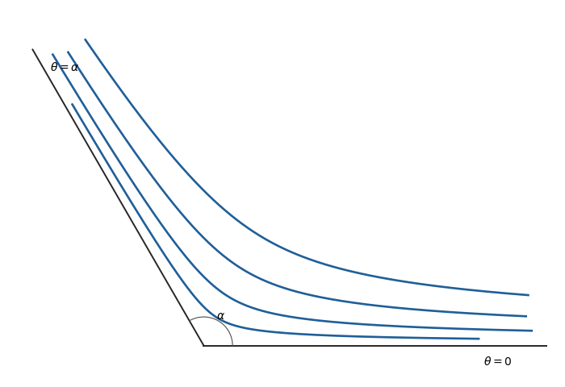

<h1 id="17c/b/solution">Solution</h1>

↑ **Parent:** [B](../b.md)

A [streamline](../../../../../../streamline.md) satisfies

$$
\frac{dr}{r\,d\theta}=\frac{u_r}{u_\theta}
=-\cot(\gamma\theta).
$$

Integration gives

$$
\log r=-\frac1\gamma\log\sin(\gamma\theta)+C.
$$

The radius is smallest on the wedge bisector $\theta=\alpha/2$, where $\sin(\gamma\theta)=1$. Labelling that radius by $r_{\min}$ therefore gives

$$
\boxed{r(\theta)=r_{\min}
\left(\sin\frac{\pi\theta}{\alpha}\right)^{-\alpha/\pi}}.
$$

Every streamline arrives from infinity along one wall, reaches its closest point on the bisector, and returns to infinity along the other wall:

**[Figure 2](#17c/b/image-streamlines-in-a-wedge). Streamlines in a wedge**.

## ↑ Ancestors (11)

1. [B](../b.md)
2. [17C](../../17c.md)
3. [Paper 1](../../../paper-1-split.md)
4. [Ib](../../../split.md)
5. [2020](../../../../split.md)
6. [Past exam of the mathematics course of the University of Cambridge](../../../../../split.md)
7. [Mathematics course of the University of Cambridge](../../../../../../mathematics-course-of-the-university-of-cambridge.md)
8. [Course of the University of Cambridge](../../../../../../course-of-the-university-of-cambridge.md)
9. [University of Cambridge](../../../../../../university-of-cambridge-split.md)
10. [List of universities](../../../../../../list-of-universities.md)
11. [Codex Wiki](../../../../../../split.md)
