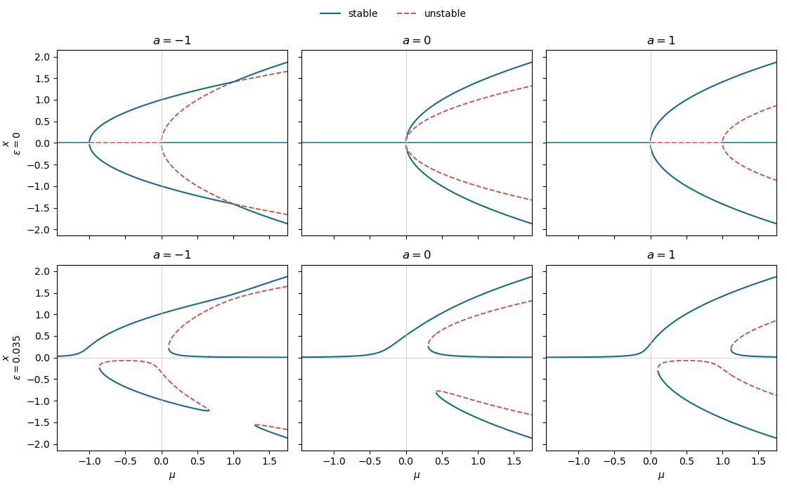

<h1 id="32e/iii/solution">Solution</h1>

↑ **Parent:** [Iii](../iii.md)

After adding $\epsilon>0$, the equilibrium equation is

$$
x^5+(a-3\mu)x^3+2\mu(\mu-a)x-\epsilon=0.
$$

The constant term breaks the reflection symmetry $x\mapsto-x$. Consequently each symmetry-forced pitchfork becomes an [imperfect pitchfork bifurcation](../../../../../../imperfect-pitchfork-bifurcation.md), while each crossing that produced a [transcritical bifurcation](../../../../../../transcritical-bifurcation.md) is disconnected. The remaining generic turning points are [saddle-node bifurcations](../../../../../../saddle-node-bifurcation.md). The lower row shows this unfolding for a representative small positive $\epsilon$; the upper row gives the unperturbed diagrams.

**[Figure 2](#32e/iii/image-bifurcation-diagrams-for-the-equilibrium-branches). Bifurcation diagrams for the equilibrium branches**.

For $a<0$, both pitchforks and both transcritical crossings are destroyed. For $a=0$, the simultaneous fifth-order meeting splits into separated folds. For $a>0$, both pitchforks become imperfect. Hence, under the allowed constant perturbation,

$$
\boxed{\text{none of the original bifurcations is structurally stable}.}
$$

This is the [structural stability of a bifurcation](../../../../../../structural-stability-of-a-bifurcation.md) distinction between the nongeneric pitchfork and transcritical diagrams and the generic saddle-node diagrams left by their unfoldings.

## ↑ Ancestors (11)

1. [Iii](../iii.md)
2. [32E](../../32e.md)
3. [Paper 1](../../../paper-1-split.md)
4. [Ii](../../../split.md)
5. [2020](../../../../split.md)
6. [Past exam of the mathematics course of the University of Cambridge](../../../../../split.md)
7. [Mathematics course of the University of Cambridge](../../../../../../mathematics-course-of-the-university-of-cambridge.md)
8. [Course of the University of Cambridge](../../../../../../course-of-the-university-of-cambridge.md)
9. [University of Cambridge](../../../../../../university-of-cambridge-split.md)
10. [List of universities](../../../../../../list-of-universities.md)
11. [Codex Wiki](../../../../../../split.md)
