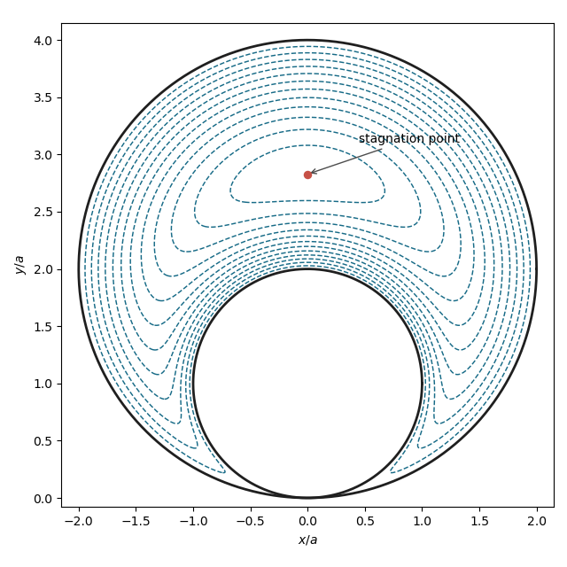

<h1 id="39b/iv/solution">Solution</h1>

↑ **Parent:** [Iv](../iv.md)

At an interior [stagnation point](../../../../../../stagnation-point.md), $\psi_r=\psi_\theta=0$. The first equation is

$$
\psi_r=a\Omega\sin\theta
\left(1-\frac{8a^2\sin^2\theta}{r^2}\right)=0.
$$

Since $\sin\theta>0$ inside the fluid, $r=2\sqrt2a\sin\theta$. Also

$$
\psi_\theta=a\Omega\cos\theta
\left(r-12a\sin\theta+\frac{24a^2\sin^2\theta}{r}\right).
$$

On the preceding locus the bracket is nonzero, so $\cos\theta=0$. Therefore

$$
\boxed{(x,y)=(0,2\sqrt2a).}
$$

For $\Omega>0$, $\psi<0$ in the interior, and its nested nonzero level curves are closed recirculating streamlines around this unique stagnation point.

**[Figure 3](#39b/iv/image-streamlines-around-two-touching-cylinders). Streamlines around two touching cylinders**.

## ↑ Ancestors (11)

1. [Iv](../iv.md)
2. [39B](../../39b.md)
3. [Paper 1](../../../paper-1-split.md)
4. [Ii](../../../split.md)
5. [2020](../../../../split.md)
6. [Past exam of the mathematics course of the University of Cambridge](../../../../../split.md)
7. [Mathematics course of the University of Cambridge](../../../../../../mathematics-course-of-the-university-of-cambridge.md)
8. [Course of the University of Cambridge](../../../../../../course-of-the-university-of-cambridge.md)
9. [University of Cambridge](../../../../../../university-of-cambridge-split.md)
10. [List of universities](../../../../../../list-of-universities.md)
11. [Codex Wiki](../../../../../../split.md)
