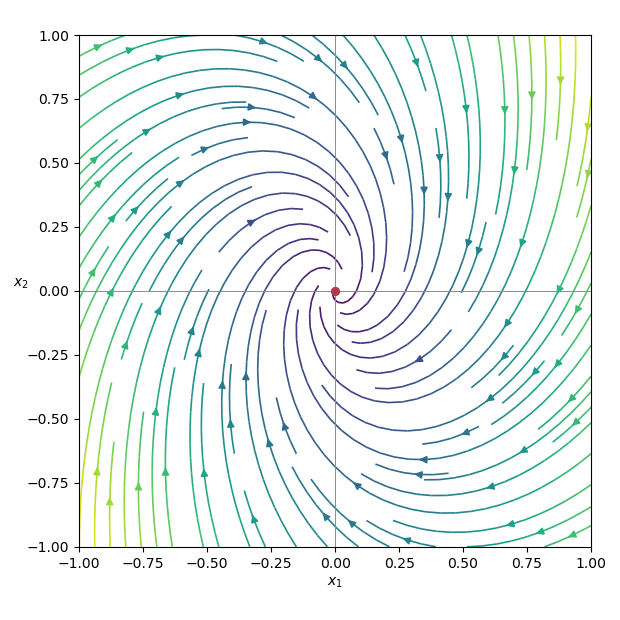

<h1 id="6b/ii/solution">Solution</h1>

↑ **Parent:** [Ii](../ii.md)

The drift is the linear vector field

$$
\mathbf A(x_1,x_2)=(-x_1+x_2,-2x_1-x_2).
$$

The eigenvalues of its matrix are $-1\pm i\sqrt2$, so the origin is a stable spiral. The field rotates clockwise while contracting toward the origin:

**[Figure 1](#6b/ii/image-the-drift-vector-field-of-a-two-dimensional-ornstein-uhlenbeck-process). The drift vector field of a two-dimensional Ornstein-Uhlenbeck process**.

## ↑ Ancestors (11)

1. [Ii](../ii.md)
2. [6B](../../6b.md)
3. [Paper 1](../../../paper-1-split.md)
4. [Ii](../../../split.md)
5. [2020](../../../../split.md)
6. [Past exam of the mathematics course of the University of Cambridge](../../../../../split.md)
7. [Mathematics course of the University of Cambridge](../../../../../../mathematics-course-of-the-university-of-cambridge.md)
8. [Course of the University of Cambridge](../../../../../../course-of-the-university-of-cambridge.md)
9. [University of Cambridge](../../../../../../university-of-cambridge-split.md)
10. [List of universities](../../../../../../list-of-universities.md)
11. [Codex Wiki](../../../../../../split.md)
