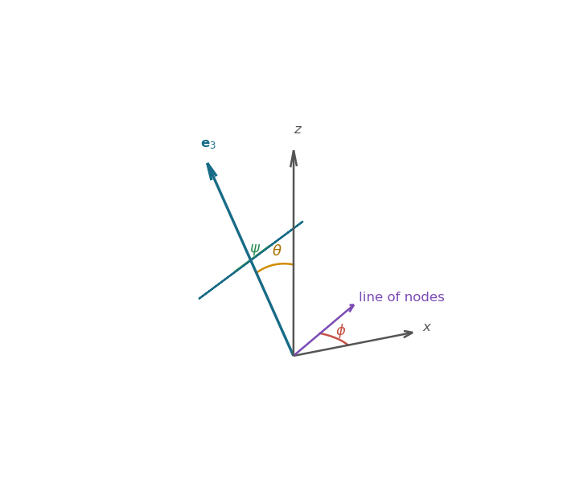
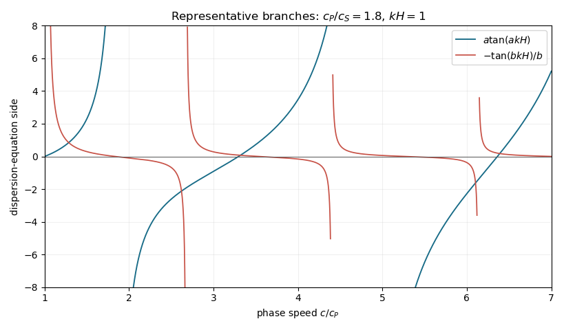

# Paper 2

↑ **Parent:** [Ii](../ii.md)

[https://www.maths.cam.ac.uk/undergrad/pastpapers/files/2020/paperii_2_2020.pdf](https://www.maths.cam.ac.uk/undergrad/pastpapers/files/2020/paperii_2_2020.pdf)

**Table of contents**

- [1H](#1h)
  - [Solution](#1h/solution)
- [2H](#2h)
  - [Solution](#2h/solution)
- [3I](#3i)
  - [a](#3i/a)
    - [Solution](#3i/a/solution)
  - [b](#3i/b)
    - [i](#3i/b/i)
      - [Solution](#3i/b/i/solution)
    - [ii](#3i/b/ii)
      - [Solution](#3i/b/ii/solution)
- [4F](#4f)
  - [i](#4f/i)
    - [Solution](#4f/i/solution)
  - [ii](#4f/ii)
    - [Solution](#4f/ii/solution)
- [5J](#5j)
  - [a](#5j/a)
    - [Solution](#5j/a/solution)
  - [b](#5j/b)
    - [Solution](#5j/b/solution)
  - [c](#5j/c)
    - [Solution](#5j/c/solution)
- [6B](#6b)
  - [i](#6b/i)
    - [Solution](#6b/i/solution)
  - [ii](#6b/ii)
    - [Solution](#6b/ii/solution)
  - [iii](#6b/iii)
    - [Solution](#6b/iii/solution)
- [7E](#7e)
  - [Solution](#7e/solution)
- [8B](#8b)
  - [Solution](#8b/solution)
- [9D](#9d)
  - [i](#9d/i)
    - [Solution](#9d/i/solution)
  - [ii](#9d/ii)
    - [Solution](#9d/ii/solution)
- [10C](#10c)
  - [i](#10c/i)
    - [Solution](#10c/i/solution)
  - [ii](#10c/ii)
    - [Solution](#10c/ii/solution)
  - [iii](#10c/iii)
    - [Solution](#10c/iii/solution)
- [11H](#11h)
  - [Solution](#11h/solution)
- [12I](#12i)
  - [i](#12i/i)
    - [Solution](#12i/i/solution)
  - [ii](#12i/ii)
    - [Solution](#12i/ii/solution)
  - [iii](#12i/iii)
    - [Solution](#12i/iii/solution)
- [13E](#13e)
  - [i](#13e/i)
    - [Solution](#13e/i/solution)
  - [ii](#13e/ii)
    - [Solution](#13e/ii/solution)
- [14B](#14b)
  - [i](#14b/i)
    - [Solution](#14b/i/solution)
  - [ii](#14b/ii)
    - [Solution](#14b/ii/solution)
  - [iii](#14b/iii)
    - [Solution](#14b/iii/solution)
  - [iv](#14b/iv)
    - [Solution](#14b/iv/solution)
- [15C](#15c)
  - [a](#15c/a)
    - [Solution](#15c/a/solution)
  - [b](#15c/b)
    - [Solution](#15c/b/solution)
  - [c](#15c/c)
    - [Solution](#15c/c/solution)
  - [d](#15c/d)
    - [i](#15c/d/i)
      - [Solution](#15c/d/i/solution)
    - [ii](#15c/d/ii)
      - [Solution](#15c/d/ii/solution)
    - [iii](#15c/d/iii)
      - [Solution](#15c/d/iii/solution)
- [16H](#16h)
  - [a](#16h/a)
    - [Solution](#16h/a/solution)
  - [b](#16h/b)
    - [i](#16h/b/i)
      - [Solution](#16h/b/i/solution)
    - [ii](#16h/b/ii)
      - [Solution](#16h/b/ii/solution)
- [17G](#17g)
  - [i](#17g/i)
    - [Solution](#17g/i/solution)
  - [ii](#17g/ii)
    - [Solution](#17g/ii/solution)
- [18G](#18g)
  - [a](#18g/a)
    - [Solution](#18g/a/solution)
  - [b](#18g/b)
    - [Solution](#18g/b/solution)
  - [c](#18g/c)
    - [i](#18g/c/i)
      - [Solution](#18g/c/i/solution)
    - [ii](#18g/c/ii)
      - [Solution](#18g/c/ii/solution)
  - [d](#18g/d)
    - [Solution](#18g/d/solution)
- [19F](#19f)
  - [Solution](#19f/solution)
- [20G](#20g)
  - [a](#20g/a)
    - [Solution](#20g/a/solution)
  - [b](#20g/b)
    - [i](#20g/b/i)
      - [Solution](#20g/b/i/solution)
    - [ii](#20g/b/ii)
      - [Solution](#20g/b/ii/solution)
    - [iii](#20g/b/iii)
      - [Solution](#20g/b/iii/solution)
- [21F](#21f)
  - [a](#21f/a)
    - [Solution](#21f/a/solution)
  - [b](#21f/b)
    - [Solution](#21f/b/solution)
  - [c](#21f/c)
    - [Solution](#21f/c/solution)
- [22I](#22i)
  - [a](#22i/a)
    - [Solution](#22i/a/solution)
  - [b](#22i/b)
    - [Solution](#22i/b/solution)
  - [c](#22i/c)
    - [Solution](#22i/c/solution)
- [23F](#23f)
  - [Solution](#23f/solution)
- [24F](#24f)
  - [a](#24f/a)
    - [Solution](#24f/a/solution)
  - [b](#24f/b)
    - [Solution](#24f/b/solution)
  - [c](#24f/c)
    - [Solution](#24f/c/solution)
- [25I](#25i)
  - [a](#25i/a)
    - [Solution](#25i/a/solution)
  - [b](#25i/b)
    - [Solution](#25i/b/solution)
  - [c](#25i/c)
    - [Solution](#25i/c/solution)
  - [d](#25i/d)
    - [Solution](#25i/d/solution)
- [26K](#26k)
  - [a](#26k/a)
    - [Solution](#26k/a/solution)
  - [b](#26k/b)
    - [Solution](#26k/b/solution)
  - [c](#26k/c)
    - [i](#26k/c/i)
      - [Solution](#26k/c/i/solution)
    - [ii](#26k/c/ii)
      - [Solution](#26k/c/ii/solution)
- [27K](#27k)
  - [i](#27k/i)
    - [Solution](#27k/i/solution)
  - [ii](#27k/ii)
    - [Solution](#27k/ii/solution)
- [28J](#28j)
  - [Solution](#28j/solution)
- [29K](#29k)
  - [i](#29k/i)
    - [Solution](#29k/i/solution)
  - [ii](#29k/ii)
    - [Solution](#29k/ii/solution)
  - [iii](#29k/iii)
    - [Solution](#29k/iii/solution)
  - [iv](#29k/iv)
    - [Solution](#29k/iv/solution)
  - [v](#29k/v)
    - [Solution](#29k/v/solution)
- [30J](#30j)
  - [a](#30j/a)
    - [Solution](#30j/a/solution)
  - [b](#30j/b)
    - [Solution](#30j/b/solution)
  - [c](#30j/c)
    - [Solution](#30j/c/solution)
  - [d](#30j/d)
    - [Solution](#30j/d/solution)
- [31D](#31d)
  - [a](#31d/a)
    - [i](#31d/a/i)
      - [Solution](#31d/a/i/solution)
    - [ii](#31d/a/ii)
      - [Solution](#31d/a/ii/solution)
  - [b](#31d/b)
    - [i](#31d/b/i)
      - [Solution](#31d/b/i/solution)
    - [ii](#31d/b/ii)
      - [Solution](#31d/b/ii/solution)
- [32E](#32e)
  - [a](#32e/a)
    - [Solution](#32e/a/solution)
  - [b](#32e/b)
    - [i](#32e/b/i)
      - [Solution](#32e/b/i/solution)
    - [ii](#32e/b/ii)
      - [Solution](#32e/b/ii/solution)
    - [iii](#32e/b/iii)
      - [Solution](#32e/b/iii/solution)
- [33C](#33c)
  - [i](#33c/i)
    - [Solution](#33c/i/solution)
  - [ii](#33c/ii)
    - [Solution](#33c/ii/solution)
  - [iii](#33c/iii)
    - [Solution](#33c/iii/solution)
- [34A](#34a)
  - [a](#34a/a)
    - [Solution](#34a/a/solution)
  - [b](#34a/b)
    - [i](#34a/b/i)
      - [Solution](#34a/b/i/solution)
    - [ii](#34a/b/ii)
      - [Solution](#34a/b/ii/solution)
- [35C](#35c)
  - [a](#35c/a)
    - [Solution](#35c/a/solution)
  - [b](#35c/b)
    - [i](#35c/b/i)
      - [Solution](#35c/b/i/solution)
    - [ii](#35c/b/ii)
      - [Solution](#35c/b/ii/solution)
- [36A](#36a)
  - [Solution](#36a/solution)
- [37D](#37d)
  - [i](#37d/i)
    - [Solution](#37d/i/solution)
  - [ii](#37d/ii)
    - [Solution](#37d/ii/solution)
  - [iii](#37d/iii)
    - [Solution](#37d/iii/solution)
- [38B](#38b)
  - [i](#38b/i)
    - [Solution](#38b/i/solution)
  - [ii](#38b/ii)
    - [Solution](#38b/ii/solution)
  - [iii](#38b/iii)
    - [Solution](#38b/iii/solution)
- [39B](#39b)
  - [a](#39b/a)
    - [Solution](#39b/a/solution)
  - [b](#39b/b)
    - [Solution](#39b/b/solution)
  - [c](#39b/c)
    - [Solution](#39b/c/solution)
- [40E](#40e)
  - [a](#40e/a)
    - [Solution](#40e/a/solution)
  - [b](#40e/b)
    - [Solution](#40e/b/solution)
  - [c](#40e/c)
    - [Solution](#40e/c/solution)
  - [d](#40e/d)
    - [Solution](#40e/d/solution)

## 1H

↑ **Parent:** [Paper 2](paper-2.md)

<h3 id="1h/solution">Solution</h3>

↑ **Parent:** [1H](#1h)

Write the [continued fraction](../../../number-theory.md#continued-fraction) as $\theta=[a_0;a_1,a_2,\ldots]$ and define its [convergents](../../../number-theory.md#continued-fraction-convergent) by

$$
p_{-1}=1,\quad p_0=a_0,\quad p_n=a_np_{n-1}+p_{n-2},
$$

$$
q_{-1}=0,\quad q_0=1,\quad q_n=a_nq_{n-1}+q_{n-2}.
$$

Induction using these recurrences gives

$$
p_nq_{n-1}-p_{n-1}q_n
=-(p_{n-1}q_{n-2}-p_{n-2}q_{n-1})
=\boxed{(-1)^{n-1}}.
$$

In particular, consecutive convergents have coprime numerator and denominator. The standard best-approximation consequence of the same determinant identity is that, for $0<q\le q_n$ and $p/q\ne p_n/q_n$,

$$
|q\theta-p|>|q_n\theta-p_n|.
$$

Dividing by $q\le q_n$ gives

$$
\left|\theta-\frac pq\right|
=\frac{|q\theta-p|}{q}
>\frac{|q_n\theta-p_n|}{q_n}
=\left|\theta-\frac{p_n}{q_n}\right|.
$$

The contrapositive proves that any strictly better approximation has $q>q_n$.

For $\sqrt{12}$, the [continued-fraction algorithm](../../../number-theory.md#continued-fraction-algorithm) gives

$$
\sqrt{12}=3+(\sqrt{12}-3),
\qquad
\frac1{\sqrt{12}-3}=2+\frac1{\sqrt{12}+3},
$$

and the remainder then repeats. Hence

$$
\boxed{\sqrt{12}=[3;\overline{2,6}]}.
$$

The convergent $[3;2]=7/2$ supplies a solution of the [Pell equation](../../../number-theory.md#pell-equation):

$$
\boxed{x=7,\qquad y=2},
\qquad 7^2-12\cdot2^2=1.
$$

## 2H

↑ **Parent:** [Paper 2](paper-2.md)

<h3 id="2h/solution">Solution</h3>

↑ **Parent:** [2H](#2h)

The [Legendre polynomial](../../../differential-equation.md#legendre-polynomial) $p_n$ is [orthogonal](../../../numerical-analysis.md#orthogonal-polynomial) on $[-1,1]$ to every polynomial of degree below $n$. Suppose it changes sign at only $r<n$ distinct interior points $x_1,\ldots,x_r$, and put

$$
q(x)=\prod_{j=1}^r(x-x_j),
$$

choosing its overall sign so that $p_nq\ge0$ on $[-1,1]$. This product is positive except at finitely many points, so

$$
\int_{-1}^1p_n(x)q(x)\,dx>0,
$$

contradicting orthogonality because $\deg q=r<n$. Thus $p_n$ has at least $n$ sign-changing roots in $(-1,1)$; its degree is $n$, so these are all its roots and they are distinct.

For arbitrary distinct nodes $x_1,\ldots,x_n$, let

$$
L_i(t)=\prod_{j\ne i}\frac{t-x_j}{x_i-x_j}
$$

be the [Lagrange basis polynomials](../../../numerical-analysis.md#lagrange-polynomial). Every polynomial $P$ of degree below $n$ satisfies $P(t)=\sum_iP(x_i)L_i(t)$, so the required weights exist and are

$$
A_i=\int_{-1}^1L_i(t)\,dt.
$$

They are unique because applying any such formula to $P=L_i$ recovers $A_i$.

Now assume exactness for every $P$ of degree below $2n$ and define $Q(t)=\prod_i(t-x_i)$. For every polynomial $R$ of degree below $n$, the product $QR$ has degree below $2n$ and vanishes at every node. Therefore

$$
\int_{-1}^1Q(t)R(t)\,dt=0.
$$

There is a unique monic polynomial of degree $n$ orthogonal to all lower-degree polynomials, so $Q$ is the monic normalization of $p_n$ and the $x_i$ are precisely the roots of $p_n$. Taking $P=1$ gives

$$
\boxed{\sum_{i=1}^nA_i=2}.
$$

Finally $L_i^2$ has degree $2n-2$, so exactness gives

$$
A_i=\sum_jA_jL_i(x_j)^2
=\int_{-1}^1L_i(t)^2\,dt>0.
$$

These are the positive weights of [Gaussian quadrature](../../../numerical-analysis.md#gaussian-quadrature).

## 3I

↑ **Parent:** [Paper 2](paper-2.md)

<h3 id="3i/a">a</h3>

↑ **Parent:** [3I](#3i)

<h4 id="3i/a/solution">Solution</h4>

↑ **Parent:** [A](#3i/a)

For a [discrete memoryless channel](../../../coding-theory.md#discrete-memoryless-channel) with input $X$ and output $Y$, its [information capacity](../../../information-theory.md#channel-capacity) is

$$
C=\max_{p_X}I(X;Y),
$$

where $I(X;Y)$ is the [mutual information](../../../information-theory.md#mutual-information) and the maximum is over all input [distributions](../../../probability-theory.md#probability-distribution). Capacity is measured in bits when logarithms have base two.

<h3 id="3i/b">b</h3>

↑ **Parent:** [3I](#3i)

<h4 id="3i/b/i">i</h4>

↑ **Parent:** [B](#3i/b)

<h5 id="3i/b/i/solution">Solution</h5>

↑ **Parent:** [I](#3i/b/i)

With rows indexed by outputs $A,B,\star$ and columns by inputs $A,B$, the channel matrix is

$$
\boxed{
\begin{pmatrix}
1/2&0\\
0&1/2\\
1/2&1/2
\end{pmatrix}}.
$$

This is a [binary erasure channel](../../../coding-theory.md#binary-erasure-channel) with erasure probability $1/2$. Conditional on no erasure, the input is recovered exactly, whereas an erasure supplies no information. Thus

$$
I(X;Y)=\frac12H(X),
$$

which is maximized by the uniform input distribution. Therefore

$$
\boxed{C=\frac12\text{ bit}}.
$$

<h4 id="3i/b/ii">ii</h4>

↑ **Parent:** [B](#3i/b)

<h5 id="3i/b/ii/solution">Solution</h5>

↑ **Parent:** [Ii](#3i/b/ii)

Let $q=\mathbb P(X=B)$. The merged channel is a [Binary Z-channel](../../../coding-theory.md#z-channel): its second output occurs with probability $q/2$, while the output has one bit of uncertainty only when $X=B$. In terms of the [binary entropy function](../../../combinatorics.md#binary-entropy-function) $h_2$,

$$
I(X;Y)=h_2(q/2)-q.
$$

At an interior maximum,

$$
0=\frac{dI}{dq}
=\frac12\log_2\frac{1-q/2}{q/2}-1,
$$

so $(2-q)/q=4$ and $q=2/5$. Consequently

$$
\boxed{C=h_2(1/5)-\frac25
=\log_2\frac54\text{ bits}}.
$$

## 4F

↑ **Parent:** [Paper 2](paper-2.md)

<h3 id="4f/i">i</h3>

↑ **Parent:** [4F](#4f)

<h4 id="4f/i/solution">Solution</h4>

↑ **Parent:** [I](#4f/i)

A subset $E\subseteq\mathbb N$ is [recursive](../../../foundations-of-mathematics.md#computable-set) when its [indicator function](../../../measure-theory.md#indicator-function) is a [total computable function](../../../foundations-of-mathematics.md#total-computable-function). It is [recursively enumerable](../../../foundations-of-mathematics.md#recursively-enumerable-set) when it is the domain of a [partial computable function](../../../foundations-of-mathematics.md#computable-function), equivalently when an algorithm can enumerate its members.

If $E$ is recursive, its indicator decides both $E$ and its complement, so both sets are recursively enumerable. Conversely, suppose programs enumerate $E$ and $\mathbb N\setminus E$. On input $n$, run the two enumerations in parallel by [dovetailing](../../../foundations-of-mathematics.md#dovetailing). Exactly one must eventually print $n$; accept in the first case and reject in the second. This algorithm always halts and decides $E$. Hence

$$
\boxed{E\text{ is recursive}\iff E\text{ and }\mathbb N\setminus E\text{ are recursively enumerable}}.
$$

<h3 id="4f/ii">ii</h3>

↑ **Parent:** [4F](#4f)

<h4 id="4f/ii/solution">Solution</h4>

↑ **Parent:** [Ii](#4f/ii)

The set

$$
\mathbb K=\{n:f_{n,1}(n)\text{ halts}\}
$$

is the [diagonal halting set](../../../foundations-of-mathematics.md#diagonal-halting-set). It is recursively enumerable by simulating the coded machine, but it is not recursive by the [halting problem](../../../foundations-of-mathematics.md#halting-problem) diagonal argument.

By contrast, $\mathbb K_{100}$ is recursive: decode $n$, reject it if it is not a program code, otherwise simulate the program on input $n$ for exactly $100$ steps and accept precisely if it has halted. This bounded computation always terminates. Thus

$$
\boxed{\mathbb K\text{ is not recursive},\qquad
\mathbb K_{100}\text{ is recursive}}.
$$

## 5J

↑ **Parent:** [Paper 2](paper-2.md)

<h3 id="5j/a">a</h3>

↑ **Parent:** [5J](#5j)

<h4 id="5j/a/solution">Solution</h4>

↑ **Parent:** [A](#5j/a)

Let $Y_i$ be the indicator that man $i$ develops heart disease and let $\pi_i=\mathbb P(Y_i=1)$. The fitted [logistic regression](../../../statistical-modelling.md#logistic-regression) assumes independent [Bernoulli responses](../../../discrete-probability-distribution.md#bernoulli-distribution) with

$$
\boxed{Y_i\sim\operatorname{Bernoulli}(\pi_i),
\qquad
\operatorname{logit}(\pi_i)
=-4.50161+0.02521\,\mathrm{height}_i
+0.02313\,\mathrm{cigs}_i.}
$$

<h3 id="5j/b">b</h3>

↑ **Parent:** [5J](#5j)

<h4 id="5j/b/solution">Solution</h4>

↑ **Parent:** [B](#5j/b)

Two packs contain $40$ cigarettes. Holding height fixed, increasing average consumption from zero to two packs per day changes the [log odds](../../../statistical-modelling.md#log-odds) by

$$
40(0.02313)=0.9252.
$$

The corresponding [odds ratio](../../../statistical-modelling.md#odds-ratio) is therefore

$$
\boxed{e^{0.9252}\approx2.52}.
$$

Thus the model estimates that a two-pack-per-day smoker has about $2.52$ times the odds of heart disease of an otherwise comparable nonsmoker. This is an association in the fitted observational model, rather than by itself a causal conclusion.

<h3 id="5j/c">c</h3>

↑ **Parent:** [5J](#5j)

<h4 id="5j/c/solution">Solution</h4>

↑ **Parent:** [C](#5j/c)

Let $\varepsilon_i$ be independent standard [logistic random variables](../../../statistical-modelling.md#logistic-distribution) and define the [latent variable](../../../statistical-modelling.md#latent-variable)

$$
Z_i=-4.50161+0.02521\,\mathrm{height}_i
+0.02313\,\mathrm{cigs}_i+\varepsilon_i.
$$

Set $Y_i=1$ exactly when $Z_i>0$. If $F$ is the logistic [cumulative distribution function](../../../probability-theory.md#cumulative-distribution-function), its symmetry and the identity $F^{-1}(p)=\operatorname{logit}(p)$ give

$$
\mathbb P(Y_i=1)=F(-4.50161+0.02521\,\mathrm{height}_i+0.02313\,\mathrm{cigs}_i),
$$

which is precisely the fitted [logistic regression](../../../statistical-modelling.md#logistic-regression).

## 6B

↑ **Parent:** [Paper 2](paper-2.md)

<h3 id="6b/i">i</h3>

↑ **Parent:** [6B](#6b)

<h4 id="6b/i/solution">Solution</h4>

↑ **Parent:** [I](#6b/i)

At a nonzero [fixed point](../../../function.md#fixed-point), both bracketed per-capita growth rates vanish:

$$
-\epsilon_1+\alpha N_2^*=0,
\qquad
\epsilon_2-\alpha N_1^*=0.
$$

Hence the coexistence equilibrium of this [Lotka-Volterra predator-prey model](../../../mathematical-biology.md#lotka-volterra-predator-prey-model) is

$$
\boxed{(N_1^*,N_2^*)=\left(\frac{\epsilon_2}{\alpha},\frac{\epsilon_1}{\alpha}\right)}.
$$

<h3 id="6b/ii">ii</h3>

↑ **Parent:** [6B](#6b)

<h4 id="6b/ii/solution">Solution</h4>

↑ **Parent:** [Ii](#6b/ii)

Since $N_i=N_i^*e^{x_i}$, division of each population equation by $N_i$ gives

$$
\dot x_1=\epsilon_1(e^{x_2}-1),
\qquad
\dot x_2=-\epsilon_2(e^{x_1}-1).
$$

Define the [Hamiltonian function](../../../symplectic-geometry.md#hamiltonian-function)

$$
H(x_1,x_2)
=\epsilon_2(e^{x_1}-x_1-1)
+\epsilon_1(e^{x_2}-x_2-1)
$$

and the [antisymmetric matrix](../../../linear-algebra.md#skew-symmetric-matrix)

$$
K=\begin{pmatrix}0&1\\-1&0\end{pmatrix}.
$$

Then

$$
\nabla H
=\begin{pmatrix}\epsilon_2(e^{x_1}-1)\\
\epsilon_1(e^{x_2}-1)\end{pmatrix},
\qquad
\boxed{\dot{\mathbf x}=K\nabla H}.
$$

<h3 id="6b/iii">iii</h3>

↑ **Parent:** [6B](#6b)

<h4 id="6b/iii/solution">Solution</h4>

↑ **Parent:** [Iii](#6b/iii)

Along a solution, the [chain rule](../../../calculus.md#chain-rule) and antisymmetry of $K$ give

$$
\frac{dH}{dt}
=(\nabla H)^T\dot{\mathbf x}
=(\nabla H)^TK\nabla H=0,
$$

because $v^TKv=0$ for every real vector $v$. Therefore

$$
\boxed{H(x_1(t),x_2(t))\text{ is constant}}.
$$

The closed level curves around the strict minimum at the coexistence equilibrium are the periodic population cycles of the [Lotka-Volterra predator-prey model](../../../mathematical-biology.md#lotka-volterra-predator-prey-model).

## 7E

↑ **Parent:** [Paper 2](paper-2.md)

<h3 id="7e/solution">Solution</h3>

↑ **Parent:** [7E](#7e)

The poles of $\csc^3z$ inside $|z|=4$ are $z=-\pi,0,\pi$. Near $z=k\pi$, write $z=k\pi+w$. Its [Laurent series](../../../analysis.md#laurent-series) begins

$$
\frac1{\sin^3z}
=(-1)^k\left(\frac1{w^3}+\frac1{2w}+O(w)\right),
$$

so the [residue](../../../analysis.md#residue) is $(-1)^k/2$. The sum of the three residues is

$$
-\frac12+\frac12-\frac12=-\frac12.
$$

The positively oriented [residue theorem](../../../analysis.md#residue-theorem) now gives

$$
\boxed{\int_C\frac{dz}{\sin^3z}
=2\pi i\left(-\frac12\right)=-\pi i}.
$$

## 8B

↑ **Parent:** [Paper 2](paper-2.md)

<h3 id="8b/solution">Solution</h3>

↑ **Parent:** [8B](#8b)

If $\mathbf r$ is measured in the rotating frame, its inertial velocity is $\dot{\mathbf r}+\boldsymbol\omega\times\mathbf r$. The masses producing the gravitational field are stationary in this frame, so their [potential energy](../../../classical-mechanics.md#potential-energy) is a time-independent function $V(\mathbf r)$. Thus kinetic minus potential energy gives the stated [Lagrangian](../../../calculus-of-variations.md#lagrangian)

$$
L=\frac m2(\dot{\mathbf r}+\boldsymbol\omega\times\mathbf r)^2-V(\mathbf r).
$$

Put $\mathbf v=\dot{\mathbf r}+\boldsymbol\omega\times\mathbf r$. Then

$$
\frac{\partial L}{\partial\dot{\mathbf r}}=m\mathbf v,
\qquad
\frac{\partial L}{\partial\mathbf r}=-m\boldsymbol\omega\times\mathbf v-\nabla V.
$$

Substitution in the [Euler-Lagrange equation](../../../analysis.md#euler-lagrange-equation) yields

$$
\boxed{m\left(\ddot{\mathbf r}+2\boldsymbol\omega\times\dot{\mathbf r}
+\dot{\boldsymbol\omega}\times\mathbf r
+\boldsymbol\omega\times(\boldsymbol\omega\times\mathbf r)\right)
=-\nabla V}.
$$

The extra terms are the [Coriolis acceleration](../../../physics.md#coriolis-acceleration), [Euler acceleration](../../../physics.md#euler-acceleration), and [centrifugal acceleration](../../../physics.md#centrifugal-acceleration) of a [rotating reference frame](../../../physics.md#rotating-reference-frame).

The [canonical momentum](../../../classical-mechanics.md#canonical-momentum) and [Hamiltonian](../../../classical-mechanics.md#hamiltonian) are

$$
\boxed{\mathbf p=m(\dot{\mathbf r}+\boldsymbol\omega\times\mathbf r)},
$$

$$
\boxed{H(\mathbf r,\mathbf p,t)
=\frac{\mathbf p^2}{2m}
-\boldsymbol\omega(t)\mathbin\cdot(\mathbf r\times\mathbf p)
+V(\mathbf r)}.
$$

Accordingly, [Hamilton's equations](../../../classical-mechanics.md#hamilton-s-equations) are

$$
\boxed{\dot{\mathbf r}=\frac{\mathbf p}{m}-\boldsymbol\omega\times\mathbf r,
\qquad
\dot{\mathbf p}=-\boldsymbol\omega\times\mathbf p-\nabla V}.
$$

## 9D

↑ **Parent:** [Paper 2](paper-2.md)

<h3 id="9d/i">i</h3>

↑ **Parent:** [9D](#9d)

<h4 id="9d/i/solution">Solution</h4>

↑ **Parent:** [I](#9d/i)

Under the [slow-roll approximation](../../../cosmic-inflation.md#slow-roll-approximation),

$$
H^2\simeq\frac{8\pi G}{3c^2}V,
\qquad
3H\dot\phi\simeq-V'(\phi).
$$

For $V=m^2\phi^2/2$ and the branch $\phi>0$, set

$$
A=\sqrt{\frac{4\pi G}{3c^2}}.
$$

Then $H\simeq Am\phi$ and

$$
\dot\phi\simeq-\frac{m}{3A}
=-\frac{mc}{\sqrt{12\pi G}}.
$$

With $\phi(0)=\phi_0$ and $a(0)=a_0$,

$$
\boxed{\phi(t)=\phi_0-\frac{mc}{\sqrt{12\pi G}}t},
$$

and integrating $\dot a/a=H$ gives

$$
\boxed{a(t)=a_0\exp\left[\frac{2\pi G}{c^2}
\left(\phi_0^2-\phi(t)^2\right)\right]}.
$$

<h3 id="9d/ii">ii</h3>

↑ **Parent:** [9D](#9d)

<h4 id="9d/ii/solution">Solution</h4>

↑ **Parent:** [Ii](#9d/ii)

For $V=\lambda\phi^4/4$ and $\phi>0$, put

$$
B=\sqrt{\frac{2\pi G\lambda}{3c^2}}.
$$

The [slow-roll approximation](../../../cosmic-inflation.md#slow-roll-approximation) gives $H\simeq B\phi^2$ and

$$
\dot\phi\simeq-\frac{\lambda}{3B}\phi
=-\frac{c\sqrt\lambda}{\sqrt{6\pi G}}\phi.
$$

Therefore, with $\gamma=c\sqrt{\lambda/(6\pi G)}$,

$$
\boxed{\phi(t)=\phi_0e^{-\gamma t}}.
$$

Since $B/\gamma=2\pi G/c^2$, integration of the [Hubble parameter](../../../cosmology.md#hubble-parameter) gives

$$
\boxed{a(t)=a_0\exp\left[\frac{\pi G}{c^2}
\left(\phi_0^2-\phi(t)^2\right)\right]}.
$$

## 10C

↑ **Parent:** [Paper 2](paper-2.md)

<h3 id="10c/i">i</h3>

↑ **Parent:** [10C](#10c)

<h4 id="10c/i/solution">Solution</h4>

↑ **Parent:** [I](#10c/i)

The [controlled-NOT gate](../../../quantum-theory.md#controlled-not-gate) sends $|0x\rangle$ to $|0x\rangle$ and $|1\bar x\rangle$ to $|1x\rangle$. Hence

$$
\operatorname{CX}|\beta_{zx}\rangle
=\frac{|0\rangle+(-1)^z|1\rangle}{\sqrt2}\otimes|x\rangle
=H|z\rangle\otimes|x\rangle.
$$

Since the [Hadamard gate](../../../quantum-theory.md#hadamard-gate) satisfies $H^2=I$,

$$
\boxed{(H\otimes I)\operatorname{CX}|\beta_{zx}\rangle=|zx\rangle}.
$$

<h3 id="10c/ii">ii</h3>

↑ **Parent:** [10C](#10c)

<h4 id="10c/ii/solution">Solution</h4>

↑ **Parent:** [Ii](#10c/ii)

The required identity is

$$
\boxed{(Z^zX^x\otimes I)|\beta_{00}\rangle=|\beta_{zx}\rangle};
$$

the first exponent in the scanned statement should be $z$. Indeed, $X^x$ changes the parity label from $0$ to $x$, while $Z^z$ multiplies the component whose first qubit is $1$ by $(-1)^z$, creating the phase label. Equivalently, the hint permits either one-qubit operator to be transferred to the second half of the [Bell state](../../../bell-state.md) by transposition.

<h3 id="10c/iii">iii</h3>

↑ **Parent:** [10C](#10c)

<h4 id="10c/iii/solution">Solution</h4>

↑ **Parent:** [Iii](#10c/iii)

This is [superdense coding](../../../bell-state.md#superdense-coding). To send the two classical bits $(z,x)$, Alice applies $Z^zX^x$ to her half of the shared [Bell state](../../../bell-state.md) $|\beta_{00}\rangle$, producing $|\beta_{zx}\rangle$, and sends that one qubit to Bob. Bob applies $\operatorname{CX}$ followed by $H$ on the first qubit, as in part (i), and measures both qubits in the [computational basis](../../../quantum-theory.md#computational-basis). The outcome is $zx$ with certainty, so one transmitted qubit communicates two classical bits using the previously shared [quantum entanglement](../../../bell-state.md#entangled-state).

## 11H

↑ **Parent:** [Paper 2](paper-2.md)

<h3 id="11h/solution">Solution</h3>

↑ **Parent:** [11H](#11h)

Label the edges so that barycentric coordinates on $T$ satisfy

$$
I=\{u=0\},\qquad J=\{v=0\},\qquad K=\{w=0\},
\qquad u+v+w=1.
$$

Suppose for contradiction that $A\cap B\cap C=\varnothing$. The [distance from a point to a closed set](../../../topological-analysis.md#distance-from-a-point-to-a-closed-set) gives continuous nonnegative functions $d_A,d_B,d_C$. Their sum never vanishes, while at every point at least one of them vanishes because $A\cup B\cup C=T$. Hence

$$
F(x)=\frac{(d_A(x),d_B(x),d_C(x))}
{d_A(x)+d_B(x)+d_C(x)}
$$

is a continuous map from $T$ to its boundary in barycentric-coordinate space. Moreover, $F(I)\subseteq I$, $F(J)\subseteq J$, and $F(K)\subseteq K$. On each edge, the straight-line homotopy between $F$ and the identity remains in that edge, so $F|_{\partial T}$ has [winding number](../../../complex-analysis.md#winding-number) one. On the other hand, a map from the whole triangle to its boundary makes its boundary restriction [null-homotopic](../../../algebraic-topology.md#null-homotopic-map), and hence gives winding number zero. This contradiction proves the three-set covering lemma:

$$
\boxed{A\cap B\cap C\ne\varnothing}.
$$

If a [retraction](../../../topology.md#retraction) $f:D\to\partial D$ fixed every boundary point, choose a homeomorphism from $T$ to $D$ taking its three edges to three consecutive closed arcs of $\partial D$ with empty triple intersection. The inverse images under $f$ of those arcs would be closed, would cover $D$, and would contain the corresponding boundary arcs. Transporting them to $T$ would contradict the result just proved. Therefore

$$
\boxed{\text{there is no retraction }D\to\partial D}.
$$

For the final statement, use compactness of the three closed arcs inside the corresponding open sets. A finite open cover of a compact metric space admits a closed shrinking, and the shrinking can be chosen to preserve specified compact subsets already lying in the respective open sets. Thus there are closed sets

$$
A\subset P,\qquad B\subset Q,\qquad C\subset R
$$

which cover $D$ and contain $\alpha,\beta,\gamma$, respectively. The disc version of the three-set covering lemma, obtained from the triangle by a homeomorphism taking its edges to the three arcs, gives a point in $A\cap B\cap C$. Since these sets lie in the original open sets,

$$
\boxed{P\cap Q\cap R\ne\varnothing}.
$$

## 12I

↑ **Parent:** [Paper 2](paper-2.md)

<h3 id="12i/i">i</h3>

↑ **Parent:** [12I](#12i)

<h4 id="12i/i/solution">Solution</h4>

↑ **Parent:** [I](#12i/i)

The columns of the [parity-check matrix](../../../coding-theory.md#parity-check-matrix) of the binary [Hamming code](../../../coding-theory.md#hamming-code) are precisely the $n=2^d-1$ distinct nonzero vectors of $\mathbb F_2^d$. If $h_1\ne h_2$, then $h_1+h_2$ is nonzero and differs from both summands, so it occurs as a unique third column $h_3$.

A word supported on three positions is a codeword exactly when the corresponding three columns sum to zero. Every unordered pair of columns determines one such triple, and each triple is counted once by each of its three pairs. Therefore

$$
\boxed{\nu(3)=\frac{1}{3}\binom n2=\frac{n(n-1)}6}.
$$

<h3 id="12i/ii">ii</h3>

↑ **Parent:** [12I](#12i)

<h4 id="12i/ii/solution">Solution</h4>

↑ **Parent:** [Ii](#12i/ii)

Sum all nonzero vectors of $\mathbb F_2^d$. In each coordinate, exactly $2^{d-1}$ vectors have entry one, which is even because $d>1$. The sum is therefore zero, so

$$
H\mathbf1^T=0.
$$

**Thus the all-one word belongs to the [Hamming code](../../../coding-theory.md#hamming-code) and has [Hamming weight](../../../coding-theory.md#hamming-weight) $n$.**

<h3 id="12i/iii">iii</h3>

↑ **Parent:** [12I](#12i)

<h4 id="12i/iii/solution">Solution</h4>

↑ **Parent:** [Iii](#12i/iii)

Adding the all-one codeword is a bijection from $C$ to itself, and it replaces every bit by its complement. It therefore sends weight $j$ to weight $n-j$, proving

$$
\nu(n-j)=\nu(j).
$$

The code has one word of weight zero and, since its [minimum Hamming distance](../../../coding-theory.md#minimum-hamming-distance-of-a-linear-code) is three, no words of weight one or two. Combining this with part (i) gives

$$
\boxed{\nu(n-1)=0,\qquad
\nu(n-2)=0,\qquad
\nu(n-3)=\frac{n(n-1)}6}.
$$

## 13E

↑ **Parent:** [Paper 2](paper-2.md)

<h3 id="13e/i">i</h3>

↑ **Parent:** [13E](#13e)

<h4 id="13e/i/solution">Solution</h4>

↑ **Parent:** [I](#13e/i)

The string is initially at rest, so $y(x,0)=y_t(x,0)=0$. Taking the [Laplace transform](../../../analysis.md#laplace-transform) in $t$ converts the [wave equation](../../../wave-equation.md) into

$$
p^2\widehat y=c^2\frac{\partial^2\widehat y}{\partial x^2}.
$$

For $\operatorname{Re}p>0$, the solution that decays as $x\to\infty$ is $\widehat y=A(p)e^{-px/c}$. The transformed boundary condition $\widehat y(0,p)=\widehat f(p)$ fixes $A=\widehat f$, and therefore

$$
\boxed{\widehat y(x,p)=\widehat f(p)e^{-px/c}}.
$$

<h3 id="13e/ii">ii</h3>

↑ **Parent:** [13E](#13e)

<h4 id="13e/ii/solution">Solution</h4>

↑ **Parent:** [Ii](#13e/ii)

For $f(t)=\sin\omega t$,

$$
\widehat f(p)=\frac{\omega}{p^2+\omega^2},
\qquad
\widehat y(x,p)=\frac{\omega e^{-px/c}}{p^2+\omega^2}.
$$

The [Bromwich inversion formula](../../../analysis.md#bromwich-inversion-formula) gives

$$
y(x,t)=\frac{1}{2\pi i}\int_{\gamma-i\infty}^{\gamma+i\infty}
\frac{\omega e^{p(t-x/c)}}{p^2+\omega^2}\,dp.
$$

When $t>x/c$, close the contour to the left. The residues at $p=\pm i\omega$ sum to $\sin(\omega(t-x/c))$. When $t<x/c$, close it to the right, where there are no poles, and the integral vanishes. Hence

$$
\boxed{y(x,t)=
\begin{cases}
0,&t<x/c,\\
\sin\!\bigl(\omega(t-x/c)\bigr),&t\ge x/c.
\end{cases}}
$$

Equivalently, $y(x,t)=\Theta(t-x/c)\sin(\omega(t-x/c))$ in terms of the [Heaviside step function](../../../analysis.md#heaviside-step-function). The boundary oscillation travels to the right at [wave speed](../../../wave-equation.md#wave-speed) $c$ without reflection or dispersion; a point at $x$ begins moving after the propagation delay $x/c$.

## 14B

↑ **Parent:** [Paper 2](paper-2.md)

<h3 id="14b/i">i</h3>

↑ **Parent:** [14B](#14b)

<h4 id="14b/i/solution">Solution</h4>

↑ **Parent:** [I](#14b/i)

In the [Euler angles for a symmetric top](../../../classical-mechanics.md#euler-angles-for-a-symmetric-top) convention, $\theta$ is the inclination of the body symmetry axis $\mathbf e_3$ from the fixed vertical, $\phi$ is the azimuth of the line of nodes in the fixed horizontal plane, and $\psi$ is rotation about $\mathbf e_3$ measured from that line:

**[Figure 1](#14b/i/image-euler-angles-for-a-symmetric-top). Euler angles for a symmetric top**.

<h3 id="14b/ii">ii</h3>

↑ **Parent:** [14B](#14b)

<h4 id="14b/ii/solution">Solution</h4>

↑ **Parent:** [Ii](#14b/ii)

The coordinates $\phi$ and $\psi$ are [cyclic](../../../classical-mechanics.md#cyclic-coordinate), so their [canonical momenta](../../../classical-mechanics.md#canonical-momentum) are conserved:

$$
\boxed{L_3=p_\psi
=I_3(\dot\psi+\dot\phi\cos\theta)},
$$

$$
\boxed{L_z=p_\phi
=I_1\dot\phi\sin^2\theta+L_3\cos\theta}.
$$

Because the [Lagrangian](../../../calculus-of-variations.md#lagrangian) has no explicit time dependence, the conserved [energy](../../../classical-mechanics.md#energy) is

$$
\boxed{E=
\frac{I_1}{2}\left(\dot\theta^2+\dot\phi^2\sin^2\theta\right)
+\frac{I_3}{2}(\dot\psi+\dot\phi\cos\theta)^2
+Mgl\cos\theta}.
$$

These are the three [integrals of motion](../../../classical-mechanics.md#integral-of-motion) requested.

<h3 id="14b/iii">iii</h3>

↑ **Parent:** [14B](#14b)

<h4 id="14b/iii/solution">Solution</h4>

↑ **Parent:** [Iii](#14b/iii)

Solving the two momentum equations gives

$$
\dot\phi=\frac{L_z-L_3\cos\theta}{I_1\sin^2\theta},
\qquad
\dot\psi+\dot\phi\cos\theta=\frac{L_3}{I_3}.
$$

Substitution into the conserved energy reduces the [heavy symmetric top](../../../classical-mechanics.md#heavy-symmetric-top) to one-dimensional [effective potential](../../../physics.md#effective-potential) motion:

$$
\boxed{\frac12I_1\dot\theta^2+V_{\mathrm{eff}}(\theta)=E'},
$$

where

$$
\boxed{V_{\mathrm{eff}}(\theta)
=\frac{(L_z-L_3\cos\theta)^2}{2I_1\sin^2\theta}
+Mgl\cos\theta},
\qquad
\boxed{E'=E-\frac{L_3^2}{2I_3}}.
$$

This is the [heavy symmetric top reduction](../../../classical-mechanics.md#heavy-symmetric-top-reduction).

<h3 id="14b/iv">iv</h3>

↑ **Parent:** [14B](#14b)

<h4 id="14b/iv/solution">Solution</h4>

↑ **Parent:** [Iv](#14b/iv)

Put $L_z=L_3(1-\epsilon^2/2)$ and seek $\theta=O(\epsilon)$. Using $\cos\theta=1-\theta^2/2+O(\theta^4)$ and $\sin^2\theta=\theta^2+O(\theta^4)$, the $\theta$-dependent part of the effective potential is

$$
V_{\mathrm{eff}}(\theta)
=\text{constant}
+\frac{L_3^2-4MglI_1}{8I_1}\theta^2
+\frac{L_3^2\epsilon^4}{8I_1\theta^2}
+O(\epsilon^4).
$$

It has a local minimum precisely when

$$
\boxed{L_3^2>4MglI_1},
$$

which is the [gyroscopic stabilization of an inverted symmetric top](../../../classical-mechanics.md#gyroscopic-stabilization-of-an-inverted-symmetric-top) condition. Differentiating the displayed approximation gives

$$
\theta_{\mathrm{eq}}^4
=\frac{L_3^2\epsilon^4}{L_3^2-4MglI_1},
$$

and hence

$$
\boxed{\theta_{\mathrm{eq}}
=\epsilon\left(\frac{L_3^2}{L_3^2-4MglI_1}\right)^{1/4}}.
$$

Taking $L_3>0$ without loss of orientation, the steady [precession](../../../classical-mechanics.md#precession) rate is

$$
\dot\phi
=\frac{L_z-L_3\cos\theta_{\mathrm{eq}}}
{I_1\sin^2\theta_{\mathrm{eq}}}
=\frac{L_3}{2I_1}
\left(1-\frac{\epsilon^2}{\theta_{\mathrm{eq}}^2}\right)+O(\epsilon^2),
$$

so

$$
\boxed{\dot\phi
=\frac{L_3-\sqrt{L_3^2-4MglI_1}}{2I_1}
+O(\epsilon^2)}.
$$

## 15C

↑ **Parent:** [Paper 2](paper-2.md)

<h3 id="15c/a">a</h3>

↑ **Parent:** [15C](#15c)

<h4 id="15c/a/solution">Solution</h4>

↑ **Parent:** [A](#15c/a)

Starting from the $n$-qubit [computational basis](../../../quantum-theory.md#computational-basis) state $|0\rangle^{\otimes n}$, apply one [Hadamard gate](../../../quantum-theory.md#hadamard-gate) to every qubit. Since $H|0\rangle=(|0\rangle+|1\rangle)/\sqrt2$,

$$
H^{\otimes n}|0\rangle^{\otimes n}
=\frac1{\sqrt{2^n}}(|0\rangle+|1\rangle)^{\otimes n}
=\frac1{\sqrt{2^n}}\sum_{x\in B_n}|x\rangle
=\boxed{|\psi_n\rangle}.
$$

**Thus parallel Hadamard gates prepare the [uniform quantum superposition](../../../quantum-theory.md#uniform-quantum-superposition).**

<h3 id="15c/b">b</h3>

↑ **Parent:** [15C](#15c)

<h4 id="15c/b/solution">Solution</h4>

↑ **Parent:** [B](#15c/b)

The [Hadamard gate](../../../quantum-theory.md#hadamard-gate) conjugates the [Pauli X gate](../../../quantum-theory.md#pauli-x-gate) into the [Pauli Z gate](../../../quantum-theory.md#pauli-z-gate):

$$
HXH=Z.
$$

When the control qubit is $|0\rangle$, all three circuits act as the identity on the target. When it is $|1\rangle$, the right-hand circuit acts on the target as $HXH=Z$. It therefore agrees with the [Controlled-Z gate](../../../quantum-theory.md#controlled-z-gate) on every [computational basis](../../../quantum-theory.md#computational-basis) state, proving

$$
\boxed{CZ=(I\otimes H)\operatorname{CNOT}_{12}(I\otimes H)}.
$$

Conjugating both sides by $I\otimes H$ and using $H^2=I$ immediately gives the reverse identity

$$
\boxed{\operatorname{CNOT}_{12}=(I\otimes H)CZ(I\otimes H)}.
$$

<h3 id="15c/c">c</h3>

↑ **Parent:** [15C](#15c)

<h4 id="15c/c/solution">Solution</h4>

↑ **Parent:** [C](#15c/c)

The three [controlled-NOT gates](../../../quantum-theory.md#controlled-not-gate) have directions $1\to2$, $2\to1$, and $1\to2$. On [computational basis](../../../quantum-theory.md#computational-basis) bits they act as

$$
(x,y)\mapsto(x,x\oplus y)
\mapsto(y,x\oplus y)
\mapsto(y,x).
$$

By linearity, the whole [quantum circuit](../../../quantum-circuit.md) is the [SWAP gate](../../../quantum-theory.md#swap-gate). Therefore

$$
\boxed{U(|\psi\rangle\otimes|\phi\rangle)
=|\phi\rangle\otimes|\psi\rangle},
$$

so $|\alpha\rangle=|\phi\rangle$ and $|\beta\rangle=|\psi\rangle$.

<h3 id="15c/d">d</h3>

↑ **Parent:** [15C](#15c)

<h4 id="15c/d/i">i</h4>

↑ **Parent:** [D](#15c/d)

<h5 id="15c/d/i/solution">Solution</h5>

↑ **Parent:** [I](#15c/d/i)

After the first [Hadamard gate](../../../quantum-theory.md#hadamard-gate), the joint state is

$$
\frac1{\sqrt2}(|0\rangle+|1\rangle)|\psi\rangle|\phi\rangle.
$$

The controlled [SWAP gate](../../../quantum-theory.md#swap-gate) then gives

$$
\frac1{\sqrt2}\left(
|0\rangle|\psi\rangle|\phi\rangle
+|1\rangle|\phi\rangle|\psi\rangle\right).
$$

After the second Hadamard gate, it is

$$
\boxed{\frac12\left[
|0\rangle\bigl(|\psi\rangle|\phi\rangle+|\phi\rangle|\psi\rangle\bigr)
+|1\rangle\bigl(|\psi\rangle|\phi\rangle-|\phi\rangle|\psi\rangle\bigr)
\right]}.
$$

<h4 id="15c/d/ii">ii</h4>

↑ **Parent:** [D](#15c/d)

<h5 id="15c/d/ii/solution">Solution</h5>

↑ **Parent:** [Ii](#15c/d/ii)

The [Born rule](../../../quantum-mechanics.md#born-rule) says that each probability is the squared norm of the corresponding ancilla component. Since the states are normalized,

$$
\left\||\psi\rangle|\phi\rangle\pm|\phi\rangle|\psi\rangle\right\|^2
=2\pm2|\langle\psi|\phi\rangle|^2.
$$

Consequently

$$
\boxed{p_0=\frac12\left(1+|\langle\psi|\phi\rangle|^2\right),
\qquad
p_1=\frac12\left(1-|\langle\psi|\phi\rangle|^2\right)}.
$$

<h4 id="15c/d/iii">iii</h4>

↑ **Parent:** [D](#15c/d)

<h5 id="15c/d/iii/solution">Solution</h5>

↑ **Parent:** [Iii](#15c/d/iii)

This circuit is the [swap test](../../../quantum-theory.md#swap-test). If the two pure states are identical up to a physically irrelevant [global phase](../../../quantum-mechanics.md#global-phase), then $|\langle\psi|\phi\rangle|=1$ and outcome one never occurs. If they are distinct, then $|\langle\psi|\phi\rangle|<1$ and each run produces outcome one with positive probability $p_1$.

Run the circuit independently on fresh copies. Observing even one outcome one proves that the states differ. If no one occurs in $N$ runs, that event has probability

$$
p_0^N
=\left[\frac{1+|\langle\psi|\phi\rangle|^2}{2}\right]^N
$$

when the states differ, which tends to zero as $N\to\infty$. Repetition therefore distinguishes equality from inequality with arbitrarily high probability.

## 16H

↑ **Parent:** [Paper 2](paper-2.md)

<h3 id="16h/a">a</h3>

↑ **Parent:** [16H](#16h)

<h4 id="16h/a/solution">Solution</h4>

↑ **Parent:** [A](#16h/a)

Define a [valuation](../../../mathematical-logic.md#propositional-logic) $v$ on primitive propositions by

$$
v(p)=1\quad\Longleftrightarrow\quad p\in S.
$$

The assumptions say exactly that $S$ is a [maximal consistent set in propositional logic](../../../mathematical-logic.md#maximal-consistent-set-in-propositional-logic). A structural induction on formulae proves

$$
v(t)=1\quad\Longleftrightarrow\quad t\in S.
$$

For example, consistency and the decision property give $\neg t\in S$ exactly when $t\notin S$, while deductive closure gives $s\land t\in S$ exactly when both $s,t\in S$; the other connectives follow similarly. Every member of $S$ is therefore true under $v$, so

$$
\boxed{v\text{ is a model of }S}.
$$

<h3 id="16h/b">b</h3>

↑ **Parent:** [16H](#16h)

<h4 id="16h/b/i">i</h4>

↑ **Parent:** [B](#16h/b)

<h5 id="16h/b/i/solution">Solution</h5>

↑ **Parent:** [I](#16h/b/i)

The [Godel completeness theorem](../../../mathematical-logic.md#godel-s-completeness-theorem) says that for every first-order theory $\Gamma$ and sentence $\varphi$,

$$
\Gamma\models\varphi\quad\Longrightarrow\quad\Gamma\vdash\varphi.
$$

Together with [soundness](../../../mathematical-logic.md#soundness-theorem-for-first-order-logic), this is equivalence; it is also equivalent to saying that every syntactically consistent first-order theory has a model.

The [compactness theorem](../../../mathematical-logic.md#compactness-theorem) states that a set $\Gamma$ of first-order sentences has a model if and only if every finite subset $\Gamma_0\subseteq\Gamma$ has a model. To deduce it, suppose every finite subset is satisfiable but $\Gamma$ is not. Then $\Gamma\models\bot$, so completeness gives a formal proof $\Gamma\vdash\bot$. A proof uses only finitely many assumptions, yielding some finite $\Gamma_0\vdash\bot$, contrary to that subset's satisfiability.

<h4 id="16h/b/ii">ii</h4>

↑ **Parent:** [B](#16h/b)

<h5 id="16h/b/ii/solution">Solution</h5>

↑ **Parent:** [Ii](#16h/b/ii)

Introduce a propositional variable $P_{x,i}$ for every $x\in X$ and $i\in\{1,\ldots,100\}$. Form a theory containing, for every $x$, clauses saying that exactly one of

$$
P_{x,1},\ldots,P_{x,100}
$$

is true, and, for every $y\in L_x$ and every $i$, the clause

$$
\neg(P_{x,i}\land P_{y,i}).
$$

Every finite subset of these clauses mentions only finitely many elements, forming a finite set $Y\subset X$. The assumed coloring $f_Y$ gives that finite subset a model. The [propositional compactness theorem](../../../mathematical-logic.md#propositional-compactness-theorem), equivalently the propositional consequence of first-order [compactness](../../../mathematical-logic.md#compactness-theorem), therefore gives a model of all the clauses.

For each $x$, let $F(x)$ be the unique $i$ for which $P_{x,i}$ is true. The edge clauses ensure that $F(x)\ne F(y)$ whenever $y\in L_x$. Hence

$$
\boxed{F:X\longrightarrow\{1,\ldots,100\}}
$$

has the required property.

## 17G

↑ **Parent:** [Paper 2](paper-2.md)

<h3 id="17g/i">i</h3>

↑ **Parent:** [17G](#17g)

<h4 id="17g/i/solution">Solution</h4>

↑ **Parent:** [I](#17g/i)

For nonadjacent vertices $a,b$, the [local connectivity](../../../graph-theory.md#local-connectivity) $\kappa(a,b;G)$ is the minimum cardinality of an $a$-$b$ [vertex separator](../../../graph-theory.md#vertex-separator): a set $S\subseteq V(G)\setminus\{a,b\}$ such that $a$ and $b$ lie in different components of $G-S$.

To prove the vertex form of the [Menger theorem](../../../graph-theory.md#menger-theorem), replace every vertex $v\notin\{a,b\}$ by an arc $v_{\mathrm{in}}\to v_{\mathrm{out}}$ of capacity one. Replace every undirected edge $uv$ by directed arcs from $u_{\mathrm{out}}$ to $v_{\mathrm{in}}$ and conversely, each of capacity larger than $|V(G)|$; leave $a,b$ unsplit. An integral $a$-$b$ flow of value $k$ decomposes into $k$ paths, and the unit-capacity vertex arcs force the corresponding graph paths to be [internally vertex-disjoint paths](../../../graph-theory.md#internally-vertex-disjoint-paths). Conversely, $k$ such paths give an integral flow of value $k$.

Because $a$ and $b$ are nonadjacent, any finite minimum cut consists entirely of unit-capacity vertex arcs. These arcs correspond exactly to an $a$-$b$ vertex separator of the same size. The [max-flow min-cut theorem](../../../graph-theory.md#max-flow-min-cut-theorem), whose augmenting-path proof also guarantees an integral maximum flow for integral capacities, therefore gives

$$
\max\{\text{number of internally vertex-disjoint $a$-$b$ paths}\}
=\kappa(a,b;G).
$$

In particular, $G$ contains the required set of $\kappa(a,b;G)$ paths.

<h3 id="17g/ii">ii</h3>

↑ **Parent:** [17G](#17g)

<h4 id="17g/ii/solution">Solution</h4>

↑ **Parent:** [Ii](#17g/ii)

A [3-connected graph](../../../graph-theory.md#3-connected-graph) contains a cycle, and any cycle is a [complete graph subdivision](../../../graph-theory.md#complete-graph-subdivision) $TK_3$.

For $TK_4$, choose a cycle $C$ for which some $C$-bridge has at least three attachment vertices $a,b,c$; such a choice is always possible in a 3-connected graph. Indeed, every component outside a cycle has at least three attachments, since one or two would form a vertex cut, and if a chosen cycle is spanning, a chord can be used to choose a smaller cycle and expose the remaining bridge. In a minimal connected part of that bridge joining $a,b,c$, suppress degree-two vertices. The result has a branch vertex $w$ joined to $a,b,c$ by three paths whose interiors are mutually disjoint and avoid $C$. The three arcs of $C$ between $a,b,c$, together with these three paths, form a subdivision of the complete graph on branch vertices $w,a,b,c$. Hence

$$
\boxed{G\text{ contains a }TK_4}.
$$

A [3-connected graph](../../../graph-theory.md#3-connected-graph) need not contain a $TK_5$. The [complete graph](../../../graph-theory.md#complete-graph) $K_4$ itself is 3-connected and has only four [vertices](../../../graph.md#vertex-graph-theory), so it cannot contain a [graph subdivision](../../../graph-theory.md#graph-subdivision) of $K_5$. Equally, any [planar](../../../graph-theory.md#planar-graph) 3-connected graph is a counterexample because a subdivision of the complete graph $K_5$ would be nonplanar.

## 18G

↑ **Parent:** [Paper 2](paper-2.md)

<h3 id="18g/a">a</h3>

↑ **Parent:** [18G](#18g)

<h4 id="18g/a/solution">Solution</h4>

↑ **Parent:** [A](#18g/a)

Every $\tau\in\operatorname{Aut}(L(\xi_N)/K(\xi_N))$ fixes $K$ and permutes the roots of $f$, so it preserves their [splitting field](../../../galois-theory.md#splitting-field) $L$. Restriction therefore defines a homomorphism

$$
\rho:\operatorname{Aut}(L(\xi_N)/K(\xi_N))
\longrightarrow\operatorname{Aut}(L/K).
$$

If $\rho(\tau)$ is the identity, then $\tau$ fixes both $L$ and $\xi_N$, which generate $L(\xi_N)$; hence $\tau$ is the identity. Thus $\rho$ is injective, and its image is a subgroup:

$$
\boxed{\operatorname{Aut}(L(\xi_N)/K(\xi_N))
\hookrightarrow\operatorname{Aut}(L/K)}.
$$

<h3 id="18g/b">b</h3>

↑ **Parent:** [18G](#18g)

<h4 id="18g/b/solution">Solution</h4>

↑ **Parent:** [B](#18g/b)

Let $\sigma(\alpha)=\xi_d\alpha$ with $\alpha\ne0$. Then

$$
\sigma^j(\alpha)=\xi_d^j\alpha
\qquad(0\le j<d),
$$

and these $d$ elements are distinct because $\xi_d$ is a [primitive root of unity](../../../algebra.md#primitive-root-of-unity). Thus the stabilizer of $\alpha$ in the cyclic [Galois group](../../../galois-theory.md#galois-group) is trivial. The orbit-stabilizer form of the [Fundamental theorem of Galois theory](../../../galois-theory.md#fundamental-theorem-of-galois-theory) gives

$$
[K(\alpha):K]=d=[L:K],
$$

so

$$
\boxed{L=K(\alpha)}.
$$

Moreover,

$$
\sigma(\alpha^d)=\xi_d^d\alpha^d=\alpha^d.
$$

The fixed field of the whole Galois group is $K$, and therefore

$$
\boxed{\alpha^d\in K}.
$$

This is the basic eigenvector mechanism behind a cyclic [Kummer extension](../../../galois-theory.md#kummer-extension).

<h3 id="18g/c">c</h3>

↑ **Parent:** [18G](#18g)

<h4 id="18g/c/i">i</h4>

↑ **Parent:** [C](#18g/c)

<h5 id="18g/c/i/solution">Solution</h5>

↑ **Parent:** [I](#18g/c/i)

A group is [solvable](../../../group-theory.md#solvable-group) when its [derived series](../../../group-theory.md#derived-series)

$$
G^{(0)}=G,\qquad G^{(r+1)}=[G^{(r)},G^{(r)}]
$$

eventually reaches the trivial group; equivalently, it has a subnormal series with [abelian](../../../group.md#abelian-group) quotients.

The [symmetric group](../../../finite-group-theory.md#symmetric-group) $S_4$ is solvable because

$$
\{1\}\triangleleft V_4\triangleleft A_4\triangleleft S_4
$$

has abelian quotients $V_4$, $C_3$, and $C_2$, where $V_4$ is the [Klein four-group](../../../finite-group-theory.md#klein-four-group). Thus

$$
\boxed{S_4\text{ is solvable}}.
$$

<h4 id="18g/c/ii">ii</h4>

↑ **Parent:** [C](#18g/c)

<h5 id="18g/c/ii/solution">Solution</h5>

↑ **Parent:** [Ii](#18g/c/ii)

For $n\ge2$, the [commutator subgroup](../../../group-theory.md#commutator-subgroup) of $S_n$ is $A_n$. The group $A_5$ is nonabelian and [simple](../../../finite-group-theory.md#simple-group), so its commutator subgroup is a nontrivial normal subgroup and must equal $A_5$ itself. Hence the derived series of $S_5$ is

$$
S_5\supset A_5=A_5' =A_5''=\cdots
$$

and never reaches the identity. Therefore

$$
\boxed{S_5\text{ is not solvable}}.
$$

<h3 id="18g/d">d</h3>

↑ **Parent:** [18G](#18g)

<h4 id="18g/d/solution">Solution</h4>

↑ **Parent:** [D](#18g/d)

Let $x_1,\ldots,x_5$ be algebraically independent indeterminates and set $a_i=e_i(x_1,\ldots,x_5)$, the elementary symmetric polynomials. Then

$$
\prod_{i=1}^5(T-x_i)
=T^5-a_1T^4+a_2T^3-a_3T^2+a_4T-a_5.
$$

The [Fundamental theorem of symmetric polynomials](../../../polynomial.md#fundamental-theorem-of-symmetric-polynomials) identifies the fixed field of the natural $S_5$ action on $\mathbb Q(x_1,\ldots,x_5)$ with $\mathbb Q(a_1,\ldots,a_5)=K$. Every permutation of the roots therefore gives a $K$-automorphism, and the [Galois group of a polynomial](../../../galois-theory.md#galois-group-of-a-polynomial) is

$$
\operatorname{Gal}(f/K)\cong S_5.
$$

A characteristic-zero polynomial is [solvable by radicals](../../../galois-theory.md#solvability-by-radicals) exactly when its Galois group is a [solvable group](../../../group-theory.md#solvable-group). Part (c) shows that $S_5$ is not solvable, so

$$
\boxed{f\text{ is not solvable by radicals over }K}.
$$

## 19F

↑ **Parent:** [Paper 2](paper-2.md)

<h3 id="19f/solution">Solution</h3>

↑ **Parent:** [19F](#19f)

Write the [nonabelian group of order 21](../../../finite-group-theory.md#nonabelian-group-of-order-21) as

$$
G=\langle r,s\mid r^7=s^3=1,\ srs^{-1}=r^2\rangle
\cong C_7\rtimes C_3;
$$

replacing $2$ by $4$ gives the same group. Conjugation by $s$ splits the six nonidentity elements of the normal subgroup $\langle r\rangle$ into the two classes

$$
C_1=\{r,r^2,r^4\},\qquad
C_2=\{r^3,r^5,r^6\}.
$$

Each of the two other cosets is one conjugacy class:

$$
C_3=\langle r\rangle s,\qquad C_4=\langle r\rangle s^2.
$$

Thus the class sizes are $1,3,3,7,7$, so there are five [irreducible characters](../../../representation-theory.md#irreducible-representation).

The [abelianization](../../../group-theory.md#abelianization) is $C_3$, giving three [linear characters](../../../representation-theory.md#linear-character). Put $\omega=e^{2\pi i/3}$ and $\zeta=e^{2\pi i/7}$, and define

$$
\alpha=\zeta+\zeta^2+\zeta^4=\frac{-1+i\sqrt7}{2},
\qquad
\beta=\zeta^3+\zeta^5+\zeta^6=\frac{-1-i\sqrt7}{2}.
$$

The two nontrivial orbits of characters of the normal $C_7$ induce two irreducible characters of degree three. Their values vanish outside $C_7$, and summing each orbit gives $\alpha,\beta$ on the two nonidentity classes. The resulting [character table](../../../representation-theory.md#character-table) is

$$
\begin{array}{c|ccccc}
&1&C_1&C_2&C_3&C_4\\
\hline
|C|&1&3&3&7&7\\
\chi_1&1&1&1&1&1\\
\chi_2&1&1&1&\omega&\omega^2\\
\chi_3&1&1&1&\omega^2&\omega\\
\chi_4&3&\alpha&\beta&0&0\\
\chi_5&3&\beta&\alpha&0&0
\end{array}.
$$

The degree check

$$
1^2+1^2+1^2+3^2+3^2=21
$$

and [character orthogonality relations](../../../representation-theory.md#character-orthogonality) verify that this is the complete table.

## 20G

↑ **Parent:** [Paper 2](paper-2.md)

<h3 id="20g/a">a</h3>

↑ **Parent:** [20G](#20g)

<h4 id="20g/a/solution">Solution</h4>

↑ **Parent:** [A](#20g/a)

Let $\sigma_1,\ldots,\sigma_n:K\hookrightarrow\mathbb C$ be the embeddings of the [number field](../../../algebraic-number-theory.md#number-field) $K$. The [discriminant of elements of a number field](../../../algebraic-number-theory.md#discriminant-of-elements-of-a-number-field) is

$$
\operatorname{disc}(\alpha_1,\ldots,\alpha_n)
=\det\!\bigl(\sigma_i(\alpha_j)\bigr)^2
=\det\!\bigl(\operatorname{Tr}_{K/\mathbb Q}(\alpha_i\alpha_j)\bigr).
$$

If the $\alpha_j$ are $\mathbb Q$-linearly dependent, the embedding matrix has dependent columns and the discriminant vanishes. Conversely, if they are independent, they form a $\mathbb Q$-basis of the $n$-dimensional vector space $K$. The trace pairing of a characteristic-zero number field is nondegenerate, so its Gram matrix in this basis is nonsingular. Hence

$$
\boxed{\operatorname{disc}(\alpha_1,\ldots,\alpha_n)\ne0
\iff(\alpha_1,\ldots,\alpha_n)\text{ is a }\mathbb Q\text{-basis of }K}.
$$

<h3 id="20g/b">b</h3>

↑ **Parent:** [20G](#20g)

<h4 id="20g/b/i">i</h4>

↑ **Parent:** [B](#20g/b)

<h5 id="20g/b/i/solution">Solution</h5>

↑ **Parent:** [I](#20g/b/i)

The polynomial of $\alpha$ satisfies the [Eisenstein criterion](../../../commutative-algebra.md#eisenstein-criterion) at $p$. Let $\mathfrak p$ be any [prime ideal](../../../commutative-algebra.md#prime-ideal) of $\mathcal O_K$ above $p$, normalize its ideal valuation by $v_{\mathfrak p}(\mathfrak p)=1$, and write $e=v_{\mathfrak p}(p)$ for its [ramification index of a prime ideal](../../../algebraic-number-theory.md#ramification-index-of-a-prime-ideal). Put $t=v_{\mathfrak p}(\alpha)$. In

$$
\alpha^n+a_{n-1}\alpha^{n-1}+\cdots+a_0=0,
$$

the constant term has valuation $e$, while every other $a_j\alpha^j$ has valuation at least $e+jt$. The [non-Archimedean valuation](../../../algebra.md#non-archimedean-valuation) property then forces

$$
nt=e.
$$

Indeed, either strict inequality would leave a unique term of least valuation in the equation. Since $t$ is a positive integer and $e\le n$, it follows that $t=1$ and $e=n$.

The fundamental inequality $\sum_{\mathfrak p\mid p}e_{\mathfrak p}f_{\mathfrak p}\le n$ now shows that $\mathfrak p$ is the unique prime above $p$ and has residue degree one. At this prime,

$$
v_{\mathfrak p}(p)=n,\qquad v_{\mathfrak p}(\alpha)=1,
$$

while $(p,\alpha)$ has no factor away from $p$. Unique [prime ideal factorization](../../../algebraic-number-theory.md#prime-ideal-factorization) therefore gives

$$
\boxed{P=(p,\alpha)=\mathfrak p,\qquad P^n=(p)}.
$$

Finally $v_P(\alpha)=1$, so

$$
\boxed{\alpha\notin P^2}.
$$

This is [total ramification from an Eisenstein polynomial](../../../commutative-algebra.md#total-ramification-from-an-eisenstein-polynomial).

<h4 id="20g/b/ii">ii</h4>

↑ **Parent:** [B](#20g/b)

<h5 id="20g/b/ii/solution">Solution</h5>

↑ **Parent:** [Ii](#20g/b/ii)

Suppose that $p$ divided the finite index $[\mathcal O_K:\mathbb Z[\alpha]]$. Then the quotient would contain nonzero $p$-torsion, so there would be $\beta\in\mathcal O_K\setminus\mathbb Z[\alpha]$ with

$$
p\beta=\sum_{j=0}^{n-1}b_j\alpha^j,
\qquad b_j\in\mathbb Z,
$$

where not all $b_j$ are divisible by $p$. Let $k$ be the least index for which $p\nmid b_k$. Since $v_P(\alpha)=1$ and $v_P(p)=n$, the term $b_k\alpha^k$ is the unique term on the right of least $P$-valuation. Thus

$$
v_P(p\beta)=k<n.
$$

But $\beta$ is an [algebraic integer](../../../algebraic-number-theory.md#algebraic-integer), so $v_P(\beta)\ge0$ and

$$
v_P(p\beta)=n+v_P(\beta)\ge n,
$$

a contradiction. Therefore

$$
\boxed{p\nmid[\mathcal O_K:\mathbb Z[\alpha]]}.
$$

<h4 id="20g/b/iii">iii</h4>

↑ **Parent:** [B](#20g/b)

<h5 id="20g/b/iii/solution">Solution</h5>

↑ **Parent:** [Iii](#20g/b/iii)

The polynomial $T^3+3T+3$ is Eisenstein at $3$, so part (ii) gives

$$
3\nmid[\mathcal O_K:\mathbb Z[\alpha]].
$$

For a cubic $T^3+aT+b$, the polynomial discriminant is $-4a^3-27b^2$. Here

$$
\operatorname{disc}(1,\alpha,\alpha^2)
=-4\cdot3^3-27\cdot3^2
=-351=-3^3\cdot13.
$$

The [discriminant-index formula for an integral lattice](../../../algebraic-number-theory.md#discriminant-index-formula-for-an-integral-lattice) says

$$
-351=[\mathcal O_K:\mathbb Z[\alpha]]^2d_K.
$$

Any prime dividing the index must therefore occur to at least the second power in $351$; the only possibility is $3$, which has already been excluded. The index is one, and hence

$$
\boxed{\mathcal O_K=\mathbb Z[\alpha]}.
$$

## 21F

↑ **Parent:** [Paper 2](paper-2.md)

<h3 id="21f/a">a</h3>

↑ **Parent:** [21F](#21f)

<h4 id="21f/a/solution">Solution</h4>

↑ **Parent:** [A](#21f/a)

Let $i:Y\hookrightarrow M_f$ be the canonical inclusion and define

$$
r:M_f\longrightarrow Y,\qquad
r(y)=y,\quad r([t,x])=f(x).
$$

This is well-defined because $[0,x]=f(x)$ in the [mapping cylinder](../../../algebraic-topology.md#mapping-cylinder), and continuity follows from the universal property of the [quotient topology](../../../topology.md#quotient-topology). Clearly $r\circ i=\operatorname{id}_Y$.

Define

$$
H_s(y)=y,\qquad
H_s([t,x])=[(1-s)t,x]
\qquad(0\le s\le1).
$$

The formula respects the gluing relation at $t=0$, so it descends from the disjoint union to a continuous [homotopy](../../../algebraic-topology.md#homotopy). It satisfies $H_0=\operatorname{id}_{M_f}$ and $H_1=i\circ r$. Thus

$$
\boxed{i:Y\hookrightarrow M_f\text{ is a homotopy equivalence}},
$$

indeed $Y$ is a [deformation retract](../../../algebraic-topology.md#deformation-retraction) of $M_f$.

<h3 id="21f/b">b</h3>

↑ **Parent:** [21F](#21f)

<h4 id="21f/b/solution">Solution</h4>

↑ **Parent:** [B](#21f/b)

Cover the attached disc by a slightly enlarged interior and a collar of its boundary, and apply the [Seifert-van Kampen theorem](../../../algebraic-topology.md#seifert-van-kampen-theorem). The collar intersection has fundamental group generated by the boundary loop, whose image in $X$ is $[\alpha]$, while that loop becomes trivial in the disc. Van Kampen therefore quotients by the smallest normal subgroup containing $[\alpha]$:

$$
\boxed{\pi_1(X\cup_\alpha D^2,x_0)
\cong\pi_1(X,x_0)/\langle\!\langle[\alpha]\rangle\!\rangle}.
$$

This is the general [fundamental group after attaching a 2-cell](../../../algebraic-topology.md#fundamental-group-after-attaching-a-2-cell).

Start with a wedge of two circles, whose [fundamental group](../../../algebraic-topology.md#fundamental-group) is the free group

$$
\langle a,b\rangle.
$$

Attach a disc along the loop represented by $a^3b^{-7}$. The displayed quotient gives a connected two-dimensional [CW complex](../../../algebraic-topology.md#cw-complex) $X$ with

$$
\boxed{\pi_1(X)\cong\langle a,b\mid a^3b^{-7}=1\rangle
=\langle a,b\mid a^3=b^7\rangle}.
$$

<h3 id="21f/c">c</h3>

↑ **Parent:** [21F](#21f)

<h4 id="21f/c/solution">Solution</h4>

↑ **Parent:** [C](#21f/c)

Let $F_2=\langle a,b\rangle=\pi_1(S^1\vee S^1)$ and take the connected two-sheeted [covering graph](../../../geometric-group-theory.md#covering-graph) corresponding to the kernel of

$$
F_2\longrightarrow C_2,\qquad a\longmapsto1,\quad b\longmapsto0.
$$

It has two vertices, a $b$-loop at each vertex, and two lifted $a$-edges joining the vertices. Choose one lifted $a$-edge as a spanning tree. The other three edges give the based loops

$$
\boxed{b,\qquad a^2,\qquad aba^{-1}}.
$$

Collapsing the spanning tree identifies the cover with a wedge of three circles, so these loops freely generate its fundamental group. Hence they generate an explicit subgroup

$$
\boxed{\langle b,a^2,aba^{-1}\rangle\le F_2}
$$

isomorphic to $F_3$, in agreement with the [Reidemeister–Schreier theorem](../../../geometric-group-theory.md#reidemeister-schreier-theorem).

## 22I

↑ **Parent:** [Paper 2](paper-2.md)

<h3 id="22i/a">a</h3>

↑ **Parent:** [22I](#22i)

<h4 id="22i/a/solution">Solution</h4>

↑ **Parent:** [A](#22i/a)

The [Baire category theorem](../../../topological-analysis.md#baire-category-theorem) says that a complete metric space cannot be a countable union of [nowhere dense sets](../../../topological-analysis.md#nowhere-dense-set), equivalently that every countable intersection of open dense sets is dense. To prove it, let $G_1,G_2,\ldots$ be open dense subsets and let $V$ be nonempty and open. Choose nested closed balls

$$
\overline B(x_n,r_n)\subset B(x_{n-1},r_{n-1})\cap G_n,
\qquad 0<r_n<2^{-n},
$$

starting inside $V\cap G_1$. The centres are a [Cauchy sequence](../../../real-analysis.md#cauchy-sequence); completeness gives a limit lying in every ball, hence in $V\cap\bigcap_nG_n$. Thus the intersection is dense.

Choose a countable sequence $q_j\uparrow p$ with $1\le q_j<p$. Since $\ell^q\subset\ell^r$ for $q<r$, every $\ell^q$ with $q<p$ lies in some $\ell^{q_j}$. For integers $m\ge1$, set

$$
E_{j,m}=\{x\in\ell^p:\|x\|_{q_j}\le m\}.
$$

Pointwise convergence and [Fatou lemma for series](../../../measure-theory.md#fatou-lemma-for-series) show that $E_{j,m}$ is closed in $\ell^p$. It has empty interior: inside any $\ell^p$ ball, add a sufficiently long finite block whose $\ell^p$ norm is tiny but whose $\ell^{q_j}$ norm is larger than $m$. Therefore every $E_{j,m}$ is nowhere dense. Since $\ell^p$ is a [Banach space](../../../banach-space.md), Baire gives

$$
\ell^p\ne\bigcup_{j,m}E_{j,m}
=\bigcup_{1\le q<p}\ell^q.
$$

An explicit element of the difference is

$$
\boxed{x_n=\frac1{n^{1/p}\{\log(n+1)\}^{2/p}}}.
$$

Its $p$th powers form a convergent logarithmic series, whereas for every $q<p$ the powers contain $n^{-q/p}$ with exponent below one and their series diverges. Hence $x\in\ell^p$ but $x\notin\ell^q$ for every $q<p$.

<h3 id="22i/b">b</h3>

↑ **Parent:** [22I](#22i)

<h4 id="22i/b/solution">Solution</h4>

↑ **Parent:** [B](#22i/b)

For integers $m,n\ge1$, let $E_{m,n}$ contain those $f\in C([0,1])$ for which there is some $x\in[0,1]$ such that

$$
|f(y)-f(x)|\le m|y-x|
$$

whenever $|y-x|<1/n$. Compactness of $[0,1]$ shows that $E_{m,n}$ is closed in the [uniform norm](../../../functional-analysis.md#supremum-norm): for a uniformly convergent sequence, choose convergent subsequences of the corresponding witness points and pass to the limit.

Each $E_{m,n}$ has empty interior. Given $f$ and a uniform-error tolerance, first approximate $f$ by a polygonal function, then add a sufficiently small-amplitude, sufficiently high-frequency sawtooth whose slopes dominate both $m$ and every slope of the polygonal approximation. At every point, one can move a distance below $1/n$ along one adjacent linear segment and obtain a difference quotient of magnitude greater than $m$. The perturbed function lies in the prescribed ball but outside $E_{m,n}$.

If $f$ is differentiable at some point, its nearby difference quotients are bounded, so $f\in E_{m,n}$ for some $m,n$. The functions differentiable somewhere therefore form a [meagre set](../../../topological-analysis.md#meagre-set). By the [Baire category theorem](../../../topological-analysis.md#baire-category-theorem), their complement is nonempty; indeed it is dense. Thus

$$
\boxed{C([0,1])\text{ contains a nowhere differentiable continuous function}}.
$$

<h3 id="22i/c">c</h3>

↑ **Parent:** [22I](#22i)

<h4 id="22i/c/solution">Solution</h4>

↑ **Parent:** [C](#22i/c)

For $x\in X$, define $e_x\in X^{**}$ by $e_x(\phi)=\phi(x)$. The map $J:x\mapsto e_x$ is linear, and

$$
|e_x(\phi)|\le\|\phi\|\,\|x\|
$$

shows $\|Jx\|\le\|x\|$, so $J$ is continuous. The granted equality $\|Jx\|=\|x\|$ is the [canonical embedding into the bidual](../../../functional-analysis.md#canonical-embedding-into-the-bidual).

Suppose, contrary to the claim, that exactly the same linear functionals are continuous for $\|\cdot\|$ and $\|\cdot\|'$. Their common continuous dual has two operator norms, say $\|\cdot\|_*$ and $\|\cdot\|_*'$. Both dual spaces are [Banach](../../../banach-space.md), even if the second normed space $X$ is not complete. The identity map

$$
(X^*,\|\cdot\|_*)\longrightarrow(X^*,\|\cdot\|_*')
$$

has a closed graph: convergence in either operator norm implies pointwise convergence on $X$, so two limits must agree. The [closed graph theorem](../../../functional-analysis.md#closed-graph-theorem) makes the two dual norms equivalent.

Applying the isometric bidual formula for each primal norm then gives constants $c,C>0$ such that

$$
c\|x\|\le\|x\|'\le C\|x\|
\qquad(x\in X).
$$

This says the two norms are [equivalent norms](../../../functional-analysis.md#equivalent-norms), contrary to the hypothesis. Their continuous duals must therefore differ as sets, so a linear functional belonging to one and not the other is continuous for exactly one of the two norms.

## 23F

↑ **Parent:** [Paper 2](paper-2.md)

<h3 id="23f/solution">Solution</h3>

↑ **Parent:** [23F](#23f)

In local coordinates centred at $p$ and $f(p)$, a nonconstant rational map has the form

$$
w=z^{e_p}u(z),\qquad u(0)\ne0.
$$

The point $p$ is a [ramification point of a holomorphic map](../../../complex-analysis.md#ramification-point-of-a-holomorphic-map) when its [ramification index of a holomorphic map](../../../complex-analysis.md#ramification-index-of-a-holomorphic-map) satisfies $e_p>1$. A [branch value of a holomorphic map](../../../complex-analysis.md#branch-value-of-a-holomorphic-map), also called a branch point in the target, is a value $f(p)$ of some ramification point.

Let $B$ be the finite set of branch values and put $R=f^{-1}(B)$. For every $w\notin B$, all points of $f^{-1}(w)$ have local degree one, so the [holomorphic inverse function theorem](../../../geometry-and-topology.md#holomorphic-inverse-function-theorem) supplies disjoint neighbourhoods on which $f$ is biholomorphic. Compactness of the fibre lets their target neighbourhoods be intersected to one evenly covered neighbourhood of $w$. Hence

$$
\boxed{f:\mathbb C_\infty\setminus R
\longrightarrow\mathbb C_\infty\setminus B}
$$

is an unramified covering map. Here the displayed restriction requires $R=f^{-1}(B)$; if “ramification point” is reserved only for points with $e_p>1$, then the source deletion must be written $f^{-1}(B)$.

The [Monodromy theorem](../../../complex-analysis.md#monodromy-theorem) says that analytic continuations along endpoint-fixed homotopic paths have the same terminal germ. Equivalently here, the [path lifting theorem](../../../algebraic-topology.md#path-lifting-theorem) lifts a loop $\gamma$ based at $w\notin B$ from each point of $f^{-1}(w)$; taking the endpoint of each lift permutes that fibre. The permutation depends only on $[\gamma]\in\pi_1(\mathbb C_\infty\setminus B,w)$, giving the [monodromy group of a covering](../../../complex-analysis.md#monodromy-group-of-a-covering).

For the stated function, make the Möbius change of coordinate

$$
t=\frac1{1-z}.
$$

Then

$$
f(z)=t^4-t^2.
$$

The critical points are $t=0,\pm1/\sqrt2,\infty$, with branch values

$$
0,\qquad-\frac14,\qquad\infty.
$$

A loop around $0$ interchanges the two roots born from $t=0$, so its branch cycle is a transposition. A loop around $-1/4$ simultaneously interchanges the two pairs that collide there, so its branch cycle is a product of two disjoint transpositions. With a suitable labelling these are

$$
(34),\qquad(13)(24).
$$

They generate a transitive group of order eight; their product is a four-cycle. Therefore the full monodromy group is

$$
\boxed{D_4\le S_4},
$$

the [dihedral group](../../../finite-group-theory.md#dihedral-group) in its action on the four vertices of a square.

## 24F

↑ **Parent:** [Paper 2](paper-2.md)

<h3 id="24f/a">a</h3>

↑ **Parent:** [24F](#24f)

<h4 id="24f/a/solution">Solution</h4>

↑ **Parent:** [A](#24f/a)

Because $k$ is [algebraically closed](../../../algebra.md#algebraically-closed-field), the [smooth quadric surface](../../../projective-space.md#smooth-quadric-surface) $V$ has a $k$-point $p$. Choose a plane $\Pi\cong\mathbb P_k^2$ not containing $p$ and project from $p$:

$$
\pi_p:V\dashrightarrow\Pi.
$$

For a general point $q\in\Pi$, the line $\overline{pq}$ meets the degree-two surface $V$ in $p$ and exactly one further point. Sending $q$ to that second intersection is a [rational map](../../../isolated-singularity.md#rational-map-complex-analysis) inverse to $\pi_p$ on dense open subsets. Therefore

$$
\boxed{V\text{ is birational to }\mathbb P_k^2}.
$$

<h3 id="24f/b">b</h3>

↑ **Parent:** [24F](#24f)

<h4 id="24f/b/solution">Solution</h4>

↑ **Parent:** [B](#24f/b)

Over an algebraically closed field of characteristic different from two, a projective change of coordinates puts every [smooth quadric surface](../../../projective-space.md#smooth-quadric-surface) in the form

$$
V(x_0x_3-x_1x_2).
$$

The [Segre embedding](../../../projective-space.md#segre-embedding) identifies this surface with $\mathbb P^1\times\mathbb P^1$ by

$$
([s:t],[u:v])\longmapsto[su:sv:tu:tv].
$$

Two distinct fibres of either coordinate projection are disjoint lines in one of the [rulings of a smooth quadric surface](../../../projective-space.md#rulings-of-a-smooth-quadric-surface). Explicitly,

$$
L_1=\{x_2=x_3=0\},\qquad
L_2=\{x_0=x_1=0\}
$$

both lie on $V$ and have no common projective point. Thus $V$ contains a pair of disjoint lines.

<h3 id="24f/c">c</h3>

↑ **Parent:** [24F](#24f)

<h4 id="24f/c/solution">Solution</h4>

↑ **Parent:** [C](#24f/c)

Suppose an [affine line](../../../ringed-space.md#affine-line) lies in $W$. Parametrize it as

$$
(x,y,z)=(a_1,a_2,a_3)+t(b_1,b_2,b_3).
$$

The defining equation would give the polynomial identity

$$
(a_1+tb_1)(a_2+tb_2)(a_3+tb_3)=1
\qquad\text{in }k[t].
$$

The only [units](../../../commutative-algebra.md#unit-in-a-polynomial-ring) of $k[t]$ are nonzero constants. Since a product is a unit only when every factor is a unit, all three linear polynomials must be constant, so $b_1=b_2=b_3=0$. The alleged line is a point, a contradiction. Therefore

$$
\boxed{W=V(xyz-1)\text{ contains no affine lines}}.
$$

## 25I

↑ **Parent:** [Paper 2](paper-2.md)

<h3 id="25i/a">a</h3>

↑ **Parent:** [25I](#25i)

<h4 id="25i/a/solution">Solution</h4>

↑ **Parent:** [A](#25i/a)

The [fundamental theorem of regular space curves](../../../differential-geometry.md#fundamental-theorem-of-regular-space-curves) states that smooth functions $\kappa(s)>0$ and $\tau(s)$ determine a unit-speed regular curve in $\mathbb R^3$ with that [curvature](../../../differential-geometry.md#curvature-of-a-space-curve) and [torsion](../../../differential-geometry.md#torsion-of-a-curve), uniquely up to a [proper Euclidean motion of Euclidean three-space](../../../differential-geometry.md#proper-euclidean-motion-of-euclidean-three-space). Existence follows by solving the [Frenet-Serret formulas](../../../differential-geometry.md#frenet-serret-formulas) for an oriented orthonormal frame and then integrating its tangent vector.

<h3 id="25i/b">b</h3>

↑ **Parent:** [25I](#25i)

<h4 id="25i/b/solution">Solution</h4>

↑ **Parent:** [B](#25i/b)

The map $\alpha:\mathbb R\to\alpha(\mathbb R)$ is a local arc-length coordinate and, when the image is closed, a covering parametrization. The restriction of $\phi$ to the one-dimensional submanifold $\alpha(\mathbb R)$ therefore lifts to a map $h:\mathbb R\to\mathbb R$ satisfying

$$
\phi(\alpha(s))=\alpha(h(s)).
$$

Both curves have unit speed and $\phi$ is an isometry, so $|h'(s)|=1$. Continuity makes the sign constant on the connected domain, hence $h'(s)=\pm1$ throughout and

$$
\boxed{\phi(\alpha(s))=\alpha(\pm s+\sigma_0)}
$$

for some constant $\sigma_0$.

A [proper Euclidean motion of Euclidean three-space](../../../differential-geometry.md#proper-euclidean-motion-of-euclidean-three-space) preserves both curvature and torsion. Reversal of an arc-length parameter also preserves them: in the determinant formula for torsion, both the first and third derivatives change sign. Comparing the two expressions for the transformed curve gives

$$
\boxed{\kappa(\pm s+\sigma_0)=\kappa(s)},
$$

and, wherever $\kappa(s)>0$,

$$
\boxed{\tau(\pm s+\sigma_0)=\tau(s)}.
$$

If the sign is plus and $\sigma_0=0$, then $\phi$ fixes every point of the curve. A nonidentity proper Euclidean motion with any fixed points is a rotation, whose fixed set is its rotation axis. Thus $\alpha(\mathbb R)$ lies on that axis and is a straight line.

<h3 id="25i/c">c</h3>

↑ **Parent:** [25I](#25i)

<h4 id="25i/c/solution">Solution</h4>

↑ **Parent:** [C](#25i/c)

For $R>r>0$, the closed curve

$$
\gamma(t)=\bigl((R+r\cos2t)\cos t,\,
(R+r\cos2t)\sin t,\,
r\sin2t\bigr)
$$

is embedded on a torus and satisfies

$$
\gamma(t+\pi)=\operatorname{Rot}_z(\pi)\gamma(t).
$$

After [arc-length parametrization](../../../differential-geometry.md#arc-length-parametrization), it meets all the requirements of part (b). Its bending and twisting vary around the two waves, so neither curvature nor torsion is constant.

**[Figure 2](#25i/c/image-a-symmetric-closed-curve-and-its-reflections). A symmetric closed curve and its reflections**.

<h3 id="25i/d">d</h3>

↑ **Parent:** [25I](#25i)

<h4 id="25i/d/solution">Solution</h4>

↑ **Parent:** [D](#25i/d)

Let

$$
\beta(s)=\alpha(\pm s+\sigma_0).
$$

This is another unit-speed [embedded curve](../../../differential-geometry.md#embedded-curve). The assumed identities say that $\alpha$ and $\beta$ have the same positive curvature and the same torsion. By the uniqueness part of the [fundamental theorem of regular space curves](../../../differential-geometry.md#fundamental-theorem-of-regular-space-curves), there is a proper Euclidean motion $\phi$ such that

$$
\phi(\alpha(s))=\beta(s)=\alpha(\pm s+\sigma_0).
$$

Since $s\mapsto\pm s+\sigma_0$ is a bijection of $\mathbb R$, this motion preserves $\alpha(\mathbb R)$.

It is nontrivial. For the plus sign, $\sigma_0\ne0$ and $\phi=\operatorname{id}$ would imply $\alpha(s)=\alpha(s+\sigma_0)$, contradicting embeddedness. For the minus sign, the identity would imply $\alpha(s)=\alpha(-s+\sigma_0)$ for every $s$, and injectivity would force $s=-s+\sigma_0$ for every $s$, which is impossible. Thus the required nontrivial proper Euclidean motion exists.

## 26K

↑ **Parent:** [Paper 2](paper-2.md)

<h3 id="26k/a">a</h3>

↑ **Parent:** [26K](#26k)

<h4 id="26k/a/solution">Solution</h4>

↑ **Parent:** [A](#26k/a)

A [sigma-algebra](../../../measure-theory.md#sigma-algebra) $\mathcal F$ on $X$ contains $\varnothing$, is closed under complements in $X$, and is closed under countable unions. A [measure](../../../measure-theory.md#measure) on the measurable space $(X,\mathcal F)$ is a function

$$
\mu:\mathcal F\to[0,\infty]
$$

such that $\mu(\varnothing)=0$ and, for every pairwise disjoint sequence $(A_n)$,

$$
\mu\left(\bigcup_{n=1}^{\infty}A_n\right)
=\sum_{n=1}^{\infty}\mu(A_n).
$$

A [probability measure](../../../probability-theory.md#probability-measure) is a measure normalized by

$$
\boxed{\mu(X)=1.}
$$

<h3 id="26k/b">b</h3>

↑ **Parent:** [26K](#26k)

<h4 id="26k/b/solution">Solution</h4>

↑ **Parent:** [B](#26k/b)

The [Caratheodory extension theorem](../../../measure-theory.md#caratheodory-s-extension-theorem) states that a [premeasure](../../../measure-theory.md#premeasure) $\mu_0$ on an algebra of subsets of $X$ extends to a measure on the generated sigma-algebra. If $\mu_0$ is sigma-finite, this extension is unique. In particular, a finite premeasure has a unique extension.

<h3 id="26k/c">c</h3>

↑ **Parent:** [26K](#26k)

<h4 id="26k/c/i">i</h4>

↑ **Parent:** [C](#26k/c)

<h5 id="26k/c/i/solution">Solution</h5>

↑ **Parent:** [I](#26k/c/i)

First, $\mathcal B\subseteq\mathcal C$ by taking $B=A$. If $A\in\mathcal C$, then

$$
A^c\mathbin\triangle B^c=A\mathbin\triangle B,
$$

so $\mathcal C$ is closed under complements. Now let $A_i\in\mathcal C$ and put $A=\bigcup_iA_i$. Because $\mu(X)<\infty$, [continuity from below of a measure](../../../measure-theory.md#continuity-from-below-of-a-measure) gives an $N$ such that

$$
\mu\left(A\setminus\bigcup_{i=1}^NA_i\right)<\frac\epsilon2.
$$

Choose $B_i\in\mathcal B$ with $\mu(A_i\triangle B_i)<\epsilon/(2N)$ and let $B=\bigcup_{i=1}^NB_i\in\mathcal B$. The union bound for symmetric differences gives

$$
\mu(A\triangle B)<\epsilon.
$$

Thus $\mathcal C$ is a sigma-algebra containing $\mathcal B$, and

$$
\boxed{\sigma(\mathcal B)\subseteq\mathcal C}.
$$

Finiteness is essential. Take $X=\mathbb N$ with counting measure and let $\mathcal B$ be the finite-cofinite [Boolean algebra of sets](../../../measure-theory.md#field-of-sets). Then $\sigma(\mathcal B)=\mathcal P(\mathbb N)$. For $\epsilon<1$, the condition $\mu(A\triangle B)<\epsilon$ forces $A=B$, so $\mathcal C=\mathcal B$. Any infinite coinfinite subset of $\mathbb N$ belongs to $\sigma(\mathcal B)$ but not to $\mathcal C$.

<h4 id="26k/c/ii">ii</h4>

↑ **Parent:** [C](#26k/c)

<h5 id="26k/c/ii/solution">Solution</h5>

↑ **Parent:** [Ii](#26k/c/ii)

**Yes.** The [regularity of Lebesgue measure](../../../measure-theory.md#regularity-of-lebesgue-measure) says that for every [Lebesgue measurable set](../../../measure-theory.md#lebesgue-measurable-set) $A\subseteq[0,1]$ and every $\epsilon>0$, there is an open set $O\supseteq A$ with

$$
m(O\setminus A)<\frac\epsilon2.
$$

Write $O\cap[0,1]$ as a countable disjoint union of intervals. Since its total measure is at most one, a finite subunion $B$ can be chosen with

$$
m(O\setminus B)<\frac\epsilon2.
$$

Then $B\in\mathcal B$ and $m(A\triangle B)<\epsilon$. Hence every Lebesgue measurable set lies in $\mathcal C$, while $\mathcal C\subseteq\mathcal L_{[0,1]}$ by definition. Therefore

$$
\boxed{\mathcal C=\mathcal L_{[0,1]}}.
$$

## 27K

↑ **Parent:** [Paper 2](paper-2.md)

<h3 id="27k/i">i</h3>

↑ **Parent:** [27K](#27k)

<h4 id="27k/i/solution">Solution</h4>

↑ **Parent:** [I](#27k/i)

Write $q_i=-g_{ii}$ for the total rate of leaving $i$. The [jump chain](../../../markov-process.md#jump-chain) of a [continuous-time Markov chain](../../../markov-process.md#continuous-time-markov-chain) $X$ is the discrete-time chain $Y=(Y_n)$ recording the states occupied after successive jumps. Its [transition probabilities](../../../markov-process.md#transition-probability) are

$$
p_{ij}=\frac{g_{ij}}{q_i}\quad(j\ne i),
\qquad p_{ii}=0,
$$

whenever $q_i>0$.

The chain $X$ is [irreducible](../../../markov-process.md#irreducible-markov-chain) if every state can be reached from every other state with positive probability. A state $i$ is [recurrent](../../../markov-process.md#recurrent-state) if, after leaving $i$, the process returns to $i$ with probability one; an irreducible chain is recurrent when one, and hence every, state is recurrent.

The [continuous-time Markov chain](../../../markov-process.md#continuous-time-markov-chain) and its [jump chain](../../../markov-process.md#jump-chain) have exactly the same successive states. If $Y$ is transient, it visits each state only finitely often, so $X$ is transient. If $Y$ is recurrent, it visits a fixed state $i$ infinitely often. At those visits, $X$ has independent [exponential](../../../continuous-probability-distribution.md#exponential-distribution) holding times of rate $q_i<\infty$. Their sum diverges almost surely, so explosion cannot occur before all those returns. Hence $X$ returns to $i$ infinitely often and is recurrent. Thus, for an irreducible chain,

$$
\boxed{X\text{ is recurrent}\iff Y\text{ is recurrent}.}
$$

<h3 id="27k/ii">ii</h3>

↑ **Parent:** [27K](#27k)

<h4 id="27k/ii/solution">Solution</h4>

↑ **Parent:** [Ii](#27k/ii)

Here the total holding rate is

$$
q_i=-g_{ii}=3^{|i|+1},
$$

and therefore the [jump chain](../../../markov-process.md#jump-chain) has state-independent transitions

$$
\mathbb P(Y_{n+1}=i-1\mid Y_n=i)=\frac13,
\qquad
\mathbb P(Y_{n+1}=i+1\mid Y_n=i)=\frac23.
$$

It is an upward [biased random walk](../../../markov-process.md#biased-random-walk) on $\mathbb Z$. By the [strong law of large numbers](../../../convergence-of-random-variables.md#strong-law-of-large-numbers), $Y_n/n\longrightarrow1/3$ almost surely, so $Y_n\to+\infty$. The jump chain, and hence $X$, is transient.

Counting measure is invariant for this jump chain: for every $j$, its incoming mass is $1/3+2/3=1$. The [invariant-measure transfer between a jump chain and a CTMC](../../../markov-process.md#invariant-measure-transfer-between-a-jump-chain-and-a-ctmc) therefore gives an invariant measure proportional to $q_i^{-1}=3^{-|i|-1}$. Since

$$
\sum_{i\in\mathbb Z}3^{-|i|-1}
=\frac13+2\sum_{i=1}^{\infty}3^{-i-1}
=\frac23,
$$

the normalized [invariant distribution of a continuous-time Markov chain](../../../markov-process.md#invariant-distribution-of-a-continuous-time-markov-chain) is

$$
\boxed{\pi_i=\frac12\,3^{-|i|},\qquad i\in\mathbb Z.}
$$

This does not contradict transience because an [invariant distribution of an explosive chain](../../../markov-process.md#invariant-distribution-of-an-explosive-chain) need not imply positive recurrence.

It remains to verify [explosion](../../../markov-process.md#explosion-of-a-continuous-time-markov-chain). Starting from zero, the probability that the biased walk ever reaches $-k$ is $2^{-k}$. Once it reaches any state, its probability of returning after departure is

$$
\frac13\cdot1+\frac23\cdot\frac12=\frac23,
$$

so its expected total number of visits to that state, conditional on reaching it, is $1/(1-2/3)=3$. If $V_i$ is the number of visits to $i$, then

$$
\mathbb E_0V_i=
\begin{cases}
3,&i\geq0,\\
3\,2^{\,i},&i<0.
\end{cases}
$$

Consequently the expected sum of all holding times is

$$
\begin{aligned}
\mathbb E_0T_\infty
&=\sum_{i\in\mathbb Z}\frac{\mathbb E_0V_i}{q_i}\\
&=\sum_{i=0}^{\infty}\frac3{3^{i+1}}
+\sum_{k=1}^{\infty}\frac{3\,2^{-k}}{3^{k+1}}\\
&=\frac32+\frac15
=\frac{17}{10}<\infty.
\end{aligned}
$$

The nonnegative random variable $T_\infty$ is therefore finite almost surely. By [explosion by summable holding times](../../../markov-process.md#explosion-by-summable-holding-times), $X$ makes infinitely many jumps by time $T_\infty$, so it is explosive.

## 28J

↑ **Parent:** [Paper 2](paper-2.md)

<h3 id="28j/solution">Solution</h3>

↑ **Parent:** [28J](#28j)

Put

$$
\overline X=\frac1n\sum_{i=1}^nX_i,
\qquad
S=\sum_{i=1}^n(X_i-\overline X)^2,
\qquad
\widehat\sigma^2=\frac Sn.
$$

The [log-likelihood](../../../statistical-modelling.md#log-likelihood), apart from an additive constant, is

$$
\ell_n(\mu,\sigma^2)
=-\frac n2\log\sigma^2
-\frac1{2\sigma^2}\sum_{i=1}^n(X_i-\mu)^2.
$$

Over the full parameter space its [maximum-likelihood estimates](../../../statistical-modelling.md#maximum-likelihood-estimation) are $(\widehat\mu,\widehat\sigma^2)=(\overline X,S/n)$. Under $H_0$, maximizing over the nuisance parameter $\mu$ gives $(\widehat\mu_0,\sigma_0^2)=(\overline X,1)$. Thus the generalized [likelihood-ratio test](../../../statistical-modelling.md#likelihood-ratio-test) statistic, in the convention $2(\sup_\Theta\ell_n-\sup_{\Theta_0}\ell_n)$, is

$$
\begin{aligned}
\Lambda_n(\Theta,\Theta_0)
&=2\{\ell_n(\overline X,S/n)-\ell_n(\overline X,1)\}\\
&=S-n-n\log(S/n)\\
&=n\{\widehat\sigma^2-1-\log\widehat\sigma^2\}.
\end{aligned}
$$

Under $H_0$, the normal-sample decomposition gives

$$
S\sim\chi^2_{n-1}.
$$

Writing $Z_n=(S-(n-1))/\sqrt{2(n-1)}$, the [central limit theorem](../../../convergence-of-random-variables.md#central-limit-theorem) for a sum of squared independent standard normal variables yields $Z_n\xrightarrow dN(0,1)$. Hence [Slutsky theorem](../../../statistical-inference.md#slutsky-theorem) gives

$$
\sqrt n(\widehat\sigma^2-1)
=\frac{S-n}{\sqrt n}
=\sqrt{\frac{2(n-1)}n}\,Z_n-\frac1{\sqrt n}
\xrightarrow dN(0,2),
$$

and in particular $\widehat\sigma^2\xrightarrow P1$.

For $h(x)=x-1-\log x$, [Taylor theorem](../../../calculus.md#taylor-theorem) at $x=1$ gives

$$
h(x)=\frac12(x-1)^2+o((x-1)^2).
$$

Consequently

$$
\Lambda_n
=\frac12\{\sqrt n(\widehat\sigma^2-1)\}^2+o_P(1)
\xrightarrow d Z^2,
\qquad Z\sim N(0,1),
$$

by the [continuous mapping theorem](../../../convergence-of-random-variables.md#continuous-mapping-theorem) and Slutsky's theorem. Since the square of a standard normal variable has the [chi-squared distribution](../../../probability-theory.md#chi-squared-distribution) with one degree of freedom,

$$
\boxed{\Lambda_n(\Theta,\Theta_0)\xrightarrow d\chi_1^2.}
$$

## 29K

↑ **Parent:** [Paper 2](paper-2.md)

<h3 id="29k/i">i</h3>

↑ **Parent:** [29K](#29k)

<h4 id="29k/i/solution">Solution</h4>

↑ **Parent:** [I](#29k/i)

Let $\phi=(\phi_n^0,\phi_n^1,\ldots,\phi_n^d)$ be a predictable [self-financing portfolio](../../../mathematical-finance.md#self-financing-portfolio), and let $V_n^\phi=\phi_n\mathbin{\cdot}S_n$ be its value. An [arbitrage](../../../mathematical-finance.md#arbitrage) is such a strategy with

$$
\boxed{V_0^\phi=0,\qquad
V_T^\phi\geq0\ \hbox{almost surely},\qquad
\mathbb P(V_T^\phi>0)>0.}
$$

<h3 id="29k/ii">ii</h3>

↑ **Parent:** [29K](#29k)

<h4 id="29k/ii/solution">Solution</h4>

↑ **Parent:** [Ii](#29k/ii)

The model is a [complete market](../../../mathematical-finance.md#complete-market) when every contingent claim in the specified class, usually every $\mathcal F_T$-measurable payoff satisfying the required integrability condition, is the terminal value of some admissible [self-financing portfolio](../../../mathematical-finance.md#self-financing-portfolio).

<h3 id="29k/iii">iii</h3>

↑ **Parent:** [29K](#29k)

<h4 id="29k/iii/solution">Solution</h4>

↑ **Parent:** [Iii](#29k/iii)

Set $Y_n=\log Z_n$ and

$$
\mu_*=\log(1+r)-\frac{\sigma^2}{2},
\qquad
\theta=\frac{\mu_*-\mu}{\sigma^2}.
$$

Define a probability measure $\mathbb P^*$ by the positive density

$$
\frac{d\mathbb P^*}{d\mathbb P}
=\prod_{k=1}^T
\exp\left\{
\theta(Y_k-\mu)-\frac12\theta^2\sigma^2
\right\}.
$$

The density has expectation one and is strictly positive, so $\mathbb P^*$ is equivalent to $\mathbb P$. By [exponential tilting](../../../probability-theory.md#exponential-tilting), the variables $Y_k$ remain independent under $\mathbb P^*$ and have distribution $N(\mu_*,\sigma^2)$. Thus $Z_k$ has a [log-normal distribution](../../../probability-theory.md#log-normal-distribution) and

$$
\mathbb E^*Z_k
=\exp\left(\mu_*+\frac{\sigma^2}{2}\right)
=1+r.
$$

For the discounted stock $\widetilde S_n=S_n/S_n^0$,

$$
\mathbb E^*(\widetilde S_n\mid\mathcal F_{n-1})
=\widetilde S_{n-1}\frac{\mathbb E^*Z_n}{1+r}
=\widetilde S_{n-1}.
$$

**Hence $\mathbb P^*$ is an [equivalent martingale measure](../../../mathematical-finance.md#risk-neutral-measure).**

<h3 id="29k/iv">iv</h3>

↑ **Parent:** [29K](#29k)

<h4 id="29k/iv/solution">Solution</h4>

↑ **Parent:** [Iv](#29k/iv)

There is no arbitrage. Indeed, part (iii) supplies an [equivalent martingale measure](../../../mathematical-finance.md#risk-neutral-measure), so the [fundamental theorem of asset pricing](../../../mathematical-finance.md#fundamental-theorem-of-asset-pricing) implies absence of arbitrage. Directly, the discounted terminal value of a zero-cost admissible self-financing strategy is a $\mathbb P^*$-martingale with mean zero; it cannot be nonnegative almost surely and positive with positive probability.

<h3 id="29k/v">v</h3>

↑ **Parent:** [29K](#29k)

<h4 id="29k/v/solution">Solution</h4>

↑ **Parent:** [V](#29k/v)

Suppose the claim $H=(S_1)^2$, payable at time $1$, were replicable. Holdings chosen at time zero are constants, so the time-$1$ value of any [self-financing portfolio](../../../mathematical-finance.md#self-financing-portfolio) has the affine form

$$
aS_1^0+bS_1=a(1+r)+bS_1.
$$

But $S_1=S_0Z_1$ has a continuous positive density on $(0,\infty)$. No affine function of $S_1$ can equal the quadratic function $S_1^2$ almost surely. Therefore $H$ is not attainable and the market is not [complete](../../../mathematical-finance.md#complete-market).

The same argument applies if $H$ is viewed as a time-$T$ claim: once $H$ is known at time $1$, its required discounted value at time $1$ is fixed, and the first-period portfolio value would still have to reproduce a nonaffine function of $S_1$.

## 30J

↑ **Parent:** [Paper 2](paper-2.md)

<h3 id="30j/a">a</h3>

↑ **Parent:** [30J](#30j)

<h4 id="30j/a/solution">Solution</h4>

↑ **Parent:** [A](#30j/a)

A sample $x_{1:n}=(x_1,\ldots,x_n)$ is shattered by $\mathcal F$ when every binary labeling is realized:

$$
\{(f(x_1),\ldots,f(x_n)):f\in\mathcal F\}=\{0,1\}^n.
$$

The [shattering coefficient](../../../foundations-of-mathematics.md#shattering-coefficient) and [VC dimension](../../../foundations-of-mathematics.md#vc-dimension) are

$$
s(\mathcal F,n)
=\sup_{x_{1:n}\in\mathcal X^n}
\left|\{(f(x_1),\ldots,f(x_n)):f\in\mathcal F\}\right|,
$$

$$
\operatorname{VC}(\mathcal F)
=\sup\{n:s(\mathcal F,n)=2^n\}.
$$

For the lower orthants in $\mathbb R^d$, the $d$ points $e_1,\ldots,e_d$ are shattered: to realize a subset $I$, choose $a_j=1$ for $j\in I$ and $a_j=1/2$ otherwise. Conversely, among any $d+1$ points choose, for each coordinate, one point attaining the maximum in that coordinate. At most $d$ points have been chosen, so there is an unchosen point $x$. Any lower orthant containing every chosen coordinate maximizer must contain every sample point, including $x$. It cannot realize the labeling that includes all chosen points and excludes $x$. This proves

$$
\boxed{\operatorname{VC}(\mathcal F)=d}.
$$

<h3 id="30j/b">b</h3>

↑ **Parent:** [30J](#30j)

<h4 id="30j/b/solution">Solution</h4>

↑ **Parent:** [B](#30j/b)

The [Sauer-Shelah lemma](../../../foundations-of-mathematics.md#sauer-shelah-lemma) states that if $\operatorname{VC}(\mathcal F)=v<\infty$, then

$$
\boxed{
s(\mathcal F,n)\leq
\sum_{j=0}^{\min(v,n)}\binom nj
}.
$$

In particular, the [Sauer-Shelah growth bound](../../../foundations-of-mathematics.md#sauer-shelah-growth-bound) gives $s(\mathcal F,n)\leq(n+1)^v$.

<h3 id="30j/c">c</h3>

↑ **Parent:** [30J](#30j)

<h4 id="30j/c/solution">Solution</h4>

↑ **Parent:** [C](#30j/c)

If $x_{1:n}$ is shattered by $\bigcup_{k=1}^r\mathcal F_k$, then all $2^n$ label vectors belong to the union of the label-vector sets generated by the individual classes. The [shattering coefficient of a union](../../../foundations-of-mathematics.md#shattering-coefficient-of-a-union) and the [Sauer-Shelah lemma](../../../foundations-of-mathematics.md#sauer-shelah-lemma) therefore give

$$
2^n
\leq\sum_{k=1}^rs(\mathcal F_k,n)
\leq r\sum_{j=0}^v\binom nj
\leq\boxed{r(n+1)^v}.
$$

Taking base-two logarithms yields

$$
n\leq\log_2r+v\log_2(n+1).
$$

For $r>1$, apply the stated elementary bound with $\alpha=\log_2r$ and $\beta=v\geq3$:

$$
n\leq4v\log_2(2v)+2\log_2r.
$$

If $r=1$, the assertion follows directly from $n\leq v$. Taking the largest shattered sample size proves

$$
\boxed{
\operatorname{VC}\left(\bigcup_{k=1}^r\mathcal F_k\right)
\leq4v\log_2(2v)+2\log_2r
}.
$$

<h3 id="30j/d">d</h3>

↑ **Parent:** [30J](#30j)

<h4 id="30j/d/solution">Solution</h4>

↑ **Parent:** [D](#30j/d)

For each $d$-element coordinate set $J\subseteq\{1,\ldots,p\}$, let $\mathcal G_J$ contain the lower orthants whose finite thresholds occur precisely in the coordinates in $J$. Ignoring the remaining coordinates identifies $\mathcal G_J$ with the lower-orthant class in $\mathbb R^d$, so part (a) gives $\operatorname{VC}(\mathcal G_J)=d$. Moreover,

$$
\mathcal G=\bigcup_{|J|=d}\mathcal G_J
$$

is a union of $r=\binom pd$ such classes. Part (c) and $\binom pd\leq p^d$ give

$$
\begin{aligned}
\operatorname{VC}(\mathcal G)
&\leq4d\log_2(2d)+2\log_2\binom pd\\
&\leq4d\log_2(2d)+2d\log_2p\\
&=\boxed{2d\{2\log_2(2d)+\log_2p\}}.
\end{aligned}
$$

## 31D

↑ **Parent:** [Paper 2](paper-2.md)

<h3 id="31d/a">a</h3>

↑ **Parent:** [31D](#31d)

<h4 id="31d/a/i">i</h4>

↑ **Parent:** [A](#31d/a)

<h5 id="31d/a/i/solution">Solution</h5>

↑ **Parent:** [I](#31d/a/i)

For fixed $n$, define the remainders

$$
r_n=f-\sum_{j=0}^na_j\phi_j,
\qquad
r_{n+1}=f-\sum_{j=0}^{n+1}a_j\phi_j.
$$

The hypotheses say $r_n=o(\phi_n)$ and $r_{n+1}=o(\phi_{n+1})$, while subtraction gives

$$
r_n=a_{n+1}\phi_{n+1}+r_{n+1}.
$$

Because $a_{n+1}\ne0$,

$$
\frac{r_n}{\phi_{n+1}}\longrightarrow a_{n+1}.
$$

For $x$ sufficiently close to $x_0$ this denominator is therefore nonzero, and

$$
\frac{\phi_{n+1}}{\phi_n}
=\frac{r_n/\phi_n}{r_n/\phi_{n+1}}
\longrightarrow\frac0{a_{n+1}}=0.
$$

**Thus $\phi_{n+1}=o(\phi_n)$ for every $n$, so $(\phi_n)$ is an [asymptotic sequence](../../../analysis.md#asymptotic-sequence).**

<h4 id="31d/a/ii">ii</h4>

↑ **Parent:** [A](#31d/a)

<h5 id="31d/a/ii/solution">Solution</h5>

↑ **Parent:** [Ii](#31d/a/ii)

Suppose

$$
\sum_{j=0}^Nc_j\phi_j(x)=0
$$

throughout the punctured neighbourhood, and let $k$ be the least index with $c_k\ne0$. Part (i) implies $\phi_j=o(\phi_k)$ for every $j>k$. Dividing by $\phi_k$ and taking $x\to x_0$ therefore gives

$$
0=c_k+\sum_{j=k+1}^Nc_j\frac{\phi_j}{\phi_k}
\longrightarrow c_k,
$$

a contradiction. Hence every $c_j$ vanishes and $\phi_0,\ldots,\phi_N$ are [linearly independent](../../../vector-space.md#linear-independence).

<h3 id="31d/b">b</h3>

↑ **Parent:** [31D](#31d)

<h4 id="31d/b/i">i</h4>

↑ **Parent:** [B](#31d/b)

<h5 id="31d/b/i/solution">Solution</h5>

↑ **Parent:** [I](#31d/b/i)

Put $a=1+\epsilon$ and, for $m\geq2$, define

$$
I_m(\epsilon)=\int_0^\infty(1+\epsilon t)^{-m}e^{-at}\,dt.
$$

One [integration by parts](../../../calculus.md#integration-by-parts) gives

$$
I_m(\epsilon)=\frac1a-\frac{m\epsilon}{a}I_{m+1}(\epsilon).
$$

Starting with $I=I_2$ and iterating $N+1$ times yields

$$
I(\epsilon)
=\sum_{n=0}^N
(-1)^n(n+1)!\frac{\epsilon^n}{(1+\epsilon)^{n+1}}
+R_N(\epsilon),
$$

where

$$
R_N(\epsilon)
=(-1)^{N+1}(N+2)!
\frac{\epsilon^{N+1}}{(1+\epsilon)^{N+1}}I_{N+3}(\epsilon).
$$

Since $0<I_{N+3}(\epsilon)\leq(1+\epsilon)^{-1}$, the remainder is $O(\epsilon^{N+1})$, which is little-$o$ of the last retained term. Therefore

$$
\boxed{
I(\epsilon)\sim
\sum_{n=0}^{\infty}
(-1)^n(n+1)!\frac{\epsilon^n}{(1+\epsilon)^{n+1}}
}
\qquad(\epsilon\to0^+).
$$

The displayed terms form an [asymptotic sequence](../../../analysis.md#asymptotic-sequence) because the ratio of successive magnitudes tends to zero.

<h4 id="31d/b/ii">ii</h4>

↑ **Parent:** [B](#31d/b)

<h5 id="31d/b/ii/solution">Solution</h5>

↑ **Parent:** [Ii](#31d/b/ii)

Keeping the terms through $n=3$ in part (i) gives

$$
I(\epsilon)
=\frac1{1+\epsilon}
-\frac{2\epsilon}{(1+\epsilon)^2}
+\frac{6\epsilon^2}{(1+\epsilon)^3}
-\frac{24\epsilon^3}{(1+\epsilon)^4}
+o(\epsilon^3).
$$

Expanding the four rational factors in powers of $\epsilon$ and collecting terms gives

$$
\boxed{
I(\epsilon)
=1-3\epsilon+11\epsilon^2-49\epsilon^3+o(\epsilon^3)
}.
$$

## 32E

↑ **Parent:** [Paper 2](paper-2.md)

<h3 id="32e/a">a</h3>

↑ **Parent:** [32E](#32e)

<h4 id="32e/a/solution">Solution</h4>

↑ **Parent:** [A](#32e/a)

The [Bendixson-Dulac criterion](../../../dynamical-systems.md#bendixson-dulac-theorem) says the following. Let $D\subseteq\mathbb R^2$ be a [simply connected domain](../../../complex-analysis.md#simply-connected-domain), let $F=(f,g)$ be continuously differentiable, and suppose there is a continuously differentiable function $B$ such that

$$
\nabla\mathbin{\cdot}(BF)
=\frac{\partial(Bf)}{\partial x}
+\frac{\partial(Bg)}{\partial y}
$$

has one sign throughout $D$ and does not vanish identically on any open subset. Then $\dot z=F(z)$ has no [periodic orbit](../../../dynamical-systems.md#periodic-orbit) contained in $D$.

Indeed, if a periodic orbit $\Gamma$ existed, simple connectivity would put its interior $U$ inside $D$. The vector field $F$, and hence $BF$, is tangent to $\Gamma$, so its outward flux is zero. The [divergence theorem](../../../calculus.md#divergence-theorem) would give

$$
0=\int_\Gamma BF\mathbin{\cdot}n\,ds
=\iint_U\nabla\mathbin{\cdot}(BF)\,dx\,dy,
$$

contradicting the sign hypothesis.

The [Poincaré-Bendixson theorem](../../../dynamical-systems.md#poincare-bendixson-theorem) states that a nonempty compact [omega-limit set](../../../dynamical-systems.md#omega-limit-set) of a continuously differentiable planar flow that contains no [equilibrium point](../../../dynamical-systems.md#equilibrium-point-of-a-dynamical-system) is a periodic orbit. More generally, when the omega-limit set contains only finitely many equilibria, it is either an equilibrium, a periodic orbit, or a union of equilibria and connecting trajectories.

<h3 id="32e/b">b</h3>

↑ **Parent:** [32E](#32e)

<h4 id="32e/b/i">i</h4>

↑ **Parent:** [B](#32e/b)

<h5 id="32e/b/i/solution">Solution</h5>

↑ **Parent:** [I](#32e/b/i)

Take the Dulac function $B=1$. For

$$
Q=5x^2-6xy+5y^2,
$$

direct differentiation gives

$$
\begin{aligned}
\frac{\partial\dot x}{\partial x}
+\frac{\partial\dot y}{\partial y}
&=2(k-3)-2(27x^2-26xy+27y^2).
\end{aligned}
$$

The quadratic form in parentheses has matrix

$$
\begin{pmatrix}27&-13\\-13&27\end{pmatrix},
$$

whose [eigenvalues](../../../linear-operator-theory.md#eigenvalue) are $14$ and $40$, so it is [positive definite](../../../linear-algebra.md#positive-definite-matrix). For $0<k\leq3$ the divergence is nonpositive and vanishes only at the origin when $k=3$. The [Bendixson-Dulac criterion](../../../dynamical-systems.md#bendixson-dulac-theorem) therefore gives

$$
\boxed{\text{there is no periodic orbit for }0<k\leq3}.
$$

<h4 id="32e/b/ii">ii</h4>

↑ **Parent:** [B](#32e/b)

<h5 id="32e/b/ii/solution">Solution</h5>

↑ **Parent:** [Ii](#32e/b/ii)

Let $R=x^2+y^2$. The cross terms in the linear part cancel, and

$$
\frac12\dot R
=kx^2+(k-6)y^2
-(3x^2+2xy+3y^2)(5x^2-6xy+5y^2).
$$

Both quadratic forms in the product are positive definite, with least eigenvalue $2$. Hence

$$
\frac12\dot R\leq kR-4R^2,
\qquad
\dot R\leq2R(k-4R).
$$

On the circle $R=k/2$, the right-hand side is $-k^2<0$, so the disc $R\leq k/2$ is forward invariant. While $R\geq k/2$, the same estimate gives $\dot R\leq-2kR$; therefore every trajectory starting outside the disc enters it in finite time. One suitable choice is

$$
\boxed{f(k)=\frac k2}.
$$

<h4 id="32e/b/iii">iii</h4>

↑ **Parent:** [B](#32e/b)

<h5 id="32e/b/iii/solution">Solution</h5>

↑ **Parent:** [Iii](#32e/b/iii)

The [Jacobian matrix](../../../calculus.md#jacobian-matrix) at the origin is

$$
A=\begin{pmatrix}k&-5\\5&k-6\end{pmatrix}.
$$

Its eigenvalues are

$$
\lambda_\pm=k-3\pm4i.
$$

Thus, when $k>3$, the origin is a hyperbolic repelling spiral. By part (ii), every forward trajectory is eventually trapped in a compact disc. For $k<10$ the hypothesis says that the origin is the only equilibrium; choose any nonstationary trajectory sufficiently close to it. Its [omega-limit set](../../../dynamical-systems.md#omega-limit-set) is nonempty and compact, and it cannot contain the repelling origin. The [Poincaré-Bendixson theorem](../../../dynamical-systems.md#poincare-bendixson-theorem) then says that this omega-limit set is a periodic orbit. Combining the restrictions gives

$$
\boxed{3<k<10}.
$$

## 33C

↑ **Parent:** [Paper 2](paper-2.md)

<h3 id="33c/i">i</h3>

↑ **Parent:** [33C](#33c)

<h4 id="33c/i/solution">Solution</h4>

↑ **Parent:** [I](#33c/i)

The [Korteweg-De Vries equation](../../../integrable-systems.md#korteweg-de-vries-equation) is the compatibility condition $L_t=[P,L]$ for the [Lax pair](../../../integrable-systems.md#lax-pair)

$$
L=-\partial_x^2+u,
\qquad
P=-4\partial_x^3+6u\partial_x+3u_x.
$$

For rapidly decaying initial data, first solve the direct [KdV Schrodinger spectral problem](../../../integrable-systems.md#kdv-schrodinger-spectral-problem)

$$
L\psi=k^2\psi.
$$

Comparing its [Jost solutions](../../../integrable-systems.md#jost-solution) at the two spatial infinities produces the [KdV scattering data](../../../integrable-systems.md#kdv-scattering-data): the reflection coefficient $R(k)$ on the continuous spectrum, discrete eigenvalues $-\kappa_n^2$, and norming amplitudes $c_n$ for the bound states.

The Lax evolution is isospectral. More precisely, the [Time evolution of KdV scattering data](../../../integrable-systems.md#time-evolution-of-kdv-scattering-data) is

$$
\kappa_n(t)=\kappa_n(0),\qquad
R(k,t)=R(k,0)e^{8ik^3t},\qquad
c_n(t)=c_n(0)e^{4\kappa_n^3t}.
$$

This is the simple linear evolution that makes the nonlinear initial-value problem tractable.

To invert the data, form

$$
F(s,t)
=\frac1{2\pi}\int_{-\infty}^{\infty}
R(k,t)e^{iks}\,dk
+\sum_n c_n(t)^2e^{-\kappa_ns}.
$$

Solve the [Gelfand-Levitan-Marchenko equation](../../../integrable-systems.md#marchenko-equation)

$$
K(x,y;t)+F(x+y,t)
+\int_x^\infty K(x,z;t)F(z+y,t)\,dz=0,
\qquad y\geq x,
$$

and reconstruct

$$
\boxed{u(x,t)=-2\frac{\partial}{\partial x}K(x,x;t)}.
$$

Direct scattering at $t=0$, linear evolution of the data, and this inverse step constitute the [inverse scattering transform](../../../integrable-systems.md#inverse-scattering-transform).

<h3 id="33c/ii">ii</h3>

↑ **Parent:** [33C](#33c)

<h4 id="33c/ii/solution">Solution</h4>

↑ **Parent:** [Ii](#33c/ii)

For one bound state at $-\kappa^2$ and no reflection, write

$$
F(s,t)=C(t)e^{-\kappa s},
\qquad
C(t)=C_0e^{8\kappa^3t}.
$$

The [rank-one Gelfand-Levitan-Marchenko kernel](../../../integrable-systems.md#rank-one-gelfand-levitan-marchenko-kernel) has the form $K(x,y;t)=-A(x,t)e^{-\kappa y}$. Substitution into the integral equation gives

$$
A=C(t)e^{-\kappa x}
-A\,C(t)\frac{e^{-2\kappa x}}{2\kappa},
$$

and hence

$$
K(x,x;t)
=-\frac{C(t)e^{-2\kappa x}}
{1+\dfrac{C(t)}{2\kappa}e^{-2\kappa x}}.
$$

Choose $x_0$ by $C_0/(2\kappa)=e^{2\kappa x_0}$. Then

$$
\frac{C(t)}{2\kappa}e^{-2\kappa x}
=e^{-2\kappa(x-x_0-4\kappa^2t)}.
$$

Differentiating the reconstruction formula gives the one-soliton solution

$$
\boxed{
u(x,t)
=-2\kappa^2
\operatorname{sech}^2\!\left[
\kappa(x-x_0-4\kappa^2t)
\right]
}.
$$

It is a negative [soliton](../../../integrable-systems.md#soliton) of amplitude $2\kappa^2$ travelling to the right with speed $4\kappa^2$, as required by this sign convention for KdV.

<h3 id="33c/iii">iii</h3>

↑ **Parent:** [33C](#33c)

<h4 id="33c/iii/solution">Solution</h4>

↑ **Parent:** [Iii](#33c/iii)

The first [Born approximation for a one-dimensional reflection coefficient](../../../integrable-systems.md#born-approximation-for-a-one-dimensional-reflection-coefficient) follows by replacing the Jost solution inside its Volterra scattering equation by the free wave $e^{ikx}$:

$$
\boxed{
R(k)
=\frac{\epsilon}{2ik}
\int_{-\infty}^{\infty}e^{-2ikz}q(z)\,dz
+O(\epsilon^2)
}.
$$

To check the inverse problem, any shallow discrete state contributes only at $O(\epsilon^2)$ pointwise, so to first order the Marchenko input is

$$
F(s)
=\frac1{2\pi}\int_{-\infty}^{\infty}R(k)e^{iks}\,dk.
$$

Differentiating and inserting the Born approximation gives

$$
\begin{aligned}
F'(s)
&=\frac{\epsilon}{4\pi}
\int_{\mathbb R}\int_{\mathbb R}
e^{ik(s-2z)}q(z)\,dz\,dk+O(\epsilon^2)\\
&=\frac{\epsilon}{4}q(s/2)+O(\epsilon^2),
\end{aligned}
$$

where the second line is the [Fourier inversion theorem](../../../fourier-analysis.md#fourier-inversion-theorem). At first order the quadratic integral term in the Marchenko equation may be dropped, so

$$
K(x,y)=-F(x+y)+O(\epsilon^2).
$$

The reconstruction formula therefore returns

$$
u(x)
=-2\frac d{dx}K(x,x)
=4F'(2x)+O(\epsilon^2)
=\boxed{\epsilon q(x)+O(\epsilon^2)}.
$$

**Thus direct and inverse scattering agree to first order.**

## 34A

↑ **Parent:** [Paper 2](paper-2.md)

<h3 id="34a/a">a</h3>

↑ **Parent:** [34A](#34a)

<h4 id="34a/a/solution">Solution</h4>

↑ **Parent:** [A](#34a/a)

Let $H_0|r\rangle=E_r|r\rangle$. In the [interaction picture](../../../quantum-mechanics.md#interaction-picture),

$$
\delta H_I(t)
=e^{iH_0t/\hbar}\delta H(t)e^{-iH_0t/\hbar},
$$

and the state obeys

$$
i\hbar\frac d{dt}|\psi_I(t)\rangle
=\delta H_I(t)|\psi_I(t)\rangle.
$$

The first term of the [Dyson series](../../../perturbative-quantum-field-theory.md#dyson-series), or equivalently first-order [time-dependent perturbation theory](../../../quantum-mechanics.md#time-dependent-perturbation-theory), gives

$$
|\psi_I(t)\rangle
=\left[
1-\frac i\hbar\int_0^t\delta H_I(t')\,dt'
\right]|\psi(0)\rangle
+O(\delta H^2).
$$

Thus, if $|\psi(0)\rangle=\sum_ra_r|r\rangle$,

$$
\boxed{
|\psi_I(t)\rangle
=\sum_s\left[
a_s-\frac i\hbar\sum_ra_r
\int_0^t
e^{i(E_s-E_r)t'/\hbar}
\langle s|\delta H(t')|r\rangle\,dt'
\right]|s\rangle
+O(\delta H^2)
}.
$$

<h3 id="34a/b">b</h3>

↑ **Parent:** [34A](#34a)

<h4 id="34a/b/i">i</h4>

↑ **Parent:** [B](#34a/b)

<h5 id="34a/b/i/solution">Solution</h5>

↑ **Parent:** [I](#34a/b/i)

The operator $|e\rangle\langle g|\otimes A$ annihilates one field quantum and excites the atom. Its adjoint $|g\rangle\langle e|\otimes A^\dagger$ de-excites the atom and creates one field quantum. These are the two exchange processes in the [Jaynes-Cummings model](../../../quantum-mechanics.md#jaynes-cummings-model).

[Unitary time evolution](../../../quantum-mechanics.md#unitary-time-evolution) requires the Hamiltonian to be Hermitian. Since the common coefficient $\tfrac12\hbar(\Omega-\omega)$ is real, the two terms must be adjoints with equal coefficients. Therefore

$$
\boxed{\beta=1}.
$$

<h4 id="34a/b/ii">ii</h4>

↑ **Parent:** [B](#34a/b)

<h5 id="34a/b/ii/solution">Solution</h5>

↑ **Parent:** [Ii](#34a/b/ii)

Write $\Delta=\Omega-\omega$. Using

$$
e^{iH_0t/\hbar}
\bigl(|e\rangle\langle g|\otimes A\bigr)
e^{-iH_0t/\hbar}
=e^{i\Delta t}|e\rangle\langle g|\otimes A,
$$

the interaction-picture perturbation is

$$
\delta H_I(t)
=\frac{\hbar\Delta}{2}
\left(
e^{i\Delta t}|e\rangle\langle g|\otimes A
+e^{-i\Delta t}|g\rangle\langle e|\otimes A^\dagger
\right).
$$

The initial field is the [coherent state](../../../quantum-theory.md#coherent-state) with amplitude $-1$:

$$
e^{-1/2}e^{-A^\dagger}|0\rangle
=e^{-1/2}\sum_{m=0}^\infty
\frac{(-1)^m}{\sqrt{m!}}|m\rangle.
$$

Hence the initial amplitudes of both $|e,n\rangle$ and $|g,n\rangle$ are

$$
c_{e,n}(0)=c_{g,n}(0)
=\frac{e^{-1/2}(-1)^n}{\sqrt{2n!}}.
$$

Only $|g,n+1\rangle$ contributes at first order to the amplitude of $|e,n\rangle$. Since $A|n+1\rangle=\sqrt{n+1}|n\rangle$,

$$
\begin{aligned}
c_{e,n}^{I}(t)
&=c_{e,n}(0)
-\frac{i\Delta}{2}\sqrt{n+1}\,c_{g,n+1}(0)
\int_0^t e^{i\Delta t'}\,dt'\\
&=c_{e,n}(0)
-\frac12\sqrt{n+1}\,c_{g,n+1}(0)
\bigl(e^{i\Delta t}-1\bigr).
\end{aligned}
$$

But $\sqrt{n+1}\,c_{g,n+1}(0)=-c_{e,n}(0)$, so

$$
c_{e,n}^{I}(t)
=\frac{c_{e,n}(0)}2
\bigl(1+e^{i\Delta t}\bigr).
$$

The free Schrödinger-picture phase does not change the probability. Within this first-order perturbative approximation,

$$
\boxed{
\mathbb P\{\text{atom }e,\text{ field }n\}
=\frac{e^{-1}}{2n!}
\cos^2\!\left(\frac{(\Omega-\omega)t}{2}\right)
}.
$$

At $t=\pi/(\Omega-\omega)$ the cosine is zero, so this probability vanishes to the stated perturbative order.

## 35C

↑ **Parent:** [Paper 2](paper-2.md)

<h3 id="35c/a">a</h3>

↑ **Parent:** [35C](#35c)

<h4 id="35c/a/solution">Solution</h4>

↑ **Parent:** [A](#35c/a)

For a lattice of period $a$, wavevectors differing by the reciprocal-lattice vector $2\pi/a$ describe the same translation eigenvalue. The first [Brillouin zone](../../../quantum-theory.md#brillouin-zone) may therefore be chosen as

$$
-\frac{\pi}{a}\leq k<\frac{\pi}{a}.
$$

[Bloch theorem](../../../quantum-theory.md#bloch-s-theorem) states that every energy eigenstate in a [periodic potential](../../../quantum-theory.md#periodic-potential) may be chosen in the form

$$
\boxed{\psi_k(x)=e^{ikx}u_k(x),\qquad u_k(x+a)=u_k(x)}.
$$

To prove it, let $T_a$ be translation by one period:

$$
(T_a\psi)(x)=\psi(x+a).
$$

Periodicity gives $[T_a,H]=0$. The translation operator is unitary, so it can be diagonalized within each energy eigenspace. Choose a common eigenstate,

$$
T_a\psi=\lambda\psi.
$$

Unitarity gives $|\lambda|=1$, so $\lambda=e^{ika}$ for some real $k$. Thus $\psi(x+a)=e^{ika}\psi(x)$. Defining $u_k(x)=e^{-ikx}\psi(x)$ gives

$$
u_k(x+a)=e^{-ik(x+a)}e^{ika}\psi(x)=u_k(x),
$$

which proves the theorem.

<h3 id="35c/b">b</h3>

↑ **Parent:** [35C](#35c)

<h4 id="35c/b/i">i</h4>

↑ **Parent:** [B](#35c/b)

<h5 id="35c/b/i/solution">Solution</h5>

↑ **Parent:** [I](#35c/b/i)

The potential has period $2\pi$, so the first Brillouin zone is $-1/2\leq k<1/2$. At its boundary the free-particle states

$$
|+\rangle=e^{ix/2},
\qquad
|-\rangle=e^{-ix/2}
$$

are degenerate, with energy

$$
E_{\rm B}=\frac{\hbar^2}{8m}.
$$

The relevant Fourier coefficient is supplied by $V_0\cos x$:

$$
\langle+|V|-\rangle=\frac{V_0}{2}.
$$

The term $-V_0\cos2x$ changes wavevector by two and has no matrix element within this degenerate pair. Thus [degenerate perturbation theory](../../../quantum-mechanics.md#degenerate-perturbation-theory) gives the matrix

$$
\begin{pmatrix}
E_{\rm B}&V_0/2\\
V_0/2&E_{\rm B}
\end{pmatrix}
$$

and the two band-edge energies

$$
E_\pm=E_{\rm B}\pm\frac{V_0}{2}
+O\!\left(\frac{V_0^2}{E_{\rm R}}\right),
\qquad E_{\rm R}=\frac{\hbar^2}{2m}.
$$

The [nearly-free electron model](../../../quantum-theory.md#nearly-free-electron-model) therefore predicts the lowest [band gap](../../../quantum-theory.md#band-gap)

$$
\boxed{
\Delta_{\rm weak}
=V_0+O\!\left(\frac{V_0^2}{E_{\rm R}}\right)
}.
$$

<h4 id="35c/b/ii">ii</h4>

↑ **Parent:** [B](#35c/b)

<h5 id="35c/b/ii/solution">Solution</h5>

↑ **Parent:** [Ii](#35c/b/ii)

The minima occur at $x=(2j+1)\pi$, where $V=-2V_0$. Writing $x=(2j+1)\pi+\xi$ gives

$$
V(x)
=V_0(\cos x-\cos2x)
=-2V_0+\frac52V_0\xi^2+O(V_0\xi^4).
$$

The [harmonic approximation near a potential minimum](../../../quantum-theory.md#harmonic-approximation-near-a-potential-minimum) therefore has frequency

$$
\omega_0=\sqrt{\frac{5V_0}{m}},
$$

because $\tfrac12m\omega_0^2\xi^2=\tfrac52V_0\xi^2$. The two lowest localized energies are

$$
\boxed{
E_0^{\rm loc}\simeq-2V_0+\frac12\hbar\omega_0,
\qquad
E_1^{\rm loc}\simeq-2V_0+\frac32\hbar\omega_0
}.
$$

In the [tight-binding model](../../../quantum-theory.md#tight-binding), tunnelling between neighbouring wells broadens each localized level into a band,

$$
E_n(k)\simeq E_n^{\rm loc}-2J_n\cos(2\pi k).
$$

For large $V_0$, the hopping amplitudes $J_n$ are exponentially small compared with the oscillator spacing. Hence the gap between the first two bands is

$$
\boxed{
\Delta_{\rm strong}
\simeq E_1^{\rm loc}-E_0^{\rm loc}
=\hbar\sqrt{\frac{5V_0}{m}}
}
$$

up to exponentially small tight-binding bandwidth corrections.

## 36A

↑ **Parent:** [Paper 2](paper-2.md)

<h3 id="36a/solution">Solution</h3>

↑ **Parent:** [36A](#36a)

For a simple system of fixed composition, the [first law of thermodynamics](../../../thermodynamics.md#first-law-of-thermodynamics) and

$$
G=E-TS+PV
$$

give

$$
dG=-S\,dT+V\,dP.
$$

Thus

$$
S=-\left(\frac{\partial G}{\partial T}\right)_P,
\qquad
V=\left(\frac{\partial G}{\partial P}\right)_T.
$$

Equality of mixed derivatives gives the [Gibbs free-energy Maxwell relation](../../../thermodynamics.md#gibbs-free-energy-maxwell-relation)

$$
\boxed{
\left(\frac{\partial S}{\partial P}\right)_T
=-\left(\frac{\partial V}{\partial T}\right)_P
}.
$$

The [heat capacity at constant volume](../../../thermodynamics.md#heat-capacity-at-constant-volume) and [heat capacity at constant pressure](../../../thermodynamics.md#heat-capacity-at-constant-pressure) are

$$
C_V=\left(\frac{\partial E}{\partial T}\right)_V
=T\left(\frac{\partial S}{\partial T}\right)_V,
$$

$$
C_P=\left(\frac{\partial H}{\partial T}\right)_P
=T\left(\frac{\partial S}{\partial T}\right)_P,
\qquad H=E+PV.
$$

Regarding $S$ as a function of $T,V$ and differentiating along a constant-pressure curve gives

$$
\left(\frac{\partial S}{\partial T}\right)_P
=\left(\frac{\partial S}{\partial T}\right)_V
+\left(\frac{\partial S}{\partial V}\right)_T
\left(\frac{\partial V}{\partial T}\right)_P.
$$

The Maxwell relation from the Helmholtz free energy is

$$
\left(\frac{\partial S}{\partial V}\right)_T
=\left(\frac{\partial P}{\partial T}\right)_V.
$$

Therefore the [difference between constant-pressure and constant-volume heat capacities](../../../thermodynamics.md#difference-between-constant-pressure-and-constant-volume-heat-capacities) is

$$
\boxed{
C_P-C_V
=T\left(\frac{\partial V}{\partial T}\right)_P
\left(\frac{\partial P}{\partial T}\right)_V
}.
$$

Along the liquid-gas [phase coexistence curve](../../../thermodynamics.md#phase-coexistence-curve), the molar Gibbs free energies agree. Differentiating $G_{\rm l}=G_{\rm g}$ along the curve gives

$$
-S_{\rm l}\,dT+V_{\rm l}\,dP
=-S_{\rm g}\,dT+V_{\rm g}\,dP.
$$

Hence the [Clausius-Clapeyron relation](../../../thermodynamics.md#clausius-clapeyron-relation) is

$$
\boxed{
\frac{dP}{dT}
=\frac{S_{\rm g}-S_{\rm l}}{V_{\rm g}-V_{\rm l}}
=\frac{L}{T(V_{\rm g}-V_{\rm l})}
},
$$

where $L=T(S_{\rm g}-S_{\rm l})$ is the molar [latent heat](../../../thermodynamics.md#latent-heat).

If $V_{\rm g}\gg V_{\rm l}$ and the gas is ideal, then $V_{\rm g}=RT/P$, so

$$
\frac{dP}{dT}\simeq\frac{LP}{RT^2}.
$$

For constant $L$, integration yields

$$
\boxed{
\log P=C-\frac{L}{RT},
\qquad
P(T)=P_0e^{-L/(RT)}
},
$$

where $P_0$ is constant over the range in which the approximations apply.

## 37D

↑ **Parent:** [Paper 2](paper-2.md)

<h3 id="37d/i">i</h3>

↑ **Parent:** [37D](#37d)

<h4 id="37d/i/solution">Solution</h4>

↑ **Parent:** [I](#37d/i)

By spherical symmetry, place the geodesic in the equatorial plane $\theta=\pi/2$. With

$$
f(r)=1-\frac{2M}{r},
$$

the [geodesic Lagrangian](../../../riemannian-geometry.md#geodesic-lagrangian) is

$$
2\mathcal L
=-f\dot t^{\,2}+f^{-1}\dot r^{\,2}+r^2\dot\phi^{\,2}
=Q,
$$

where $Q$ is the constant squared norm of the tangent: $Q=-1$ for a unit-speed timelike geodesic and $Q=0$ for a null geodesic. The cyclic coordinates $t$ and $\phi$ give the conserved quantities

$$
E=f\dot t,
\qquad
L=r^2\dot\phi.
$$

Substitution into the normalization gives

$$
Q=-\frac{E^2}{f}+\frac{\dot r^{\,2}}f+\frac{L^2}{r^2}.
$$

Multiplying by $f$ and rearranging produces

$$
\boxed{
\frac12\dot r^{\,2}+V(r)=\frac12E^2,
\qquad
V(r)=\frac12\left(1-\frac{2M}{r}\right)
\left(\frac{L^2}{r^2}-Q\right)
}.
$$

This is the [timelike geodesic effective potential](../../../general-relativity.md#timelike-geodesic-effective-potential) form, with the same derivation applying to any affinely parametrized causal geodesic.

<h3 id="37d/ii">ii</h3>

↑ **Parent:** [37D](#37d)

<h4 id="37d/ii/solution">Solution</h4>

↑ **Parent:** [Ii](#37d/ii)

The radial equation for a circular geodesic, or equivalently $V'(r)=0$, gives the [Angular velocity of a circular Schwarzschild geodesic](../../../general-relativity.md#angular-velocity-of-a-circular-schwarzschild-geodesic)

$$
\Omega=\frac{d\phi}{dt}=\sqrt{\frac{M}{r^3}}.
$$

One orbit therefore takes Schwarzschild coordinate time

$$
\Delta t=\frac{2\pi}{\Omega}
=2\pi\sqrt{\frac{r^3}{M}}.
$$

Observer $O_3$ is static at infinity, where coordinate time equals [proper time](../../../special-relativity.md#proper-time), so

$$
\Delta\tau_3=\Delta t
=2\pi\sqrt{\frac{r^2(r-0M)}M};
\qquad
\boxed{\alpha_3=0}.
$$

For the static observer $O_2$ at radius $r$, $dr=d\theta=d\phi=0$, and the [Schwarzschild spacetime](../../../general-relativity.md#schwarzschild-spacetime) metric gives

$$
d\tau_2=\sqrt{1-\frac{2M}{r}}\,dt.
$$

Thus

$$
\Delta\tau_2
=2\pi\sqrt{\frac{r^2(r-2M)}M};
\qquad
\boxed{\alpha_2=2}.
$$

Along $O_1$,

$$
d\tau_1^2
=\left(1-\frac{2M}{r}\right)dt^2-r^2d\phi^2
=\left(1-\frac{3M}{r}\right)dt^2,
$$

where $d\phi/dt=\Omega$ was used. Hence the [Proper period of a circular Schwarzschild geodesic](../../../general-relativity.md#proper-period-of-a-circular-schwarzschild-geodesic) is

$$
\Delta\tau_1
=2\pi\sqrt{\frac{r^2(r-3M)}M};
\qquad
\boxed{\alpha_1=3}.
$$

<h3 id="37d/iii">iii</h3>

↑ **Parent:** [37D](#37d)

<h4 id="37d/iii/solution">Solution</h4>

↑ **Parent:** [Iii](#37d/iii)

Since $r>3M$,

$$
\boxed{\Delta\tau_1<\Delta\tau_2<\Delta\tau_3}.
$$

Relative to the distant observer, the static clock $O_2$ suffers gravitational [time dilation](../../../special-relativity.md#time-dilation). The orbiting clock $O_1$ suffers the same gravitational effect together with the kinematic time dilation caused by its orbital motion, so it accumulates the least proper time.

## 38B

↑ **Parent:** [Paper 2](paper-2.md)

<h3 id="38b/i">i</h3>

↑ **Parent:** [38B](#38b)

<h4 id="38b/i/solution">Solution</h4>

↑ **Parent:** [I](#38b/i)

Let $x$ point down the plane and $z$ normal to it, with velocity $(u,w)$. The two-dimensional incompressible [Navier-Stokes equation](../../../viscous-fluid-flow.md#navier-stokes-equation) is

$$
u_x+w_z=0,
$$

$$
u_t+uu_x+wu_z
=-\frac1\rho p_x+\nu(u_{xx}+u_{zz})+g\sin\alpha,
$$

$$
w_t+uw_x+ww_z
=-\frac1\rho p_z+\nu(w_{xx}+w_{zz})-g\cos\alpha.
$$

The [lubrication theory](../../../viscous-fluid-flow.md#lubrication-theory) limit has film thickness much smaller than its streamwise length. Transverse viscous derivatives dominate, inertia is negligible at late times, and the leading equations are

$$
0=-\frac1\rho p_x+\nu u_{zz}+g\sin\alpha,
\qquad
0=-\frac1\rho p_z-g\cos\alpha.
$$

At the wall, $u=w=0$ by the [no-slip boundary condition](../../../viscous-fluid-flow.md#no-slip-boundary-condition). At the free surface $z=h(x,t)$, take $p=p_{\rm atm}$ and $u_z=0$, neglecting surface tension. The normal balance gives the [hydrostatic pressure](../../../fluid-mechanics.md#hydrostatic-pressure)

$$
p=p_{\rm atm}+\rho g\cos\alpha\,(h-z),
\qquad
\frac{p_x}{\rho}=g\cos\alpha\,h_x.
$$

If the current has thickness scale $H$ and length scale $L$, then

$$
\frac{|p_x|/\rho}{g\sin\alpha}
\sim\frac HL\cot\alpha\ll1.
$$

Thus the streamwise pressure gradient is asymptotically smaller than the downslope body force for a fixed nonzero inclination. The streamwise equation becomes

$$
\nu u_{zz}=-g\sin\alpha.
$$

Using $u(0)=0$ and $u_z(h)=0$ gives

$$
u(z)=\frac{g\sin\alpha}{\nu}
\left(hz-\frac{z^2}{2}\right).
$$

The [volume flux](../../../fluid-mechanics.md#volumetric-flow-rate) is

$$
q=\int_0^hu\,dz
=\frac{g\sin\alpha}{3\nu}h^3.
$$

Integrating incompressibility across the film and using the [kinematic boundary condition](../../../fluid-mechanics.md#kinematic-boundary-condition) gives $h_t+q_x=0$, hence

$$
\boxed{
h_t+\frac{\partial}{\partial x}
\left(\frac{gh^3\sin\alpha}{3\nu}\right)=0
}.
$$

<h3 id="38b/ii">ii</h3>

↑ **Parent:** [38B](#38b)

<h4 id="38b/ii/solution">Solution</h4>

↑ **Parent:** [Ii](#38b/ii)

Write

$$
C=\frac{g\sin\alpha}{3\nu}.
$$

Conservation of the two-dimensional volume $V=\int h\,dx$ suggests

$$
h=t^{-1/3}H(\eta),
\qquad
\eta=xt^{-1/3}.
$$

Substitution into the [scalar conservation law](../../../partial-differential-equation.md#scalar-conservation-law) $h_t+(Ch^3)_x=0$ gives

$$
-\frac13(H+\eta H')+C(H^3)'=0.
$$

The integration constant is zero at the dry rear, so

$$
CH^3-\frac13\eta H=0,
\qquad
H(\eta)=\sqrt{\frac{\eta}{3C}}.
$$

Thus

$$
h(x,t)=\sqrt{\frac{x}{3Ct}},
\qquad 0<x<x_N(t).
$$

The jump from $h_N$ to the dry region is a shock. Its [Rankine-Hugoniot condition](../../../partial-differential-equation.md#rankine-hugoniot-conditions) gives $\dot x_N=Ch_N^2$, which is also satisfied by the similarity profile.

Volume conservation determines the front:

$$
V=\int_0^{x_N}\sqrt{\frac{x}{3Ct}}\,dx
=\frac{2x_N^{3/2}}{3\sqrt{3Ct}}.
$$

Therefore the [finite-volume gravity-driven thin-film current](../../../viscous-fluid-flow.md#finite-volume-gravity-driven-thin-film-current) has

$$
\boxed{
x_N(t)
=\left(\frac{9gV^2\sin\alpha}{4\nu}t\right)^{1/3}
},
$$

and its head height is

$$
\boxed{
h_N(t)
=\left(\frac{3\nu V}{2g\sin\alpha}\right)^{1/3}t^{-1/3}
}.
$$

<h3 id="38b/iii">iii</h3>

↑ **Parent:** [38B](#38b)

<h4 id="38b/iii/solution">Solution</h4>

↑ **Parent:** [Iii](#38b/iii)

Let the supplied volume per unit width be $V(t)$. The governing balance gives the scales

$$
\frac ht\sim C\frac{h^3}{x},
\qquad
V\sim hx.
$$

Eliminating $x$ yields

$$
V(t)\sim Ch^3t.
$$

For the head height to approach a nonzero constant $h_\infty$, the total supplied volume must therefore grow linearly:

$$
\boxed{
\frac{dV}{dt}\sim C h_\infty^3
=\frac{g\sin\alpha}{3\nu}h_\infty^3
=\text{constant}
}.
$$

This is the [constant-head supply for a gravity-driven thin film](../../../viscous-fluid-flow.md#constant-head-supply-for-a-gravity-driven-thin-film).

## 39B

↑ **Parent:** [Paper 2](paper-2.md)

<h3 id="39b/a">a</h3>

↑ **Parent:** [39B](#39b)

<h4 id="39b/a/solution">Solution</h4>

↑ **Parent:** [A](#39b/a)

Substitute the harmonic [plane wave](../../../quantum-mechanics.md#plane-wave)

$$
\mathbf u=\mathbf A e^{i(\mathbf K\cdot\mathbf x-\omega t)}
$$

into the [elastic wave](../../../wave-equation.md#elastic-wave) equation. The vector identity

$$
\mathbf K\times(\mathbf K\times\mathbf A)
=\mathbf K(\mathbf K\mathbin{\cdot}\mathbf A)-K^2\mathbf A
$$

gives

$$
\rho\omega^2\mathbf A
=(\lambda+\mu)\mathbf K(\mathbf K\mathbin{\cdot}\mathbf A)
+\mu K^2\mathbf A.
$$

If $\mathbf A$ is parallel to $\mathbf K$, this becomes

$$
\omega^2=c_P^2K^2,
\qquad
\boxed{c_P=\sqrt{\frac{\lambda+2\mu}{\rho}}},
$$

and gives a longitudinal [P wave](../../../wave-equation.md#p-wave). If $\mathbf A\mathbin{\cdot}\mathbf K=0$, it becomes

$$
\omega^2=c_S^2K^2,
\qquad
\boxed{c_S=\sqrt{\frac{\mu}{\rho}}},
$$

and gives either polarization of an [S wave](../../../wave-equation.md#s-wave).

For $\mathbf K=(k,0,m)$, convenient polarization vectors are

$$
\begin{array}{c|c}
\text{wave}&\mathbf A\\ \hline
\text{P}&(k,0,m)\\
\text{SV}&(m,0,-k)\\
\text{SH}&(0,1,0).
\end{array}
$$

The [SV-wave](../../../wave-equation.md#sv-wave) lies in the $xz$ propagation plane, whereas the [SH-wave](../../../wave-equation.md#sh-wave) is perpendicular to that plane.

<h3 id="39b/b">b</h3>

↑ **Parent:** [39B](#39b)

<h4 id="39b/b/solution">Solution</h4>

↑ **Parent:** [B](#39b/b)

Fix $\omega=kc$. For a P-wave,

$$
m_P^2=\frac{\omega^2}{c_P^2}-k^2
=k^2\left(\frac{c^2}{c_P^2}-1\right).
$$

Set

$$
a=\frac{m_P}{k}
=\sqrt{\frac{c^2}{c_P^2}-1}.
$$

Equal-amplitude P-waves with vertical wavenumbers $\pm m_P$ then give, after an irrelevant common normalization,

$$
\boxed{
\mathbf u_P
=A e^{ik(x-ct)}
\bigl(\cos(akz),\,0,\,ia\sin(akz)\bigr)
}.
$$

Thus $f_1$ is even and both scalar functions multiplying $1$ and $i$ are real.

Similarly, put

$$
b=\frac{m_S}{k}
=\sqrt{\frac{c^2}{c_S^2}-1}.
$$

Using the in-plane transverse polarizations $(m_S,0,-k)$ and $(m_S,0,k)$ for the two vertical directions gives

$$
\boxed{
\mathbf u_{SV}
=B e^{ik(x-ct)}
\bigl(b\cos(bkz),\,0,\,-i\sin(bkz)\bigr)
}.
$$

This has the same required parity and reality properties.

<h3 id="39b/c">c</h3>

↑ **Parent:** [39B](#39b)

<h4 id="39b/c/solution">Solution</h4>

↑ **Parent:** [C](#39b/c)

Take a linear combination of the P- and SV-fields from part (b). The rigid boundary condition $\mathbf u=0$ at $z=H$ gives

$$
A\cos(akH)+Bb\cos(bkH)=0,
$$

$$
Aa\sin(akH)-B\sin(bkH)=0.
$$

The conditions at $z=-H$ are the same because the horizontal displacement is even and the vertical displacement is odd. A nonzero pair $(A,B)$ exists exactly when the determinant vanishes:

$$
\cos(akH)\sin(bkH)
+ab\sin(akH)\cos(bkH)=0.
$$

Therefore the [rigid elastic waveguide mode](../../../wave-equation.md#rigid-elastic-waveguide-mode) dispersion relation is

$$
\boxed{
a\tan(akH)
=-\frac{\tan(bkH)}b,
\qquad
a=\sqrt{\frac{c^2}{c_P^2}-1},
\quad
b=\sqrt{\frac{c^2}{c_S^2}-1}
}.
$$

**[Figure 3](#39b/c/image-dispersion-relation-branches-in-an-elastic-waveguide). Dispersion relation branches in an elastic waveguide**.

As $c$ increases, both $akH$ and $bkH$ increase without bound. The two sides consequently have infinitely many alternating tangent branches and poles. On successive continuity intervals their relative ordering reverses, so the intermediate value theorem gives infinitely many intersections, corresponding to infinitely many propagating waveguide modes.

## 40E

↑ **Parent:** [Paper 2](paper-2.md)

<h3 id="40e/a">a</h3>

↑ **Parent:** [40E](#40e)

<h4 id="40e/a/solution">Solution</h4>

↑ **Parent:** [A](#40e/a)

The $m$th [Krylov subspace](../../../numerical-analysis.md#krylov-subspace) is

$$
\boxed{
\mathcal K_m(A,v)
=\operatorname{span}\{v,Av,\ldots,A^{m-1}v\}
}.
$$

Because $A$ has a complete eigenbasis, decompose

$$
v=v_1+\cdots+v_s,
$$

where $v_j$ is the projection of $v$ onto the eigenspace belonging to the $j$th distinct eigenvalue $\lambda_j$; some $v_j$ may vanish. Then

$$
A^kv=\sum_{j=1}^s\lambda_j^kv_j.
$$

Every generator of $\mathcal K_m(A,v)$ therefore belongs to $\operatorname{span}\{v_1,\ldots,v_s\}$, and

$$
\boxed{\dim\mathcal K_m(A,v)\leq s\quad\text{for every }m}.
$$

<h3 id="40e/b">b</h3>

↑ **Parent:** [40E](#40e)

<h4 id="40e/b/solution">Solution</h4>

↑ **Parent:** [B](#40e/b)

For an iterate $x_m$, the [Conjugate gradient method](../../../numerical-analysis.md#conjugate-gradient-method) residual is

$$
\boxed{r_m=b-Ax_m}.
$$

Two fundamental properties are the [Conjugate-gradient residual orthogonality](../../../numerical-analysis.md#conjugate-gradient-residual-orthogonality) conditions

$$
r_m\perp\mathcal K_m(A,r_0),
\qquad
r_m\in\mathcal K_{m+1}(A,r_0).
$$

Equivalently, the residuals generated before convergence are mutually orthogonal and span the successive Krylov spaces.

Since $A$ has only $s$ distinct eigenvalues, its minimal polynomial has degree at most $s$. Consequently

$$
\mathcal K_{s+1}(A,r_0)=\mathcal K_s(A,r_0).
$$

The two properties then put $r_s$ both inside and orthogonal to $\mathcal K_s(A,r_0)$, so $r_s=0$. Hence $Ax_s=b$, and

$$
\boxed{\text{CG terminates after at most }s\text{ iterations}}.
$$

<h3 id="40e/c">c</h3>

↑ **Parent:** [40E](#40e)

<h4 id="40e/c/solution">Solution</h4>

↑ **Parent:** [C](#40e/c)

Let $e_1=(1,0,\ldots,0)^T$. The displayed lower-bidiagonal matrix $Q$ satisfies

$$
A=QQ^T+e_1e_1^T.
$$

Since $P=Q^{-1}$, the [Preconditioned conjugate gradient method](../../../numerical-analysis.md#preconditioned-conjugate-gradient-method) uses

$$
PAP^T
=I+(Pe_1)(Pe_1)^T.
$$

Solving $Qz=e_1$ gives

$$
z=Pe_1=(1,-1,1,-1,\ldots)^T,
\qquad
z^Tz=n.
$$

The rank-one matrix $I+zz^T$ has eigenvalue $1+n$ in the direction $z$ and eigenvalue $1$ on the $(n-1)$-dimensional orthogonal complement of $z$. It therefore has only two distinct eigenvalues. Part (b) gives

$$
\boxed{\text{the preconditioned method terminates after at most two iterations}}.
$$

<h3 id="40e/d">d</h3>

↑ **Parent:** [40E](#40e)

<h4 id="40e/d/solution">Solution</h4>

↑ **Parent:** [D](#40e/d)

Because $A$ is a [positive-definite matrix](../../../linear-algebra.md#positive-definite-matrix), it has a positive-definite inverse square root. Choose the [exact inverse-square-root preconditioner](../../../numerical-analysis.md#exact-inverse-square-root-preconditioner)

$$
\boxed{P=A^{-1/2}}.
$$

Then

$$
PAP^T=A^{-1/2}AA^{-1/2}=I,
$$

which has one distinct eigenvalue, so preconditioned CG terminates in one step.

This construction is of little computational use because obtaining and applying $A^{-1/2}$ is generally at least as expensive in storage and arithmetic as directly factoring or solving the original system. A useful preconditioner must only approximate this transformation while remaining cheap to construct and apply.

## ↑ Ancestors (8)

1. [Ii](../ii.md)
2. [2020](../../2020.md)
3. [Past exam of the mathematics course of the University of Cambridge](../../../past-exam-of-the-mathematics-course-of-the-university-of-cambridge.md)
4. [Mathematics course of the University of Cambridge](../../../university-of-cambridge.md#mathematics-course-of-the-university-of-cambridge)
5. [Course of the University of Cambridge](../../../university-of-cambridge.md#course-of-the-university-of-cambridge)
6. [University of Cambridge](../../../university-of-cambridge.md)
7. [List of universities](../../../README.md#list-of-universities)
8. [Codex Wiki](../../../README.md)
