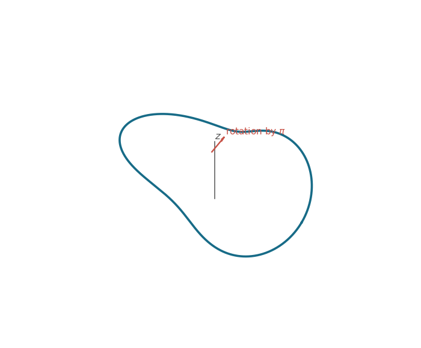

<h1 id="25i/c/solution">Solution</h1>

↑ **Parent:** [C](../c.md)

For $R>r>0$, the closed curve

$$
\gamma(t)=\bigl((R+r\cos2t)\cos t,\,
(R+r\cos2t)\sin t,\,
r\sin2t\bigr)
$$

is embedded on a torus and satisfies

$$
\gamma(t+\pi)=\operatorname{Rot}_z(\pi)\gamma(t).
$$

After [arc-length parametrization](../../../../../../arc-length-parametrization.md), it meets all the requirements of part (b). Its bending and twisting vary around the two waves, so neither curvature nor torsion is constant.

**[Figure 2](#25i/c/image-a-symmetric-closed-curve-and-its-reflections). A symmetric closed curve and its reflections**.

## ↑ Ancestors (11)

1. [C](../c.md)
2. [25I](../../25i.md)
3. [Paper 2](../../../paper-2-split.md)
4. [Ii](../../../split.md)
5. [2020](../../../../split.md)
6. [Past exam of the mathematics course of the University of Cambridge](../../../../../split.md)
7. [Mathematics course of the University of Cambridge](../../../../../../mathematics-course-of-the-university-of-cambridge.md)
8. [Course of the University of Cambridge](../../../../../../course-of-the-university-of-cambridge.md)
9. [University of Cambridge](../../../../../../university-of-cambridge-split.md)
10. [List of universities](../../../../../../list-of-universities.md)
11. [Codex Wiki](../../../../../../split.md)
