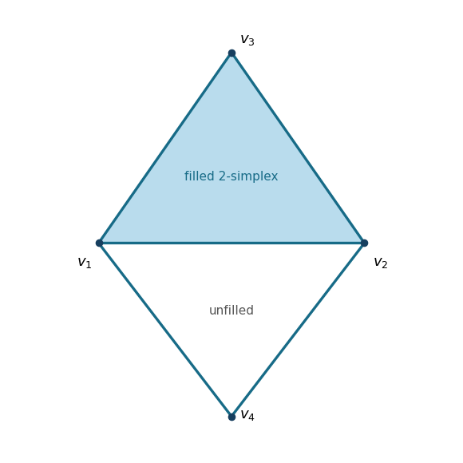

<h1 id="20f/a/solution">Solution</h1>

↑ **Parent:** [A](../a.md)

The [geometric realization of a simplicial complex](../../../../../../geometric-realization-of-a-simplicial-complex.md) consists of the filled triangle $\langle v_1,v_2,v_3\rangle$ together with the two extra edges $\langle v_1,v_4\rangle$ and $\langle v_2,v_4\rangle$. Thus the triangle on $v_1,v_2,v_4$ has only its boundary:

**[Figure 1](#20f/a/image-the-vertices-edges-and-faces-of-a-simplicial-complex). The vertices, edges and faces of a simplicial complex**.

## ↑ Ancestors (11)

1. [A](../a.md)
2. [20F](../../20f.md)
3. [Paper 3](../../../paper-3-split.md)
4. [Ii](../../../split.md)
5. [2020](../../../../split.md)
6. [Past exam of the mathematics course of the University of Cambridge](../../../../../split.md)
7. [Mathematics course of the University of Cambridge](../../../../../../mathematics-course-of-the-university-of-cambridge.md)
8. [Course of the University of Cambridge](../../../../../../course-of-the-university-of-cambridge.md)
9. [University of Cambridge](../../../../../../university-of-cambridge-split.md)
10. [List of universities](../../../../../../list-of-universities.md)
11. [Codex Wiki](../../../../../../split.md)
