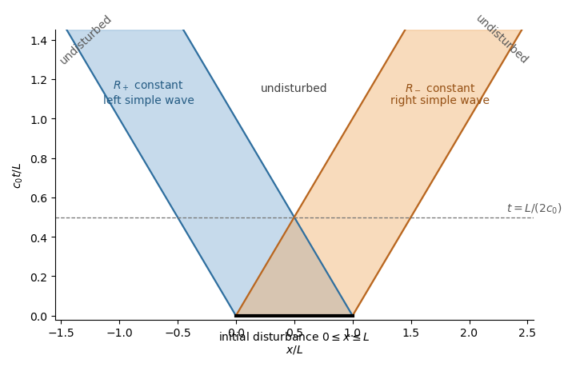

# Paper 4

↑ **Parent:** [Ii](../ii.md)

[https://www.maths.cam.ac.uk/undergrad/pastpapers/files/2020/paperii_4_2020.pdf](https://www.maths.cam.ac.uk/undergrad/pastpapers/files/2020/paperii_4_2020.pdf)

**Table of contents**

- [1H](#1h)
  - [Solution](#1h/solution)
- [2H](#2h)
  - [Solution](#2h/solution)
- [3I](#3i)
  - [a](#3i/a)
    - [Solution](#3i/a/solution)
  - [b](#3i/b)
    - [Solution](#3i/b/solution)
- [4F](#4f)
  - [Solution](#4f/solution)
- [5J](#5j)
  - [a](#5j/a)
    - [i](#5j/a/i)
      - [Solution](#5j/a/i/solution)
    - [ii](#5j/a/ii)
      - [Solution](#5j/a/ii/solution)
    - [iii](#5j/a/iii)
      - [Solution](#5j/a/iii/solution)
  - [b](#5j/b)
    - [Solution](#5j/b/solution)
- [6B](#6b)
  - [i](#6b/i)
    - [Solution](#6b/i/solution)
  - [ii](#6b/ii)
    - [Solution](#6b/ii/solution)
  - [iii](#6b/iii)
    - [Solution](#6b/iii/solution)
- [7E](#7e)
  - [Solution](#7e/solution)
- [8B](#8b)
  - [Solution](#8b/solution)
- [9D](#9d)
  - [Solution](#9d/solution)
- [10C](#10c)
  - [i](#10c/i)
    - [Solution](#10c/i/solution)
  - [ii](#10c/ii)
    - [Solution](#10c/ii/solution)
  - [iii](#10c/iii)
    - [Solution](#10c/iii/solution)
  - [iv](#10c/iv)
    - [Solution](#10c/iv/solution)
- [11H](#11h)
  - [a](#11h/a)
    - [Solution](#11h/a/solution)
  - [b](#11h/b)
    - [Solution](#11h/b/solution)
  - [c](#11h/c)
    - [Solution](#11h/c/solution)
  - [d](#11h/d)
    - [Solution](#11h/d/solution)
- [12H](#12h)
  - [a](#12h/a)
    - [Solution](#12h/a/solution)
  - [b](#12h/b)
    - [i](#12h/b/i)
      - [Solution](#12h/b/i/solution)
    - [ii](#12h/b/ii)
      - [Solution](#12h/b/ii/solution)
    - [iii](#12h/b/iii)
      - [Solution](#12h/b/iii/solution)
- [13J](#13j)
  - [a](#13j/a)
    - [Solution](#13j/a/solution)
  - [b](#13j/b)
    - [i](#13j/b/i)
      - [Solution](#13j/b/i/solution)
    - [ii](#13j/b/ii)
      - [Solution](#13j/b/ii/solution)
    - [iii](#13j/b/iii)
      - [Solution](#13j/b/iii/solution)
- [14B](#14b)
  - [i](#14b/i)
    - [Solution](#14b/i/solution)
  - [ii](#14b/ii)
    - [Solution](#14b/ii/solution)
  - [iii](#14b/iii)
    - [Solution](#14b/iii/solution)
  - [iv](#14b/iv)
    - [Solution](#14b/iv/solution)
- [15B](#15b)
  - [a](#15b/a)
    - [Solution](#15b/a/solution)
  - [b](#15b/b)
    - [Solution](#15b/b/solution)
  - [c](#15b/c)
    - [i](#15b/c/i)
      - [Solution](#15b/c/i/solution)
    - [ii](#15b/c/ii)
      - [Solution](#15b/c/ii/solution)
- [16H](#16h)
  - [a](#16h/a)
    - [Solution](#16h/a/solution)
  - [b](#16h/b)
    - [Solution](#16h/b/solution)
  - [c](#16h/c)
    - [i](#16h/c/i)
      - [Solution](#16h/c/i/solution)
    - [ii](#16h/c/ii)
      - [Solution](#16h/c/ii/solution)
    - [iii](#16h/c/iii)
      - [Solution](#16h/c/iii/solution)
- [17G](#17g)
  - [Solution](#17g/solution)
- [18G](#18g)
  - [a](#18g/a)
    - [Solution](#18g/a/solution)
  - [b](#18g/b)
    - [Solution](#18g/b/solution)
- [19F](#19f)
  - [a](#19f/a)
    - [Solution](#19f/a/solution)
  - [b](#19f/b)
    - [Solution](#19f/b/solution)
- [20G](#20g)
  - [Solution](#20g/solution)
- [21F](#21f)
  - [a](#21f/a)
    - [i](#21f/a/i)
      - [Solution](#21f/a/i/solution)
    - [ii](#21f/a/ii)
      - [Solution](#21f/a/ii/solution)
  - [b](#21f/b)
    - [Solution](#21f/b/solution)
  - [c](#21f/c)
    - [Solution](#21f/c/solution)
- [22I](#22i)
  - [a](#22i/a)
    - [Solution](#22i/a/solution)
  - [b](#22i/b)
    - [Solution](#22i/b/solution)
  - [c](#22i/c)
    - [i](#22i/c/i)
      - [Solution](#22i/c/i/solution)
    - [ii](#22i/c/ii)
      - [Solution](#22i/c/ii/solution)
- [23I](#23i)
  - [a](#23i/a)
    - [Solution](#23i/a/solution)
  - [b](#23i/b)
    - [Solution](#23i/b/solution)
  - [c](#23i/c)
    - [Solution](#23i/c/solution)
- [24F](#24f)
  - [Solution](#24f/solution)
- [25I](#25i)
  - [a](#25i/a)
    - [Solution](#25i/a/solution)
  - [b](#25i/b)
    - [Solution](#25i/b/solution)
  - [c](#25i/c)
    - [Solution](#25i/c/solution)
  - [d](#25i/d)
    - [i](#25i/d/i)
      - [Solution](#25i/d/i/solution)
    - [ii](#25i/d/ii)
      - [Solution](#25i/d/ii/solution)
- [26K](#26k)
  - [a](#26k/a)
    - [Solution](#26k/a/solution)
  - [b](#26k/b)
    - [i](#26k/b/i)
      - [Solution](#26k/b/i/solution)
    - [ii](#26k/b/ii)
      - [Solution](#26k/b/ii/solution)
    - [iii](#26k/b/iii)
      - [Solution](#26k/b/iii/solution)
- [27K](#27k)
  - [i](#27k/i)
    - [Solution](#27k/i/solution)
  - [ii](#27k/ii)
    - [Solution](#27k/ii/solution)
  - [iii](#27k/iii)
    - [Solution](#27k/iii/solution)
- [28J](#28j)
  - [Solution](#28j/solution)
- [29K](#29k)
  - [i](#29k/i)
    - [Solution](#29k/i/solution)
  - [ii](#29k/ii)
    - [Solution](#29k/ii/solution)
  - [iii](#29k/iii)
    - [Solution](#29k/iii/solution)
  - [iv](#29k/iv)
    - [Solution](#29k/iv/solution)
  - [v](#29k/v)
    - [Solution](#29k/v/solution)
- [30J](#30j)
  - [i](#30j/i)
    - [Solution](#30j/i/solution)
  - [ii](#30j/ii)
    - [Solution](#30j/ii/solution)
  - [iii](#30j/iii)
    - [Solution](#30j/iii/solution)
  - [iv](#30j/iv)
    - [Solution](#30j/iv/solution)
- [31A](#31a)
  - [i](#31a/i)
    - [Solution](#31a/i/solution)
  - [ii](#31a/ii)
    - [Solution](#31a/ii/solution)
  - [iii](#31a/iii)
    - [Solution](#31a/iii/solution)
  - [iv](#31a/iv)
    - [Solution](#31a/iv/solution)
- [32E](#32e)
  - [a](#32e/a)
    - [i](#32e/a/i)
      - [Solution](#32e/a/i/solution)
    - [ii](#32e/a/ii)
      - [Solution](#32e/a/ii/solution)
  - [b](#32e/b)
    - [i](#32e/b/i)
      - [Solution](#32e/b/i/solution)
    - [ii](#32e/b/ii)
      - [Solution](#32e/b/ii/solution)
    - [iii](#32e/b/iii)
      - [Solution](#32e/b/iii/solution)
    - [iv](#32e/b/iv)
      - [Solution](#32e/b/iv/solution)
- [33A](#33a)
  - [Solution](#33a/solution)
- [34C](#34c)
  - [a](#34c/a)
    - [Solution](#34c/a/solution)
  - [b](#34c/b)
    - [i](#34c/b/i)
      - [Solution](#34c/b/i/solution)
    - [ii](#34c/b/ii)
      - [Solution](#34c/b/ii/solution)
    - [iii](#34c/b/iii)
      - [Solution](#34c/b/iii/solution)
- [35A](#35a)
  - [i](#35a/i)
    - [Solution](#35a/i/solution)
  - [ii](#35a/ii)
    - [Solution](#35a/ii/solution)
  - [iii](#35a/iii)
    - [Solution](#35a/iii/solution)
- [36D](#36d)
  - [a](#36d/a)
    - [Solution](#36d/a/solution)
  - [b](#36d/b)
    - [i](#36d/b/i)
      - [Solution](#36d/b/i/solution)
    - [ii](#36d/b/ii)
      - [Solution](#36d/b/ii/solution)
    - [iii](#36d/b/iii)
      - [Solution](#36d/b/iii/solution)
    - [iv](#36d/b/iv)
      - [Solution](#36d/b/iv/solution)
- [37D](#37d)
  - [i](#37d/i)
    - [Solution](#37d/i/solution)
  - [ii](#37d/ii)
    - [Solution](#37d/ii/solution)
  - [iii](#37d/iii)
    - [Solution](#37d/iii/solution)
  - [iv](#37d/iv)
    - [Solution](#37d/iv/solution)
- [38B](#38b)
  - [i](#38b/i)
    - [Solution](#38b/i/solution)
  - [ii](#38b/ii)
    - [Solution](#38b/ii/solution)
  - [iii](#38b/iii)
    - [Solution](#38b/iii/solution)
- [39B](#39b)
  - [a](#39b/a)
    - [Solution](#39b/a/solution)
  - [b](#39b/b)
    - [i](#39b/b/i)
      - [Solution](#39b/b/i/solution)
    - [ii](#39b/b/ii)
      - [Solution](#39b/b/ii/solution)
- [40E](#40e)
  - [a](#40e/a)
    - [Solution](#40e/a/solution)
  - [b](#40e/b)
    - [Solution](#40e/b/solution)
  - [c](#40e/c)
    - [Solution](#40e/c/solution)

## 1H

↑ **Parent:** [Paper 4](paper-4.md)

<h3 id="1h/solution">Solution</h3>

↑ **Parent:** [1H](#1h)

[Lagrange theorem for polynomial congruences](../../../mathematics.md#lagrange-theorem-for-polynomial-congruences) says that a nonzero [polynomial](../../../polynomial.md) of [degree](../../../polynomial.md#degree-of-a-polynomial) $d$ over the [finite field](../../../algebra.md#finite-field) $\mathbb F_p$ has at most $d$ roots. To prove it, use [mathematical induction](../../../foundations-of-mathematics.md#mathematical-induction) on $d$. A constant nonzero polynomial has no roots. If $f(a)=0$, [polynomial division](../../../polynomial.md#polynomial-division) in the field $\mathbb F_p$ gives $f(X)=(X-a)q(X)$ with $\deg q=d-1$. Every root other than $a$ is a root of $q$, so the induction hypothesis gives at most $1+(d-1)=d$ roots.

Every nonzero [residue class](../../../number-theory.md#residue-class) modulo $p$ has a unique [multiplicative inverse](../../../number-theory.md#modular-multiplicative-inverse). In the product $(p-1)!$, pair each class with its inverse. The unpaired classes satisfy $x=x^{-1}$, hence $x^2-1=0$. By the theorem these are exactly $1$ and $-1$, and therefore

$$
(p-1)!\equiv1\cdot(-1)\equiv-1\pmod p.
$$

This is [Wilson theorem](../../../number-theory.md#wilson-s-theorem).

Now write $p-1=kq$. By [Fermat's little theorem](../../../number-theory.md#fermat-little-theorem), every nonzero class is a root of

$$
X^{p-1}-1=(X^k-1)(1+X^k+\cdots+X^{(q-1)k}).
$$

The second factor has degree $p-1-k$ and hence at most $p-1-k$ roots. Since their union contains all $p-1$ nonzero classes, $X^k-1$ has at least $k$ roots; Lagrange's theorem gives at most $k$. Thus $x^k\equiv1\pmod p$ has exactly $k$ solutions.

## 2H

↑ **Parent:** [Paper 4](paper-4.md)

<h3 id="2h/solution">Solution</h3>

↑ **Parent:** [2H](#2h)

A subset $A$ of a [metric space](../../../topological-analysis.md#metric-space) is [nowhere dense](../../../topological-analysis.md#nowhere-dense-set) when the interior of its closure is empty. One form of the [Baire category theorem](../../../topological-analysis.md#baire-category-theorem) says that a nonempty [complete metric space](../../../topological-analysis.md#complete-metric-space) cannot be a [countable union](../../../set.md#set-union) of nowhere dense closed sets; equivalently, a countable intersection of dense open sets is dense.

Fix $\varepsilon>0$ and work in the complete interval $[1,2]$. For $N\geq1$ define the closed set

$$
E_N=\{x\in[1,2]: |f(nx)|\leq\varepsilon\text{ for every }n\geq N\}.
$$

The sets are closed by the [continuity](../../../calculus.md#continuous-function) of $f$, and the assumed [pointwise convergence](../../../real-analysis.md#pointwise-convergence) gives $[1,2]=\bigcup_NE_N$. The [Baire category theorem](../../../topological-analysis.md#baire-category-theorem) therefore gives an $N$ and a nonempty open interval $(a,b)\subseteq[1,2]$ contained in $E_N$.

The intervals $[na,nb]$ overlap once $(n+1)a\leq nb$, which holds for every sufficiently large [natural number](../../../arithmetic.md#natural-number) $n$. Their union consequently contains a half-line. Every sufficiently large $t$ can therefore be written as $t=nx$ with $n\geq N$ and $x\in(a,b)$, and then $|f(t)|=|f(nx)|\leq\varepsilon$. Since $\varepsilon$ was arbitrary, $f(t)\to0$ as $t\to\infty$.

## 3I

↑ **Parent:** [Paper 4](paper-4.md)

<h3 id="3i/a">a</h3>

↑ **Parent:** [3I](#3i)

<h4 id="3i/a/solution">Solution</h4>

↑ **Parent:** [A](#3i/a)

A [cipher](../../../coding-theory.md#cipher) has [perfect secrecy](../../../coding-theory.md#perfect-secrecy) when the [conditional probability](../../../probability-theory.md#conditional-probability) of every plaintext given a ciphertext equals its prior probability: $\Pr(M=m\mid C=c)=\Pr(M=m)$ whenever $\Pr(C=c)>0$. Equivalently, the plaintext and ciphertext are [independent random variables](../../../random-variable.md#independent-random-variables).

Fix a ciphertext $c$ that can occur. Perfect secrecy requires every possible plaintext $m$ to remain possible after observing $c$. For a deterministic decryption rule, two different plaintexts producing $c$ require two different keys, so the key space has cardinality at least that of the message space.

In a [one-time pad](../../../coding-theory.md#one-time-pad), the message and key belong to the same finite [additive group](../../../group.md#additive-group), the key is [uniform](../../../continuous-probability-distribution.md#continuous-uniform-distribution) and independent of the message, and encryption is $C=M+K$. For every $m,c$ there is exactly one key $k=c-m$, so

$$
\Pr(C=c\mid M=m)=\Pr(K=c-m)=\frac1{|\mathcal K|},
$$

independent of $m$. [Bayes' theorem](../../../probability-theory.md#bayes-theorem) then gives $\Pr(M=m\mid C=c)=\Pr(M=m)$, proving [perfect secrecy](../../../coding-theory.md#perfect-secrecy).

<h3 id="3i/b">b</h3>

↑ **Parent:** [3I](#3i)

<h4 id="3i/b/solution">Solution</h4>

↑ **Parent:** [B](#3i/b)

Perform every addition in the [finite field](../../../algebra.md#finite-field) $\mathbb F_2$. From the two transmitted strings $c_i=a_i+k_i$ and $d_i=a_i+k_{i+1}$ one obtains

$$
c_i+d_i=k_i+k_{i+1}\qquad(1\leq i\leq N).
$$

Choosing one candidate value of $k_1$ recursively determines $k_2,\ldots,k_{N+1}$, and hence determines the candidate plaintext $a_i=c_i+k_i$. There are only two candidates: changing $k_1$ complements every recovered key bit and every plaintext bit. The information that the message makes sense normally selects the intended candidate.

Once this ambiguity is resolved, any other ciphertext positions encrypted with the recovered segment $k_1,\ldots,k_{N+1}$ can be decrypted. Key bits outside that segment remain [independent](../../../random-variable.md#independent-random-variables) and uniformly distributed, so this mistake gives no information about messages using only those bits. This is the [two-time pad attack](../../../coding-theory.md#two-time-pad-attack): reusing related one-time-pad key material destroys [perfect secrecy](../../../coding-theory.md#perfect-secrecy).

## 4F

↑ **Parent:** [Paper 4](paper-4.md)

<h3 id="4f/solution">Solution</h3>

↑ **Parent:** [4F](#4f)

A [context-free grammar](../../../foundations-of-mathematics.md#context-free-grammar) is in [Chomsky normal form](../../../foundations-of-mathematics.md#chomsky-normal-form) when every production has the form $A\to BC$ or $A\to a$, where $A,B,C$ are [nonterminals](../../../foundations-of-mathematics.md#nonterminal-symbol) and $a$ is a [terminal symbol](../../../foundations-of-mathematics.md#terminal-symbol); one may additionally allow the new start production $S_0\to\epsilon$ when the language contains the [empty string](../../../foundations-of-mathematics.md#empty-word), provided $S_0$ never appears on a right-hand side.

The standard conversion proceeds as follows.

- Introduce a fresh start symbol $S_0$ and $S_0\to S$. This changes $N$ only when the old start symbol occurs on a right-hand side or when a protected start symbol is needed to preserve $\epsilon$.
- Find all nullable nonterminals, add productions obtained by omitting nullable occurrences, and remove the original $\epsilon$-productions except the permitted $S_0\to\epsilon$. This leaves $N$ unchanged.
- Eliminate each [unit production](../../../foundations-of-mathematics.md#unit-production) $A\to B$ by adding to $A$ the non-unit productions reachable through its transitive closure. This leaves $N$ unchanged.
- Delete non-generating symbols and then unreachable symbols. This is the only simplification stage that can shrink $N$.
- In every right-hand side of length at least two, replace a terminal $a$ by a fresh nonterminal $T_a$ with $T_a\to a$. New nonterminals are needed exactly for terminals that occur in such mixed or long productions.
- Break every right-hand side of length at least three into binary productions, introducing fresh nonterminals for successive suffixes. New nonterminals are needed exactly when such long productions remain.

The terminal alphabet $\Sigma$ may be kept unchanged throughout, although unused terminals may be discarded by convention. Every stage preserves the generated language, with the explicit protection of $\epsilon$ at the start-symbol stage. For example,

$$
S\to SS\mid a
$$

is already in [Chomsky normal form](../../../foundations-of-mathematics.md#chomsky-normal-form) and generates the infinite language $\{a^n:n\geq1\}$, so its conversion may be the grammar itself.

## 5J

↑ **Parent:** [Paper 4](paper-4.md)

<h3 id="5j/a">a</h3>

↑ **Parent:** [5J](#5j)

<h4 id="5j/a/i">i</h4>

↑ **Parent:** [A](#5j/a)

<h5 id="5j/a/i/solution">Solution</h5>

↑ **Parent:** [I](#5j/a/i)

The individual [t-tests](../../../statistical-modelling.md#student-s-t-test) only test each [regression coefficient](../../../linear-regression.md#regression-coefficient) after adjusting for the other covariate. Here neither covariate is individually significant at conventional levels, but from the abbreviated coefficient table alone one cannot conclude that neither explains the response: strong [multicollinearity](../../../statistical-modelling.md#multicollinearity) can make both standard errors large even when the covariates are jointly useful.

<h4 id="5j/a/ii">ii</h4>

↑ **Parent:** [A](#5j/a)

<h5 id="5j/a/ii/solution">Solution</h5>

↑ **Parent:** [Ii](#5j/a/ii)

The full [F-test](../../../probability-and-statistics.md#f-test) has $p<2.2\times10^{-16}$ and tests the [null hypothesis](../../../statistical-modelling.md#null-hypothesis) that both slope coefficients vanish. It decisively rejects that hypothesis, while $R^2=0.8126$ says the fitted model explains about $81\%$ of the sample variation. Together with the insignificant individual t-tests, this is characteristic of [multicollinearity](../../../statistical-modelling.md#multicollinearity): the two covariates explain the response jointly, but the output does not identify either one as having a separately estimable effect.

<h4 id="5j/a/iii">iii</h4>

↑ **Parent:** [A](#5j/a)

<h5 id="5j/a/iii/solution">Solution</h5>

↑ **Parent:** [Iii](#5j/a/iii)

Here the full [F-test](../../../probability-and-statistics.md#f-test) has $p=0.9834$ and $R^2\approx0$. There is no evidence against the joint [null hypothesis](../../../statistical-modelling.md#null-hypothesis) that both slopes vanish, and hence no evidence in this model that either covariate explains the response.

<h3 id="5j/b">b</h3>

↑ **Parent:** [5J](#5j)

<h4 id="5j/b/solution">Solution</h4>

↑ **Parent:** [B](#5j/b)

The intercept-only model has $49$ residual degrees of freedom, so the sample size is $50$. The one-covariate model and full model therefore have respectively $48$ and $47$ residual degrees of freedom. The completed sequential [analysis of variance](../../../linear-regression.md#analysis-of-variance) table has

$$
\begin{array}{c|c|c|c|c|c}
&\mathrm{Res.Df}&\mathrm{RSS}&\mathrm{Df}&\mathrm{Sum\ of\ Sq}&F\\ \hline
1&49&164.448&&&\\
2&48&30.831&1&164.448-30.831&\dfrac{164.448-30.831}{30.817/47}\\
3&47&30.817&1&30.831-30.817&\dfrac{30.831-30.817}{30.817/47}
\end{array}
$$

Thus the missing sums of squares are $133.617$ and $0.014$, and the corresponding [F-statistics](../../../probability-and-statistics.md#f-statistic) are approximately $203.8$ and $0.0214$. The first p-value is below $2\times10^{-16}$; the second is approximately $0.8845$. The tiny second increment is consistent with the reported [t-test](../../../statistical-modelling.md#student-s-t-test) because, for one added coefficient, the partial F-statistic equals the squared t-statistic up to displayed rounding.

## 6B

↑ **Parent:** [Paper 4](paper-4.md)

<h3 id="6b/i">i</h3>

↑ **Parent:** [6B](#6b)

<h4 id="6b/i/solution">Solution</h4>

↑ **Parent:** [I](#6b/i)

This is a [Yule process](../../../markov-process.md#yule-process), a [pure birth process](../../../markov-process.md#birth-process) with state-dependent birth rate $\lambda_n=\lambda n$. Probability flows into state $n$ from $n-1$ and leaves it for $n+1$, so the [master equation](../../../markov-process.md#master-equation) is

$$
\boxed{\frac{dP_1}{dt}=-\lambda P_1,
\qquad
\frac{dP_n}{dt}=\lambda(n-1)P_{n-1}-\lambda nP_n\quad(n\geq2).}
$$

<h3 id="6b/ii">ii</h3>

↑ **Parent:** [6B](#6b)

<h4 id="6b/ii/solution">Solution</h4>

↑ **Parent:** [Ii](#6b/ii)

Put $q=e^{-\lambda t}$ and propose $P_n=q(1-q)^{n-1}$. The initial condition follows from $q(0)=1$. Since $q'=-\lambda q$,

$$
\frac{dP_n}{dt}
=-\lambda q(1-q)^{n-1}
+\lambda(n-1)q^2(1-q)^{n-2}.
$$

On the other hand,

$$
\lambda(n-1)P_{n-1}-\lambda nP_n
=\lambda(n-1)q(1-q)^{n-2}-\lambda nq(1-q)^{n-1},
$$

and expanding the bracket gives the same expression. The formula also sums to one by the [geometric series](../../../real-analysis.md#geometric-series), so it is the required [probability mass function](../../../probability-theory.md#probability-mass-function).

<h3 id="6b/iii">iii</h3>

↑ **Parent:** [6B](#6b)

<h4 id="6b/iii/solution">Solution</h4>

↑ **Parent:** [Iii](#6b/iii)

The distribution is the [geometric distribution](../../../discrete-probability-distribution.md#geometric-distribution) on $\{1,2,\ldots\}$ with success parameter $q=e^{-\lambda t}$. Its [expected value](../../../probability-theory.md#expected-value) is therefore

$$
\mathbb E[N(t)]=\frac1q=e^{\lambda t}.
$$

Equivalently, multiplying the [master equation](../../../markov-process.md#master-equation) by $n$ and summing gives $m'(t)=\lambda m(t)$ with $m(0)=1$.

## 7E

↑ **Parent:** [Paper 4](paper-4.md)

<h3 id="7e/solution">Solution</h3>

↑ **Parent:** [7E](#7e)

With the stated sign convention, write $t=y-x$ to obtain

$$
\mathcal H(e^{i\omega x})(y)
=\frac{e^{i\omega y}}\pi\,\mathcal P\!\int_{-\infty}^{\infty}\frac{e^{-i\omega t}}t\,dt.
$$

The [Cauchy principal value](../../../complex-analysis.md#cauchy-principal-value) of the cosine part vanishes by [oddness](../../../calculus.md#odd-function), while the [Dirichlet integral](../../../fourier-analysis.md#dirichlet-integral) gives

$$
\mathcal P\!\int_{-\infty}^{\infty}\frac{e^{-i\omega t}}t\,dt=-i\pi\operatorname{sgn}(\omega).
$$

Thus the [Hilbert transform](../../../analysis.md#hilbert-transform) has [Fourier multiplier](../../../analysis.md#fourier-multiplier-operator) $-i\operatorname{sgn}(\omega)$. Taking the real part yields

$$
\boxed{\mathcal H(\cos\omega x)(y)=\operatorname{sgn}(\omega)\sin(\omega y)}.
$$

## 8B

↑ **Parent:** [Paper 4](paper-4.md)

<h3 id="8b/solution">Solution</h3>

↑ **Parent:** [8B](#8b)

Write the position of a mass element relative to the [center of mass](../../../classical-mechanics.md#center-of-mass) as $\mathbf r$, so its inertial-frame velocity is $\dot{\mathbf X}+\boldsymbol\omega\times\mathbf r$. The center-of-mass identity $\int\mathbf r\,dm=0$ removes all cross terms. Define the [inertia tensor](../../../classical-mechanics.md#inertia-tensor) about the center of mass by

$$
I_{ij}=\int\bigl(r^2\delta_{ij}-r_ir_j\bigr)\,dm.
$$

The total [angular momentum](../../../classical-mechanics.md#angular-momentum) about the origin and [kinetic energy](../../../classical-mechanics.md#kinetic-energy) are then

$$
\mathbf L=M\mathbf X\times\dot{\mathbf X}+I\boldsymbol\omega,
\qquad
T=\frac12M|\dot{\mathbf X}|^2+\frac12\boldsymbol\omega\mathbin{\cdot}I\boldsymbol\omega.
$$

Let $\rho(r)=C r^{-1}\sin(\pi r/R)$. [Spherical symmetry](../../../geometry-and-topology.md#spherical-symmetry) makes $I=I_0\mathbf1$. The mass normalization is

$$
M=4\pi C\int_0^R r\sin\frac{\pi r}{R}\,dr=4CR^2,
$$

so $C=M/(4R^2)$. A moment about any diameter is

$$
I_0=\frac{8\pi}{3}\int_0^R\rho(r)r^4\,dr
=\frac{8\pi C}{3}\frac{R^4}{\pi^4}\int_0^\pi x^3\sin x\,dx
=\frac{2MR^2(\pi^2-6)}{3\pi^2}.
$$

Therefore

$$
\boxed{I=\frac{2MR^2(\pi^2-6)}{3\pi^2}\,\mathbf1}.
$$

## 9D

↑ **Parent:** [Paper 4](paper-4.md)

<h3 id="9d/solution">Solution</h3>

↑ **Parent:** [9D](#9d)

[Chemical equilibrium](../../../thermodynamics.md#chemical-equilibrium) for $p+e^-\rightleftharpoons H+\gamma$ gives $\mu_p+\mu_e=\mu_H$, because the [photon chemical potential](../../../thermodynamics.md#photon-chemical-potential) vanishes. Applying the [nonrelativistic number-density formula](../../../statistical-physics.md#maxwell-boltzmann-distribution) to all three massive species and taking the ratio gives

$$
\frac{n_H}{n_pn_e}
=\frac{g_H}{g_pg_e}
\left(\frac{2\pi\hbar^2}{k_BT}\right)^{3/2}
\left(\frac{m_H}{m_pm_e}\right)^{3/2}
\exp\!\left(\frac{m_pc^2+m_ec^2-m_Hc^2}{k_BT}\right).
$$

Use [charge neutrality](../../../electromagnetism.md#charge-neutrality) $n_p=n_e$, the [Hydrogen binding energy](../../../cosmology.md#hydrogen-binding-energy) $E_{\rm bind}=m_pc^2+m_ec^2-m_Hc^2$, $m_H\simeq m_p$, and the ground-state statistical weights $g_H=g_pg_e$. Then

$$
\boxed{n_H\simeq n_e^2
\left(\frac{2\pi\hbar^2}{m_ek_BT}\right)^{3/2}
e^{E_{\rm bind}/k_BT}}.
$$

The approximations are a dilute, nondegenerate [ideal gas](../../../thermodynamics.md#ideal-gas) in thermal and chemical equilibrium, nonrelativistic electrons, protons and hydrogen, negligible excited hydrogen states, and negligible corrections from the proton-to-hydrogen mass ratio. This relation is the [Saha ionization equation](../../../cosmology.md#saha-ionization-equation).

## 10C

↑ **Parent:** [Paper 4](paper-4.md)

<h3 id="10c/i">i</h3>

↑ **Parent:** [10C](#10c)

<h4 id="10c/i/solution">Solution</h4>

↑ **Parent:** [I](#10c/i)

For $\omega=e^{2\pi i/N}$, the [quantum Fourier transform](../../../quantum-theory.md#quantum-fourier-transform) is

$$
\operatorname{QFT}_N|x\rangle
=\frac1{\sqrt N}\sum_{y=0}^{N-1}\omega^{xy}|y\rangle.
$$

Its matrix is unitary because [character orthogonality](../../../representation-theory.md#character-orthogonality) for the cyclic group gives orthogonal rows.

<h3 id="10c/ii">ii</h3>

↑ **Parent:** [10C](#10c)

<h4 id="10c/ii/solution">Solution</h4>

↑ **Parent:** [Ii](#10c/ii)

For $N=4$, the binary label $10$ is the integer $2$, so

$$
\operatorname{QFT}_4|10\rangle
=\frac12\bigl(|00\rangle-|01\rangle+|10\rangle-|11\rangle\bigr)
=|+\rangle\otimes|-\rangle,
$$

where $|+\rangle=(|0\rangle+|1\rangle)/\sqrt2$ and $|-\rangle=(|0\rangle-|1\rangle)/\sqrt2$. It is a [product state](../../../bell-state.md#product-state) and hence has no [quantum entanglement](../../../bell-state.md#entangled-state).

<h3 id="10c/iii">iii</h3>

↑ **Parent:** [10C](#10c)

<h4 id="10c/iii/solution">Solution</h4>

↑ **Parent:** [Iii](#10c/iii)

Applying the transform twice gives

$$
\operatorname{QFT}_N^2|x\rangle
=\frac1N\sum_{y,z=0}^{N-1}\omega^{y(x+z)}|z\rangle.
$$

By the [finite geometric series](../../../real-analysis.md#finite-geometric-series), the inner sum over $y$ is $N$ when $x+z\equiv0\pmod N$ and zero otherwise. Therefore

$$
\operatorname{QFT}_N^2|x\rangle=|-x\bmod N\rangle,
$$

which is the stated $|N-x\rangle$ with the label interpreted modulo $N$.

<h3 id="10c/iv">iv</h3>

↑ **Parent:** [10C](#10c)

<h4 id="10c/iv/solution">Solution</h4>

↑ **Parent:** [Iv](#10c/iv)

The map $x\mapsto-x$ is an [involution](../../../group-theory.md#involution), so

$$
\operatorname{QFT}_N^4=I.
$$

If $\lambda$ is an [eigenvalue](../../../linear-operator-theory.md#eigenvalue) of $\operatorname{QFT}_N$, then $\lambda^4=1$. Hence every eigenvalue belongs to

$$
\{1,-1,i,-i\}.
$$

Because $X^4-1$ has distinct roots, the transform is [diagonalizable](../../../linear-operator-theory.md#diagonalizable-matrix); which fourth roots occur and their multiplicities depend on $N$.

## 11H

↑ **Parent:** [Paper 4](paper-4.md)

<h3 id="11h/a">a</h3>

↑ **Parent:** [11H](#11h)

<h4 id="11h/a/solution">Solution</h4>

↑ **Parent:** [A](#11h/a)

An [arithmetic function](../../../number-theory.md#arithmetic-function) $f$ is [multiplicative](../../../number-theory.md#multiplicative-function) when $f(1)=1$ and $f(mn)=f(m)f(n)$ whenever $m$ and $n$ are [coprime](../../../number-theory.md#coprime-integers). If $m$ and $n$ are coprime, every divisor $d$ of $mn$ has a unique factorization $d=d_1d_2$ with $d_1\mid m$ and $d_2\mid n$. Hence the [Dirichlet convolution](../../../number-theory.md#dirichlet-convolution) of multiplicative functions satisfies

$$
\begin{aligned}
(f\star g)(mn)
&=\sum_{d_1\mid m}\sum_{d_2\mid n}
f(d_1d_2)g\!\left(\frac m{d_1}\frac n{d_2}\right)\\
&=(f\star g)(m)(f\star g)(n),
\end{aligned}
$$

and $(f\star g)(1)=1$, so it is multiplicative.

Let $\varepsilon$ be the [identity for Dirichlet convolution](../../../number-theory.md#identity-for-dirichlet-convolution), with $\varepsilon(1)=1$ and $\varepsilon(n)=0$ for $n>1$. The [Möbius function](../../../number-theory.md#mobius-function) satisfies $\mu\star1=\varepsilon$. Therefore, using commutativity and associativity,

$$
f=\mu\star g
\quad\Longrightarrow\quad
f\star1=g\star(\mu\star1)=g\star\varepsilon=g.
$$

This is the [Möbius inversion formula](../../../number-theory.md#mobius-inversion-formula).

<h3 id="11h/b">b</h3>

↑ **Parent:** [11H](#11h)

<h4 id="11h/b/solution">Solution</h4>

↑ **Parent:** [B](#11h/b)

Take both functions to be the constant arithmetic function $1$. Then

$$
(1\star1)(n)=\sum_{d\mid n}1=\tau(n),
$$

so the [divisor function](../../../number-theory.md#divisor-function) is multiplicative by part (a). For $s$ with $\operatorname{Re}s>1$, the relevant [Dirichlet series](../../../analytic-number-theory.md#dirichlet-series) are absolutely convergent, so their [Cauchy product](../../../real-analysis.md#cauchy-product) may be rearranged:

$$
\begin{aligned}
\zeta(s)^2
&=\sum_{a,b\geq1}\frac1{(ab)^s}
=\sum_{n\geq1}\frac1{n^s}\sum_{a\mid n}1
=\sum_{n\geq1}\frac{\tau(n)}{n^s}.
\end{aligned}
$$

Equivalently, Dirichlet convolution becomes multiplication of absolutely convergent Dirichlet series.

<h3 id="11h/c">c</h3>

↑ **Parent:** [11H](#11h)

<h4 id="11h/c/solution">Solution</h4>

↑ **Parent:** [C](#11h/c)

Let $P=p_1p_2\cdots p_{k+1}$ be the product of the first $k+1$ [primes](../../../number-theory.md#prime-number), and take $n=P^a$ for positive integers $a$. The [prime factorization](../../../number-theory.md#fundamental-theorem-of-arithmetic) gives

$$
\tau(P^a)=(a+1)^{k+1},
\qquad
(\log P^a)^k=a^k(\log P)^k.
$$

Their ratio is

$$
\frac{(a+1)^{k+1}}{a^k(\log P)^k}
=\frac{a(1+1/a)^{k+1}}{(\log P)^k}\longrightarrow\infty.
$$

**Thus every sufficiently large $a$ gives $\tau(P^a)\geq(\log P^a)^k$, producing infinitely many such $n$.**

<h3 id="11h/d">d</h3>

↑ **Parent:** [11H](#11h)

<h4 id="11h/d/solution">Solution</h4>

↑ **Parent:** [D](#11h/d)

If $n=\prod_{p^\alpha\parallel n}p^\alpha$, multiplicativity and the prime-power formula for the [divisor function](../../../number-theory.md#divisor-function) give

$$
\frac{\tau(n)}{n^\epsilon}
=\prod_{p^\alpha\parallel n}\frac{\alpha+1}{p^{\alpha\epsilon}}.
$$

Choose $P_0=2^{1/\epsilon}$. For $p\geq P_0$ and $\alpha\geq1$, the elementary bound $\alpha+1\leq2^\alpha$ gives

$$
\frac{\alpha+1}{p^{\alpha\epsilon}}\leq1.
$$

For each of the finitely many primes $p<P_0$, the sequence $(\alpha+1)p^{-\alpha\epsilon}$ tends to zero and therefore has a finite maximum $M_p$ over $\alpha\geq0$. Consequently

$$
\frac{\tau(n)}{n^\epsilon}
\leq C(\epsilon):=\prod_{p<P_0}M_p<\infty,
$$

uniformly in $n$, which proves $\tau(n)\leq C(\epsilon)n^\epsilon$.

## 12H

↑ **Parent:** [Paper 4](paper-4.md)

<h3 id="12h/a">a</h3>

↑ **Parent:** [12H](#12h)

<h4 id="12h/a/solution">Solution</h4>

↑ **Parent:** [A](#12h/a)

[Liouville approximation theorem](../../../number-theory.md#liouville-approximation-theorem) states that if $\alpha$ is a real [algebraic number](../../../algebra.md#algebraic-number) of degree $d\geq2$, then there is a constant $c(\alpha)>0$ such that

$$
\left|\alpha-\frac pq\right|>\frac{c(\alpha)}{q^d}
$$

for every rational $p/q$ with $q>0$. The strict inequality may be replaced by a non-strict one after changing the constant.

<h3 id="12h/b">b</h3>

↑ **Parent:** [12H](#12h)

<h4 id="12h/b/i">i</h4>

↑ **Parent:** [B](#12h/b)

<h5 id="12h/b/i/solution">Solution</h5>

↑ **Parent:** [I](#12h/b/i)

The convergents satisfy

$$
p_nq_{n-1}-p_{n-1}q_n=(-1)^{n-1},
$$

so $(p_n,q_n)$ and $(p_{n-1},q_{n-1})$ form an integer basis of $\mathbb Z^2$. Put $\delta_j=q_j\alpha-p_j$. Consecutive errors have opposite signs and $|\delta_{n-1}|>|\delta_n|$.

For integers $p,q$ with $0<q\leq q_n$, write

$$
(p,q)=r(p_n,q_n)+s(p_{n-1},q_{n-1}).
$$

If $s>0$, the denominator bound forces $r\leq0$, while if $s<0$ positivity forces $r\geq1$. Because $\delta_n$ and $\delta_{n-1}$ have opposite signs, in either case $s\neq0$ implies

$$
|q\alpha-p|=|r\delta_n+s\delta_{n-1}|>|\delta_n|.
$$

If $s=0$, the denominator bound gives $r=1$ unless the fraction is zero or has the same value as $p_n/q_n$. Thus $p_n/q_n$ is a [best approximation of the second kind](../../../number-theory.md#best-approximation-of-the-second-kind). Dividing by $q\leq q_n$ gives

$$
\boxed{\left|\alpha-\frac pq\right|
=\frac{|q\alpha-p|}{q}
\geq\frac{|q_n\alpha-p_n|}{q_n}
=\left|\alpha-\frac{p_n}{q_n}\right|.}
$$

<h4 id="12h/b/ii">ii</h4>

↑ **Parent:** [B](#12h/b)

<h5 id="12h/b/ii/solution">Solution</h5>

↑ **Parent:** [Ii](#12h/b/ii)

Suppose $a_j\leq A$ for every $j$. Given $b>0$, choose the first convergent denominator $q_m\geq b$. Then $q_{m-1}<b$ and the recurrence gives $q_m=a_mq_{m-1}+q_{m-2}<(A+1)b$. Part (i), applied at index $m$, gives $|b\alpha-a|\geq|q_m\alpha-p_m|$.

If $\alpha_{m+1}=[a_{m+1};a_{m+2},\ldots]$ is the complete quotient, the exact error formula is

$$
|q_m\alpha-p_m|
=\frac1{q_m\alpha_{m+1}+q_{m-1}}.
$$

Since $\alpha_{m+1}<A+1$, this is greater than $1/((A+2)q_m)$ and therefore greater than $1/((A+1)(A+2)b)$. It follows that every rational $a/b$ satisfies

$$
\left|\alpha-\frac ab\right|>
\frac1{(A+1)(A+2)b^2}.
$$

**Thus one may take $c=((A+1)(A+2))^{-1}$.**

<h4 id="12h/b/iii">iii</h4>

↑ **Parent:** [B](#12h/b)

<h5 id="12h/b/iii/solution">Solution</h5>

↑ **Parent:** [Iii](#12h/b/iii)

Consecutive convergents obey the standard error estimate

$$
0<\left|\alpha-\frac{p_n}{q_n}\right|
<\frac1{q_nq_{n+1}}
\leq\frac1{a_{n+1}q_n^2}.
$$

If the partial quotients are unbounded, then for every $c>0$ there are infinitely many indices with $a_{n+1}>1/c$; otherwise the whole sequence would be bounded after adjoining its finite initial segment. At each such index,

$$
\left|\alpha-\frac{p_n}{q_n}\right|<\frac c{q_n^2}.
$$

The denominators of the infinite continued fraction tend to infinity, so these give infinitely many distinct rational numbers of the required kind.

## 13J

↑ **Parent:** [Paper 4](paper-4.md)

<h3 id="13j/a">a</h3>

↑ **Parent:** [13J](#13j)

<h4 id="13j/a/solution">Solution</h4>

↑ **Parent:** [A](#13j/a)

A [generalized linear model](../../../statistical-modelling.md#generalized-linear-model) assumes independent responses from one [exponential dispersion family](../../../exponential-family.md#exponential-dispersion-model),

$$
f_i(y_i;\theta_i,\sigma_i^2)
=\exp\!\left\{
\frac{y_i\theta_i-b(\theta_i)}{\sigma_i^2}
+c(y_i,\sigma_i^2)
\right\},
$$

where $\sigma_i^2=a_i\sigma^2$, $\mu_i=\mathbb E[Y_i]=b'(\theta_i)$, and a [link function](../../../statistical-modelling.md#link-function) relates the mean to the [linear predictor](../../../statistical-modelling.md#linear-predictor) by $g(\mu)=X\beta$. It follows from normalization of the density after shifting the [natural parameter](../../../exponential-family.md#natural-parameter-of-an-exponential-family) that

$$
\mathbb E[e^{t_iY_i}]
=\exp\!\left\{
\frac{b(\theta_i+\sigma_i^2t_i)-b(\theta_i)}{\sigma_i^2}
\right\}.
$$

Independence therefore gives the joint [moment-generating function](../../../probability-theory.md#moment-generating-function)

$$
\mathbb E[e^{t^TY}]
=\exp\!\left\{
\sum_{i=1}^n
\frac{b(\theta_i+a_i\sigma^2t_i)-b(\theta_i)}{a_i\sigma^2}
\right\},
$$

whenever every shifted natural parameter lies in its natural-parameter domain.

<h3 id="13j/b">b</h3>

↑ **Parent:** [13J](#13j)

<h4 id="13j/b/i">i</h4>

↑ **Parent:** [B](#13j/b)

<h5 id="13j/b/i/solution">Solution</h5>

↑ **Parent:** [I](#13j/b/i)

Let $m=1/\sigma^2$. Within block $i$, the $m$ replicated observations have dispersion $a_i$ and common natural parameter $\theta_i$. Evaluating their joint MGF at the blockwise argument $\sigma^2t_i$ gives

$$
\left[
\exp\!\left\{
\frac{b(\theta_i+a_i\sigma^2t_i)-b(\theta_i)}{a_i}
\right\}
\right]^m
=\exp\!\left\{
\frac{b(\theta_i+a_i\sigma^2t_i)-b(\theta_i)}{a_i\sigma^2}
\right\}.
$$

Multiplying over blocks reproduces the MGF of $Y$ from part (a). Since moment-generating functions uniquely determine distributions in this family, $\bar Y\overset d=Y$.

<h4 id="13j/b/ii">ii</h4>

↑ **Parent:** [B](#13j/b)

<h5 id="13j/b/ii/solution">Solution</h5>

↑ **Parent:** [Ii](#13j/b/ii)

Writing $B_i$ for block $i$ and using $\sum_{j\in B_i}\tilde y_j=\bar y_i/\sigma^2$, the replicated likelihood factors as

$$
f(\tilde y;\tilde\mu,\tilde\sigma^2)
=\underbrace{
\exp\!\left\{
\sum_{i=1}^n\frac{\bar y_i\theta_i-b(\theta_i)}{a_i\sigma^2}
\right\}}_{g_1(\bar y;\beta)}
\underbrace{
\exp\!\left\{
\sum_i\sum_{j\in B_i}c(\tilde y_j,a_i)
\right\}}_{g_2(\tilde y)}.
$$

The second factor is independent of $\beta$, while the first depends on the data only through $\bar y$. The [Fisher-Neyman factorization theorem](../../../probability-and-statistics.md#fisher-neyman-factorization-theorem) therefore makes $\bar Y$ a [sufficient statistic](../../../probability-and-statistics.md#sufficient-statistic) for $\beta$ in the replicated experiment.

<h4 id="13j/b/iii">iii</h4>

↑ **Parent:** [B](#13j/b)

<h5 id="13j/b/iii/solution">Solution</h5>

↑ **Parent:** [Iii](#13j/b/iii)

Let

$$
\widetilde{\mathcal M}_1
=\{(\nu_1\mathbf1_m,\ldots,\nu_n\mathbf1_m):
(\nu_1,\ldots,\nu_n)\in\mathbb R^n\}
$$

be the block-saturated mean space, and let

$$
\widetilde{\mathcal M}_0
=\{(\mu_1(\beta)\mathbf1_m,\ldots,
\mu_n(\beta)\mathbf1_m):\beta\in\mathbb R^p\}
$$

be the fitted GLM mean space. Full column rank and the regularity assumptions give dimensions $n$ and $p$. The factorization in part (ii) makes the nuisance factor cancel from their likelihood ratio, while $\bar Y\overset d=Y$ gives

$$
\frac{D(Y;\widehat\mu)}{\sigma^2}
\overset d=
2\log
\frac{
\sup_{\tilde\mu\in\widetilde{\mathcal M}_1}
f(\widetilde Y;\tilde\mu,\tilde\sigma^2)}{
\sup_{\tilde\mu\in\widetilde{\mathcal M}_0}
f(\widetilde Y;\tilde\mu,\tilde\sigma^2)}.
$$

As $\sigma^2\to0$, the replicate count $m=1/\sigma^2$ tends to infinity. [Wilks theorem](../../../statistical-inference.md#wilks-theorem) applied to these nested regular models makes twice the log-likelihood ratio converge in distribution to a chi-squared variable with the difference in dimensions:

$$
\boxed{
\frac{D(Y;\widehat\mu)}{\sigma^2}
\xrightarrow d\chi^2_{n-p}}.
$$

## 14B

↑ **Parent:** [Paper 4](paper-4.md)

<h3 id="14b/i">i</h3>

↑ **Parent:** [14B](#14b)

<h4 id="14b/i/solution">Solution</h4>

↑ **Parent:** [I](#14b/i)

Write $E_n(t)=P(E,n)$ and $C_n(t)=P(ES,n)$. The [master equation](../../../markov-process.md#master-equation) balances the transitions $E_n\to C_n$ at rate $k_1$, $C_n\to E_n$ at rate $k'_1$, and $C_n\to E_{n+1}$ at rate $k_2$:

$$
\dot E_n=-k_1E_n+k'_1C_n+k_2C_{n-1},
\qquad
\dot C_n=k_1E_n-(k'_1+k_2)C_n,
$$

for $n\geq0$, with $C_{-1}=0$.

<h3 id="14b/ii">ii</h3>

↑ **Parent:** [14B](#14b)

<h4 id="14b/ii/solution">Solution</h4>

↑ **Parent:** [Ii](#14b/ii)

For zero products, put $A=k_1+k'_1+k_2$ and

$$
\lambda_\pm=\frac12\left(A\pm\sqrt{A^2-4k_1k_2}\right).
$$

The initial conditions are $E_0(0)=1$ and $C_0(0)=0$. Eliminating $E_0$ gives

$$
\ddot C_0+A\dot C_0+k_1k_2C_0=0,
\qquad \dot C_0(0)=k_1.
$$

Therefore

$$
C_0(t)=\frac{k_1}{\lambda_+-\lambda_-}
\left(e^{-\lambda_-t}-e^{-\lambda_+t}\right),
$$

and using $E_0=(\dot C_0+(k'_1+k_2)C_0)/k_1$ gives

$$
\boxed{E_0(t)=\frac{(k'_1+k_2-\lambda_-)e^{-\lambda_-t}
-(k'_1+k_2-\lambda_+)e^{-\lambda_+t}}
{\lambda_+-\lambda_-}.}
$$

<h3 id="14b/iii">iii</h3>

↑ **Parent:** [14B](#14b)

<h4 id="14b/iii/solution">Solution</h4>

↑ **Parent:** [Iii](#14b/iii)

Before the first product forms, the system is in either $E_0$ or $C_0$. Product formation is possible only through $C_0\to E_1$, so the [first-passage-time density](../../../markov-process.md#first-passage-time-density) is the outgoing probability flux

$$
f(\tau)=k_2C_0(\tau)
=\frac{k_1k_2}{\lambda_+-\lambda_-}
\left(e^{-\lambda_-\tau}-e^{-\lambda_+\tau}\right),
\qquad \tau\geq0.
$$

Equivalently, the [survival function](../../../survival-analysis.md#survival-function) is $E_0(\tau)+C_0(\tau)$ and its negative derivative is this density.

<h3 id="14b/iv">iv</h3>

↑ **Parent:** [14B](#14b)

<h4 id="14b/iv/solution">Solution</h4>

↑ **Parent:** [Iv](#14b/iv)

Integrating the density, and using $\lambda_++\lambda_-=A$ and $\lambda_+\lambda_-=k_1k_2$, gives

$$
\mathbb E[\tau]
=\frac{k_1k_2}{\lambda_+-\lambda_-}
\left(\frac1{\lambda_-^2}-\frac1{\lambda_+^2}\right)
=\frac{A}{k_1k_2}
=\boxed{\frac{k_1+k'_1+k_2}{k_1k_2}}.
$$

The same result follows from [first-step analysis](../../../analysis.md#first-step-analysis): the enzyme waits on average $1/k_1$ to bind, and each complex either produces or returns to the initial enzyme state.

## 15B

↑ **Parent:** [Paper 4](paper-4.md)

<h3 id="15b/a">a</h3>

↑ **Parent:** [15B](#15b)

<h4 id="15b/a/solution">Solution</h4>

↑ **Parent:** [A](#15b/a)

For a regular [Lagrangian](../../../calculus-of-variations.md#lagrangian), define the [canonical momentum](../../../classical-mechanics.md#canonical-momentum) $p_i=\partial L/\partial\dot q_i$ and invert this relation for $\dot q(q,p,t)$. Its [Legendre transform](../../../convex-optimization.md#convex-conjugate) is the [Hamiltonian](../../../classical-mechanics.md#hamiltonian)

$$
H(q,p,t)=p\mathbin\cdot\dot q-L(q,\dot q,t).
$$

Since $L\,dt=p\cdot dq-H\,dt$, the [action](../../../classical-mechanics.md#action) is

$$
S=\int_{t_1}^{t_2}(p\cdot\dot q-H)\,dt
=\int(p\cdot dq-H\,dt).
$$

For independent variations with $\delta q(t_1)=\delta q(t_2)=0$,

$$
\delta S=\int_{t_1}^{t_2}
\left[(\dot q-\partial_pH)\cdot\delta p
-(\dot p+\partial_qH)\cdot\delta q\right]dt.
$$

Stationarity for arbitrary $\delta p$ and $\delta q$ gives [Hamilton's equations](../../../classical-mechanics.md#hamilton-s-equations) $\dot q=\partial_pH$ and $\dot p=-\partial_qH$.

<h3 id="15b/b">b</h3>

↑ **Parent:** [15B](#15b)

<h4 id="15b/b/solution">Solution</h4>

↑ **Parent:** [B](#15b/b)

The defining relations for a [type-2 generating function](../../../classical-mechanics.md#type-two-generating-function-for-a-canonical-transformation) give

$$
d(F_2-P\cdot Q)=p\cdot dq-P\cdot dQ
+\frac{\partial F_2}{\partial t}dt.
$$

Hence

$$
p\cdot dq-Hdt
=P\cdot dQ-\left(H+\frac{\partial F_2}{\partial t}\right)dt
+d(F_2-P\cdot Q).
$$

The exact differential changes the action only by an endpoint term. Thus the transformed variational principle has canonical one-form $P\cdot dQ-Kdt$ and yields Hamilton's equations in $(Q,P)$ with

$$
\boxed{K=H+\partial_tF_2}.
$$

<h3 id="15b/c">c</h3>

↑ **Parent:** [15B](#15b)

<h4 id="15b/c/i">i</h4>

↑ **Parent:** [C](#15b/c)

<h5 id="15b/c/i/solution">Solution</h5>

↑ **Parent:** [I](#15b/c/i)

For $H=H(p)$, [Hamilton's equations](../../../classical-mechanics.md#hamilton-s-equations) give

$$
p(t)=P,
\qquad
q(t)=Q+tH'(P).
$$

Thus $P=p$ and $Q=q-tH'(p)$. The [Poisson bracket](../../../classical-mechanics.md#poisson-bracket) is $\{Q,P\}=1$, so the transformation is canonical for every $t$. A type-2 generator is

$$
\boxed{F_2(q,P,t)=qP-tH(P)}.
$$

Indeed $p=\partial_qF_2=P$, $Q=\partial_PF_2=q-tH'(P)$, and the transformed Hamiltonian is $K=0$, as expected because $Q,P$ are constants of motion.

<h4 id="15b/c/ii">ii</h4>

↑ **Parent:** [C](#15b/c)

<h5 id="15b/c/ii/solution">Solution</h5>

↑ **Parent:** [Ii](#15b/c/ii)

For the [harmonic oscillator](../../../classical-mechanics.md#simple-harmonic-motion) Hamiltonian $H=(q^2+p^2)/2$,

$$
q(t)=Q\cos t+P\sin t,
\qquad
p(t)=P\cos t-Q\sin t.
$$

This rotation preserves the [symplectic form](../../../symplectic-geometry.md#symplectic-form) $dq\wedge dp$, so it is a [canonical transformation](../../../classical-mechanics.md#canonical-transformation) for every $t$. Where $\cos t\neq0$, solving for the initial variables gives

$$
Q=q\sec t-P\tan t,
\qquad
p=P\sec t-q\tan t,
$$

and hence the type-2 generator

$$
\boxed{F_2(q,P,t)=qP\sec t-\frac12(q^2+P^2)\tan t}.
$$

Its derivatives give the displayed transformation and $H+\partial_tF_2=0$. At $\cos t=0$ the canonical rotation remains perfectly regular, but its projection to $(q,P)$ is singular, so no type-2 generating function in those variables exists there; another generating-function chart covers those isolated times.

## 16H

↑ **Parent:** [Paper 4](paper-4.md)

<h3 id="16h/a">a</h3>

↑ **Parent:** [16H](#16h)

<h4 id="16h/a/solution">Solution</h4>

↑ **Parent:** [A](#16h/a)

[Zorn lemma](../../../set-theory.md#zorn-s-lemma) states that if every [chain](../../../set.md#chain-in-a-partially-ordered-set) in a nonempty [partially ordered set](../../../set.md#partially-ordered-set) has an [upper bound](../../../set.md#upper-bound-in-a-partially-ordered-set) in that set, then the set has a [maximal element](../../../set.md#maximal-element-of-a-partially-ordered-set). It is equivalent, over the usual axioms of set theory, to the [axiom of choice](../../../set-theory.md#axiom-of-choice).

<h3 id="16h/b">b</h3>

↑ **Parent:** [16H](#16h)

<h4 id="16h/b/solution">Solution</h4>

↑ **Parent:** [B](#16h/b)

The set $P_x=\{y\in P:x\leq y\}$ is nonempty because it contains $x$. Every nonempty chain $C\subseteq P_x$ has an upper bound $u$ in $P$ by hypothesis. Since every member of $C$ is at least $x$, one has $x\leq u$, so $u\in P_x$. [Zorn lemma](../../../set-theory.md#zorn-s-lemma) therefore gives a maximal element $\sigma$ of $P_x$. If $\sigma\leq z$ in $P$, then $z\in P_x$, and maximality in $P_x$ forces $z=\sigma$. Thus $\sigma$ is maximal in $P$ and satisfies $x\leq\sigma$.

<h3 id="16h/c">c</h3>

↑ **Parent:** [16H](#16h)

<h4 id="16h/c/i">i</h4>

↑ **Parent:** [C](#16h/c)

<h5 id="16h/c/i/solution">Solution</h5>

↑ **Parent:** [I](#16h/c/i)

The family $\mathcal U_n=\{A\subseteq\mathbb N:n\in A\}$ is nonempty, excludes the empty set, is closed under finite intersections, and is upward closed. It is therefore a [filter](../../../set-theory.md#filter-set-theory). For every $A\subseteq\mathbb N$, either $n\in A$ or $n\in A^c$, so either $A\in\mathcal U_n$ or $A^c\in\mathcal U_n$. Hence $\mathcal U_n$ is the [principal ultrafilter](../../../set-theory.md#principal-ultrafilter) at $n$.

<h4 id="16h/c/ii">ii</h4>

↑ **Parent:** [C](#16h/c)

<h5 id="16h/c/ii/solution">Solution</h5>

↑ **Parent:** [Ii](#16h/c/ii)

The [cofinite filter](../../../set-theory.md#cofinite-filter) $\mathcal F$ is nonempty, because $\mathbb N\in\mathcal F$; finite unions of finite complements show closure under intersections, and taking a superset can only shrink the complement. The empty set is excluded because its complement is infinite. It is not an [ultrafilter](../../../set-theory.md#ultrafilter): the even numbers and the odd numbers both have infinite complements, so neither belongs to $\mathcal F$. Finally, $\mathbb N\setminus\{n\}$ is cofinite but does not belong to $\mathcal U_n$, proving $\mathcal F\nsubseteq\mathcal U_n$ for every $n$.

<h4 id="16h/c/iii">iii</h4>

↑ **Parent:** [C](#16h/c)

<h5 id="16h/c/iii/solution">Solution</h5>

↑ **Parent:** [Iii](#16h/c/iii)

**Yes.** Order the proper filters containing the [cofinite filter](../../../set-theory.md#cofinite-filter) by inclusion. The union of every chain is again a proper filter containing $\mathcal F$: any finite collection of its members already lies in one filter in the chain. [Zorn lemma](../../../set-theory.md#zorn-s-lemma) gives a maximal proper filter $\mathcal U$.

A maximal proper filter is an [ultrafilter](../../../set-theory.md#ultrafilter). Indeed, if $A\notin\mathcal U$, adjoining $A$ cannot generate another proper filter, so some $U\in\mathcal U$ has $U\cap A=\varnothing$. Thus $U\subseteq A^c$, and upward closure gives $A^c\in\mathcal U$. Finally, $\mathcal U$ cannot equal any principal ultrafilter $\mathcal U_n$, because it contains the cofinite set $\mathbb N\setminus\{n\}$ whereas $\mathcal U_n$ does not. Thus $\mathcal U$ is a [nonprincipal ultrafilter](../../../set-theory.md#nonprincipal-ultrafilter) on $\mathbb N$.

## 17G

↑ **Parent:** [Paper 4](paper-4.md)

<h3 id="17g/solution">Solution</h3>

↑ **Parent:** [17G](#17g)

[Vizing theorem](../../../graph-theory.md#vizing-s-theorem) states that every finite simple [graph](../../../graph.md) of [maximum degree](../../../graph-theory.md#maximum-degree-of-a-graph) $\Delta$ has

$$
\Delta\leq\chi'(G)\leq\Delta+1,
$$

where $\chi'(G)$ is its [edge chromatic number](../../../graph-theory.md#edge-chromatic-number). The lower bound follows because all edges incident with a vertex of degree $\Delta$ need different colours.

For the upper bound, induct on the number of edges. Delete an edge $xy$ and colour the remaining graph with the palette $\{1,\ldots,\Delta+1\}$. We use the [Vizing fan lemma](../../../graph-theory.md#vizing-fan-lemma): in a partial proper edge colouring with one uncoloured edge $xy$, if the palette has one more colour than the maximum degree, a sequence of fan rotations and two-colour [Kempe-chain](../../../graph-theory.md#kempe-chain) interchanges makes some colour missing at both ends of the uncoloured edge.

Here is the fan argument. Build a maximal sequence $y_0=y,y_1,\ldots,y_k$ of distinct neighbours of $x$ such that, for $i\geq1$, the colour on $xy_i$ is missing at an earlier fan vertex. Rotating an initial fan segment means moving each colour on $xy_i$ to the preceding edge where it is missing; this preserves properness and moves the uncoloured edge to the end of that segment. Choose a colour $\alpha$ missing at $x$ and a colour $\beta$ missing at $y_k$. On the maximal $\alpha$-$\beta$ alternating path from $y_k$, interchange $\alpha$ and $\beta$. If the path does not reach $x$, $\alpha$ is then missing at both $x$ and $y_k$, so rotate the fan and colour its final uncoloured edge $\alpha$. If it reaches $x$, its last edge at $x$ has colour $\beta$. Maximality of the fan forces the other endpoint of that edge to be a fan vertex; rotate up to that vertex first. This breaks the alternating path before $x$, reducing to the preceding case. This proves the fan lemma and extends the colouring to $xy$, completing the induction.

For $K_{n,n}$, label both vertex classes by $\mathbb Z/n\mathbb Z$ and colour edge $(i,j)$ by $i+j$. Each colour is a [perfect matching](../../../graph-theory.md#perfect-matching), so this is an $n$-edge-colouring. Since $\Delta(K_{n,n})=n$, $\chi'(K_{n,n})=n$. If $r=\max\{m,n\}$, embed $K_{m,n}$ into $K_{r,r}$ and restrict its $r$-edge-colouring. The degree lower bound then gives

$$
\boxed{\chi'(K_{m,n})=\max\{m,n\}}.
$$

Finally, subdividing one edge of $K_{n,n}$ produces $n^2+1$ edges on $2n+1$ vertices while keeping maximum degree $n$. In any proper edge colouring, each colour class is a [matching](../../../graph-theory.md#matching-graph-theory) of size at most $n$. An $n$-edge-colouring could therefore colour at most $n^2$ edges, a contradiction. Thus $\chi'(G)>n$, while [Vizing theorem](../../../graph-theory.md#vizing-s-theorem) gives $\chi'(G)\leq n+1$, so

$$
\boxed{\chi'(G)=\Delta(G)+1=n+1}.
$$

## 18G

↑ **Parent:** [Paper 4](paper-4.md)

<h3 id="18g/a">a</h3>

↑ **Parent:** [18G](#18g)

<h4 id="18g/a/solution">Solution</h4>

↑ **Parent:** [A](#18g/a)

Let $f(x)=a\prod_{i=1}^n(x-\alpha_i)$. Its [polynomial discriminant](../../../galois-theory.md#polynomial-discriminant) is

$$
\Delta(f)=a^{2n-2}\prod_{i<j}(\alpha_i-\alpha_j)^2
=(-1)^{n(n-1)/2}a^{n-2}\operatorname{Res}(f,f').
$$

The squared [Vandermonde determinant](../../../galois-theory.md#vandermonde-determinant) is a symmetric polynomial in the roots. By the [Fundamental theorem of symmetric polynomials](../../../polynomial.md#fundamental-theorem-of-symmetric-polynomials), it is a polynomial in their elementary symmetric functions, which are the coefficients of $f$ by [Vieta formulas](../../../polynomial.md#vieta-formulas); hence $\Delta(f)\in K$. Equivalently, the [resultant](../../../polynomial.md#resultant) formula puts it directly in $K$.

For $f=x^4+rx+s$, a resultant calculation with $f'=4x^3+r$ gives

$$
\boxed{\Delta(f)=256s^3-27r^4}.
$$

<h3 id="18g/b">b</h3>

↑ **Parent:** [18G](#18g)

<h4 id="18g/b/solution">Solution</h4>

↑ **Parent:** [B](#18g/b)

For a depressed quartic

$$
f(x)=x^4+px^2+qx+r_0
$$

with roots summing to zero, set

$$
\beta_1=\alpha_1\alpha_2+\alpha_3\alpha_4,
\quad
\beta_2=\alpha_1\alpha_3+\alpha_2\alpha_4,
\quad
\beta_3=\alpha_1\alpha_4+\alpha_2\alpha_3.
$$

The [cubic resolvent of a quartic](../../../galois-theory.md#cubic-resolvent-of-a-quartic) is

$$
g(y)=\prod_{i=1}^3(y-\beta_i)
=y^3-py^2-4r_0y+(4pr_0-q^2).
$$

The symmetric group $S_4$ acts on the three partitions of four roots into two unordered pairs. The resulting homomorphism $S_4\to S_3$ has kernel the [Klein four-group](../../../finite-group-theory.md#klein-four-group) $V_4$. If $\Delta(f)$ is a square and the characteristic is not two, the [discriminant criterion for an alternating Galois group](../../../galois-theory.md#discriminant-criterion-for-an-alternating-galois-group) gives $G=\operatorname{Gal}(f)\leq A_4$, and its image on the three resolvent roots lies in $A_4/V_4\cong C_3$.

For an irreducible quartic, $G$ is transitive on four roots, and its only possibilities inside $A_4$ are $V_4$ and $A_4$. The resolvent is irreducible exactly when the image acts transitively on its three roots, equivalently when that image is $C_3$. Thus

$$
g\text{ irreducible}\iff G=A_4,
\qquad
g\text{ reducible}\iff G=V_4.
$$

The printed statement omits the needed irreducibility hypothesis on $f$. Literally it is false: $f=x(x^3-3x-1)$ has square discriminant and Galois group $C_3$, and its resolvent is irreducible. Without quartic irreducibility, a reducible resolvent only implies $G\leq V_4$, allowing the trivial group, $C_2$, or $V_4$.

For the specified polynomial $x^4+8x+12$,

$$
\Delta=256\cdot12^3-27\cdot8^4=331776=576^2.
$$

Its resolvent is $g(y)=y^3-48y-64$. Modulo $5$ this is $y^3+2y+1$, which has no root in $\mathbb F_5$ and is therefore an [irreducible](../../../polynomial.md#irreducible-polynomial) cubic. The quartic is given to be irreducible, so the preceding criterion yields

$$
\boxed{\operatorname{Gal}(x^4+8x+12)=A_4}.
$$

## 19F

↑ **Parent:** [Paper 4](paper-4.md)

<h3 id="19f/a">a</h3>

↑ **Parent:** [19F](#19f)

<h4 id="19f/a/solution">Solution</h4>

↑ **Parent:** [A](#19f/a)

[Burnside lemma](../../../representation-theory.md#burnside-s-lemma) says that the number of orbits of a finite group $G$ on a finite set $X$ is

$$
|X/G|=\frac1{|G|}\sum_{g\in G}|X^g|.
$$

Indeed, double-count the set $\{(g,x):gx=x\}$. Counting first by $g$ gives the numerator. Counting first by $x$ gives $\sum_x|G_x|$; each orbit $O$ contributes $|O||G_x|=|G|$ by the [orbit-stabilizer theorem](../../../group-theory.md#orbit-stabilizer-theorem), proving the formula.

Let $\pi(g)=|X^g|$ be the character of the [permutation representation](../../../representation-theory.md#permutation-representation). Then

$$
\langle\pi,\pi\rangle
=\frac1{|G|}\sum_g|X^g|^2
$$

is, by Burnside's lemma, the number of orbits on $X\times X$. A [two-transitive group action](../../../group-theory.md#two-transitive-group-action) has exactly two such orbits: the diagonal and the ordered pairs of distinct points. Hence $\langle\pi,\pi\rangle=2$. Transitivity also gives $\langle\pi,1_G\rangle=1$. If $\pi=1_G+\sum m_i\chi_i$ is its [irreducible character decomposition](../../../representation-theory.md#irreducible-character), then $2=1+\sum m_i^2$, so exactly one nontrivial irreducible character occurs, with multiplicity one. Thus the permutation character has precisely two distinct irreducible summands.

<h3 id="19f/b">b</h3>

↑ **Parent:** [19F](#19f)

<h4 id="19f/b/solution">Solution</h4>

↑ **Parent:** [B](#19f/b)

Every element of $GL_2(\mathbb F_q)$ is conjugate to exactly one representative of one of these types, with the indicated parameter identifications:

- $aI$, where $a\in\mathbb F_q^\times$;
- $\begin{pmatrix}a&1\\0&a\end{pmatrix}$, where $a\in\mathbb F_q^\times$;
- $\operatorname{diag}(a,b)$, where $a,b\in\mathbb F_q^\times$, $a\neq b$, and $(a,b)$ is unordered;
- $\begin{pmatrix}0&-N(\lambda)\\1&\operatorname{Tr}(\lambda)\end{pmatrix}$, where $\lambda\in\mathbb F_{q^2}\setminus\mathbb F_q$ is identified with $\lambda^q$.

The projective line $\mathbb P^1(\mathbb F_q)$ has $q+1$ points. A line is fixed exactly when it is an eigenline over $\mathbb F_q$, so the permutation character $\pi$ takes respectively the values

$$
q+1,\qquad1,\qquad2,\qquad0.
$$

The action is two-transitive. Part (a) therefore gives

$$
\pi=1_G+\mathrm{St},
$$

where the nontrivial constituent $\mathrm{St}$ is irreducible of degree $q$, the [Steinberg representation of GL2 over a finite field](../../../representation-theory.md#steinberg-representation-of-gl2-over-a-finite-field). Its values on the four types are

$$
\boxed{q,\qquad0,\qquad1,\qquad-1.}
$$

## 20G

↑ **Parent:** [Paper 4](paper-4.md)

<h3 id="20g/solution">Solution</h3>

↑ **Parent:** [20G](#20g)

First suppose $|\sigma_i(\alpha)|=1$ for every complex embedding. The coefficients of the monic polynomial

$$
P_m(T)=\prod_{i=1}^n(T-\sigma_i(\alpha^m))
$$

are rational algebraic integers and hence integers. They are uniformly bounded in $m$, because each is an elementary symmetric sum of numbers of modulus one. Only finitely many such integer polynomials can occur, so only finitely many algebraic integers $\alpha^m$ occur. Two powers coincide; since $\alpha\neq0$, this gives $\alpha^{r-s}=1$. Thus $\alpha$ is a [root of unity](../../../algebra.md#root-of-unity). This is [Kronecker theorem on algebraic integers in the unit disk](../../../algebraic-number-theory.md#kronecker-theorem-on-algebraic-integers-in-the-unit-disk).

The second printed assertion is literally false for $\alpha=0$. For the intended statement with $\alpha\neq0$, use the [Minkowski embedding](../../../algebraic-number-theory.md#minkowski-embedding-of-a-number-field): algebraic integers of $K$ form a lattice, so only finitely many have all conjugates of modulus at most $2$. A nonzero algebraic integer with every conjugate of modulus at most one has

$$
1\leq|N_{K/\mathbb Q}(\alpha)|leq1,
$$

so every conjugate has modulus one and the first part applies. Consequently every non-root in that finite box has $\max_i|\sigma_i(\alpha)|>1$. Choose $c>1$ no larger than the least of these finitely many maxima, taking $c=2$ if there are no non-roots. Then every nonzero $\alpha\in\mathcal O_K$ satisfying $|\sigma_i(\alpha)|<c$ for all $i$ is a root of unity.

[Dirichlet unit theorem](../../../algebraic-number-theory.md#dirichlet-s-unit-theorem) states that for signature $(r_1,r_2)$,

$$
\mathcal O_K^\times\cong\mu(K)\times\mathbb Z^{r_1+r_2-1},
$$

and the [logarithmic embedding of number field units](../../../algebraic-number-theory.md#logarithmic-embedding-of-number-field-units) maps the free part to a full lattice in the hyperplane where the weighted coordinate sum is zero.

For a real quadratic field, the roots of unity are $\{\pm1\}$ and the logarithms of positive units form a nonzero discrete subgroup $a\mathbb Z\subset\mathbb R$. Its smallest positive element is $\log\epsilon$ for a unit $\epsilon>1$. Given any positive unit $u>1$, choose $n$ so that $1\leq u\epsilon^{-n}<\epsilon$; minimality forces the quotient to be $1$. Applying signs and inverses shows

$$
\mathcal O_K^\times=\{\pm\epsilon^n:n\in\mathbb Z\}.
$$

Since $11\equiv3\pmod4$, the [ring of integers of a quadratic field](../../../algebraic-number-theory.md#ring-of-integers-of-a-quadratic-field) is $\mathbb Z[\sqrt{11}]$. A unit $a+b\sqrt{11}$ satisfies the [Pell equation](../../../number-theory.md#pell-equation) $a^2-11b^2=\pm1$. The element

$$
10+3\sqrt{11}
$$

has norm $1$. To prove it is the smallest unit above one without invoking the continued-fraction algorithm, suppose $1<a+b\sqrt{11}<10+3\sqrt{11}$. Replacing by its inverse or negative if needed makes $b>0$, and the conjugate relation implies $b\sqrt{11}<(u+u^{-1})/2<10$, so $b\leq3$. For $b=1,2,3$, the numbers $11b^2\pm1$ are respectively

$$
10,12;qquad43,45;qquad98,100.
$$

Only the last list contains a square, namely $100=10^2$, which yields the endpoint itself. Hence no smaller unit exists and

$$
\boxed{\epsilon=10+3\sqrt{11}}.
$$

## 21F

↑ **Parent:** [Paper 4](paper-4.md)

<h3 id="21f/a">a</h3>

↑ **Parent:** [21F](#21f)

<h4 id="21f/a/i">i</h4>

↑ **Parent:** [A](#21f/a)

<h5 id="21f/a/i/solution">Solution</h5>

↑ **Parent:** [I](#21f/a/i)

Suppose $X=A\cup B$ and that the [interiors](../../../topology.md#interior-topology) of $A$ and $B$ cover $X$. The [Mayer–Vietoris theorem](../../../algebraic-topology.md#mayer-vietoris-sequence) gives the [long exact sequence in homology](../../../homology.md#long-exact-sequence-in-homology)

$$
\cdots\longrightarrow H_n(A\cap B)\xrightarrow{(i_*,-j_*)}H_n(A)\oplus H_n(B)\xrightarrow{k_*+l_*}H_n(X)\xrightarrow{\partial}H_{n-1}(A\cap B)\longrightarrow\cdots,
$$

where all four displayed maps except the [connecting homomorphism](../../../homology.md#connecting-homomorphism) $\partial$ are induced by the relevant [inclusion maps](../../../topology.md#inclusion-map).

To prove it, let $C_*^{A,B}(X)$ be the [chain complex](../../../homology.md#chain-complex) generated by those [singular simplices](../../../homology.md#singular-simplex) whose images lie wholly in $A$ or wholly in $B$. The sequence

$$
0\longrightarrow C_*(A\cap B)\xrightarrow{c\mapsto(c,-c)}C_*(A)\oplus C_*(B)\xrightarrow{(a,b)\mapsto a+b}C_*^{A,B}(X)\longrightarrow0
$$

is a [short exact sequence](../../../module-theory.md#short-exact-sequence) of [chain complexes](../../../homology.md#chain-complex). Repeated [barycentric subdivision](../../../homology.md#barycentric-subdivision) makes every singular simplex small enough to lie in $A$ or $B$, and the subdivision operator is [chain homotopic](../../../homology.md#chain-homotopy) to the identity. The inclusion $C_*^{A,B}(X)\hookrightarrow C_*(X)$ therefore induces an [isomorphism](../../../algebra.md#isomorphism) on every [homology group](../../../homology.md#homology-group). The [long exact homology sequence of a short exact sequence of chain complexes](../../../homology.md#short-exact-sequence-of-chain-complexes) now gives the displayed sequence. Explicitly, if an $n$-cycle $z=a+b$ with $a\in C_n(A)$ and $b\in C_n(B)$, then $\partial a=-\partial b$ lies in $C_{n-1}(A\cap B)$ and represents the connecting class $\partial[z]$.

<h4 id="21f/a/ii">ii</h4>

↑ **Parent:** [A](#21f/a)

<h5 id="21f/a/ii/solution">Solution</h5>

↑ **Parent:** [Ii](#21f/a/ii)

Write the closed [oriented surface](../../../differential-geometry.md#oriented-surface) of [genus](../../../topology.md#genus-of-a-surface) $g$ as $\Sigma_g=A\cup B$, where $B$ is a [closed disk](../../../topology.md#closed-disc), $A$ is a slightly enlarged once-punctured surface, and $A\cap B$ is an [annulus](../../../topology.md#annulus-mathematics). Thus $B$ is [contractible](../../../algebraic-topology.md#contractible-space), $A\cap B$ is [homotopy equivalent](../../../algebraic-topology.md#homotopy-inverse) to the [circle](../../../topology.md#circle), and $A$ is homotopy equivalent to the [wedge sum](../../../topology.md#wedge-sum) of $2g$ circles. The boundary circle represents the product of the $g$ commutators in the [fundamental group](../../../algebraic-topology.md#fundamental-group) of $A$, so its image in the [first homology group](../../../homology.md#first-homology), which is the [abelianization](../../../group-theory.md#abelianization) of that group, is zero.

The relevant part of the [Mayer–Vietoris sequence](../../../algebraic-topology.md#mayer-vietoris-sequence) is consequently

$$
0\longrightarrow H_2(\Sigma_g)\longrightarrow\mathbb Z\xrightarrow{0}\mathbb Z^{2g}\longrightarrow H_1(\Sigma_g)\longrightarrow0.
$$

The degree-zero part says that the connected space $\Sigma_g$ has $H_0(\Sigma_g)\cong\mathbb Z$, while the groups above degree two vanish. Hence

$$
\boxed{H_i(\Sigma_g;\mathbb Z)\cong
\begin{cases}
\mathbb Z,&i=0,2,\\
\mathbb Z^{2g},&i=1,\\
0,&\text{otherwise}.
\end{cases}}
$$

<h3 id="21f/b">b</h3>

↑ **Parent:** [21F](#21f)

<h4 id="21f/b/solution">Solution</h4>

↑ **Parent:** [B](#21f/b)

Let $T$ be the [surface with boundary](../../../topology.md#surface-with-boundary) obtained by deleting the interiors of the $n$ disks. By [excision](../../../homology.md#excision-theorem),

$$
H_i(S,T)\cong\bigoplus_{j=1}^nH_i(D^2,S^1),
$$

so $H_2(S,T)\cong\mathbb Z^n$ and the other relative groups vanish. In the [long exact sequence in relative homology](../../../homology.md#long-exact-sequence-in-relative-homology), the map

$$
H_2(S)\cong\mathbb Z\longrightarrow H_2(S,T)\cong\mathbb Z^n
$$

sends an [orientation class](../../../cohomology.md#fundamental-class) to $(1,\ldots,1)$, up to an overall choice of sign. It is therefore injective and has [cokernel](../../../linear-algebra.md#cokernel) $\mathbb Z^{n-1}$. Exactness gives $H_2(T)=0$ and a [short exact sequence](../../../module-theory.md#short-exact-sequence)

$$
0\longrightarrow\mathbb Z^{n-1}\longrightarrow H_1(T)\longrightarrow H_1(S)\cong\mathbb Z^{2g}\longrightarrow0.
$$

This sequence splits because its right-hand group is a [free abelian group](../../../group-theory.md#free-abelian-group). Since $T$ is connected, we obtain

$$
\boxed{H_i(T;\mathbb Z)\cong
\begin{cases}
\mathbb Z,&i=0,\\
\mathbb Z^{2g+n-1},&i=1,\\
0,&\text{otherwise}.
\end{cases}}
$$

<h3 id="21f/c">c</h3>

↑ **Parent:** [21F](#21f)

<h4 id="21f/c/solution">Solution</h4>

↑ **Parent:** [C](#21f/c)

**No.** Here $T$ is the [pair of pants](../../../topology.md#pair-of-pants-mathematics), and part (b) gives $H_2(T)=0$, whereas

$$
H_2(S^1\times S^1)\cong H_2(T^2)\cong\mathbb Z.
$$

If $g:T^2\to T$ made $f\circ g$ [homotopic](../../../algebraic-topology.md#homotopy) to the [identity map](../../../function.md#identity-function) of the [torus](../../../topology.md#torus), [functoriality of homology](../../../homology.md#functoriality-of-homology) and [homotopy invariance of homology](../../../homology.md#homotopy-invariance-of-homology) would give

$$
(f\circ g)_*=f_*\circ g_*=(\operatorname{id}_{T^2})_*
$$

on $H_2(T^2)$. But $g_*$ factors through the zero group $H_2(T)$, so the left side is zero while the right side is the identity on $\mathbb Z$, a contradiction.

## 22I

↑ **Parent:** [Paper 4](paper-4.md)

<h3 id="22i/a">a</h3>

↑ **Parent:** [22I](#22i)

<h4 id="22i/a/solution">Solution</h4>

↑ **Parent:** [A](#22i/a)

A family $\mathcal S\subseteq C(K)$ is [equicontinuous](../../../topological-analysis.md#equicontinuity) if for every $x\in K$ and $\varepsilon>0$ there is a [neighborhood](../../../topology.md#neighbourhood-mathematics) $U$ of $x$ such that

$$
|f(y)-f(x)|<\varepsilon
$$

for every $y\in U$ and every $f\in\mathcal S$. The [Arzelà-Ascoli theorem](../../../topological-analysis.md#arzela-ascoli-theorem) says that, for a [compact Hausdorff space](../../../topology.md#compact-hausdorff-space) $K$, a subset of $C(K)$ has [compact closure](../../../topological-analysis.md#relatively-compact-subset) in the [uniform norm](../../../functional-analysis.md#supremum-norm) if and only if it is equicontinuous and pointwise bounded. On compact $K$, equicontinuity and pointwise boundedness together imply [uniform boundedness](../../../topological-analysis.md#uniformly-bounded-family-of-functions).

For necessity, a compact closure is [totally bounded](../../../topological-analysis.md#totally-bounded-space). Given $\varepsilon>0$, choose a finite $\varepsilon/3$-net $f_1,\ldots,f_m$. The finitely many [continuous functions](../../../calculus.md#continuous-function) $f_j$ are simultaneously continuous near each point, and comparison with a nearby $f_j$ proves equicontinuity of the whole family. Evaluation at any fixed point is a continuous map $C(K)\to\mathbb R$ or $\mathbb C$, so compactness also gives pointwise boundedness.

Conversely, equicontinuity gives, around each $x\in K$, a neighborhood on which every $f\in\mathcal S$ oscillates by less than $\varepsilon/3$. [Compactness](../../../topology.md#compact-space) supplies a finite such cover with selected points $x_1,\ldots,x_m$. Pointwise boundedness makes the set of vectors

$$
\{(f(x_1),\ldots,f(x_m)):f\in\mathcal S\}
$$

a bounded subset of a finite-dimensional [normed vector space](../../../functional-analysis.md#normed-vector-space), so it has a finite $\varepsilon/3$-net. Choose one function of $\mathcal S$ for every nonempty cell of this net. If two functions have evaluation vectors in the same cell, then comparison at a selected $x_j$ and the two oscillation bounds show that their uniform distance is less than $\varepsilon$. Thus $\mathcal S$ is totally bounded. Since $C(K)$ is a [Banach space](../../../banach-space.md), its closure is complete; a [complete totally bounded metric space is compact](../../../topological-analysis.md#complete-totally-bounded-metric-space-is-compact), proving the theorem.

<h3 id="22i/b">b</h3>

↑ **Parent:** [22I](#22i)

<h4 id="22i/b/solution">Solution</h4>

↑ **Parent:** [B](#22i/b)

Write $C(K)=\bigcup_{n\geq1}\mathcal S_n$ with every $\mathcal S_n$ equicontinuous. Its closure $E_n=\overline{\mathcal S_n}$ is still equicontinuous, because [uniform limits](../../../real-analysis.md#uniform-limit) preserve the same oscillation inequalities. The [Baire category theorem](../../../topological-analysis.md#baire-category-theorem) applied to the [Banach space](../../../banach-space.md) $C(K)$ shows that some $E_n$ has nonempty interior. Hence there are $f_0\in C(K)$ and $r>0$ such that the open ball $B(f_0,r)$ lies in $E_n$.

Fix $x\in K$. Equicontinuity of $E_n$ gives a neighborhood $U$ of $x$ on which every member of $E_n$ changes by less than $r/4$. If $y\in U$ were distinct from $x$, the [normality of a compact Hausdorff space](../../../topology.md#normality-of-a-compact-hausdorff-space) and the [Urysohn lemma](../../../topology.md#urysohn-s-lemma) would give $h\in C(K)$ with $h(x)=0$, $h(y)=r/2$, and $\lVert h\rVert_\infty=r/2$. Both $f_0$ and $f_0+h$ belong to $E_n$, yet

$$
|h(y)-h(x)|\leq |(f_0+h)(y)-(f_0+h)(x)|+|f_0(y)-f_0(x)|<r/2,
$$

a contradiction. Thus $U=\{x\}$, so every point is [isolated](../../../topological-analysis.md#isolated-point) and $K$ is a [discrete space](../../../topology.md#discrete-space). A compact discrete space is finite, since its cover by singleton open sets has a finite subcover.

<h3 id="22i/c">c</h3>

↑ **Parent:** [22I](#22i)

<h4 id="22i/c/i">i</h4>

↑ **Parent:** [C](#22i/c)

<h5 id="22i/c/i/solution">Solution</h5>

↑ **Parent:** [I](#22i/c/i)

Set $y_k(0)=x_0$ and let $M=\sup_{z\in\mathbb R^n}\lVert F(z)\rVert<\infty$. On the first interval, $y_k$ is the known constant $x_0$, so the [integral equation](../../../analysis.md#integral-equation) defines $x_k$. Its endpoint value then defines the constant $y_k$ on the next interval, and induction over the $k$ subintervals defines the pair on all of $[0,1]$. An integral of the bounded, piecewise constant function $F\circ y_k$ is [continuous](../../../calculus.md#continuous-function), so every $x_k$ is continuous. In fact,

$$
\lVert x_k(t)-x_k(s)\rVert\leq M|t-s|,
$$

so the approximations are uniformly [Lipschitz continuous](../../../real-analysis.md#lipschitz-continuity).

<h4 id="22i/c/ii">ii</h4>

↑ **Parent:** [C](#22i/c)

<h5 id="22i/c/ii/solution">Solution</h5>

↑ **Parent:** [Ii](#22i/c/ii)

The preceding estimate makes $(x_k)$ [equicontinuous](../../../topological-analysis.md#equicontinuity), and

$$
\lVert x_k(t)-x_0\rVert\leq Mt
$$

makes it uniformly bounded. The [Arzelà-Ascoli theorem](../../../topological-analysis.md#arzela-ascoli-theorem) therefore supplies a subsequence converging uniformly to a continuous function $x:[0,1]\to\mathbb R^n$. On every mesh interval,

$$
\lVert x_k(t)-y_k(t)\rVert\leq\frac Mk,
$$

including an endpoint by using the adjacent interval. Consequently $y_k\to x$ uniformly along the same subsequence.

All $x_k(t)$ and $y_k(t)$ lie in one compact ball. The restriction of the continuous [vector field](../../../calculus.md#vector-field) $F$ to that ball is [uniformly continuous](../../../topological-analysis.md#uniform-continuity), so $F\circ y_k\to F\circ x$ uniformly. Passing to the limit in the defining equation gives

$$
x(t)=x_0+\int_0^tF(x(s))\,ds.
$$

The [fundamental theorem of calculus](../../../calculus.md#fundamental-theorem-of-calculus) now makes $x$ differentiable and yields $x'(t)=F(x(t))$. This proves the required special case of the [Peano existence theorem](../../../differential-equation.md#peano-existence-theorem); uniqueness need not hold because $F$ was assumed continuous but not locally [Lipschitz continuous](../../../real-analysis.md#lipschitz-continuity).

## 23I

↑ **Parent:** [Paper 4](paper-4.md)

<h3 id="23i/a">a</h3>

↑ **Parent:** [23I](#23i)

<h4 id="23i/a/solution">Solution</h4>

↑ **Parent:** [A](#23i/a)

Let $\mathcal S'(\mathbb R^n)$ be the space of [tempered distributions](../../../fourier-analysis.md#tempered-distribution). For $s\in\mathbb R$, the [Sobolev space](../../../sobolev-space.md) $H^s(\mathbb R^n)$ is

$$
H^s(\mathbb R^n)=\left\{u\in\mathcal S'(\mathbb R^n):(1+|\xi|^2)^{s/2}\widehat u(\xi)\in L^2(\mathbb R^n)\right\},
$$

with norm

$$
\lVert u\rVert_{H^s}^2=\int_{\mathbb R^n}(1+|\xi|^2)^s|\widehat u(\xi)|^2\,d\xi.
$$

Changing the normalization of the [Fourier transform](../../../analysis.md#fourier-transform) changes this norm only by a fixed constant.

<h3 id="23i/b">b</h3>

↑ **Parent:** [23I](#23i)

<h4 id="23i/b/solution">Solution</h4>

↑ **Parent:** [B](#23i/b)

Let $\alpha$ be a [multi-index](../../../distribution-theory.md#multi-index-notation) with $|\alpha|\leq k$. The [Cauchy-Schwarz inequality](../../../probability-and-statistics.md#cauchy-schwarz-inequality) gives

$$
\int_{\mathbb R^n}|\xi|^{|\alpha|}|\widehat u(\xi)|\,d\xi
\leq\lVert u\rVert_{H^s}
\left(\int_{\mathbb R^n}|\xi|^{2|\alpha|}(1+|\xi|^2)^{-s}\,d\xi\right)^{1/2}.
$$

The second integral is finite precisely under the sufficient inequality $s>|\alpha|+n/2$, which follows from $s>k+n/2$. Hence $(i\xi)^\alpha\widehat u$ is [Lebesgue integrable](../../../measure-theory.md#lebesgue-integrable-function) for every $|\alpha|\leq k$.

The [Fourier inversion theorem](../../../fourier-analysis.md#fourier-inversion-theorem) therefore defines a function

$$
u^*(x)=(2\pi)^{-n}\int_{\mathbb R^n}e^{ix\cdot\xi}\widehat u(\xi)\,d\xi
$$

whose derivatives through order $k$ may be obtained by differentiating under the integral sign. Those derivatives are continuous, so $u^*\in C^k(\mathbb R^n)$. The inverse transform represents the same [tempered distribution](../../../fourier-analysis.md#tempered-distribution) as $u$; consequently $u=u^*$ [almost everywhere](../../../measure-theory.md#almost-everywhere). This is the [Sobolev embedding theorem](../../../sobolev-space.md#sobolev-embedding-theorem) $H^s(\mathbb R^n)\hookrightarrow C^k(\mathbb R^n)$ in this range.

<h3 id="23i/c">c</h3>

↑ **Parent:** [23I](#23i)

<h4 id="23i/c/solution">Solution</h4>

↑ **Parent:** [C](#23i/c)

Taking the [Fourier transform](../../../analysis.md#fourier-transform) of the equation in the sense of [distributions](../../../distribution-theory.md#distribution-mathematical-analysis) gives

$$
(|\xi|^4-|\xi|^2+1)\widehat u(\xi)=\widehat f(\xi).
$$

The [Fourier multiplier](../../../analysis.md#fourier-multiplier)

$$
m(\xi)=|\xi|^4-|\xi|^2+1=\left(|\xi|^2-\frac12\right)^2+\frac34
$$

is everywhere positive. Define $\widehat u=\widehat f/m$. Since

$$
\sup_{\xi\in\mathbb R^n}\frac{(1+|\xi|^2)^2}{m(\xi)}<\infty,
$$

we have

$$
\lVert u\rVert_{H^{s+4}}^2
=\int(1+|\xi|^2)^{s+4}\frac{|\widehat f(\xi)|^2}{m(\xi)^2}\,d\xi
\leq C^2\lVert f\rVert_{H^s}^2.
$$

Thus $u\in H^{s+4}$ exists and obeys the required estimate. If two solutions existed, their difference would have $m\widehat u=0$; positivity of $m$ proves uniqueness.

A [classical solution](../../../partial-differential-equation.md#classical-solution) needs continuous derivatives through order four. Applying the [Sobolev embedding theorem](../../../sobolev-space.md#sobolev-embedding-theorem) with $k=4$ to $u\in H^{s+4}$ shows that this is guaranteed when

$$
s+4>4+\frac n2,
$$

or equivalently

$$
\boxed{s>\frac n2}.
$$

## 24F

↑ **Parent:** [Paper 4](paper-4.md)

<h3 id="24f/solution">Solution</h3>

↑ **Parent:** [24F](#24f)

Apply a [projective linear transformation](../../../projective-space.md#projective-linear-transformation) sending the first $n+1$ points to the [coordinate points](../../../projective-space.md#coordinate-point)

$$
e_0=[1:0:\cdots:0],\ldots,e_n=[0:\cdots:0:1].
$$

The next point has every [homogeneous coordinate](../../../projective-space.md#homogeneous-coordinate) nonzero by [general linear position](../../../projective-space.md#general-linear-position), so a diagonal projective transformation fixing the $e_i$ sends it to

$$
e=[1:\cdots:1].
$$

Write the last point as $a=[a_0:\cdots:a_n]$. Again general linear position implies that every $a_i$ is nonzero. It also implies $a_i\ne a_j$ for $i\ne j$: otherwise $a$, $e$, and the $n-1$ coordinate points other than $e_i,e_j$ would lie in the [hyperplane](../../../vector-space.md#hyperplane) $x_i-x_j=0$.

Put $t_i=a_i^{-1}$ and define the degree-$n$ [homogeneous polynomials](../../../algebra.md#homogeneous-polynomial)

$$
P_i(S,T)=\prod_{j\ne i}(S-t_jT),\qquad 0\leq i\leq n.
$$

The associated map $\mathbb P^1\to\mathbb P^n$ is a [rational normal curve](../../../projective-space.md#rational-normal-curve). It sends $[t_i:1]$ to $e_i$, sends $[1:0]$ to $e$, and sends $[0:1]$ to $a$, because

$$
P_i(0,1)=(-1)^n\prod_{j\ne i}t_j
$$

is one common nonzero scalar times $t_i^{-1}=a_i$. This proves existence.

For uniqueness, parametrize any rational normal curve through these points and choose a coordinate $[S:T]$ on its source $\mathbb P^1$ so that the preimages of $e$ and $a$ are respectively $[1:0]$ and $[0:1]$. If the preimage of $e_i$ is $[s_i:1]$, then its $i$th coordinate polynomial must have all the other $s_j$ as roots. It is therefore

$$
Q_i(S,T)=c_i\prod_{j\ne i}(S-s_jT).
$$

The value at $[1:0]$ is $e$, so all $c_i$ are equal and may be removed by a common rescaling. The value at $[0:1]$ is $a$, so $s_i^{-1}$ is proportional to $a_i$. Thus all $s_i$ are obtained from the $t_i$ by one common rescaling of the coordinate on $\mathbb P^1$. This merely reparametrizes the curve, proving uniqueness.

For $n=3$, choose the [monomial basis](../../../vector-space.md#monomial-basis) $S^3,S^2T,ST^2,T^3$. The resulting curve is the [twisted cubic](../../../algebraic-geometry.md#twisted-cubic)

$$
[S:T]\longmapsto[S^3:S^2T:ST^2:T^3].
$$

Its [homogeneous ideal](../../../commutative-algebra.md#homogeneous-ideal) is generated by the three quadratic [matrix minors](../../../vector-space.md#minor-linear-algebra)

$$
\boxed{x_0x_2-x_1^2,\qquad x_0x_3-x_1x_2,\qquad x_1x_3-x_2^2},
$$

the $2\times2$ minors of

$$
\begin{pmatrix}x_0&x_1&x_2\\x_1&x_2&x_3\end{pmatrix}.
$$

## 25I

↑ **Parent:** [Paper 4](paper-4.md)

<h3 id="25i/a">a</h3>

↑ **Parent:** [25I](#25i)

<h4 id="25i/a/solution">Solution</h4>

↑ **Parent:** [A](#25i/a)

For a compact oriented [regular surface](../../../differential-geometry.md#smooth-surface) $S\subset\mathbb R^3$ without boundary, the [Gauss-Bonnet theorem](../../../differential-geometry.md#gauss-bonnet-theorem) states

$$
\int_S K\,dA=2\pi\chi(S).
$$

Here $K=k_1k_2$ is the [Gaussian curvature](../../../second-fundamental-form.md#gaussian-curvature), the product of the two [principal curvatures](../../../second-fundamental-form.md#principal-curvature); $dA$ is the area element induced by the [first fundamental form](../../../differential-geometry.md#first-fundamental-form); and $\chi(S)$ is the [Euler characteristic](../../../homology.md#euler-characteristic). If $S$ is connected and has [genus](../../../topology.md#genus-of-a-surface) $g$, the [classification theorem for surfaces](../../../geometry-and-topology.md#classification-theorem-for-surfaces) gives $\chi(S)=2-2g$, so

$$
\boxed{\int_S K\,dA=4\pi(1-g).}
$$

<h3 id="25i/b">b</h3>

↑ **Parent:** [25I](#25i)

<h4 id="25i/b/solution">Solution</h4>

↑ **Parent:** [B](#25i/b)

Since $K\geq0$, [Gauss-Bonnet](../../../differential-geometry.md#gauss-bonnet-theorem) gives $4\pi(1-g)\geq0$, hence $g\leq1$. If $g=1$, the integral of the continuous nonnegative function $K$ is zero, so $K$ vanishes everywhere.

That is impossible for a compact regular surface in $\mathbb R^3$. Choose $p\in S$ maximizing the [Euclidean distance](../../../topological-analysis.md#euclidean-distance) from the origin, after translating the origin off the surface if necessary. The sphere centered at the origin through $p$ is a [supporting sphere](../../../second-fundamental-form.md#supporting-sphere). The [supporting-sphere curvature bound](../../../second-fundamental-form.md#supporting-sphere-curvature-bound) shows that both [principal curvatures](../../../second-fundamental-form.md#principal-curvature) at $p$ have the same sign and nonzero magnitude, so $K(p)>0$. Therefore $g\ne1$, and $g=0$. The [classification theorem for surfaces](../../../geometry-and-topology.md#classification-theorem-for-surfaces) now shows that $S$ is diffeomorphic to the sphere.

<h3 id="25i/c">c</h3>

↑ **Parent:** [25I](#25i)

<h4 id="25i/c/solution">Solution</h4>

↑ **Parent:** [C](#25i/c)

Take the [ring torus](../../../differential-geometry.md#ring-torus) with minor radius $1$ and major radius $R_n=n+2$. With angular coordinate $\theta$ around the generating circle, its [Gaussian curvature](../../../second-fundamental-form.md#gaussian-curvature) is

$$
K_n(\theta)=\frac{\cos\theta}{R_n+\cos\theta},
$$

and hence

$$
\inf_{S_n}K_n=-\frac1{R_n-1}\longrightarrow0.
$$

**Thus the displayed $\limsup$ condition holds, while every $S_n$ has genus one and is not diffeomorphic to the sphere.**

<h3 id="25i/d">d</h3>

↑ **Parent:** [25I](#25i)

<h4 id="25i/d/i">i</h4>

↑ **Parent:** [D](#25i/d)

<h5 id="25i/d/i/solution">Solution</h5>

↑ **Parent:** [I](#25i/d/i)

**False with the $\limsup$ printed in the paper.** Let the even-indexed surfaces be one fixed unit sphere and the odd-indexed surfaces one fixed ring torus. Then

$$
\limsup_{n\to\infty}\inf_{x\in S_n}K_n(x)=1>0,
$$

but infinitely many surfaces are tori. The two fixed surfaces lie in one ball and have uniformly bounded area. Their [injectivity radii](../../../riemannian-geometry.md#injectivity-radius) have a positive common lower bound, and compactness gives a common bound on $|\nabla K|$, hence on every radial derivative $|\partial_rK|$. Thus this alternating sequence satisfies all four additional conditions as well.

The intended statement becomes true if $\limsup$ is replaced by

$$
\liminf_{n\to\infty}\inf_{x\in S_n}K_n(x)\geq0.
$$

Here is the proof. Put $\delta_n=\max(0,-\inf_{S_n}K_n)$, so $\delta_n\to0$. Choose $p_n$ maximizing distance from the centre of the fixed containing ball. The [supporting-sphere curvature bound](../../../second-fundamental-form.md#supporting-sphere-curvature-bound) gives

$$
K_n(p_n)\geq\kappa:=R^{-2}>0.
$$

Write $K_0=K_n(p_n)$ and $j(r,\theta)=\sqrt{G(r,\theta)}$ in [geodesic polar coordinates](../../../riemannian-geometry.md#geodesic-polar-coordinates). Choose a fixed sufficiently small $c>0$ and set $\rho_n=cK_0^{-1/2}$. Conditions (3) and (4) allow $c$ to be chosen so that $\rho_n\leq\epsilon_0$ and

$$
\frac12K_0\leq K_n(r,\theta)\leq\frac32K_0\qquad(0\leq r\leq\rho_n).
$$

The [Jacobi equation](../../../calculus-of-variations.md#jacobi-equation) $j_{rr}=-K_nj$, with $j(0)=0$ and $j_r(0)=1$, and the [Sturm comparison theorem](../../../differential-equation.md#sturm-comparison-theorem) then give $j(r,\theta)\geq c_1r$ on this ball for a constant $c_1>0$ independent of $n$. Consequently

$$
\int_{B(p_n,\rho_n)}K_n\,dA
\geq\int_0^{2\pi}\int_0^{\rho_n}\frac{K_0}{2}c_1r\,dr\,d\theta
=\frac{\pi c_1c^2}{2}=:c_0>0.
$$

Since $K_n\geq-\delta_n$ elsewhere and $\operatorname{Area}(S_n)\leq M$,

$$
\int_{S_n}K_n\,dA\geq c_0-M\delta_n>0
$$

for all sufficiently large $n$. [Gauss-Bonnet](../../../differential-geometry.md#gauss-bonnet-theorem) forces $\chi(S_n)>0$, and the [classification theorem for surfaces](../../../geometry-and-topology.md#classification-theorem-for-surfaces) makes each such $S_n$ a sphere.

<h4 id="25i/d/ii">ii</h4>

↑ **Parent:** [D](#25i/d)

<h5 id="25i/d/ii/solution">Solution</h5>

↑ **Parent:** [Ii](#25i/d/ii)

For the tori in part (c), the distance from the origin is as large as $R_n+1\to\infty$, so condition (1) fails. Their [surface areas](../../../differential-geometry.md#surface-area) are

$$
\operatorname{Area}(S_n)=4\pi^2R_n,
$$

so condition (2) fails as well.

## 26K

↑ **Parent:** [Paper 4](paper-4.md)

<h3 id="26k/a">a</h3>

↑ **Parent:** [26K](#26k)

<h4 id="26k/a/solution">Solution</h4>

↑ **Parent:** [A](#26k/a)

The [strong law of large numbers](../../../convergence-of-random-variables.md#strong-law-of-large-numbers) states that if $(X_i)_{i\geq1}$ are [independent and identically distributed random variables](../../../random-variable.md#independent-and-identically-distributed-random-variables) with $\mathbb E|X_1|<\infty$, then

$$
\frac1n\sum_{i=1}^nX_i\longrightarrow\mathbb E X_1
$$

[almost surely](../../../convergence-of-random-variables.md#almost-sure-convergence). Under the stronger fourth-moment hypothesis, it has a short proof. Put $\mu=\mathbb EX_1$, $Y_i=X_i-\mu$, and $S_n=\sum_{i=1}^nY_i$. Independence and centering make every term in the expansion of $S_n^4$ vanish unless each index occurs at least twice, so

$$
\mathbb ES_n^4=n\mathbb EY_1^4+3n(n-1)(\mathbb EY_1^2)^2\leq Cn^2.
$$

For every $\varepsilon>0$, the [Markov inequality](../../../probability-inequality.md#markov-inequality) gives

$$
\mathbb P(|S_n|>\varepsilon n)\leq\frac{C}{\varepsilon^4n^2}.
$$

The probabilities are summable, so the first [Borel-Cantelli lemma](../../../probability-theory.md#borel-cantelli-lemmas) says that $|S_n|>\varepsilon n$ occurs only finitely often almost surely. Apply this simultaneously to $\varepsilon=1,1/2,1/3,\ldots$ to obtain $S_n/n\to0$ almost surely, which is the claimed law.

<h3 id="26k/b">b</h3>

↑ **Parent:** [26K](#26k)

<h4 id="26k/b/i">i</h4>

↑ **Parent:** [B](#26k/b)

<h5 id="26k/b/i/solution">Solution</h5>

↑ **Parent:** [I](#26k/b/i)

For $n>m$, [independence](../../../random-variable.md#independent-random-variables) and $\mathbb EX_k=0$ give

$$
\lVert S_n-S_m\rVert_2^2
=\mathbb E\left|\sum_{k=m+1}^na_kX_k\right|^2
=\sum_{k=m+1}^na_k^2\longrightarrow0.
$$

Thus $(S_n)$ is a [Cauchy sequence](../../../real-analysis.md#cauchy-sequence) in the complete [L2 space](../../../measure-theory.md#l2-space-is-a-hilbert-space) and converges in $L^2$ to some random variable $S$. The [Cauchy-Schwarz inequality](../../../probability-and-statistics.md#cauchy-schwarz-inequality) gives $\lVert Z\rVert_1\leq\lVert Z\rVert_2$ on a probability space, so the convergence also holds in $L^1$. Finally, convergence in $L^2$ implies [convergence in probability](../../../convergence-of-random-variables.md#convergence-in-probability), which implies [convergence in distribution](../../../convergence-of-random-variables.md#convergence-in-distribution).

<h4 id="26k/b/ii">ii</h4>

↑ **Parent:** [B](#26k/b)

<h5 id="26k/b/ii/solution">Solution</h5>

↑ **Parent:** [Ii](#26k/b/ii)

For every finite Rademacher sum, independence and the vanishing of odd moments give

$$
\mathbb E|S_n|^4
=\sum_{k=1}^na_k^4+6\sum_{i<j}a_i^2a_j^2
=3\left(\sum_{k=1}^na_k^2\right)^2-2\sum_{k=1}^na_k^4
\leq3\left(\sum_{k=1}^na_k^2\right)^2.
$$

The same calculation applied to $S_n-S_m$ shows that $(S_n)$ is Cauchy in $L^4$, because the tail of $\sum a_k^2$ tends to zero. Its $L^4$ limit agrees almost surely with its $L^2$ limit $S$, since both modes imply convergence in probability. Passing to the limit gives

$$
\lVert S\rVert_4^4\leq3\left(\sum_{k\geq1}a_k^2\right)^2=3\lVert S\rVert_2^4,
$$

and therefore

$$
\boxed{\lVert S\rVert_4\leq3^{1/4}\lVert S\rVert_2}.
$$

<h4 id="26k/b/iii">iii</h4>

↑ **Parent:** [B](#26k/b)

<h5 id="26k/b/iii/solution">Solution</h5>

↑ **Parent:** [Iii](#26k/b/iii)

A finite linear combination of independent [Gaussian random variables](../../../probability-theory.md#gaussian-random-variable) is Gaussian, so

$$
\sum_{k=1}^na_kY_k\sim N(0,v_n),
\qquad
v_n=\sum_{k=1}^na_k^2.
$$

Since $v_n\to v:=\sum_{k\geq1}a_k^2<\infty$, the [characteristic functions](../../../probability-theory.md#characteristic-function) converge pointwise:

$$
\exp\left(-\frac12v_nt^2\right)\longrightarrow\exp\left(-\frac12vt^2\right).
$$

The [Lévy continuity theorem](../../../probability-theory.md#levy-continuity-theorem) yields convergence in distribution to

$$
\boxed{N\left(0,\sum_{k\geq1}a_k^2\right)}.
$$

On the given common probability space, the same variance calculation actually proves convergence in $L^2$ as well.

## 27K

↑ **Parent:** [Paper 4](paper-4.md)

<h3 id="27k/i">i</h3>

↑ **Parent:** [27K](#27k)

<h4 id="27k/i/solution">Solution</h4>

↑ **Parent:** [I](#27k/i)

An [M/M/1 queue](../../../markov-process.md#m-m-1-queue) has [Poisson process](../../../probability-theory.md#poisson-process) arrivals of rate $\lambda$, independent [exponential](../../../continuous-probability-distribution.md#exponential-distribution) service times of rate $\mu$, and one server. The two letters $M$ indicate the [memoryless property](../../../continuous-probability-distribution.md#memorylessness-of-the-exponential-distribution) of the interarrival and service-time distributions. Its queue length is a [birth-death process](../../../markov-process.md#birth-death-process) with birth rate $\lambda$ and death rate $\mu$ away from zero. When $\rho=\lambda/\mu<1$, its normalized [stationary distribution](../../../markov-process.md#stationary-distribution) is

$$
\pi_n=(1-\rho)\rho^n;
$$

the powers $\rho^n$ quoted in the question form the corresponding unnormalized invariant measure.

<h3 id="27k/ii">ii</h3>

↑ **Parent:** [27K](#27k)

<h4 id="27k/ii/solution">Solution</h4>

↑ **Parent:** [Ii](#27k/ii)

Let $N$ be the number of visits to the server made by one customer. Then $N$ has the [geometric distribution](../../../discrete-probability-distribution.md#geometric-distribution) with success parameter $\delta$, and its service periods $E_1,E_2,\ldots$ are independent exponential random variables of rate $\mu$. For $s\geq0$, the [Laplace transform](../../../analysis.md#laplace-transform) of the total service time $T=E_1+\cdots+E_N$ is

$$
\mathbb E e^{-sT}
=\sum_{k\geq1}\delta(1-\delta)^{k-1}\left(\frac\mu{\mu+s}\right)^k
=\frac{\delta\mu}{s+\delta\mu}.
$$

Thus

$$
\boxed{T\sim\operatorname{Exp}(\delta\mu)}.
$$

At each service completion, a successful departure reduces the queue length by one and occurs at rate $\delta\mu$ while the queue is nonempty; feedback completions leave its length unchanged. The queue-length process is therefore the [birth-death process](../../../markov-process.md#birth-death-process) of an ordinary $M/M/1$ queue with service rate $\delta\mu$. It is positive recurrent exactly when $\lambda<\delta\mu$, and then, with $\rho=\lambda/(\delta\mu)$,

$$
\boxed{\pi_n=(1-\rho)\rho^n,\qquad n\geq0}.
$$

<h3 id="27k/iii">iii</h3>

↑ **Parent:** [27K](#27k)

<h4 id="27k/iii/solution">Solution</h4>

↑ **Parent:** [Iii](#27k/iii)

The [Poisson output theorem for a feedback queue](../../../markov-process.md#poisson-output-theorem-for-a-feedback-queue), equivalently the [Burke theorem](../../../markov-process.md#burke-s-theorem) applied to the effective queue-length process with service rate $\delta\mu$, shows that successful departures in equilibrium form a [Poisson process](../../../probability-theory.md#poisson-process) of rate $\lambda$.

The process of all entries into the queue is different. Its long-run rate is

$$
\lambda+(1-\delta)\mu\,\mathbb P(Q>0)
=\lambda+(1-\delta)\mu\frac{\lambda}{\delta\mu}
=\frac\lambda\delta.
$$

Immediately after any queue-entry event the server is busy, so the conditional probability of another entry in the next interval of length $h$ is

$$
[\lambda+(1-\delta)\mu]h+o(h):
$$

the next entry can be external or can be a service completion followed by feedback. A Poisson process of the displayed long-run rate would instead give $(\lambda/\delta)h+o(h)$. These coefficients are unequal when $\lambda<\delta\mu$, since

$$
\lambda+(1-\delta)\mu-\frac\lambda\delta
=(1-\delta)\left(\mu-\frac\lambda\delta\right)>0.
$$

**Hence the combined arrival process is not Poissonian.**

## 28J

↑ **Parent:** [Paper 4](paper-4.md)

<h3 id="28j/solution">Solution</h3>

↑ **Parent:** [28J](#28j)

Write $\ell(x,\theta)=\log f(x,\theta)$ and let $\dot\ell_{\theta_0}(x)$ be its [score function](../../../statistical-modelling.md#informant-function). A second-order [Taylor expansion](../../../calculus.md#taylor-expansion) around $\theta_0$ gives, for fixed $h$,

$$
Z_n(h)=h^T\Delta_n+\frac1{2n}\sum_{i=1}^nh^T\ddot\ell(X_i,\theta_{i,n})h,
\qquad
\Delta_n=\frac1{\sqrt n}\sum_{i=1}^n\dot\ell_{\theta_0}(X_i),
$$

where every $\theta_{i,n}$ lies between $\theta_0$ and $\theta_0+h/\sqrt n$. The [mean-zero score identity](../../../statistical-modelling.md#mean-zero-score-identity), the [Fisher information matrix](../../../statistical-modelling.md#fisher-information-matrix), and the [multivariate central limit theorem](../../../convergence-of-random-variables.md#multivariate-central-limit-theorem) give

$$
\Delta_n\xrightarrow{d}N(0,I(\theta_0)).
$$

The assumed regularity and a [uniform law of large numbers](../../../convergence-of-random-variables.md#uniform-law-of-large-numbers) give

$$
\frac1n\sum_{i=1}^n\ddot\ell(X_i,\theta_{i,n})\xrightarrow{p}-I(\theta_0).
$$

Consequently, by the [Slutsky theorem](../../../statistical-inference.md#slutsky-theorem),

$$
Z_n(h)\xrightarrow{d}h^T\Delta-\frac12h^TI(\theta_0)h,
\qquad
\Delta\sim N(0,I(\theta_0)).
$$

For the stated [Gaussian shift model](../../../statistical-modelling.md#gaussian-shift-model), direct expansion of the two [normal distribution](../../../probability-theory.md#normal-distribution) densities gives

$$
Z(h)=h^TI(\theta_0)X-\frac12h^TI(\theta_0)h,
\qquad
X\sim N(0,I(\theta_0)^{-1}).
$$

Since $I(\theta_0)X\sim N(0,I(\theta_0))$, this has exactly the limiting distribution above. Equivalently, both limits are normal with mean $-\tfrac12h^TI(\theta_0)h$ and variance $h^TI(\theta_0)h$. This is the [local asymptotic normality](../../../statistical-modelling.md#local-asymptotic-normality) of the model at $\theta_0$.

## 29K

↑ **Parent:** [Paper 4](paper-4.md)

<h3 id="29k/i">i</h3>

↑ **Parent:** [29K](#29k)

<h4 id="29k/i/solution">Solution</h4>

↑ **Parent:** [I](#29k/i)

In a [Black-Scholes model](../../../mathematical-finance.md#black-scholes-model), the risk-free asset and risky asset satisfy

$$
dS_t^0=rS_t^0\,dt,
\qquad
dS_t=\mu S_t\,dt+\sigma S_t\,dB_t,
$$

where $B$ is a [Brownian motion](../../../brownian-motion.md), $\sigma>0$, and the coefficients are constant. With $S_0^0=1$,

$$
S_t^0=e^{rt},
\qquad
S_t=S_0\exp\left((\mu-\tfrac12\sigma^2)t+\sigma B_t\right),
$$

so the risky asset is a [geometric Brownian motion](../../../stochastic-calculus.md#geometric-brownian-motion).

<h3 id="29k/ii">ii</h3>

↑ **Parent:** [29K](#29k)

<h4 id="29k/ii/solution">Solution</h4>

↑ **Parent:** [Ii](#29k/ii)

The model has a unique [equivalent martingale measure](../../../mathematical-finance.md#risk-neutral-measure) $\mathbb Q$ under which

$$
dS_t=rS_t\,dt+\sigma S_t\,dW_t^{\mathbb Q}
$$

and the discounted stock is a [martingale](../../../martingale.md). The time-zero value of an integrable time-$T$ [contingent claim](../../../mathematical-finance.md#contingent-claim) $C$ is therefore

$$
\boxed{V_0=e^{-rT}\mathbb E_{\mathbb Q}[C]}.
$$

<h3 id="29k/iii">iii</h3>

↑ **Parent:** [29K](#29k)

<h4 id="29k/iii/solution">Solution</h4>

↑ **Parent:** [Iii](#29k/iii)

For a [European call option](../../../mathematical-finance.md#european-call-option), the pointwise inequality $(S_T-K)^+\geq S_T-K$ and [risk-neutral pricing](../../../mathematical-finance.md#risk-neutral-pricing) give

$$
V_0\geq e^{-rT}(\mathbb E_{\mathbb Q}S_T-K)
=e^{-rT}(S_0e^{rT}-K)
=\boxed{S_0-e^{-rT}K}.
$$

<h3 id="29k/iv">iv</h3>

↑ **Parent:** [29K](#29k)

<h4 id="29k/iv/solution">Solution</h4>

↑ **Parent:** [Iv](#29k/iv)

Under $\mathbb Q$,

$$
\log S_T\sim N\left(\log S_0+(r-\tfrac12\sigma^2)T,\sigma^2T\right).
$$

Define

$$
d_+=\frac{\log(S_0/K)+(r+\tfrac12\sigma^2)T}{\sigma\sqrt T},
\qquad
d_-=d_+-\sigma\sqrt T
=\frac{\log(S_0/K)+(r-\tfrac12\sigma^2)T}{\sigma\sqrt T}.
$$

The [standard normal cumulative distribution function](../../../probability-theory.md#standard-normal-distribution-function) $\Phi$ then gives

$$
\mathbb Q(S_T>K)=\Phi(d_-),
\qquad
\mathbb E_{\mathbb Q}[S_T\mathbf1_{\{S_T>K\}}]=S_0e^{rT}\Phi(d_+).
$$

Substitution into the discounted expected payoff yields the [Black-Scholes formula](../../../mathematical-finance.md#black-scholes-formula)

$$
\boxed{V_0=S_0\Phi(d_+)-e^{-rT}K\Phi(d_-)}.
$$

<h3 id="29k/v">v</h3>

↑ **Parent:** [29K](#29k)

<h4 id="29k/v/solution">Solution</h4>

↑ **Parent:** [V](#29k/v)

At time $t$, immediate exercise is worth $(S_t-K)^+$, while waiting is worth the [European call option](../../../mathematical-finance.md#european-call-option) price with remaining maturity $\tau=T-t$. The conditional version of part (iii) gives

$$
C(t,S_t)\geq S_t-e^{-r\tau}K.
$$

Under the standard Black-Scholes assumption $r\geq0$, this is at least $S_t-K$, while a call value is nonnegative. Hence $C(t,S_t)\geq(S_t-K)^+$, and the investor should wait until $T$; with $\sigma>0$ and $\tau>0$, waiting has strictly positive time value.

If negative interest rates are allowed, the unconditional instruction “wait” need not be correct. The exact decision is to exercise when

$$
(S_t-K)^+\geq S_t\Phi(d_+(\tau))-Ke^{-r\tau}\Phi(d_-(\tau)),
$$

and otherwise to continue.

## 30J

↑ **Parent:** [Paper 4](paper-4.md)

<h3 id="30j/i">i</h3>

↑ **Parent:** [30J](#30j)

<h4 id="30j/i/solution">Solution</h4>

↑ **Parent:** [I](#30j/i)

The [empirical risk](../../../foundations-of-mathematics.md#empirical-risk) is

$$
f(\beta)=\frac1n\sum_{i=1}^n\log_2(1+e^{-y_ix_i^T\beta}).
$$

For $g(z)=\log_2(1+e^{-z})$,

$$
g''(z)=\frac{e^z}{\log(2)(1+e^z)^2}\geq0,
$$

so $g$ is a [convex function](../../../real-analysis.md#convex-function). Each signed margin $y_ix_i^T\beta$ is an [affine function](../../../vector-space.md#affine-function) of $\beta$, and composition with an affine function preserves convexity. Equivalently,

$$
\nabla^2f(\beta)=\frac1n\sum_{i=1}^ng''(y_ix_i^T\beta)x_ix_i^T
$$

is a [positive semidefinite matrix](../../../linear-algebra.md#positive-semidefinite-matrix). Therefore $f$ is convex.

<h3 id="30j/ii">ii</h3>

↑ **Parent:** [30J](#30j)

<h4 id="30j/ii/solution">Solution</h4>

↑ **Parent:** [Ii](#30j/ii)

Choose $I_s$ independently and uniformly from $\{1,\ldots,n\}$. Starting from any $\beta_1\in C$, the [projected stochastic gradient descent](../../../numerical-analysis.md#projected-stochastic-gradient-descent) iteration is

$$
G_s=-\frac{y_{I_s}x_{I_s}}{\log(2)[1+\exp(y_{I_s}x_{I_s}^T\beta_s)]},
\qquad
\beta_{s+1}=\pi_C(\beta_s-\eta_sG_s).
$$

Conditional on $\beta_s$, $\mathbb E[G_s\mid\beta_s]=\nabla f(\beta_s)$, so $G_s$ is an [unbiased stochastic gradient](../../../numerical-analysis.md#unbiased-stochastic-gradient). The [metric projection onto a closed convex set](../../../mathematical-optimization.md#euclidean-projection-onto-a-convex-set) keeps every iterate in $C$. For a fixed step size, return the [Cesaro average](../../../real-analysis.md#cesaro-mean) $\bar\beta=k^{-1}\sum_{s=1}^k\beta_s$.

<h3 id="30j/iii">iii</h3>

↑ **Parent:** [30J](#30j)

<h4 id="30j/iii/solution">Solution</h4>

↑ **Parent:** [Iii](#30j/iii)

The stochastic gradients obey

$$
\lVert G_s\rVert_2\leq G:=\frac{M}{\log2}.
$$

The [nonexpansiveness of metric projection](../../../mathematical-optimization.md#nonexpansiveness-of-metric-projection) and the [subgradient inequality](../../../real-analysis.md#subgradient-inequality) imply, after conditioning on $\beta_s$,

$$
2\eta\,\mathbb E[f(\beta_s)-f(\widehat\beta)]
\leq\mathbb E\lVert\beta_s-\widehat\beta\rVert_2^2
-\mathbb E\lVert\beta_{s+1}-\widehat\beta\rVert_2^2
+\eta^2G^2.
$$

Summing telescopes. Since both $\beta_1$ and $\widehat\beta$ lie in the radius-$R$ set $C$, their distance is at most $2R$. By the [Jensen inequality](../../../real-analysis.md#jensen-s-inequality) and convexity of $f$,

$$
\mathbb E f(\bar\beta)-f(\widehat\beta)
\leq\frac{2R^2}{\eta k}+\frac{\eta M^2}{2\{\log2\}^2}.
$$

Choose

$$
\boxed{\eta=\frac{2R\log2}{M\sqrt k}}.
$$

The two terms are then equal, and

$$
\boxed{\mathbb E f(\bar\beta)-f(\widehat\beta)
\leq\frac{2MR}{\log(2)\sqrt k}}.
$$

<h3 id="30j/iv">iv</h3>

↑ **Parent:** [30J](#30j)

<h4 id="30j/iv/solution">Solution</h4>

↑ **Parent:** [Iv](#30j/iv)

With varying positive step sizes, the same one-step inequality is

$$
2\eta_s\,\mathbb E[f(\beta_s)-f(\widehat\beta)]
\leq\mathbb E\lVert\beta_s-\widehat\beta\rVert_2^2
-\mathbb E\lVert\beta_{s+1}-\widehat\beta\rVert_2^2
+\eta_s^2\frac{M^2}{\{\log2\}^2}.
$$

Sum from $s=1$ to $k$, use $\lVert\beta_1-\widehat\beta\rVert_2\leq2R$, and divide by $2A_1$. The [Jensen inequality](../../../real-analysis.md#jensen-s-inequality) for the weighted average $\widetilde\beta=A_1^{-1}\sum_s\eta_s\beta_s$ gives

$$
\boxed{
\mathbb E f(\widetilde\beta)-f(\widehat\beta)
\leq\frac{A_2M^2}{2A_1\{\log(2)\}^2}+\frac{2R^2}{A_1}},
$$

where $A_1=\sum_s\eta_s$ and $A_2=\sum_s\eta_s^2$.

## 31A

↑ **Parent:** [Paper 4](paper-4.md)

<h3 id="31a/i">i</h3>

↑ **Parent:** [31A](#31a)

<h4 id="31a/i/solution">Solution</h4>

↑ **Parent:** [I](#31a/i)

For an equation $y''+p(x)y'+q(x)y=0$, infinity is a [regular singular point](../../../complex-analysis.md#regular-singular-point) only when $p(x)=O(x^{-1})$ and $q(x)=O(x^{-2})$. Here $p=-1$ and $q=-2/x-2/x^2$, so infinity is an [irregular singular point](../../../complex-analysis.md#irregular-singular-point).

<h3 id="31a/ii">ii</h3>

↑ **Parent:** [31A](#31a)

<h4 id="31a/ii/solution">Solution</h4>

↑ **Parent:** [Ii](#31a/ii)

Use the standard [elimination of the first derivative](../../../differential-equation.md#elimination-of-the-first-derivative) by setting

$$
y(x)=e^{x/2}u(x).
$$

Then

$$
y''-y'=e^{x/2}\left(u''-\frac14u\right),
$$

so the transformed equation is

$$
\boxed{u''+q(x)u=0,\qquad q(x)=-\frac14-\frac2x-\frac2{x^2}}.
$$

<h3 id="31a/iii">iii</h3>

↑ **Parent:** [31A](#31a)

<h4 id="31a/iii/solution">Solution</h4>

↑ **Parent:** [Iii](#31a/iii)

Put

$$
Q(x)=-q(x)=\frac14+\frac2x+\frac2{x^2}>0
$$

for sufficiently large $x$. The [Liouville–Green approximation](../../../analysis.md#wkb-approximation) gives

$$
u_\pm(x)\sim Q(x)^{-1/4}\exp\left(\pm\int^x\sqrt{Q(t)}\,dt\right).
$$

Since

$$
\sqrt{Q(x)}=\frac12+\frac2x+O(x^{-2}),
\qquad
Q(x)^{-1/4}=\sqrt2\,[1+O(x^{-1})],
$$

we obtain, after absorbing nonzero constants into the two solutions,

$$
\boxed{u_+(x)\sim x^2e^{x/2},\qquad u_-(x)\sim x^{-2}e^{-x/2}}.
$$

<h3 id="31a/iv">iv</h3>

↑ **Parent:** [31A](#31a)

<h4 id="31a/iv/solution">Solution</h4>

↑ **Parent:** [Iv](#31a/iv)

Multiplying the two [Liouville–Green](../../../analysis.md#wkb-approximation) forms by $e^{x/2}$ gives

$$
\boxed{y_+(x)\sim x^2e^x,\qquad y_-(x)\sim x^{-2}}.
$$

The first expression is in fact exact:

$$
y=x^2e^x,\qquad y'=e^x(x^2+2x),\qquad y''=e^x(x^2+4x+2),
$$

and direct substitution gives

$$
\boxed{y''-y'-\frac{2(x+1)}{x^2}y=0.}
$$

## 32E

↑ **Parent:** [Paper 4](paper-4.md)

<h3 id="32e/a">a</h3>

↑ **Parent:** [32E](#32e)

<h4 id="32e/a/i">i</h4>

↑ **Parent:** [A](#32e/a)

<h5 id="32e/a/i/solution">Solution</h5>

↑ **Parent:** [I](#32e/a/i)

An [interval map](../../../dynamical-systems.md#interval-map) $F:I\to I$ has a [horseshoe](../../../dynamical-systems.md#horseshoe-for-an-interval-map) when there are an [open interval](../../../topology.md#open-interval) $J\subseteq I$ and two disjoint [open intervals](../../../topology.md#open-interval) $K_0,K_1\subseteq J$ such that

$$
\boxed{F(K_0)=F(K_1)=J.}
$$

<h4 id="32e/a/ii">ii</h4>

↑ **Parent:** [A](#32e/a)

<h5 id="32e/a/ii/solution">Solution</h5>

↑ **Parent:** [Ii](#32e/a/ii)

The map is [chaotic in Glendinning's sense](../../../dynamical-systems.md#glendinning-chaos) when some positive [iterate](../../../dynamical-systems.md#iterated-function) $F^n$ has a [horseshoe](../../../dynamical-systems.md#horseshoe-for-an-interval-map).

<h3 id="32e/b">b</h3>

↑ **Parent:** [32E](#32e)

<h4 id="32e/b/i">i</h4>

↑ **Parent:** [B](#32e/b)

<h5 id="32e/b/i/solution">Solution</h5>

↑ **Parent:** [I](#32e/b/i)

The graph of $F$ is the symmetric tent with vertices

$$
(-1,1-\mu),\qquad(0,1),\qquad(1,1-\mu).
$$

If $0<\mu<1$, then $F\geq0$ and

$$
F^2(x)=1-\mu+\mu^2|x|,
$$

so $F^2$ is an upward-pointing V with its minimum at $(0,1-\mu)$ and equal endpoint values $1-\mu+\mu^2$.

If $1<\mu<2$, the zeros of $F$ are $\pm1/\mu$ and

$$
F^2(x)=
\begin{cases}
1-\mu+\mu^2|x|,&|x|\leq1/\mu,\\
1+\mu-\mu^2|x|,&1/\mu\leq|x|\leq1.
\end{cases}
$$

Thus its five vertices are

$$
\boxed{(-1,1+\mu-\mu^2),\quad(-1/\mu,1),\quad(0,1-\mu),\quad(1/\mu,1),\quad(1,1+\mu-\mu^2).}
$$

<h4 id="32e/b/ii">ii</h4>

↑ **Parent:** [B](#32e/b)

<h5 id="32e/b/ii/solution">Solution</h5>

↑ **Parent:** [Ii](#32e/b/ii)

For $0<\mu<1$, one iterate sends the whole interval into $[1-\mu,1]$, where

$$
F(x)=1-\mu x.
$$

This is a [contraction mapping](../../../analysis.md#contraction-mapping) with unique [fixed point](../../../function.md#fixed-point)

$$
x_*=\frac1{1+\mu}.
$$

Every orbit converges to $x_*$, alternating around it because the multiplier is $-\mu$.

For $\mu=1$, the first iterate lies in $[0,1]$ and $F(x)=1-x$ there. Hence $F^2$ is the identity on $[0,1]$: $1/2$ is fixed, while every other point in that interval belongs to the period-two orbit $\{x,1-x\}$.

<h4 id="32e/b/iii">iii</h4>

↑ **Parent:** [B](#32e/b)

<h5 id="32e/b/iii/solution">Solution</h5>

↑ **Parent:** [Iii](#32e/b/iii)

The map $F$ itself has a horseshoe only for $\mu=2$. Indeed, its [Lipschitz constant](../../../real-analysis.md#lipschitz-constant) is $\mu$. If two intervals $J_0,J_1$ form a horseshoe and their convex hull has length $L$, then

$$
L\leq\mu|J_i|\quad(i=0,1),
\qquad
|J_0|+|J_1|\leq L,
$$

which forces $\mu\geq2$. At $\mu=2$, take $J=(-1,1)$, $K_0=(-1,0)$ and $K_1=(0,1)$; both $K_i$ map onto $J$.

The [Lipschitz constant](../../../real-analysis.md#lipschitz-constant) of $F^2$ is $\mu^2$, so the same length argument makes $\mu\geq\sqrt2$ necessary for an $F^2$ horseshoe. It is sufficient. Put

$$
a=\frac1{1+\mu},\qquad b=\frac{\mu+2}{\mu(1+\mu)}.
$$

For $\mu\geq\sqrt2$, one has $a<1/\mu\leq b\leq1$. With

$$
J=(a,1),\qquad K_0=(a,1/\mu),\qquad K_1=(1/\mu,b),
$$

the two relevant monotone branches satisfy

$$
F^2(a)=F^2(b)=a,
\qquad
F^2(1/\mu)=1.
$$

Thus $K_0,K_1\subset J$ are disjoint and $F^2(K_0)=F^2(K_1)=J$. Therefore

$$
\boxed{F\text{ has a horseshoe iff }\mu=2,\qquad F^2\text{ has one iff }\mu\geq\sqrt2}.
$$

<h4 id="32e/b/iv">iv</h4>

↑ **Parent:** [B](#32e/b)

<h5 id="32e/b/iv/solution">Solution</h5>

↑ **Parent:** [Iv](#32e/b/iv)

For $0<\mu<1$, all orbits converge to one fixed point, and for $\mu=1$ every orbit is eventually fixed or period two, so no iterate has a horseshoe. For the symmetric [tent map](../../../dynamical-systems.md#tent-map) with slope magnitude $\mu>1$, the [topological entropy](../../../dynamical-systems.md#topological-entropy) is $\log\mu>0$. The [interval-map positive-entropy horseshoe theorem](../../../dynamical-systems.md#interval-map-positive-entropy-horseshoe-theorem) says that a continuous [interval map](../../../dynamical-systems.md#interval-map) has [positive topological entropy](../../../dynamical-systems.md#positive-topological-entropy) exactly when some [iterate](../../../dynamical-systems.md#iterated-function) has a [horseshoe](../../../dynamical-systems.md#horseshoe-for-an-interval-map). Hence

$$
\boxed{F\text{ is chaotic in Glendinning's sense exactly when }1<\mu\leq2}.
$$

For $\mu\geq\sqrt2$ this already follows from part (iii); for $1<\mu<\sqrt2$, a higher iterate supplies the horseshoe.

## 33A

↑ **Parent:** [Paper 4](paper-4.md)

<h3 id="33a/solution">Solution</h3>

↑ **Parent:** [33A](#33a)

Every [density operator](../../../quantum-theory.md#density-matrix) can be written as

$$
\rho=\sum_jp_j|\psi_j\rangle\langle\psi_j|,
\qquad p_j\geq0,
\qquad\sum_jp_j=1.
$$

Therefore $\langle\phi|\rho|\phi\rangle=\sum_jp_j|\langle\psi_j|\phi\rangle|^2\geq0$, so $\rho$ is a [positive semidefinite operator](../../../hilbert-space.md#positive-operator), and $\operatorname{Tr}\rho=\sum_jp_j=1$. A [pure quantum state](../../../quantum-theory.md#pure-state) has a rank-one density operator $|\psi\rangle\langle\psi|$, equivalently $\rho^2=\rho$ and $\operatorname{Tr}(\rho^2)=1$. A [mixed quantum state](../../../quantum-theory.md#mixed-state) is not pure and has $\operatorname{Tr}(\rho^2)<1$ in finite dimension.

The [Von Neumann equation](../../../quantum-theory.md#von-neumann-equation) and the [Pauli matrix commutator identity](../../../algebra.md#pauli-matrix-commutator-identity) give

$$
\dot\rho=-\frac{i}{\hbar}[H,\rho],
\qquad
[\boldsymbol\omega\mathbin\cdot\boldsymbol\sigma,
\mathbf a\mathbin\cdot\boldsymbol\sigma]
=2i(\boldsymbol\omega\times\mathbf a)\mathbin\cdot\boldsymbol\sigma,
$$

so the [Bloch vector](../../../quantum-theory.md#bloch-vector) obeys

$$
\dot{\mathbf a}=2\boldsymbol\omega\times\mathbf a.
$$

Writing $\omega=|\boldsymbol\omega|$ and $\widehat{\boldsymbol\omega}=\boldsymbol\omega/\omega$, the assumption $\mathbf a\mathbin\cdot\boldsymbol\omega=0$ gives

$$
\mathbf a(t)=\mathbf a\cos(2\omega t)
+(\widehat{\boldsymbol\omega}\times\mathbf a)\sin(2\omega t),
$$

and hence

$$
\boxed{\rho(t)=\frac12\left[1_{\mathcal H}+\left(\mathbf a\cos(2\omega t)+(\widehat{\boldsymbol\omega}\times\mathbf a)\sin(2\omega t)\right)\mathbin\cdot\boldsymbol\sigma\right]}.
$$

Unitary evolution rotates the Bloch vector and preserves its length. Since $|\mathbf a|<1$, the state remains mixed, whereas $|\!\uparrow_x\rangle$ has the unit Bloch vector $(1,0,0)$. The system is therefore never definitely in $|\!\uparrow_x\rangle$.

## 34C

↑ **Parent:** [Paper 4](paper-4.md)

<h3 id="34c/a">a</h3>

↑ **Parent:** [34C](#34c)

<h4 id="34c/a/solution">Solution</h4>

↑ **Parent:** [A](#34c/a)

For a particle of mass $m$ and charge $q$, the [Hamiltonian of a charged particle in an electromagnetic field](../../../classical-mechanics.md#hamiltonian-of-a-charged-particle-in-an-electromagnetic-field) is

$$
H(\mathbf x,\mathbf p,t)=\frac1{2m}[\mathbf p-q\mathbf A(\mathbf x,t)]^2+q\phi(\mathbf x,t).
$$

The [canonical momentum](../../../classical-mechanics.md#canonical-momentum) is $\mathbf p=m\dot{\mathbf x}+q\mathbf A$. Hamilton's equations are equivalent to the [Lorentz force law](../../../electromagnetism.md#lorentz-force)

$$
\boxed{m\ddot{\mathbf x}=q(\mathbf E+\dot{\mathbf x}\times\mathbf B),
\qquad
\mathbf E=-\nabla\phi-\partial_t\mathbf A,
\qquad
\mathbf B=\nabla\times\mathbf A.}
$$

<h3 id="34c/b">b</h3>

↑ **Parent:** [34C](#34c)

<h4 id="34c/b/i">i</h4>

↑ **Parent:** [B](#34c/b)

<h5 id="34c/b/i/solution">Solution</h5>

↑ **Parent:** [I](#34c/b/i)

These potentials give the uniform [magnetic field](../../../electromagnetism.md#magnetic-field) $\mathbf B=B\widehat{\mathbf z}$ and zero [electric field](../../../electromagnetism.md#electric-field). With the signed frequency $\omega_c=qB/m$, the [Lorentz force law](../../../electromagnetism.md#lorentz-force) becomes

$$
\ddot x=\omega_c\dot y,
\qquad
\ddot y=-\omega_c\dot x,
\qquad
\ddot z=0.
$$

Thus

$$
\dot x+i\dot y=(\dot x_0+i\dot y_0)e^{-i\omega_ct},
$$

and explicitly

$$
\begin{aligned}
x(t)&=x_0+\frac{\dot x_0\sin(\omega_ct)+\dot y_0[1-\cos(\omega_ct)]}{\omega_c},\\
y(t)&=y_0+\frac{\dot y_0\sin(\omega_ct)-\dot x_0[1-\cos(\omega_ct)]}{\omega_c},\\
z(t)&=z_0+\dot z_0t.
\end{aligned}
$$

The transverse trajectory is a circle about the fixed [guiding centre](../../../electromagnetism.md#guiding-center) $(x+\dot y/\omega_c,y-\dot x/\omega_c)$. The positive [cyclotron frequency](../../../quantum-theory.md#cyclotron-frequency) is

$$
\boxed{\omega_B=\frac{|qB|}{m}}.
$$

<h4 id="34c/b/ii">ii</h4>

↑ **Parent:** [B](#34c/b)

<h5 id="34c/b/ii/solution">Solution</h5>

↑ **Parent:** [Ii](#34c/b/ii)

Let $\boldsymbol\Pi=\mathbf p-q\mathbf A$ be the [kinetic momentum](../../../quantum-theory.md#kinetic-momentum). The quantum Hamiltonian is

$$
H=\frac1{2m}\left[\left(p_x+\frac{qB}{2}y\right)^2+
\left(p_y-\frac{qB}{2}x\right)^2+p_z^2\right]
=\frac{p_x^2+p_y^2+p_z^2}{2m}
+\frac{q^2B^2}{8m}(x^2+y^2)-\frac{qB}{2m}L_z.
$$

Assume $qB>0$ and zero longitudinal momentum, as in the displayed states. Since

$$
[\Pi_x,\Pi_y]=i\hbar qB,
\qquad
a=\frac{\Pi_x+i\Pi_y}{\sqrt{2\hbar qB}},
$$

we have $[a,a^\dagger]=1$ and

$$
H=\hbar\omega_B\left(a^\dagger a+\frac12\right).
$$

For $w=x+iy$,

$$
\Pi_x+i\Pi_y=-2i\hbar\left(\partial_{\bar w}+\frac{qB}{4\hbar}w\right),
$$

which annihilates every

$$
\psi=f(w)e^{-qB|w|^2/(4\hbar)}
$$

with $f$ [holomorphic](../../../complex-analysis.md#complex-differentiability-at-a-point). Hence all these states have

$$
\boxed{E_0=\frac12\hbar\omega_B}.
$$

The [Landau levels](../../../quantum-theory.md#landau-level) are $E_n=\hbar\omega_B(n+1/2)$ for $n=0,1,\ldots$; the arbitrary holomorphic function exhibits the degeneracy of the lowest level. For $qB<0$, the normalizable lowest-level states are anti-holomorphic instead.

<h4 id="34c/b/iii">iii</h4>

↑ **Parent:** [B](#34c/b)

<h5 id="34c/b/iii/solution">Solution</h5>

↑ **Parent:** [Iii](#34c/b/iii)

For $f(w)=w^M=r^Me^{iM\varphi}$, the [angular momentum operator](../../../quantum-mechanics.md#angular-momentum-operator) $L_z=-i\hbar\partial_\varphi$ gives

$$
\boxed{L_z\psi=M\hbar\psi}.
$$

The probability density is proportional to

$$
r^{2M}e^{-qBr^2/(2\hbar)},
$$

whose maximum occurs at

$$
\boxed{r_M=\sqrt{\frac{2M\hbar}{qB}}}.
$$

In a large disk of area $A=\pi R^2$, the states that fit inside satisfy $M\lesssim qBR^2/(2\hbar)$. Thus the degeneracy of each [Landau level](../../../quantum-theory.md#landau-level) is asymptotically

$$
\boxed{N\simeq\frac{qBA}{2\pi\hbar}=\frac{\Phi_B}{h/q}},
$$

where $\Phi_B=BA$ is the [magnetic flux](../../../electromagnetism.md#magnetic-flux). There is one state per [magnetic flux quantum](../../../quantum-theory.md#magnetic-flux-quantum) $h/q$, up to boundary corrections.

## 35A

↑ **Parent:** [Paper 4](paper-4.md)

<h3 id="35a/i">i</h3>

↑ **Parent:** [35A](#35a)

<h4 id="35a/i/solution">Solution</h4>

↑ **Parent:** [I](#35a/i)

Set $k_B=1$. After the [Gaussian integral](../../../calculus.md#gaussian-integral) over momenta, the [canonical partition function](../../../statistical-physics.md#canonical-partition-function) factors as

$$
Z=Z_{\rm kin}\frac1{N!}\int_{V^N}e^{-U(\mathbf x_1,\ldots,\mathbf x_N)/T}\,d^{3N}x,
$$

whereas the [ideal gas](../../../thermodynamics.md#ideal-gas) has $Z_{\rm ideal}=Z_{\rm kin}V^N/N!$. Hence

$$
\frac Z{Z_{\rm ideal}}
=\frac1{V^N}\int_{V^N}e^{-U/T}\,d^{3N}x
=1+\frac1{V^N}\int_{V^N}(e^{-U/T}-1)\,d^{3N}x.
$$

Using the [Helmholtz free energy](../../../thermodynamics.md#helmholtz-free-energy) $F=-T\log Z$ therefore gives

$$
\boxed{F=F_{\rm ideal}-T\log\left\{1+\frac1{V^N}\int_{V^N}(e^{-U/T}-1)\,d^{3N}x\right\}}.
$$

<h3 id="35a/ii">ii</h3>

↑ **Parent:** [35A](#35a)

<h4 id="35a/ii/solution">Solution</h4>

↑ **Parent:** [Ii](#35a/ii)

Let the [pair potential](../../../statistical-physics.md#pair-potential) be $u(r)$, so that in the dilute limit only one interacting pair need be retained at a time. The leading [Mayer f-function](../../../statistical-physics.md#mayer-f-function) expansion is

$$
e^{-U/T}-1\simeq\sum_{1\leq i<j\leq N}
\left(e^{-u(|\mathbf x_i-\mathbf x_j|)/T}-1\right).
$$

For each pair, translation of its center coordinate supplies $V$ and the other $N-2$ particles supply $V^{N-2}$. Neglecting boundary corrections,

$$
\frac1{V^N}\int(e^{-U/T}-1)\,d^{3N}x
\simeq \frac{N(N-1)}{2V}\int_{\mathbb R^3}(e^{-u(r)/T}-1)\,d^3r.
$$

The [Taylor expansion](../../../calculus.md#taylor-expansion) $\log(1+x)=x+O(x^2)$ and $N(N-1)\simeq N^2$ in the [thermodynamic limit](../../../statistical-physics.md#thermodynamic-limit) give

$$
\boxed{F=F_{\rm ideal}+\frac{N^2T}{V}B(T)},
\qquad
\boxed{B(T)=\frac12\int_{\mathbb R^3}\left(1-e^{-u(r)/T}\right)d^3r
=2\pi\int_0^\infty\left(1-e^{-u(r)/T}\right)r^2\,dr}.
$$

Using $P=-(\partial F/\partial V)_{T,N}$ and the [ideal gas free energy](../../../statistical-physics.md#ideal-gas-free-energy),

$$
\boxed{P=\frac{NT}{V}+\frac{N^2T}{V^2}B(T)}.
$$

With [number density](../../../statistical-physics.md#number-density) $n=N/V$, this is $P/(nT)=1+B(T)n+O(n^2)$, so $B(T)$ is precisely the [second virial coefficient](../../../statistical-physics.md#second-virial-coefficient).

<h3 id="35a/iii">iii</h3>

↑ **Parent:** [35A](#35a)

<h4 id="35a/iii/solution">Solution</h4>

↑ **Parent:** [Iii](#35a/iii)

The [Clausius gas](../../../thermodynamics.md#clausius-gas) equation can be written

$$
P=\frac{NT}{V-Nb}=\frac{nT}{1-nb}=nT\left(1+nb+O(n^2)\right).
$$

Comparison with the [virial expansion](../../../statistical-physics.md#virial-expansion) gives

$$
\boxed{B(T)=b}.
$$

For a [hard-sphere gas](../../../statistical-physics.md#hard-sphere-gas) of atomic radius $r_0$, the [pair potential](../../../statistical-physics.md#pair-potential) is infinite when the center separation is below $2r_0$ and zero otherwise. Thus

$$
B=\frac12\int_{r<2r_0}d^3r
=\frac12\frac{4\pi}{3}(2r_0)^3
=\boxed{\frac{16\pi r_0^3}{3}}.
$$

This is four times the volume of one atom and is the per-particle [excluded volume](../../../statistical-physics.md#excluded-volume) appearing in the dilute [equation of state](../../../thermodynamics.md#equation-of-state).

## 36D

↑ **Parent:** [Paper 4](paper-4.md)

<h3 id="36d/a">a</h3>

↑ **Parent:** [36D](#36d)

<h4 id="36d/a/solution">Solution</h4>

↑ **Parent:** [A](#36d/a)

In the absence of free [electric charge](../../../electromagnetism.md#electric-charge) and [electric current](../../../electromagnetism.md#electric-current), the [source-free Maxwell equations in a linear medium](../../../electromagnetism.md#source-free-maxwell-equations-in-a-linear-medium) are

$$
\boxed{
\nabla\mathbin\cdot\mathbf D=0,
\qquad
\nabla\mathbin\cdot\mathbf B=0,
\qquad
\nabla\times\mathbf E=-\partial_t\mathbf B,
\qquad
\nabla\times\mathbf H=\partial_t\mathbf D},
$$

together with the [constitutive relations](../../../electromagnetism.md#constitutive-relations) $\mathbf D=\varepsilon\mathbf E$ and $\mathbf B=\mu\mathbf H$.

<h3 id="36d/b">b</h3>

↑ **Parent:** [36D](#36d)

<h4 id="36d/b/i">i</h4>

↑ **Parent:** [B](#36d/b)

<h5 id="36d/b/i/solution">Solution</h5>

↑ **Parent:** [I](#36d/b/i)

For a time-independent field, [Faraday's law](../../../electromagnetism.md#faraday-s-law-of-induction) gives $\nabla\times\mathbf E=0$. Integrating around a thin rectangular loop crossing $x=0$ and shrinking its height gives continuity of the [tangential component](../../../differential-geometry.md#tangential-component):

$$
\boxed{E_y^-=E_y^+,qquad E_z^-=E_z^+}.
$$

A thin [Gaussian pillbox](../../../electromagnetism.md#gaussian-pillbox) and $\nabla\cdot\mathbf D=0$ give continuity of the normal [electric displacement field](../../../electromagnetism.md#electric-displacement-field):

$$
\boxed{D_x^-=D_x^+,qquad \varepsilon_-E_x^-=\varepsilon_+E_x^+}.
$$

These are the electrostatic cases of the [dielectric-interface boundary conditions](../../../electromagnetism.md#dielectric-interface-boundary-conditions).

<h4 id="36d/b/ii">ii</h4>

↑ **Parent:** [B](#36d/b)

<h5 id="36d/b/ii/solution">Solution</h5>

↑ **Parent:** [Ii](#36d/b/ii)

For each $X\in\{I,R,T\}$, substitution of a complex [plane electromagnetic wave in a linear medium](../../../electromagnetism.md#plane-electromagnetic-wave-in-a-linear-medium) into the [source-free Maxwell equations in a linear medium](../../../electromagnetism.md#source-free-maxwell-equations-in-a-linear-medium) requires

$$
\boxed{\mathbf k_X\mathbin\cdot\mathbf E_X=0,
\qquad |\mathbf k_X|^2=\mu\varepsilon_X\omega_X^2},
$$

where $\varepsilon_I=\varepsilon_R=\varepsilon_-$ and $\varepsilon_T=\varepsilon_+$. The accompanying [magnetic field](../../../electromagnetism.md#magnetic-field) is

$$
\boxed{\mathbf B(\mathbf x,t)=
\begin{cases}
\displaystyle\sum_{X=I,R}\operatorname{Im}\left[\frac{\mathbf k_X\times\mathbf E_X}{\omega_X}e^{i\mathbf k_X\cdot\mathbf x-i\omega_Xt}\right],&x<0,\\[2mm]
\displaystyle\operatorname{Im}\left[\frac{\mathbf k_T\times\mathbf E_T}{\omega_T}e^{i\mathbf k_T\cdot\mathbf x-i\omega_Tt}\right],&x>0.
\end{cases}}
$$

The incident and transmitted waves have $k_{Ix}>0$ and $k_{Tx}>0$, while the reflected wave has $k_{Rx}<0$. Matching the fields at the stationary interface additionally imposes the [phase matching at a planar wave interface](../../../electromagnetism.md#phase-matching-at-a-planar-wave-interface) conditions $\omega_I=\omega_R=\omega_T$ and equality of all tangential wavevector components.

<h4 id="36d/b/iii">iii</h4>

↑ **Parent:** [B](#36d/b)

<h5 id="36d/b/iii/solution">Solution</h5>

↑ **Parent:** [Iii](#36d/b/iii)

The condition $\mathbf E_I\cdot\widehat{\mathbf x}=0$, together with [transversality](../../../electromagnetism.md#transversality-of-an-electromagnetic-plane-wave) $\mathbf k_I\cdot\mathbf E_I=0$, selects polarization along $\widehat{\mathbf y}$ away from the normal-incidence degeneracy. [Phase matching at a planar wave interface](../../../electromagnetism.md#phase-matching-at-a-planar-wave-interface) gives

$$
\omega_T=\omega_I,
\qquad k_{Ty}=0,
\qquad k_{Tz}=k_{Iz}=k_I\sin\theta_I.
$$

The two [dispersion relations](../../../wave-equation.md#dispersion-relation) give $|\mathbf k_T|^2=(\varepsilon_+/\varepsilon_-)k_I^2$. Choosing propagation into $x>0$ therefore yields

$$
\boxed{
\mathbf k_T=k_I\left[
\sqrt{\frac{\varepsilon_+}{\varepsilon_-}-\sin^2\theta_I}\,\widehat{\mathbf x}
+\sin\theta_I\,\widehat{\mathbf z}
\right]}.
$$

Equivalently, this is [Snell law for electromagnetic waves](../../../electromagnetism.md#snell-law-for-electromagnetic-waves) with [refractive index](../../../electromagnetism.md#refractive-index) proportional to $\sqrt\varepsilon$ because the two media have equal [magnetic permeability](../../../electromagnetism.md#permeability-electromagnetism).

<h4 id="36d/b/iv">iv</h4>

↑ **Parent:** [B](#36d/b)

<h5 id="36d/b/iv/solution">Solution</h5>

↑ **Parent:** [Iv](#36d/b/iv)

A real transmitted normal wavenumber exists only if

$$
\sin^2\theta_I\leq\frac{\varepsilon_+}{\varepsilon_-},
$$

so the [critical angle for total internal reflection](../../../electromagnetism.md#critical-angle-for-total-internal-reflection) is

$$
\boxed{\theta_I^{\rm cr}=\arcsin\sqrt{\frac{\varepsilon_+}{\varepsilon_-}}}.
$$

For $\theta_I>\theta_I^{\rm cr}$, put

$$
k_x=k_I\cos\theta_I,
\qquad k_z=k_I\sin\theta_I,
\qquad
\kappa=k_I\sqrt{\sin^2\theta_I-\frac{\varepsilon_+}{\varepsilon_-}}.
$$

For incident amplitude $E_0\widehat{\mathbf y}$, the [transverse-electric Fresnel reflection coefficient](../../../electromagnetism.md#transverse-electric-fresnel-reflection-coefficient) and transmission coefficient are

$$
r=\frac{k_x-i\kappa}{k_x+i\kappa},
\qquad
t=1+r=\frac{2k_x}{k_x+i\kappa}.
$$

A boundary-matched solution is

$$
\mathbf E=\begin{cases}
\operatorname{Im}\!\left\{E_0\widehat{\mathbf y}\left[e^{i(k_xx+k_zz-\omega t)}+r e^{i(-k_xx+k_zz-\omega t)}\right]\right\},&x<0,\\
\operatorname{Im}\!\left\{E_0t\widehat{\mathbf y}\,e^{-\kappa x}e^{i(k_zz-\omega t)}\right\},&x>0,
\end{cases}
$$

with each magnetic component obtained from $\mathbf B_X=\mathbf k_X\times\mathbf E_X/\omega$, now using the complex transmitted wavevector $(i\kappa,0,k_z)$. Since $|r|=1$, the wave undergoes [total internal reflection](../../../electromagnetism.md#total-internal-reflection); the transmitted field is an [evanescent wave](../../../continuum-mechanics.md#evanescent-wave) that propagates parallel to the interface and decays exponentially into $x>0$.

## 37D

↑ **Parent:** [Paper 4](paper-4.md)

<h3 id="37d/i">i</h3>

↑ **Parent:** [37D](#37d)

<h4 id="37d/i/solution">Solution</h4>

↑ **Parent:** [I](#37d/i)

The [Einstein tensor](../../../general-relativity.md#einstein-tensor) is $G_{\alpha\beta}=R_{\alpha\beta}-\tfrac12g_{\alpha\beta}R$. Taking the [metric trace](../../../linear-algebra.md#metric-trace) of the [Einstein field equations](../../../general-relativity.md#einstein-field-equations) in four dimensions gives

$$
-R=8\pi T,
$$

and substitution back gives the [Trace-reversed Einstein field equations in D dimensions](../../../general-relativity.md#trace-reversed-einstein-field-equations-in-d-dimensions) specialized to $D=4$:

$$
\boxed{R_{\alpha\beta}=8\pi\left(T_{\alpha\beta}-\frac12g_{\alpha\beta}T\right)}.
$$

For [linearized gravity](../../../general-relativity.md#linearized-gravity), the given equation and $G_{\mu\nu}=8\pi T_{\mu\nu}$ imply

$$
\Box\bar h_{\mu\nu}=-16\pi T_{\mu\nu}.
$$

Since $\bar h=-h$, its trace is $\Box h=16\pi T$. Using $\bar h_{\mu\nu}=h_{\mu\nu}-\tfrac12\eta_{\mu\nu}h$ then yields

$$
\boxed{\Box h_{\mu\nu}=-16\pi\left(T_{\mu\nu}-\frac12\eta_{\mu\nu}T\right)}.
$$

<h3 id="37d/ii">ii</h3>

↑ **Parent:** [37D](#37d)

<h4 id="37d/ii/solution">Solution</h4>

↑ **Parent:** [Ii](#37d/ii)

In the [Newtonian limit of general relativity](../../../general-relativity.md#newtonian-limit), time derivatives are negligible and $T_{00}=\rho$ is the only leading component. With signature $(-,+,+,+)$,

$$
T=\eta^{\mu\nu}T_{\mu\nu}=-\rho.
$$

The $00$ component of the trace-reversed equation becomes

$$
\nabla^2h_{00}=-16\pi\left(\rho-\frac12\eta_{00}(-\rho)\right)=-8\pi\rho.
$$

Identifying $h_{00}=-2\Phi$ therefore gives the [Poisson equation](../../../partial-differential-equation.md#poisson-equation) of [Newtonian gravity](../../../classical-mechanics.md#gravitational-acceleration):

$$
\boxed{\nabla^2\Phi=4\pi\rho}.
$$

<h3 id="37d/iii">iii</h3>

↑ **Parent:** [37D](#37d)

<h4 id="37d/iii/solution">Solution</h4>

↑ **Parent:** [Iii](#37d/iii)

For the [Dirac delta distribution](../../../distribution-theory.md#dirac-delta-function) source $\rho(\mathbf r)=M\delta(\mathbf r)$, the stated [Green function of the Laplacian](../../../partial-differential-equation.md#green-function-of-the-laplacian) gives

$$
\Phi(\mathbf r)
=-\int\frac{4\pi M\delta(\mathbf r')}{4\pi|\mathbf r-\mathbf r'|}\,d^3r'
=\boxed{-\frac Mr}.
$$

This is the [Newtonian potential of a point mass](../../../classical-mechanics.md#newtonian-potential-of-a-point-mass); its negative [gradient](../../../calculus.md#gradient) gives the inverse-square gravitational acceleration $-M\widehat{\mathbf r}/r^2$.

<h3 id="37d/iv">iv</h3>

↑ **Parent:** [37D](#37d)

<h4 id="37d/iv/solution">Solution</h4>

↑ **Parent:** [Iv](#37d/iv)

Move the positive [cosmological constant](../../../cosmology.md#cosmological-constant) to the source side and define

$$
T^{(\Lambda)}_{\alpha\beta}=-\frac{\Lambda}{8\pi}g_{\alpha\beta}.
$$

To first order about [Minkowski spacetime](../../../special-relativity.md#minkowski-spacetime), $T^{(\Lambda)}=-\Lambda/(2\pi)$. Its contribution to the trace-reversed $00$ source is

$$
T^{(\Lambda)}_{00}-\frac12\eta_{00}T^{(\Lambda)}=-\frac{\Lambda}{8\pi}.
$$

Repeating the [Newtonian limit of general relativity](../../../general-relativity.md#newtonian-limit) calculation gives

$$
\boxed{\nabla^2\Phi=4\pi\rho-\Lambda}.
$$

For a point mass, $\nabla^2r^2=6$, so

$$
\Phi=-\frac Mr-Br^2,
\qquad -6B=-\Lambda,
\qquad
\boxed{B=\frac\Lambda6}.
$$

The radial acceleration is

$$
-\frac{d\Phi}{dr}=-\frac M{r^2}+\frac\Lambda3r.
$$

Thus positive $\Lambda$ supplies an outward acceleration and balances the point-mass attraction at the [static radius](../../../general-relativity.md#static-radius)

$$
r_{\rm s}=\left(\frac{3M}{\Lambda}\right)^{1/3}.
$$

The [weak-field approximation](../../../general-relativity.md#weak-field-approximation) requires both $M/r\ll1$ and $\Lambda r^2\ll1$, giving parametrically

$$
\boxed{M\ll r\ll\Lambda^{-1/2}}.
$$

## 38B

↑ **Parent:** [Paper 4](paper-4.md)

<h3 id="38b/i">i</h3>

↑ **Parent:** [38B](#38b)

<h4 id="38b/i/solution">Solution</h4>

↑ **Parent:** [I](#38b/i)

Let the disturbed sheet be $y=h+\eta$ and take a [normal mode](../../../wave-equation.md#normal-mode) proportional to $e^{i(kx-\omega t)}$, with $K=|k|$. [Irrotational flow](../../../fluid-mechanics.md#irrotational-flow) and the rigid-wall condition at $y=0$ give perturbation [velocity potentials](../../../fluid-mechanics.md#velocity-potential)

$$
\phi_-'=A\cosh(Ky)e^{i(kx-\omega t)},
\qquad
\phi_+'=Be^{-K(y-h)}e^{i(kx-\omega t)}.
$$

The two linearized [kinematic boundary conditions](../../../fluid-mechanics.md#kinematic-boundary-condition) at $y=h$ are

$$
-i(\omega-kU)\eta=AK\sinh(Kh),
\qquad
-i\omega\eta=-KB.
$$

The [Unsteady Bernoulli equation](../../../fluid-mechanics.md#unsteady-bernoulli-equation) gives $p_-'=i\rho(\omega-kU)A\cosh(Kh)$ and $p_+'=i\rho\omega B$. Continuity of pressure therefore yields the [finite-depth vortex-sheet dispersion relation](../../../fluid-mechanics.md#finite-depth-vortex-sheet-dispersion-relation)

$$
\boxed{(\omega-kU)^2\coth(Kh)+\omega^2=0},
$$

or, with $T=\tanh(Kh)$,

$$
(\omega-kU)^2+T\omega^2=0.
$$

For $k>0$ its two roots are

$$
\boxed{\omega=\frac{kU}{1+T}\left(1\pm i\sqrt T\right)}.
$$

One root has positive temporal growth for every $k\ne0$, so every finite [wavelength](../../../wave-equation.md#wavelength) is subject to the [Kelvin-Helmholtz instability](../../../fluid-mechanics.md#kelvin-helmholtz-instability).

<h3 id="38b/ii">ii</h3>

↑ **Parent:** [38B](#38b)

<h4 id="38b/ii/solution">Solution</h4>

↑ **Parent:** [Ii](#38b/ii)

The unstable branch has [temporal growth rate](../../../wave-equation.md#growth-rate) and [phase velocity](../../../wave-equation.md#phase-velocity)

$$
\boxed{\sigma(k)=\operatorname{Im}\omega
=\frac{|k|U\sqrt{\tanh(|k|h)}}{1+\tanh(|k|h)}},
\qquad
\boxed{c_p=\frac{\operatorname{Re}\omega}{k}
=\frac{U}{1+\tanh(|k|h)}}.
$$

For short waves, $|k|h\gg1$, so

$$
\sigma\sim\frac{|k|U}{2},
\qquad c_p\sim\frac U2.
$$

For long waves, $|k|h\ll1$, so

$$
\sigma\sim U\sqrt h\,|k|^{3/2},
\qquad c_p\sim U(1-|k|h)\longrightarrow U.
$$

**Thus the growth-rate curve starts at the origin with zero slope, rises like $|k|^{3/2}$, and approaches the straight-line asymptote $|k|U/2$. The inviscid zero-thickness model consequently has no short-wave cutoff.**

<h3 id="38b/iii">iii</h3>

↑ **Parent:** [38B](#38b)

<h4 id="38b/iii/solution">Solution</h4>

↑ **Parent:** [Iii](#38b/iii)

If the lower density $\rho_-$ exceeds the upper density $\rho_+$, [stable density stratification](../../../gravity-wave.md#stable-density-stratification) adds a gravitational restoring term. Including [surface tension](../../../fluid-mechanics.md#surface-tension) $\gamma$, the same calculation has the schematic dispersion relation

$$
\rho_-\coth(Kh)(\omega-kU)^2+\rho_+\omega^2
=(\rho_--\rho_+)gK+\gamma K^3.
$$

The gravity term dominates the shear term as $K\to0$ and therefore suppresses sufficiently long waves. The capillary term dominates as $K\to\infty$ and suppresses sufficiently short waves. Together they reduce the [Kelvin-Helmholtz instability](../../../fluid-mechanics.md#kelvin-helmholtz-instability) growth rate and can leave only a finite unstable band, or eliminate instability if the restoring effects are strong enough.

## 39B

↑ **Parent:** [Paper 4](paper-4.md)

<h3 id="39b/a">a</h3>

↑ **Parent:** [39B](#39b)

<h4 id="39b/a/solution">Solution</h4>

↑ **Parent:** [A](#39b/a)

The one-dimensional [Isentropic Euler equations](../../../compressible-flow.md#isentropic-euler-equations) are

$$
\rho_t+u\rho_x+\rho u_x=0,
\qquad
u_t+uu_x+\frac{c^2}{\rho}\rho_x=0,
\qquad
c^2=\frac{dp}{d\rho}.
$$

Define the [Riemann invariants for one-dimensional isentropic flow](../../../compressible-flow.md#riemann-invariants-for-one-dimensional-isentropic-flow)

$$
\boxed{R_\pm=u\pm\int_{\rho_0}^{\rho}\frac{c(s)}s\,ds}.
$$

Combining the two equations directly gives

$$
\boxed{\left[\partial_t+(u\pm c)\partial_x\right]R_\pm=0},
$$

so $R_\pm$ is constant on the corresponding [characteristic curve](../../../partial-differential-equation.md#characteristic-curve) $dx/dt=u\pm c$.

Initially both invariant disturbances are supported in $0\leq x\leq L$. Once the two characteristic families have separated, the left-moving packet is a [simple wave](../../../compressible-flow.md#simple-wave) with $R_+$ at its equilibrium value, while the right-moving packet is a [simple wave](../../../compressible-flow.md#simple-wave) with $R_-$ at equilibrium. Between and outside them, both invariants retain their equilibrium values. The schematic [spacetime diagram](../../../physics.md#spacetime-diagram) below uses the equilibrium slopes $\pm c_0$ and shows separation after $t=L/(2c_0)$.

**[Figure 1](#39b/a/image-characteristic-curves-and-simple-wave-separation). Characteristic curves and simple-wave separation**.

<h3 id="39b/b">b</h3>

↑ **Parent:** [39B](#39b)

<h4 id="39b/b/i">i</h4>

↑ **Parent:** [B](#39b/b)

<h5 id="39b/b/i/solution">Solution</h5>

↑ **Parent:** [I](#39b/b/i)

For

$$
p(\rho)=A-\frac{B^2}{\rho},
$$

the [adiabatic sound speed](../../../compressible-flow.md#adiabatic-sound-speed) is

$$
c^2=\frac{dp}{d\rho}=\frac{B^2}{\rho^2},
\qquad c=\frac B\rho.
$$

Since $\int(c/\rho)d\rho=-B/\rho=-c$, choose invariants that vanish in the equilibrium state $(u,c)=(0,c_0)$:

$$
\boxed{R_+=u-c+c_0,
\qquad R_-=u+c-c_0}.
$$

Consequently

$$
\boxed{u+c=c_0+R_-,
\qquad u-c=-c_0+R_+}.
$$

In a right-moving [simple wave](../../../compressible-flow.md#simple-wave) with $R_-=0$, the $R_+$ characteristic speed is therefore $u+c=c_0$, independent of amplitude. The transport equation becomes $(\partial_t+c_0\partial_x)R_+=0$, so the whole velocity profile translates rigidly at the equilibrium [sound speed](../../../compressible-flow.md#speed-of-sound) $c_0$ without nonlinear distortion.

<h4 id="39b/b/ii">ii</h4>

↑ **Parent:** [B](#39b/b)

<h5 id="39b/b/ii/solution">Solution</h5>

↑ **Parent:** [Ii](#39b/b/ii)

Let $\tau$ be the time at which a right-running [characteristic curve](../../../partial-differential-equation.md#characteristic-curve) leaves the piston. The boundary velocity and the characteristic it emits are

$$
u=a\omega\cos(\omega\tau),
\qquad
x=a\sin(\omega\tau)+c_0(t-\tau).
$$

With

$$
\phi=\omega\left(t-\frac{x}{c_0}\right),
\qquad
\theta=\omega\tau,
\qquad
\epsilon=\frac{a\omega}{c_0}<1,
$$

these relations become

$$
\boxed{\phi=\theta-\epsilon\sin\theta,
\qquad U(\phi)=a\omega\cos\theta}.
$$

Because $d\phi/d\theta=1-\epsilon\cos\theta>0$ and $\phi(\theta+2\pi)=\phi(\theta)+2\pi$, $U$ is single-valued and $2\pi$-periodic behind the wavefront. Ahead of the first characteristic, where $\phi<0$, the fluid remains undisturbed and $U=0$. The implicit relation is [Kepler equation](../../../classical-mechanics.md#kepler-s-equation); unless $\epsilon=0$, its inverse is not a pure sinusoid.

[Series reversion](../../../analysis.md#series-reversion) gives

$$
\theta=\phi+\epsilon\sin\phi+\epsilon^2\sin\phi\cos\phi+O(\epsilon^3).
$$

Expanding the cosine then gives

$$
\cos\theta
=\cos\phi-\epsilon\sin^2\phi
-\frac32\epsilon^2\sin^2\phi\cos\phi+O(\epsilon^3),
$$

and hence

$$
\boxed{U(\phi)=a\omega\left(\cos\phi-\epsilon\sin^2\phi-\frac32\epsilon^2\sin^2\phi\cos\phi+O(\epsilon^3)\right)}
\qquad(\phi>0).
$$

## 40E

↑ **Parent:** [Paper 4](paper-4.md)

<h3 id="40e/a">a</h3>

↑ **Parent:** [40E](#40e)

<h4 id="40e/a/solution">Solution</h4>

↑ **Parent:** [A](#40e/a)

[Termwise differentiation of a Fourier series](../../../fourier-series.md#termwise-differentiation-of-a-fourier-series) multiplies a mode by its wavenumber, so

$$
\boxed{\widehat{(f_x)}_{m,n}=i\pi m\widehat f_{m,n},
\qquad
\widehat{(f_y)}_{m,n}=i\pi n\widehat f_{m,n}}.
$$

The [convolution theorem](../../../fourier-analysis.md#convolution-theorem) turns pointwise multiplication into [discrete convolution](../../../fourier-analysis.md#discrete-convolution):

$$
h=fg
=\sum_{p,q}\sum_{r,s}\widehat f_{p,q}\widehat g_{r,s}
 e^{i\pi(p+r)x+i\pi(q+s)y},
$$

so

$$
\boxed{\widehat h_{m,n}
=\sum_{p,q\in\mathbb Z}\widehat f_{p,q}\widehat g_{m-p,n-q}}.
$$

The assumed [real analyticity](../../../analysis.md#real-analytic-function) justifies these termwise operations through rapid decay of the [Fourier coefficients](../../../fourier-series.md#fourier-coefficient).

<h3 id="40e/b">b</h3>

↑ **Parent:** [40E](#40e)

<h4 id="40e/b/solution">Solution</h4>

↑ **Parent:** [B](#40e/b)

Expand $a,u,f$ in the two-dimensional [Fourier basis](../../../fourier-series.md#fourier-basis). Applying the derivative and product rules from part (a), the $(m,n)$ coefficient of the equation is

$$
-\pi^2\sum_{p,q\in\mathbb Z}
(mp+nq)\widehat a_{m-p,n-q}\widehat u_{p,q}
=\widehat f_{m,n}.
$$

The normalization and compatibility conditions are

$$
\boxed{\widehat u_{0,0}=0,
\qquad \widehat f_{0,0}=0}.
$$

Thus, on $\mathbb Z^2\setminus\{(0,0)\}$, the infinite [Fourier spectral method](../../../numerical-analysis.md#fourier-spectral-method) system is

$$
\boxed{\sum_{p,q}A_{(m,n),(p,q)}\widehat u_{p,q}=-\widehat f_{m,n}},
\qquad
\boxed{A_{(m,n),(p,q)}=\pi^2(mp+nq)\widehat a_{m-p,n-q}}.
$$

For a square [spectral truncation](../../../numerical-analysis.md#spectral-truncation), choose

$$
\Lambda_N=\{(m,n):|m|,|n|\leq N\}\setminus\{(0,0)\},
$$

retain equations and unknowns indexed by $\Lambda_N$, and set omitted coefficients to zero. This is the [Fourier–Galerkin method](../../../numerical-analysis.md#fourier-galerkin-method): it projects the residual onto the retained [Fourier modes](../../../fourier-analysis.md#fourier-mode). Other finite mode sets may be used in the same way.

<h3 id="40e/c">c</h3>

↑ **Parent:** [40E](#40e)

<h4 id="40e/c/solution">Solution</h4>

↑ **Parent:** [C](#40e/c)

Here the only nonzero coefficients of $a$ are

$$
\widehat a_{0,0}=5,
\qquad
\widehat a_{1,0}=\widehat a_{-1,0}
=\widehat a_{0,1}=\widehat a_{0,-1}=1.
$$

Therefore, for each $(m,n)\in\Lambda_N$, the truncated system is

$$
\begin{aligned}
\pi^2\{&5(m^2+n^2)\widehat u_{m,n}
+[m(m-1)+n^2]\widehat u_{m-1,n}\\
&+[m(m+1)+n^2]\widehat u_{m+1,n}
+[m^2+n(n-1)]\widehat u_{m,n-1}\\
&+[m^2+n(n+1)]\widehat u_{m,n+1}\}
=-\widehat f_{m,n},
\end{aligned}
$$

where a coefficient is omitted when its index is outside $\Lambda_N$ or equals $(0,0)$.

For wavevectors $\mathbf k=(m,n)$ and $\boldsymbol\ell=(p,q)$, the matrix entry is

$$
A_{\mathbf k,\boldsymbol\ell}
=\pi^2(\mathbf k\mathbin\cdot\boldsymbol\ell)\widehat a_{\mathbf k-\boldsymbol\ell}.
$$

Because $\widehat a_{\mathbf r}=\widehat a_{-\mathbf r}$, $A_{\mathbf k,\boldsymbol\ell}=A_{\boldsymbol\ell,\mathbf k}$, so the matrix is [symmetric](../../../linear-algebra.md#symmetric-matrix). Its diagonal entry is $5\pi^2|\mathbf k|^2$. The sum of absolute off-diagonal entries is at most

$$
\pi^2\sum_{j=1}^2\left(
|\mathbf k|^2+k_j+|\mathbf k|^2-k_j\right)
=4\pi^2|\mathbf k|^2,
$$

because $|\mathbf k|^2\pm k_j\geq0$ for nonzero integer $\mathbf k$; truncation can only reduce the sum. Hence $A$ is [strictly diagonally dominant](../../../vector-space.md#strictly-diagonally-dominant-matrix) with positive diagonal. The [Gershgorin circle theorem](../../../numerical-analysis.md#gershgorin-circle-theorem) places every eigenvalue in the positive interval

$$
[\pi^2|\mathbf k|^2,9\pi^2|\mathbf k|^2]
$$

for at least one row. Since the symmetric matrix has only real eigenvalues, all are positive, and $A$ is a [positive-definite matrix](../../../linear-algebra.md#positive-definite-matrix). Any one-dimensional ordering merely conjugates $A$ by a [permutation matrix](../../../vector-space.md#permutation-matrix), preserving symmetry and positive definiteness.

## ↑ Ancestors (8)

1. [Ii](../ii.md)
2. [2020](../../2020.md)
3. [Past exam of the mathematics course of the University of Cambridge](../../../past-exam-of-the-mathematics-course-of-the-university-of-cambridge.md)
4. [Mathematics course of the University of Cambridge](../../../university-of-cambridge.md#mathematics-course-of-the-university-of-cambridge)
5. [Course of the University of Cambridge](../../../university-of-cambridge.md#course-of-the-university-of-cambridge)
6. [University of Cambridge](../../../university-of-cambridge.md)
7. [List of universities](../../../README.md#list-of-universities)
8. [Codex Wiki](../../../README.md)
