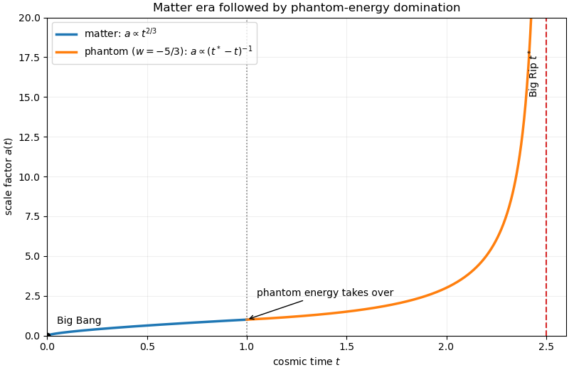

<h1 id="37c/b/ii/solution">Solution</h1>

↑ **Parent:** [Ii](../ii.md)

For example, choose $w=-5/3$. A schematic solution can join the [pressureless matter](../../../../../../../pressureless-matter.md) law $a\propto t^{2/3}$ to the phantom-dominated law $a\propto(t^*-t)^{-1}$. It begins at the [Big Bang](../../../../../../../big-bang.md), bends down during matter domination, changes to accelerated expansion when [phantom energy](../../../../../../../phantom-energy.md) takes over, and has a vertical asymptote at the finite [Big Rip](../../../../../../../big-rip.md) time $t^*$.

**[Figure 1](#37c/b/ii/image-cosmic-expansion-from-the-matter-era-to-phantom-energy-domination). Cosmic expansion from the matter era to phantom-energy domination**.

## ↑ Ancestors (12)

1. [Ii](../ii.md)
2. [B](../../b.md)
3. [37C](../../../37c.md)
4. [Paper 4](../../../../paper-4-split.md)
5. [Ii](../../../../split.md)
6. [2021](../../../../../split.md)
7. [Past exam of the mathematics course of the University of Cambridge](../../../../../../split.md)
8. [Mathematics course of the University of Cambridge](../../../../../../../mathematics-course-of-the-university-of-cambridge.md)
9. [Course of the University of Cambridge](../../../../../../../course-of-the-university-of-cambridge.md)
10. [University of Cambridge](../../../../../../../university-of-cambridge-split.md)
11. [List of universities](../../../../../../../list-of-universities.md)
12. [Codex Wiki](../../../../../../../split.md)
