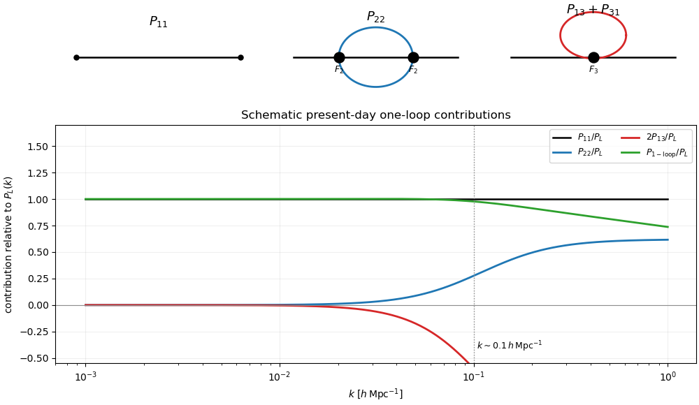

<h1 id="3/b/solution">Solution</h1>

↑ **Parent:** [B](../b.md)

Expand $\delta=\delta^{(1)}+\delta^{(2)}+\delta^{(3)}+\cdots$, where the [standard perturbation theory density kernel](../../../../../../standard-perturbation-theory-density-kernel.md) $F_n$ convolves $n$ linear fields. Through fourth order in the Gaussian linear field, the only power-spectrum diagrams are the tree contraction $P_{11}$, the loop joining two $F_2$ vertices $P_{22}$, and the two orderings that join an $F_3$ vertex to a linear leg, $P_{13}+P_{31}=2P_{13}$. Their expressions are

$$
P_{11}(k)=P_L(k),
$$

$$
P_{22}(k)=2\int\frac{d^3q}{(2\pi)^3}
F_2(\mathbf q,\mathbf k-\mathbf q)^2
P_L(q)P_L(|\mathbf k-\mathbf q|),
$$

$$
2P_{13}(k)=6P_L(k)\int\frac{d^3q}{(2\pi)^3}
F_3(\mathbf k,\mathbf q,-\mathbf q)P_L(q).
$$

**[Figure 1](#3/b/image-one-loop-matter-power-spectrum-diagrams-and-schematic-present-day-contributions). One-loop matter-power-spectrum diagrams and schematic present-day contributions**. The three required contraction topologies are P11, P22, and P13 plus P31. At low wavenumber the one-loop sum approaches the linear spectrum; the loop terms become appreciable around 0.1 inverse megaparsecs times h, and fixed-order perturbation theory eventually fails.

## ↑ Ancestors (11)

1. [B](../b.md)
2. [3](../../3.md)
3. [Paper 312](../../../paper-312-split.md)
4. [Iii](../../../split.md)
5. [2021](../../../../split.md)
6. [Past exam of the mathematics course of the University of Cambridge](../../../../../split.md)
7. [Mathematics course of the University of Cambridge](../../../../../../mathematics-course-of-the-university-of-cambridge.md)
8. [Course of the University of Cambridge](../../../../../../course-of-the-university-of-cambridge.md)
9. [University of Cambridge](../../../../../../university-of-cambridge-split.md)
10. [List of universities](../../../../../../list-of-universities.md)
11. [Codex Wiki](../../../../../../split.md)
