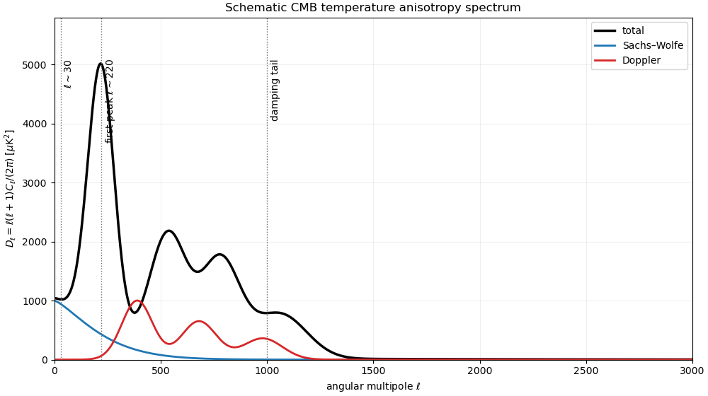

<h1 id="4/c/solution">Solution</h1>

↑ **Parent:** [C](../c.md)

**[Figure 2](#4/c/image-schematic-cosmic-microwave-background-temperature-power-spectrum-and-source-contributions). Schematic cosmic microwave background temperature power spectrum and source contributions**. The Sachs-Wolfe contribution controls the low-multipole plateau, acoustic physics produces the peaks, the Doppler contribution is phase shifted, and photon diffusion suppresses the spectrum in the high-multipole damping tail.

The conventional vertical variable is $D_\ell=\ell(\ell+1)C_\ell/(2\pi)$ in $\mu{\rm K}^2$, plotted against the dimensionless angular multipole $\ell$. The [Sachs-Wolfe effect](../../../../../../sachs-wolfe-effect.md) supplies a nearly flat large-angle plateau for $\ell\lesssim30$. The total spectrum has its first acoustic peak near $\ell\simeq220$ with $D_\ell$ of order $5\times10^3\,\mu{\rm K}^2$, followed by further [Cosmic microwave background acoustic peaks](../../../../../../cosmic-microwave-background-acoustic-peak.md); the [Doppler CMB anisotropy](../../../../../../doppler-cmb-anisotropy.md) is phase shifted relative to the photon-density oscillation. At $\ell\gtrsim1000$, [Cosmic microwave background diffusion damping](../../../../../../cosmic-microwave-background-diffusion-damping.md) lets photons random-walk across perturbations during recombination and produces the rapidly falling damping tail.

## ↑ Ancestors (11)

1. [C](../c.md)
2. [4](../../4.md)
3. [Paper 312](../../../paper-312-split.md)
4. [Iii](../../../split.md)
5. [2021](../../../../split.md)
6. [Past exam of the mathematics course of the University of Cambridge](../../../../../split.md)
7. [Mathematics course of the University of Cambridge](../../../../../../mathematics-course-of-the-university-of-cambridge.md)
8. [Course of the University of Cambridge](../../../../../../course-of-the-university-of-cambridge.md)
9. [University of Cambridge](../../../../../../university-of-cambridge-split.md)
10. [List of universities](../../../../../../list-of-universities.md)
11. [Codex Wiki](../../../../../../split.md)
