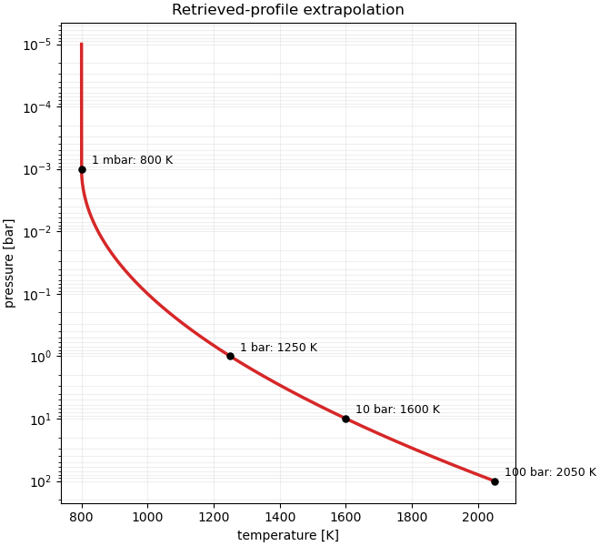
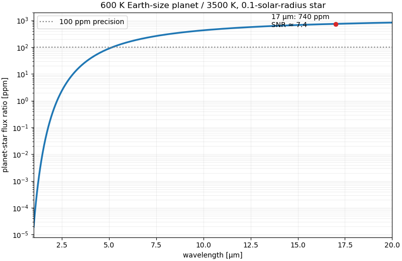

# Paper 315

↑ **Parent:** [Iii](../iii.md)

[https://www.maths.cam.ac.uk/postgrad/part-iii/files/pastpapers/2021/paper_315.pdf](https://www.maths.cam.ac.uk/postgrad/part-iii/files/pastpapers/2021/paper_315.pdf)

**Table of contents**

- [1](#1)
  - [a](#1/a)
    - [Solution](#1/a/solution)
  - [b](#1/b)
    - [Solution](#1/b/solution)
  - [c](#1/c)
    - [Solution](#1/c/solution)
  - [d](#1/d)
    - [Solution](#1/d/solution)
- [2](#2)
  - [a](#2/a)
    - [Solution](#2/a/solution)
  - [b](#2/b)
    - [Solution](#2/b/solution)
  - [c](#2/c)
    - [Solution](#2/c/solution)
  - [d](#2/d)
    - [Solution](#2/d/solution)
  - [e](#2/e)
    - [Solution](#2/e/solution)
- [3](#3)
  - [a](#3/a)
    - [Solution](#3/a/solution)
  - [b](#3/b)
    - [Solution](#3/b/solution)
- [4](#4)
  - [a](#4/a)
    - [Solution](#4/a/solution)
  - [b](#4/b)
    - [Solution](#4/b/solution)
  - [c](#4/c)
    - [Solution](#4/c/solution)
  - [d](#4/d)
    - [Solution](#4/d/solution)
  - [e](#4/e)
    - [Solution](#4/e/solution)

## 1

↑ **Parent:** [Paper 315](paper-315.md)

<h3 id="1/a">a</h3>

↑ **Parent:** [1](#1)

<h4 id="1/a/solution">Solution</h4>

↑ **Parent:** [A](#1/a)

Interpret every logarithm in the empirical profile as base ten with the dimensionless argument $P/(1\ {\rm mbar})$. Put

$$
x=\log_{10}\frac{P}{1\ {\rm mbar}}.
$$

The upper atmosphere has $T=800\ {\rm K}$ for $x\leq0$, while integration of $dT/d\log_{10}P=Ax$ below it gives

$$
T(P)=800\ {\rm K}+\frac A2x^2.
$$

Assume that the stated $1250\ {\rm K}$ [planetary equilibrium temperature](../../../exoplanet.md#planetary-equilibrium-temperature) is a reasonable [brightness temperature](../../../exoplanet.md#brightness-temperature) at the $1\ {\rm bar}=10^3\ {\rm mbar}$ photosphere. Then

$$
1250=800+\frac A2(3)^2,
\qquad
\boxed{A\simeq100\ {\rm K\,dex^{-2}}}.
$$

At $10\ {\rm bar}$, $x=4$, and therefore

$$
\boxed{T(10\ {\rm bar})\simeq800+50(4)^2=1600\ {\rm K}}.
$$

This estimate neglects day-night variation, wavelength-dependent photospheric pressure, and a possible [radiative-convective boundary](../../../exoplanet.md#radiative-convective-boundary); it treats the retrieved profile as representative of the dayside disk.

**[Figure 1](#1/a/image-plausible-pressure-temperature-profile-for-the-hot-jupiter). Plausible pressure-temperature profile for the hot Jupiter**. The profile is isothermal above one millibar and follows the integrated quadratic logarithmic-pressure law below it, calibrated to 1250 kelvin at one bar.

<h3 id="1/b">b</h3>

↑ **Parent:** [1](#1)

<h4 id="1/b/solution">Solution</h4>

↑ **Parent:** [B](#1/b)

In a thin atmosphere in [hydrostatic equilibrium](../../../statistical-physics.md#hydrostatic-equilibrium), take gravity $g$ and mean molecular mass $\mu m_H$ as constant. The [ideal gas](../../../thermodynamics.md#ideal-gas) equation of state and hydrostatic balance give

$$
\frac{dP}{dz}=-\rho g
=-\frac{\mu m_Hg}{k_BT}P.
$$

For $P>1\ {\rm mbar}$,

$$
\frac{dT}{dP}=\frac{Ax}{P\ln10},
$$

so the [atmospheric lapse rate](../../../exoplanet.md#lapse-rate-atmosphere) follows from the chain rule:

$$
\boxed{\frac{dT}{dz}
=-\frac{A\mu m_Hg}{k_BT\ln10}
\log_{10}\frac{P}{1\ {\rm mbar}}}.
$$

It vanishes in the assumed isothermal region above $1\ {\rm mbar}$. If natural logarithms are used instead, the factor $\ln10$ is absent and the fitted numerical value of $A$ changes accordingly.

<h3 id="1/c">c</h3>

↑ **Parent:** [1](#1)

<h4 id="1/c/solution">Solution</h4>

↑ **Parent:** [C](#1/c)

Assume that both objects emit as [blackbodies](../../../astrophysics.md#blackbody), take $T_*=5778\ {\rm K}$ and $R_p/R_*\simeq R_J/R_\odot=0.100$, and use $T_p=1250\ {\rm K}$ because the line-free window sees the $1$-bar continuum photosphere. Across a narrow bin, the [thermal eclipse depth](../../../exoplanet.md#thermal-eclipse-depth) is

$$
\frac{F_p}{F_*}\simeq
\left(\frac{R_p}{R_*}\right)^2
\frac{B_\lambda(T_p)}{B_\lambda(T_*)}
=\left(\frac{R_p}{R_*}\right)^2
\frac{e^{hc/(\lambda k_BT_*)}-1}
{e^{hc/(\lambda k_BT_p)}-1}.
$$

At $\lambda=17\,\mu{\rm m}$ this gives

$$
\boxed{\frac{F_p}{F_*}\simeq1.64\times10^{-3}
\simeq1640\ {\rm ppm}}.
$$

Integrating the [Planck law](../../../statistical-physics.md#planck-s-law) over the full $1\,\mu{\rm m}$ bin changes this narrow-bin estimate only slightly.

<h3 id="1/d">d</h3>

↑ **Parent:** [1](#1)

<h4 id="1/d/solution">Solution</h4>

↑ **Parent:** [D](#1/d)

For $R_p=R_\oplus$, $R_*=0.1R_\odot$, $T_p=600\ {\rm K}$, and $T_*=3500\ {\rm K}$, the same [thermal eclipse depth](../../../exoplanet.md#thermal-eclipse-depth) at $17\,\mu{\rm m}$ is

$$
\frac{F_p}{F_*}
=\left(\frac{R_\oplus}{0.1R_\odot}\right)^2
\frac{e^{hc/(17\mu{\rm m}\,k_B3500{\rm K})}-1}
{e^{hc/(17\mu{\rm m}\,k_B600{\rm K})}-1}
\simeq7.40\times10^{-4}.
$$

Thus a $100\ {\rm ppm}$ uncertainty gives

$$
\boxed{{\rm SNR}\simeq\frac{740\ {\rm ppm}}{100\ {\rm ppm}}\simeq7.4}.
$$

This assumes one independent eclipse measurement with that precision, negligible reflected light in the infrared, no atmosphere, and blackbody emission from the bare surface.

**[Figure 2](#1/d/image-blackbody-secondary-eclipse-spectrum-of-a-600-kelvin-earth-size-planet-around-the-stated-m-dwarf). Blackbody secondary-eclipse spectrum of a 600-kelvin Earth-size planet around the stated M dwarf**. The planet-star ratio is extremely small on the Wien tail at short wavelength and rises toward about 740 parts per million at 17 micrometres.

## 2

↑ **Parent:** [Paper 315](paper-315.md)

<h3 id="2/a">a</h3>

↑ **Parent:** [2](#2)

<h4 id="2/a/solution">Solution</h4>

↑ **Parent:** [A](#2/a)

Let $R_1$ be the core radius and $R_p$ the planetary radius. For the [two-layer constant-density planet](../../../exoplanet.md#two-layer-constant-density-planet),

$$
\boxed{R_1=\left(\frac{3M_1}{4\pi\rho_1}\right)^{1/3}},
$$

and the mantle volume gives

$$
\boxed{R_p=\left[R_1^3+
\frac{3(M_p-M_1)}{4\pi\rho_2}\right]^{1/3}}.
$$

The enclosed mass profile is

$$
\boxed{M(r)=
\begin{cases}
\dfrac{4\pi}{3}\rho_1r^3,&0\leq r\leq R_1,\\[6pt]
M_1+\dfrac{4\pi}{3}\rho_2(r^3-R_1^3),
&R_1\leq r\leq R_p.
\end{cases}}
$$

<h3 id="2/b">b</h3>

↑ **Parent:** [2](#2)

<h4 id="2/b/solution">Solution</h4>

↑ **Parent:** [B](#2/b)

Assume Newtonian spherical [hydrostatic equilibrium](../../../statistical-physics.md#hydrostatic-equilibrium), neglect rotation and thermal density changes, and require continuous pressure at the layer boundary. Write

$$
C=M_1-\frac{4\pi}{3}\rho_2R_1^3,
\qquad
D=\frac{4\pi}{3}\rho_2,
$$

so the mantle mass profile is $M(r)=C+Dr^3$. Integrating $dP/dr=-G\rho_2M(r)/r^2$ inward from $P(R_p)=P_0$ gives the boundary pressure

$$
\boxed{P_b=P_0+G\rho_2\left[
C\left(\frac1{R_1}-\frac1{R_p}\right)
+\frac D2(R_p^2-R_1^2)
\right]}.
$$

<h3 id="2/c">c</h3>

↑ **Parent:** [2](#2)

<h4 id="2/c/solution">Solution</h4>

↑ **Parent:** [C](#2/c)

At a mantle radius $R_1\leq r\leq R_p$, the same integration gives

$$
\boxed{P(r)=P_0+G\rho_2\left[
C\left(\frac1r-\frac1{R_p}\right)
+\frac D2(R_p^2-r^2)
\right]}.
$$

Inside the core, $M(r)=4\pi\rho_1r^3/3$, so matching to $P_b$ gives

$$
\boxed{P(r)=P_b+\frac{2\pi G}{3}\rho_1^2(R_1^2-r^2),
\qquad0\leq r\leq R_1}.
$$

The central pressure is therefore

$$
\boxed{P_c=P_b+\frac{2\pi G}{3}\rho_1^2R_1^2}.
$$

<h3 id="2/d">d</h3>

↑ **Parent:** [2](#2)

<h4 id="2/d/solution">Solution</h4>

↑ **Parent:** [D](#2/d)

For a geometrically thin isothermal ideal-gas atmosphere, set $g=GM_p/R_p^2$ and

$$
H=\frac{k_BT_0}{\mu m_Hg}.
$$

Hydrostatic balance gives $P(z)=P_0e^{-z/H}$. The observed transit photosphere at $P_{\rm phot}$ is consequently at the [isothermal pressure-level transit radius](../../../exoplanet.md#isothermal-pressure-level-transit-radius)

$$
\boxed{R_{\rm obs}=R_p+H\ln\frac{P_0}{P_{\rm phot}}}.
$$

This assumes $P_{\rm phot}<P_0$, constant $T_0$, composition, and gravity, and an opacity that selects the stated pressure.

<h3 id="2/e">e</h3>

↑ **Parent:** [2](#2)

<h4 id="2/e/solution">Solution</h4>

↑ **Parent:** [E](#2/e)

Hydrostatic balance makes the atmospheric column mass $(P_0-P_{\rm top})/g$. Multiplying by the surface area gives the [mass of a thin hydrostatic atmosphere](../../../exoplanet.md#mass-of-a-thin-hydrostatic-atmosphere)

$$
\boxed{M_{\rm atm}\simeq
\frac{4\pi R_p^2(P_0-P_{\rm top})}{g}
\simeq\frac{4\pi R_p^4P_0}{GM_p}},
$$

where the second expression neglects the top pressure and atmospheric self-gravity.

## 3

↑ **Parent:** [Paper 315](paper-315.md)

<h3 id="3/a">a</h3>

↑ **Parent:** [3](#3)

<h4 id="3/a/solution">Solution</h4>

↑ **Parent:** [A](#3/a)

For a plane-parallel atmosphere with optical depth increasing downward, the [radiative transfer equation](../../../astrophysics.md#radiative-transfer-equation) is

$$
\mu\frac{dI_\nu}{d\tau_\nu}=I_\nu-S_\nu.
$$

Integrating over solid angle gives the first [radiation-field moment](../../../astrophysics.md#radiation-field-moment)

$$
\frac{dF_\nu}{d\tau_\nu}=4\pi(J_\nu-S_\nu).
$$

In [radiative equilibrium](../../../thermodynamics.md#radiative-equilibrium), matter has no net local radiative heating, so the opacity-weighted frequency integral of $J_\nu-S_\nu$ vanishes. After converting each optical-depth derivative to physical depth and integrating over frequency,

$$
\boxed{\frac{dF}{dz}=0}.
$$

Thus the bolometric internal flux is constant with depth, as stated by [constant flux in a plane-parallel radiative-equilibrium atmosphere](../../../astrophysics.md#constant-flux-in-a-plane-parallel-radiative-equilibrium-atmosphere).

In local thermal equilibrium $S_\nu=B_\nu(T)$. Define the planet's [internal effective temperature of a planet](../../../exoplanet.md#internal-effective-temperature-of-a-planet) by the constant outward flux. The standard [Planck law](../../../statistical-physics.md#planck-s-law) integral gives

$$
\boxed{F_{\rm int}=\pi\int_0^\infty B_\nu(T_{\rm eff})\,d\nu
=\sigma T_{\rm eff}^4}.
$$

The corresponding intrinsic luminosity is $L_{\rm int}=4\pi R_p^2\sigma T_{\rm eff}^4$.

<h3 id="3/b">b</h3>

↑ **Parent:** [3](#3)

<h4 id="3/b/solution">Solution</h4>

↑ **Parent:** [B](#3/b)

Let the atmosphere occupy a thin annulus from $R_p$ to $R_a=R_p+\Delta R$. With mass extinction coefficient $k_\nu$, constant density $\rho$, and the assumed common chord length $l$, its [optical depth](../../../astrophysics.md#optical-depth) is

$$
\tau_\nu=k_\nu\rho l.
$$

The opaque solid planet removes area $\pi R_p^2$, while the annulus removes the fraction $1-e^{-\tau_\nu}$ of the incident [specific intensity](../../../astrophysics.md#specific-intensity). Neglecting limb darkening, the [exoplanet transmission spectrum](../../../exoplanet.md#exoplanet-transmission-spectrum) is therefore

$$
\boxed{D_\nu\equiv1-\frac{F_\nu^{\rm in}}{F_\nu^{\rm out}}
=\frac{R_p^2+(R_a^2-R_p^2)(1-e^{-k_\nu\rho l})}{R_s^2}}.
$$

For a thin annulus,

$$
D_\nu\simeq\left(\frac{R_p}{R_s}\right)^2
+\frac{2R_p\Delta R}{R_s^2}(1-e^{-k_\nu\rho l}).
$$

If the geometrical thickness is estimated as $\Delta R=N_HH$, then the [atmospheric scale height](../../../exoplanet.md#atmospheric-scale-height) is $H=k_BT_p/(\mu m_HGM_p/R_p^2)$. A wavelength-independent $k_\nu$ makes this idealized spectrum flat; real molecular opacities create its features.

## 4

↑ **Parent:** [Paper 315](paper-315.md)

<h3 id="4/a">a</h3>

↑ **Parent:** [4](#4)

<h4 id="4/a/solution">Solution</h4>

↑ **Parent:** [A](#4/a)

Let the stellar radius and temperature be $R_*$ and $T_*$. Assume [Bond albedo](../../../exoplanet.md#bond-albedo) $A_B$, isotropic stellar emission, blackbody planetary emission, and complete redistribution over the tidally locked planet. The absorbed stellar power is

$$
P_{\rm abs}=\pi R_p^2(1-A_B)\sigma T_*^4
\left(\frac{R_*}{a}\right)^2.
$$

Adding the isolated internal luminosity $4\pi R_p^2\sigma T_0^4$ and balancing the total against $4\pi R_p^2\sigma T_{\rm eq}^4$ gives the [planetary equilibrium temperature](../../../exoplanet.md#planetary-equilibrium-temperature)

$$
\boxed{T_{\rm eq}^4=T_0^4
+(1-A_B)T_*^4\frac{R_*^2}{4a^2}}.
$$

If heat is reradiated uniformly only over the dayside, replace the denominator $4a^2$ by $2a^2$. The latter is often more plausible for inefficient redistribution on a tidally locked bare planet.

<h3 id="4/b">b</h3>

↑ **Parent:** [4](#4)

<h4 id="4/b/solution">Solution</h4>

↑ **Parent:** [B](#4/b)

Use a [single-layer greenhouse model](../../../exoplanet.md#single-layer-greenhouse-model) whose atmosphere is transparent to incident stellar light and has infrared emissivity $\epsilon$. Let $T_s$ and $T_a$ be the surface and atmospheric temperatures. Atmospheric balance gives

$$
\epsilon\sigma T_s^4=2\epsilon\sigma T_a^4,
\qquad
T_a^4=\frac12T_s^4.
$$

At the top of the atmosphere, the escaping flux is the directly transmitted surface radiation plus upward atmospheric emission:

$$
\sigma T_{\rm eq}^4=(1-\epsilon)\sigma T_s^4
+\epsilon\sigma T_a^4.
$$

Therefore

$$
\boxed{T_s=\frac{T_{\rm eq}}{(1-\epsilon/2)^{1/4}}}.
$$

For a perfectly infrared-opaque one-layer atmosphere, $T_s=2^{1/4}T_{\rm eq}$; for $\epsilon=0$, $T_s=T_{\rm eq}$.

<h3 id="4/c">c</h3>

↑ **Parent:** [4](#4)

<h4 id="4/c/solution">Solution</h4>

↑ **Parent:** [C](#4/c)

In vacuum, a narrow ray bundle conserves both power and geometrical etendue $dA\cos\theta\,d\Omega$. Their ratio, the [specific intensity](../../../astrophysics.md#specific-intensity), is therefore independent of source-receiver distance. Equivalently, geometric dilution reduces received power and apparent solid angle by the same inverse-square factor.

For an isotropically emitting isothermal blackbody atmosphere, the outward surface flux is

$$
F=\int_{\rm hemisphere}B(T)\cos\theta\,d\Omega
=\pi B(T)=\sigma T^4,
$$

where the last equality is bolometric. Multiplication by the emitting area gives the [luminosity of a spherical blackbody](../../../astrophysics.md#luminosity-of-a-spherical-blackbody)

$$
\boxed{L_p=4\pi R_p^2\sigma T^4}.
$$

<h3 id="4/d">d</h3>

↑ **Parent:** [4](#4)

<h4 id="4/d/solution">Solution</h4>

↑ **Parent:** [D](#4/d)

At a molecular line, the large opacity moves the optical-depth-one surface to lower pressure and higher altitude than the neighboring continuum. The [Eddington-Barbier relation](../../../astrophysics.md#eddington-barbier-relation) makes the emergent intensity approximately the [Planck function](../../../astrophysics.md#planck-function) at that layer. In an ordinary outward-cooling atmosphere, the line-forming layer is cooler and the feature is in absorption. In an [atmospheric thermal inversion](../../../exoplanet.md#inversion-meteorology), it is hotter, so the [spectral-line emission from an atmospheric thermal inversion](../../../exoplanet.md#spectral-line-emission-from-an-atmospheric-thermal-inversion) exceeds the continuum brightness and the feature appears in emission.

Factors that can create or suppress inversions include the abundance of high-altitude optical absorbers such as TiO, VO, or atomic metals; the host star's irradiation level and spectral energy distribution; and clouds, hazes, composition, and day-night circulation, all of which alter where stellar and thermal radiation are absorbed.

<h3 id="4/e">e</h3>

↑ **Parent:** [4](#4)

<h4 id="4/e/solution">Solution</h4>

↑ **Parent:** [E](#4/e)

At fixed temperature and pressure, a closed reacting system is in [thermochemical equilibrium](../../../thermodynamics.md#thermochemical-equilibrium) when its [Gibbs free energy](../../../thermodynamics.md#gibbs-free-energy) is minimal subject to elemental-abundance constraints. For every independent reaction,

$$
\boxed{\Delta_rG=\sum_i\nu_i\mu_i=0},
$$

with a positive second variation in every allowed direction.

An atmosphere can be driven into [disequilibrium chemistry in an exoplanet atmosphere](../../../exoplanet.md#disequilibrium-chemistry-in-an-exoplanet-atmosphere) by vertical mixing faster than chemical conversion, which causes chemical quenching; ultraviolet [atmospheric photochemistry](../../../exoplanet.md#atmospheric-photochemistry); and atmospheric escape. Lightning, energetic particles, horizontal transport, condensation, and rainout provide further mechanisms.

## ↑ Ancestors (8)

1. [Iii](../iii.md)
2. [2021](../../2021.md)
3. [Past exam of the mathematics course of the University of Cambridge](../../../past-exam-of-the-mathematics-course-of-the-university-of-cambridge.md)
4. [Mathematics course of the University of Cambridge](../../../university-of-cambridge.md#mathematics-course-of-the-university-of-cambridge)
5. [Course of the University of Cambridge](../../../university-of-cambridge.md#course-of-the-university-of-cambridge)
6. [University of Cambridge](../../../university-of-cambridge.md)
7. [List of universities](../../../README.md#list-of-universities)
8. [Codex Wiki](../../../README.md)
