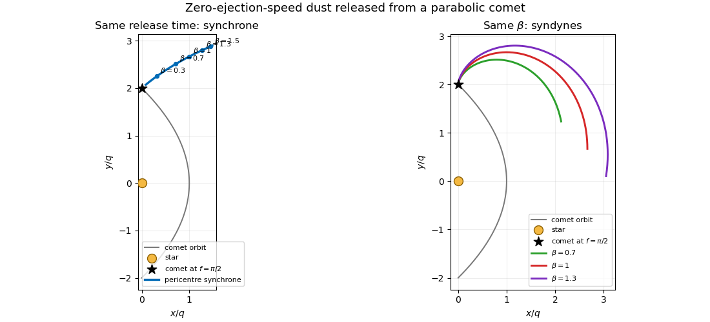

<h1 id="3/v/solution">Solution</h1>

↑ **Parent:** [V](../v.md)

At [periapsis](../../../../../../periapsis.md) the release velocity is tangential. A grain with $\beta=1$ feels no net stellar inverse-square force and therefore moves on the tangent line. A grain with $\beta<1$ retains an inward acceleration and bends toward the star; a grain with $\beta>1$ feels a net outward acceleration and bends away from it. At the common observation time, joining these positions in increasing $\beta$ gives the [synchrone](../../../../../../synchrone.md) shown below. It starts near the low-$\beta$ orbital trajectory, passes through the force-free $\beta=1$ position, and extends outward through the repelled high-$\beta$ grains.

**[Figure 1](#3/v/image-synchrones-and-syndynes-for-zero-speed-dust-release-from-a-parabolic-comet). Synchrones and syndynes for zero-speed dust release from a parabolic comet**. The left panel joins grains released together at pericentre with different radiation-pressure coefficients. The right panel joins grains of one coefficient released at different comet true anomalies.

## ↑ Ancestors (11)

1. [V](../v.md)
2. [3](../../3.md)
3. [Paper 316](../../../paper-316-split.md)
4. [Iii](../../../split.md)
5. [2021](../../../../split.md)
6. [Past exam of the mathematics course of the University of Cambridge](../../../../../split.md)
7. [Mathematics course of the University of Cambridge](../../../../../../mathematics-course-of-the-university-of-cambridge.md)
8. [Course of the University of Cambridge](../../../../../../course-of-the-university-of-cambridge.md)
9. [University of Cambridge](../../../../../../university-of-cambridge-split.md)
10. [List of universities](../../../../../../list-of-universities.md)
11. [Codex Wiki](../../../../../../split.md)
