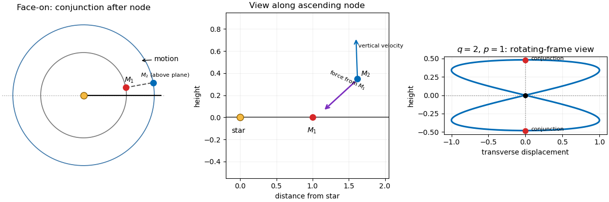

<h1 id="4/v/solution">Solution</h1>

↑ **Parent:** [V](../v.md)

Just after $M_2$ crosses its [ascending node](../../../../../../ascending-node.md), it lies above the nearly fixed orbital plane of $M_1$. At a nearby conjunction, $M_1$ is inward of $M_2$, because $r_1<r_2$. The perturbing acceleration toward $M_1$ therefore has an inward component and a downward normal component. In the view along the node toward the star, the downward component opposes $M_2$'s upward vertical velocity and reduces its [orbital inclination](../../../../../../orbital-inclination.md); in the face-on view, the inward component perturbs its orbital energy and shifts the conjunction phase. A conjunction before the ascending node reverses the relation between the normal force and vertical velocity. Repeated phase-correlated impulses therefore provide the restoring dynamics of an [inclination-type mean-motion resonance](../../../../../../inclination-type-mean-motion-resonance.md).

**[Figure 2](#4/v/image-geometry-of-the-inclination-type-resonance). Geometry of the inclination-type resonance**. The first two panels show a conjunction just after the outer body crosses its ascending node. The third shows the representative figure-eight projection of the q equals two resonant orbit for p equals one in the frame rotating with the inner body.

## ↑ Ancestors (11)

1. [V](../v.md)
2. [4](../../4.md)
3. [Paper 316](../../../paper-316-split.md)
4. [Iii](../../../split.md)
5. [2021](../../../../split.md)
6. [Past exam of the mathematics course of the University of Cambridge](../../../../../split.md)
7. [Mathematics course of the University of Cambridge](../../../../../../mathematics-course-of-the-university-of-cambridge.md)
8. [Course of the University of Cambridge](../../../../../../course-of-the-university-of-cambridge.md)
9. [University of Cambridge](../../../../../../university-of-cambridge-split.md)
10. [List of universities](../../../../../../list-of-universities.md)
11. [Codex Wiki](../../../../../../split.md)
