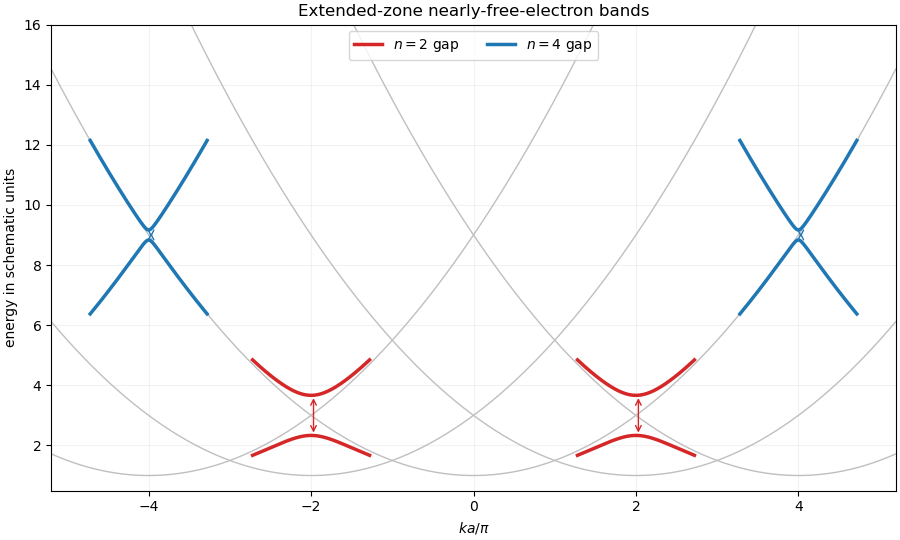

<h1 id="36d/solution">Solution</h1>

↑ **Parent:** [36D](../36d.md)

Let $G_n=2\pi n/a$. The free states $|k\rangle$ and $|k-G_n\rangle$ are degenerate at the Bragg point $k=G_n/2=n\pi/a$. Since

$$
\langle k|V|k-G_n\rangle=V_n,
$$

[degenerate perturbation theory](../../../../../degenerate-perturbation-theory.md) restricts the Hamiltonian near this crossing to

$$
\begin{pmatrix}
\hbar^2k^2/(2m)+V_0&V_n\\
V_n^*&\hbar^2(k-G_n)^2/(2m)+V_0
\end{pmatrix}.
$$

Writing $k=n\pi/a+\kappa$ and diagonalizing gives the [nearly-free electron dispersion near a one-dimensional band gap](../../../../../nearly-free-electron-dispersion-near-a-one-dimensional-band-gap.md)

$$
\boxed{
E_\pm(k)=V_0+\frac{\hbar^2}{2m}
\left[\left(\frac{n\pi}{a}\right)^2+\kappa^2\right]
\pm\sqrt{
\left(\frac{\hbar^2n\pi\kappa}{ma}\right)^2+|V_n|^2}}.
$$

Thus the two continuous [bands](../../../../../energy-band.md) avoid crossing, and at $\kappa=0$ their separation is

$$
\boxed{\Delta E_n=2|V_n|}.
$$

This is the [nearly-free electron model](../../../../../nearly-free-electron-model.md). The [dispersion relation](../../../../../dispersion-relation.md) is the relation $E=E(k)$ between energy and Bloch wavevector.

For the specified potential,

$$
\frac83V_0\cos^4\left(\frac{2\pi x}{a}\right)
=V_0+\frac43V_0\cos\left(\frac{4\pi x}{a}\right)
+\frac13V_0\cos\left(\frac{8\pi x}{a}\right).
$$

Hence

$$
V_{\pm2}=\frac23V_0,\qquad
V_{\pm4}=\frac16V_0,
$$

and all other nonconstant Fourier coefficients vanish. The gaps are therefore

$$
\begin{array}{c|c|c}
n&\text{crossing wavevectors}&\text{gap width}\\ \hline
2&k=\pm 2\pi/a&4|V_0|/3\\
4&k=\pm 4\pi/a&|V_0|/3.
\end{array}
$$

Their centre energies are respectively

$$
V_0+\frac{2\hbar^2\pi^2}{ma^2},
\qquad
V_0+\frac{8\hbar^2\pi^2}{ma^2}.
$$

The extended-zone sketch consists of the free-particle parabolas shifted upward by $V_0$, with [avoided crossings](../../../../../avoided-crossing.md) of these two widths at the listed [Bragg points](../../../../../bragg-point.md); elsewhere they meet to this order because the corresponding [Fourier coefficients](../../../../../fourier-coefficient.md) vanish.

**[Figure 1](#36d/image-extended-zone-nearly-free-electron-bands-and-their-two-nonzero-gaps). Extended-zone nearly-free-electron bands and their two nonzero gaps**. Gray curves are the intersecting free-electron parabolas. Colored avoided crossings show the larger n equals 2 gap at ka over pi equals plus or minus 2 and the smaller n equals 4 gap at plus or minus 4.

## ↑ Ancestors (10)

1. [36D](../36d.md)
2. [Paper 2](../../paper-2-split.md)
3. [Ii](../../split.md)
4. [2022](../../../split.md)
5. [Past exam of the mathematics course of the University of Cambridge](../../../../split.md)
6. [Mathematics course of the University of Cambridge](../../../../../mathematics-course-of-the-university-of-cambridge.md)
7. [Course of the University of Cambridge](../../../../../course-of-the-university-of-cambridge.md)
8. [University of Cambridge](../../../../../university-of-cambridge-split.md)
9. [List of universities](../../../../../list-of-universities.md)
10. [Codex Wiki](../../../../../split.md)
