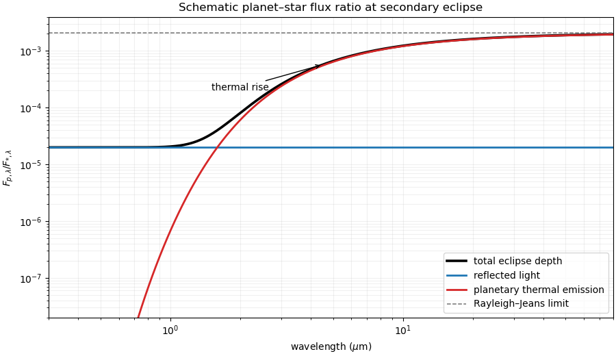

<h1 id="2/c/solution">Solution</h1>

↑ **Parent:** [C](../c.md)

At [exoplanet secondary eclipse](../../../../../../exoplanet-secondary-eclipse.md), the full-phase planet-star flux ratio is the sum of reflected and thermal light. Approximating both bodies as unresolved blackbodies and taking wavelength-independent [geometric albedo](../../../../../../geometric-albedo.md),

$$
\boxed{
\frac{F_{p,\lambda}}{F_{*,\lambda}}
=A_g\left(\frac{R_p}{a}\right)^2
+\left(\frac{R_p}{R_*}\right)^2
\frac{B_\lambda(T_p)}{B_\lambda(T_*)}}.
$$

The first term is a flat reflected-light level under the stated constant-albedo assumption. At short wavelength the cool planet lies in the [Wien limit](../../../../../../wien-approximation.md), so thermal emission is exponentially suppressed and reflection dominates. At long wavelength both spectra enter the [Rayleigh-Jeans law](../../../../../../rayleigh-jeans-law.md), giving

$$
\frac{F_{p,\lambda}}{F_{*,\lambda}}
\longrightarrow A_g\left(\frac{R_p}{a}\right)^2
+\left(\frac{R_p}{R_*}\right)^2\frac{T_p}{T_*}.
$$

The sketch therefore starts on the reflected plateau, rises where planetary [blackbody radiation](../../../../../../black-body-radiation.md) becomes important, and asymptotically approaches the long-wavelength plateau. This neglects spectral albedo features, phase dependence, stellar lines, and a nonisothermal planetary photosphere.

**[Figure 1](#2/c/image-schematic-wavelength-dependence-of-a-planet-star-flux-ratio-at-secondary-eclipse). Schematic wavelength dependence of a planet-star flux ratio at secondary eclipse**. Reflected light sets a short-wavelength plateau, planetary blackbody emission produces a thermal rise, and the sum approaches its Rayleigh--Jeans plateau at long wavelength. The temperatures and radii are illustrative rather than a fit to a particular planet.

## ↑ Ancestors (11)

1. [C](../c.md)
2. [2](../../2.md)
3. [Paper 315](../../../paper-315-split.md)
4. [Iii](../../../split.md)
5. [2022](../../../../split.md)
6. [Past exam of the mathematics course of the University of Cambridge](../../../../../split.md)
7. [Mathematics course of the University of Cambridge](../../../../../../mathematics-course-of-the-university-of-cambridge.md)
8. [Course of the University of Cambridge](../../../../../../course-of-the-university-of-cambridge.md)
9. [University of Cambridge](../../../../../../university-of-cambridge-split.md)
10. [List of universities](../../../../../../list-of-universities.md)
11. [Codex Wiki](../../../../../../split.md)
