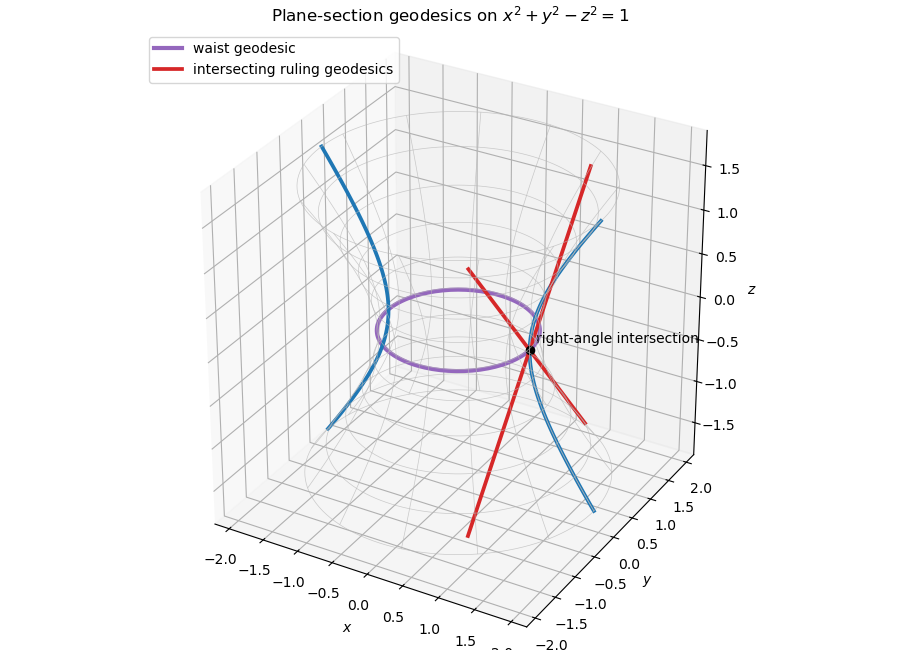

# Paper 3

↑ **Parent:** [Ib](../ib.md)

[https://www.maths.cam.ac.uk/undergrad/pastpapers/files/2023/paperib_3_2023.pdf](https://www.maths.cam.ac.uk/undergrad/pastpapers/files/2023/paperib_3_2023.pdf)

**Table of contents**

- [1E](#1e)
  - [Solution](#1e/solution)
- [2E](#2e)
  - [Solution](#2e/solution)
- [3B](#3b)
  - [a](#3b/a)
    - [Solution](#3b/a/solution)
  - [b](#3b/b)
    - [Solution](#3b/b/solution)
- [4C](#4c)
  - [Solution](#4c/solution)
- [5A](#5a)
  - [Solution](#5a/solution)
- [6D](#6d)
  - [a](#6d/a)
    - [Solution](#6d/a/solution)
  - [b](#6d/b)
    - [Solution](#6d/b/solution)
  - [c](#6d/c)
    - [Solution](#6d/c/solution)
- [7C](#7c)
  - [Solution](#7c/solution)
- [8H](#8h)
  - [a](#8h/a)
    - [Solution](#8h/a/solution)
  - [b](#8h/b)
    - [Solution](#8h/b/solution)
  - [c](#8h/c)
    - [Solution](#8h/c/solution)
- [9F](#9f)
  - [Solution](#9f/solution)
- [10E](#10e)
  - [a](#10e/a)
    - [i](#10e/a/i)
      - [Solution](#10e/a/i/solution)
    - [ii](#10e/a/ii)
      - [Solution](#10e/a/ii/solution)
    - [Solution](#10e/a/solution)
  - [b](#10e/b)
    - [Solution](#10e/b/solution)
- [11G](#11g)
  - [Solution](#11g/solution)
- [12E](#12e)
  - [Solution](#12e/solution)
  - [i](#12e/i)
    - [Solution](#12e/i/solution)
  - [ii](#12e/ii)
    - [Solution](#12e/ii/solution)
  - [iii](#12e/iii)
    - [Solution](#12e/iii/solution)
- [13G](#13g)
  - [Solution](#13g/solution)
- [14A](#14a)
  - [a](#14a/a)
    - [Solution](#14a/a/solution)
  - [b](#14a/b)
    - [Solution](#14a/b/solution)
  - [c](#14a/c)
    - [Solution](#14a/c/solution)
  - [d](#14a/d)
    - [Solution](#14a/d/solution)
  - [e](#14a/e)
    - [Solution](#14a/e/solution)
- [15D](#15d)
  - [a](#15d/a)
    - [Solution](#15d/a/solution)
  - [b](#15d/b)
    - [Solution](#15d/b/solution)
  - [c](#15d/c)
    - [Solution](#15d/c/solution)
  - [d](#15d/d)
    - [Solution](#15d/d/solution)
- [16C](#16c)
  - [a](#16c/a)
    - [Solution](#16c/a/solution)
  - [b](#16c/b)
    - [i](#16c/b/i)
      - [Solution](#16c/b/i/solution)
    - [ii](#16c/b/ii)
      - [Solution](#16c/b/ii/solution)
    - [iii](#16c/b/iii)
      - [Solution](#16c/b/iii/solution)
    - [iv](#16c/b/iv)
      - [Solution](#16c/b/iv/solution)
    - [v](#16c/b/v)
      - [Solution](#16c/b/v/solution)
- [17B](#17b)
  - [a](#17b/a)
    - [Solution](#17b/a/solution)
  - [b](#17b/b)
    - [Solution](#17b/b/solution)
  - [c](#17b/c)
    - [Solution](#17b/c/solution)
  - [d](#17b/d)
    - [Solution](#17b/d/solution)
- [18H](#18h)
  - [a](#18h/a)
    - [Solution](#18h/a/solution)
  - [b](#18h/b)
    - [i](#18h/b/i)
      - [Solution](#18h/b/i/solution)
    - [ii](#18h/b/ii)
      - [Solution](#18h/b/ii/solution)
- [19H](#19h)
  - [a](#19h/a)
    - [Solution](#19h/a/solution)
  - [b](#19h/b)
    - [Solution](#19h/b/solution)
  - [c](#19h/c)
    - [Solution](#19h/c/solution)
  - [d](#19h/d)
    - [Solution](#19h/d/solution)

## 1E

↑ **Parent:** [Paper 3](paper-3.md)

<h3 id="1e/solution">Solution</h3>

↑ **Parent:** [1E](#1e)

For

$$
A=\begin{pmatrix}a&b\\c&d\end{pmatrix}\in GL_2(F),
$$

define its action on the [projective line](../../../finite-group-theory.md#projective-line) $F\cup\{\infty\}$ by the [Möbius transformation](../../../group-theory.md#mobius-transformation)

$$
A\cdot x=\frac{ax+b}{cx+d},
$$

with the usual conventions when the denominator vanishes or $x=\infty$. [Matrix](../../../vector-space.md#matrix) multiplication agrees with composition, so this is a [group action](../../../group-theory.md#group-action). If $A$ fixes every projective point, then it fixes $0$ and $\infty$, forcing $b=c=0$, and fixing $1$ then gives $a=d$. Thus the kernel consists exactly of the nonzero [scalar](../../../vector-space.md#scalar) [matrices](../../../vector-space.md#matrix) $Z$. The induced [group homomorphism](../../../group-theory.md#group-homomorphism)

$$
\phi:GL_2(F)/Z\longrightarrow S_{q+1}
$$

is therefore injective. This is the [projective general linear group action on the projective line](../../../finite-group-theory.md#projective-general-linear-group-action-on-the-projective-line).

For $F=\mathbb F_4$,

$$
|GL_2(\mathbb F_4)|
=(4^2-1)(4^2-4)=15\cdot12=180.
$$

The [scalar](../../../vector-space.md#scalar) [subgroup](../../../group.md#subgroup) has order $|Z|=3$, so

$$
|G|=60.
$$

The four classes represented by

$$
\begin{pmatrix}1&b\\0&1\end{pmatrix},
\qquad b\in\mathbb F_4,
$$

form a [subgroup](../../../group.md#subgroup) $P$ of order four, hence a [Sylow subgroup](../../../finite-group-theory.md#sylow-subgroup) for the prime two. Its action is translation $x\mapsto x+b$ on $\mathbb F_4$ and fixes $\infty$. For $b\ne0$, characteristic two makes this permutation a product of two disjoint transpositions on the four finite points. It is therefore even, and

$$
\boxed{\phi(P)\leq A_5}.
$$

This realizes the [Sylow 2-subgroup of PGL2 over F4](../../../finite-group-theory.md#sylow-2-subgroup-of-pgl2-over-f4).

## 2E

↑ **Parent:** [Paper 3](paper-3.md)

<h3 id="2e/solution">Solution</h3>

↑ **Parent:** [2E](#2e)

In the [Poincaré half-plane model](../../../geometry-and-topology.md#poincare-half-plane-model), the [Riemannian metric](../../../differential-geometry.md#riemannian-metric)

$$
ds^2=\frac{dx^2+dy^2}{y^2}
$$

assigns to a [smooth curve](../../../differential-geometry.md#smooth-curve) $\gamma(t)=(x(t),y(t))$ the length

$$
L(\gamma)=\int
\frac{\sqrt{\dot x(t)^2+\dot y(t)^2}}{y(t)}\,dt.
$$

The metric is conformal to the Euclidean metric, so hyperbolic and Euclidean angles agree. Its area element is

$$
dA=\frac{dx\,dy}{y^2}.
$$

The two geodesics from $e^{i\alpha}$ and $e^{i\beta}$ to infinity are the vertical lines $x=\cos\alpha$ and $x=\cos\beta$, while the third side is the unit semicircle. The triangle lies above that semicircle, so its area is

$$
\begin{aligned}
\operatorname{Area}
&=\int_{\cos\beta}^{\cos\alpha}
\int_{\sqrt{1-x^2}}^\infty\frac{dy\,dx}{y^2}\\
&=\int_{\cos\beta}^{\cos\alpha}
\frac{dx}{\sqrt{1-x^2}}
=\beta-\alpha.
\end{aligned}
$$

Its interior angles are $\alpha$, $\pi-\beta$, and zero at the [ideal](../../../commutative-algebra.md#ideal) vertex, and hence

$$
\operatorname{Area}
=\pi-\bigl(\alpha+(\pi-\beta)+0).
$$

Triangulating a geodesic polygon with $n$ sides into $n-2$ triangles gives

$$
\boxed{
\operatorname{Area}
=(n-2)\pi-\sum_{j=1}^n\theta_j
},
$$

the [area of a hyperbolic geodesic polygon](../../../differential-geometry.md#area-of-a-hyperbolic-geodesic-polygon) and the polygonal [Gauss-Bonnet theorem](../../../differential-geometry.md#gauss-bonnet-theorem).

## 3B

↑ **Parent:** [Paper 3](paper-3.md)

<h3 id="3b/a">a</h3>

↑ **Parent:** [3B](#3b)

<h4 id="3b/a/solution">Solution</h4>

↑ **Parent:** [A](#3b/a)

Taking the complex [derivative](../../../calculus.md#derivative) along the real direction gives

$$
\boxed{f'(z)=u_x+iv_x}.
$$

Taking it along the imaginary direction and equating the two expressions gives the [Cauchy-Riemann equations](../../../analysis.md#cauchy-riemann-equations)

$$
\boxed{u_x=v_y,\qquad u_y=-v_x}.
$$

<h3 id="3b/b">b</h3>

↑ **Parent:** [3B](#3b)

<h4 id="3b/b/solution">Solution</h4>

↑ **Parent:** [B](#3b/b)

Differentiate the affine relation with respect to $x$ and $y$:

$$
au_x+bv_x=0,
\qquad
au_y+bv_y=0.
$$

Using the [Cauchy-Riemann equations](../../../analysis.md#cauchy-riemann-equations), the second equation becomes

$$
bu_x-av_x=0.
$$

Thus

$$
\begin{pmatrix}a&b\\b&-a\end{pmatrix}
\begin{pmatrix}u_x\\v_x\end{pmatrix}=0.
$$

The [determinant](../../../linear-algebra.md#determinant) is $-(a^2+b^2)\ne0$, so $u_x=v_x=0$ and therefore $f'=0$. A [holomorphic function](../../../complex-analysis.md#holomorphic-function) with zero [derivative](../../../calculus.md#derivative) on a connected [open set](../../../topology.md#open-set) is constant. Hence $f$ is constant, as in [analytic function with image in an affine real line](../../../complex-analysis.md#analytic-function-with-image-in-an-affine-real-line).

## 4C

↑ **Parent:** [Paper 3](paper-3.md)

<h3 id="4c/solution">Solution</h3>

↑ **Parent:** [4C](#4c)

A [function](../../../function.md) $f:D\to\mathbb R$ on a [convex set](../../../mathematical-optimization.md#convex-set) $D$ is [convex](../../../real-analysis.md#convex-function) when

$$
f((1-t)x+ty)
\leq(1-t)f(x)+tf(y)
$$

for all $x,y\in D$ and $0\leq t\leq1$.

If $f$ is once [differentiable](../../../analysis.md#differentiable-function), this is equivalent to monotonicity of its [gradient](../../../calculus.md#gradient):

$$
\boxed{
(\nabla f(x)-\nabla f(y))\cdot(x-y)\geq0
}.
$$

Equivalently, every tangent hyperplane supports the graph:

$$
f(y)\geq f(x)+\nabla f(x)\cdot(y-x).
$$

If $f$ is twice [differentiable](../../../analysis.md#differentiable-function), convexity is equivalent to the [Hessian matrix](../../../calculus.md#hessian-matrix) being positive semidefinite throughout $D$.

For

$$
f(x,y)=x^3+y^3+Axy,
$$

the Hessian is

$$
H=
\begin{pmatrix}6x&A\\A&6y\end{pmatrix}.
$$

A real symmetric two-by-two [matrix](../../../vector-space.md#matrix) is positive semidefinite exactly when its two diagonal entries and its [determinant](../../../linear-algebra.md#determinant) are nonnegative. Thus

$$
x\geq0,\qquad y\geq0,\qquad 36xy-A^2\geq0.
$$

The largest convexity domain is therefore

$$
\boxed{
D_A=\{(x,y):x\geq0,\ y\geq0,\ 36xy\geq A^2\}
}.
$$

For $A\ne0$, its boundary is the hyperbola $y=A^2/(36x)$ in the first quadrant and the domain lies above it. For $A=0$, it is the closed first quadrant. This is the [convexity domain of x cubed plus y cubed plus Axy](../../../real-analysis.md#convexity-domain-of-x-cubed-plus-y-cubed-plus-axy).

## 5A

↑ **Parent:** [Paper 3](paper-3.md)

<h3 id="5a/solution">Solution</h3>

↑ **Parent:** [5A](#5a)

Away from $x=\xi$, the [Green function](../../../analysis.md#green-s-function) solves $G''-G=0$. The solution satisfying the left [boundary condition](../../../differential-equation.md#boundary-condition) is proportional to $\sinh x$, while the solution decaying at infinity is proportional to $e^{-x}$. Continuity at $\xi$ and the unit [derivative](../../../calculus.md#derivative) jump

$$
G_x(\xi+;\xi)-G_x(\xi-;\xi)=1
$$

give

$$
\boxed{
G(x;\xi)=
\begin{cases}
-e^{-\xi}\sinh x,&0<x<\xi,\\
-e^{-x}\sinh\xi,&x>\xi,
\end{cases}
}
$$

or $G=-\sinh(\min\{x,\xi\})e^{-\max\{x,\xi\}}$, the [dirichlet half-line Green function for d2 minus 1](../../../analysis.md#dirichlet-half-line-green-function-for-d2-minus-1).

The required solution is

$$
y(x)=\int_0^\infty G(x;\xi)e^{-2\xi}\,d\xi.
$$

Evaluation of the two elementary [integrals](../../../calculus.md#integral), split at $\xi=x$, gives

$$
\boxed{y(x)=\frac13(e^{-2x}-e^{-x})}.
$$

Indeed, direct [differentiation](../../../calculus.md#differentiation) gives $y''-y=e^{-2x}$, and both [boundary conditions](../../../differential-equation.md#boundary-condition) are immediate.

## 6D

↑ **Parent:** [Paper 3](paper-3.md)

<h3 id="6d/a">a</h3>

↑ **Parent:** [6D](#6d)

<h4 id="6d/a/solution">Solution</h4>

↑ **Parent:** [A](#6d/a)

The spatial [wavefunction](../../../quantum-mechanics.md#wave-function) $\chi(x)$ is the position amplitude of a stationary [quantum state](../../../quantum-mechanics.md#quantum-state), so $|\chi(x)|^2$ is its [probability density](../../../quantum-mechanics.md#probability-density) after normalization. The real [function](../../../function.md) $U(x)$ is the [potential energy](../../../classical-mechanics.md#potential-energy), $E$ is the energy [eigenvalue](../../../linear-operator-theory.md#eigenvalue), $m$ is the particle mass, and $\hbar$ is the reduced [Planck constant](../../../quantum-mechanics.md#planck-constant).

<h3 id="6d/b">b</h3>

↑ **Parent:** [6D](#6d)

<h4 id="6d/b/solution">Solution</h4>

↑ **Parent:** [B](#6d/b)

As $|x|\to\infty$, the equation approaches

$$
\chi''+\frac{2m}{\hbar^2}(E-U_0)\chi=0.
$$

If $E>U_0$, the asymptotic solutions are oscillatory and do not decay, so there are no [bound states](../../../quantum-mechanics.md#bound-state). If $0<E<U_0$, the asymptotic solutions are exponential; one decaying branch can be selected at each end. [Bound states](../../../quantum-mechanics.md#bound-state) are therefore possible, although only energies satisfying the global matching conditions actually occur.

<h3 id="6d/c">c</h3>

↑ **Parent:** [6D](#6d)

<h4 id="6d/c/solution">Solution</h4>

↑ **Parent:** [C](#6d/c)

Suppose $\chi_1$ and $\chi_2$ are two bound-state solutions with the same energy. Their [Wronskian](../../../differential-equation.md#wronskian)

$$
W=\chi_1\chi_2'-\chi_1'\chi_2
$$

satisfies $W'=0$ because the [Schrödinger equation](../../../physics.md#schrodinger-equation) contains no first-derivative term. Hence $W$ is constant. Both [wavefunctions](../../../quantum-mechanics.md#wave-function) and their [derivatives](../../../calculus.md#derivative) decay at infinity, so $W\to0$ there and therefore $W\equiv0$. The two solutions are linearly dependent. Thus every one-dimensional bound-state energy is [nondegenerate](../../../physics.md#nondegeneracy-of-one-dimensional-bound-states).

## 7C

↑ **Parent:** [Paper 3](paper-3.md)

<h3 id="7c/solution">Solution</h3>

↑ **Parent:** [7C](#7c)

A [velocity potential](../../../fluid-mechanics.md#velocity-potential) satisfying uniform flow at infinity and no radial flow through $r=a$ is

$$
\phi(r,\theta)
=U\left(r+\frac{a^2}{r}\right)\cos\theta.
$$

Therefore

$$
\boxed{
u_r=U\left(1-\frac{a^2}{r^2}\right)\cos\theta,
\qquad
u_\theta=-U\left(1+\frac{a^2}{r^2}\right)\sin\theta
}.
$$

On the cylinder, $u_r=0$ and $u_\theta=-2U\sin\theta$. The steady [Bernoulli equation](../../../fluid-mechanics.md#bernoulli-equation), compared with the uniform flow at infinity, gives

$$
p+\frac12\rho|\mathbf u|^2
=p_\infty+\frac12\rho U^2.
$$

Hence

$$
\boxed{
p(a,\theta)
=p_\infty+\frac12\rho U^2(1-4\sin^2\theta)
},
$$

the [pressure](../../../thermodynamics.md#pressure) in [potential flow around a circular cylinder](../../../fluid-mechanics.md#potential-flow-around-a-circular-cylinder).

## 8H

↑ **Parent:** [Paper 3](paper-3.md)

<h3 id="8h/a">a</h3>

↑ **Parent:** [8H](#8h)

<h4 id="8h/a/solution">Solution</h4>

↑ **Parent:** [A](#8h/a)

Let $\pi=(\pi_A,\pi_B,\pi_C)$. Solving the [stationary distribution](../../../markov-process.md#stationary-distribution) equations $\pi P=\pi$ together with $\pi_A+\pi_B+\pi_C=1$ gives

$$
\boxed{\pi=\left(\frac12,\frac16,\frac13\right)}.
$$

<h3 id="8h/b">b</h3>

↑ **Parent:** [8H](#8h)

<h4 id="8h/b/solution">Solution</h4>

↑ **Parent:** [B](#8h/b)

**Yes.** The three nontrivial [detailed balance](../../../markov-process.md#detailed-balance) identities are

$$
\pi_AP_{AB}=\frac18=\pi_BP_{BA},
$$

$$
\pi_AP_{AC}=\frac18=\pi_CP_{CA},
$$

and

$$
\pi_BP_{BC}=\frac1{24}=\pi_CP_{CB}.
$$

**Thus the chain is a [reversible Markov chain](../../../markov-process.md#reversible-markov-chain).**

<h3 id="8h/c">c</h3>

↑ **Parent:** [8H](#8h)

<h4 id="8h/c/solution">Solution</h4>

↑ **Parent:** [C](#8h/c)

By stationarity,

$$
\begin{aligned}
\mathbb P(X_{n-2}=B\mid X_n=B)
&=\frac{\mathbb P(X_{n-2}=B,X_n=B)}{\mathbb P(X_n=B)}\\
&=\frac{\pi_B(P^2)_{BB}}{\pi_B}
=(P^2)_{BB}.
\end{aligned}
$$

The two-step return probability is

$$
(P^2)_{BB}
=P_{BA}P_{AB}+P_{BB}^2+P_{BC}P_{CB}
=\frac34\frac14+0+\frac14\frac18.
$$

Therefore the requested probability is

$$
\boxed{\frac7{32}}.
$$

## 9F

↑ **Parent:** [Paper 3](paper-3.md)

<h3 id="9f/solution">Solution</h3>

↑ **Parent:** [9F](#9f)

A [linear operator](../../../vector-space.md#linear-operator) $\alpha$ on a real inner-product space is [self-adjoint](../../../linear-operator-theory.md#self-adjoint-operator) when

$$
\langle\alpha v,w\rangle=\langle v,\alpha w\rangle
$$

for all $v,w$.

To prove the [finite-dimensional spectral theorem](../../../linear-operator-theory.md#finite-dimensional-spectral-theorem), first note that the continuous [quadratic function](../../../polynomial.md#quadratic-function) $\langle\alpha v,v\rangle$ has a maximum on the unit sphere. The [Lagrange multiplier](../../../mathematical-optimization.md#lagrange-multiplier) equation at a maximizing [vector](../../../vector-space.md#vector) $v$ gives $\alpha v=\lambda v$, so $\alpha$ has a real unit [eigenvector](../../../linear-operator-theory.md#eigenvector). Its orthogonal complement is invariant because

$$
\langle\alpha w,v\rangle=\langle w,\alpha v\rangle
=\lambda\langle w,v\rangle=0.
$$

Induction on the dimension supplies an orthonormal eigenbasis of that complement and hence of $V$.

For $f\ne0$,

$$
\langle f,f\rangle=\int_0^\infty f(x)^2e^{-x}\,dx>0,
$$

while symmetry and bilinearity are immediate, so the displayed formula defines an [inner product](../../../linear-algebra.md#inner-product) on $P_n$. Since

$$
e^{-x}\alpha(f)
=\bigl(xe^{-x}f'(x))',
$$

[integration by parts](../../../calculus.md#integration-by-parts) gives

$$
\begin{aligned}
\langle\alpha f,g\rangle
&=\left[gxe^{-x}f'\right]_0^\infty
-\int_0^\infty x e^{-x}f'g'\,dx\\
&=\langle f,\alpha g\rangle.
\end{aligned}
$$

The boundary term vanishes for [polynomials](../../../polynomial.md), proving that $\alpha$ is self-adjoint.

On the monomial $x^k$,

$$
\alpha(x^k)=-kx^k+k^2x^{k-1}.
$$

Thus the [matrix](../../../vector-space.md#matrix) of $\alpha$ in the monomial [basis](../../../vector-space.md#basis) is triangular with diagonal

$$
0,-1,-2,\ldots,-n.
$$

These are therefore its [eigenvalues](../../../linear-operator-theory.md#eigenvalue). For $n=2$, corresponding [eigenvectors](../../../linear-operator-theory.md#eigenvector) are

$$
\boxed{
1,\qquad x-1,\qquad x^2-4x+2
}
$$

for [eigenvalues](../../../linear-operator-theory.md#eigenvalue) $0,-1,-2$, respectively. They are the first [Laguerre polynomials](../../../linear-operator-theory.md#laguerre-polynomial) up to normalization, as described by the [Laguerre differential operator on polynomials](../../../linear-operator-theory.md#laguerre-differential-operator-on-polynomials).

## 10E

↑ **Parent:** [Paper 3](paper-3.md)

<h3 id="10e/a">a</h3>

↑ **Parent:** [10E](#10e)

<h4 id="10e/a/i">i</h4>

↑ **Parent:** [A](#10e/a)

<h5 id="10e/a/i/solution">Solution</h5>

↑ **Parent:** [I](#10e/a/i)

A [polynomial](../../../polynomial.md) over a [unique factorization domain](../../../algebra.md#unique-factorization-domain) is called a [primitive polynomial](../../../commutative-algebra.md#primitive-polynomial) when the greatest common divisor of its coefficients is a unit.

Assume that the primitive [polynomial](../../../polynomial.md) $f$ factors in $F[X]$ as $f=gh$, with both factors of positive degree. Clearing denominators and removing contents writes

$$
g=a g_0,\qquad h=b h_0,
$$

where $a,b\in F^\times$ and $g_0,h_0\in R[X]$ are primitive. Then

$$
f=ab\,g_0h_0.
$$

By [Gauss lemma for polynomials](../../../commutative-algebra.md#gauss-lemma-for-polynomials), $g_0h_0$ is primitive. Since $f$ is also primitive, comparison of contents forces $ab$ to be a unit of $R$. Absorbing that unit into one factor gives a nontrivial factorization of $f$ in $R[X]$, contrary to its assumed irreducibility. Hence $f$ is irreducible in $F[X]$.

<h4 id="10e/a/ii">ii</h4>

↑ **Parent:** [A](#10e/a)

<h5 id="10e/a/ii/solution">Solution</h5>

↑ **Parent:** [Ii](#10e/a/ii)

Suppose $f$ is prime in $F[X]$ and divides $gh$ in $R[X]$. It divides one factor in $F[X]$, say $g=fq$ for $q\in F[X]$. Write $q=a q_0$ with $q_0\in R[X]$ primitive and $a\in F$. The product $fq_0$ is primitive. Since

$$
g=a(fq_0)
$$

has all coefficients in $R$, a denominator of $a$ would divide every coefficient of the primitive [polynomial](../../../polynomial.md) $fq_0$; it must therefore be a unit. Thus $a\in R$, so $q\in R[X]$ and $f$ divides $g$ in $R[X]$. Hence $f$ is prime in $R[X]$.

<h4 id="10e/a/solution">Solution</h4>

↑ **Parent:** [A](#10e/a)

To deduce the final assertion, use the characterization that an [integral](../../../calculus.md#integral) domain is a [unique factorization domain](../../../algebra.md#unique-factorization-domain) when it is atomic and every irreducible element is prime. Factoring the contents in $R$ and then the primitive parts by degree shows that $R[X]$ is atomic.

An irreducible constant of $R$ is prime in $R[X]$. Every irreducible [polynomial](../../../polynomial.md) of positive degree is, up to a constant unit, primitive. Part (i) makes it irreducible in $F[X]$; because $F[X]$ is a principal [ideal](../../../commutative-algebra.md#ideal) domain, it is prime there, and part (ii) makes it prime in $R[X]$. Thus every irreducible of $R[X]$ is prime, and

$$
\boxed{R[X]\text{ is a unique factorization domain}.}
$$

This is the [polynomial ring over a unique factorization domain](../../../commutative-algebra.md#polynomial-ring-over-a-unique-factorization-domain) theorem.

<h3 id="10e/b">b</h3>

↑ **Parent:** [10E](#10e)

<h4 id="10e/b/solution">Solution</h4>

↑ **Parent:** [B](#10e/b)

Choose a coprime presentation

$$
f(X,Y)=\frac{p(X,Y)}{q(X,Y)},
\qquad p,q\in\mathbb C[X,Y].
$$

For a [polynomial](../../../polynomial.md) $r$, write $r^*(X,Y)=r(Y,X)$. Symmetry of $f$ gives

$$
p q^*=p^*q.
$$

Since $\mathbb C[X,Y]$ is a [unique factorization domain](../../../algebra.md#unique-factorization-domain) and $\gcd(p,q)=1$, one has $p\mid p^*$ and $q\mid q^*$. Exchanging the variables preserves total degree, so

$$
p^*=\lambda p,\qquad q^*=\mu q
$$

for nonzero constants $\lambda,\mu$. The displayed identity gives $\lambda=\mu$, and applying the exchange twice gives $\lambda^2=1$.

If $\lambda=-1$, then $p(X,X)=q(X,X)=0$, so $X-Y$ divides both [polynomials](../../../polynomial.md), contradicting coprimality. Therefore $\lambda=1$, and both $p$ and $q$ are symmetric. Taking $g=p$ and $h=q$ proves the claim, which is the [symmetric rational function in two variables](../../../commutative-algebra.md#symmetric-rational-function-in-two-variables) result.

## 11G

↑ **Parent:** [Paper 3](paper-3.md)

<h3 id="11g/solution">Solution</h3>

↑ **Parent:** [11G](#11g)

For $a\in U$, the [function](../../../function.md) $f:U\to\mathbb R^n$ is [differentiable](../../../analysis.md#differentiable-function) at $a$ if there is a [linear map](../../../vector-space.md#linear-map) $A:\mathbb R^m\to\mathbb R^n$ such that

$$
f(a+h)=f(a)+Ah+r(h),
\qquad
\frac{\lVert r(h)\rVert}{\lVert h\rVert}\longrightarrow0
\quad\hbox{as }h\longrightarrow0.
$$

The [linear map](../../../vector-space.md#linear-map) is unique and is the [Fréchet derivative](../../../calculus.md#frechet-derivative) $Df_a=A$. The [function](../../../function.md) is [continuously differentiable](../../../calculus.md#continuously-differentiable-function) at $a$ if it is [differentiable](../../../analysis.md#differentiable-function) on a [neighbourhood](../../../topology.md#neighbourhood-mathematics) of $a$ and the map $x\mapsto Df_x$, with values in the space of [linear maps](../../../vector-space.md#linear-map) equipped with the [operator norm](../../../continuous-dual-space.md#operator-norm), is [continuous](../../../calculus.md#continuous-function) at $a$.

If $T:\mathbb R^m\to\mathbb R^n$ is linear, then

$$
T(a+h)-T(a)-T(h)=0.
$$

Consequently $DT_a=T$ at every $a$. The [derivative](../../../calculus.md#derivative) is a [constant function](../../../function.md#constant-function) of $a$, hence is continuous, so every [linear map](../../../vector-space.md#linear-map) is continuously [differentiable](../../../analysis.md#differentiable-function) everywhere.

The [mean value inequality](../../../calculus.md#mean-value-inequality) says that if the [line segment](../../../mathematical-optimization.md#line-segment) $[x,y]$ lies in $U$ and

$$
\lVert Df_z\rVert\leq M\qquad(z\in[x,y]),
$$

then

$$
\lVert f(y)-f(x)\rVert\leq M\lVert y-x\rVert.
$$

To prove it, put $v=f(y)-f(x)$. The claim is immediate if $v=0$. Otherwise set $e=v/\lVert v\rVert$ and apply the one-dimensional [mean value theorem](../../../calculus.md#mean-value-theorem) to the [real-valued function](../../../function.md#real-valued-function)

$$
\phi(t)=e\mathbin{\cdot}f\bigl(x+t(y-x)),
\qquad 0\leq t\leq1.
$$

For some $c\in(0,1)$, the [chain rule](../../../calculus.md#chain-rule) gives

$$
\begin{aligned}
\lVert f(y)-f(x)\rVert
&=\phi(1)-\phi(0)\\
&=e\mathbin{\cdot}Df_{x+c(y-x)}(y-x)\\
&\leq \lVert Df_{x+c(y-x)}\rVert\lVert y-x\rVert
\leq M\lVert y-x\rVert,
\end{aligned}
$$

as required.

Now suppose that $U$ is [open](../../../topology.md#open-set) and [connected](../../../geometry-and-topology.md#connected-space) and that $Df_a=0$ for every $a\in U$. Every point has an [open ball](../../../topology.md#open-ball) contained in $U$. The mean value inequality with $M=0$ shows that $f$ is constant on each such ball, so $f$ is [locally constant](../../../calculus.md#locally-constant-function). Fix $a_0\in U$. The [level set](../../../topology.md#level-set)

$$
E=\{x\in U:f(x)=f(a_0)\}
$$

is nonempty and open in $U$; its complement is also open because $f$ is locally constant. Since $U$ is connected, $E=U$. This proves the [zero derivative on a connected open set](../../../calculus.md#zero-derivative-on-a-connected-open-set) result: $f$ is constant.

The [inverse function theorem](../../../calculus.md#inverse-function-theorem) states that if $f:U\to\mathbb R^m$ is continuously [differentiable](../../../analysis.md#differentiable-function), $a\in U$, and $Df_a$ is an [invertible linear map](../../../calculus.md#invertible-linear-map), then there are open neighbourhoods $V$ of $a$ and $W$ of $f(a)$ such that $f|_V:V\to W$ is a [bijection](../../../function.md#bijection) whose inverse is continuously [differentiable](../../../analysis.md#differentiable-function).

For the curve in the question, define the continuously [differentiable function](../../../analysis.md#differentiable-function)

$$
F(x,y)=x^2+y+\cos(xy)-1.
$$

Then

$$
F(0,0)=0,
\qquad
\frac{\partial F}{\partial y}(x,y)=1-x\sin(xy),
\qquad
\frac{\partial F}{\partial y}(0,0)=1\neq0.
$$

The [implicit function theorem](../../../calculus.md#implicit-function-theorem), which follows from the [inverse function theorem](../../../calculus.md#inverse-function-theorem) applied to $(x,y)\mapsto(x,F(x,y))$, therefore gives an [open interval](../../../topology.md#open-interval) $I$ containing $0$, an open [neighbourhood](../../../topology.md#neighbourhood-mathematics) $U_0$ of $(0,0)$, and a [continuously differentiable](../../../calculus.md#continuously-differentiable-function), hence [continuous](../../../calculus.md#continuous-function), [function](../../../function.md) $g:I\to\mathbb R$ such that

$$
\boxed{U_0\cap C
=\{(x,y)\in\mathbb R^2:x\in I,\ y=g(x)\}.}
$$

## 12E

↑ **Parent:** [Paper 3](paper-3.md)

<h3 id="12e/solution">Solution</h3>

↑ **Parent:** [12E](#12e)

Write $q^1=u$, $q^2=v$, $\sigma_i=\partial_i\sigma$, and let $g_{ij}=\sigma_i\mathbin{\cdot}\sigma_j$ be the [first fundamental form](../../../differential-geometry.md#first-fundamental-form). Since

$$
\dot\gamma=\sigma_i\dot q^i,
\qquad
\ddot\gamma=\sigma_i\ddot q^i+\sigma_{ij}\dot q^i\dot q^j,
$$

differentiating $\sigma_u\mathbin{\cdot}\dot\gamma$ and $\sigma_v\mathbin{\cdot}\dot\gamma$, or equivalently taking the two [inner products](../../../linear-algebra.md#inner-product) of the second formula with $\sigma_k$, gives

$$
\sigma_k\mathbin{\cdot}\ddot\gamma
=g_{k\ell}
\left(\ddot q^\ell+\Gamma^\ell_{ij}\dot q^i\dot q^j\right).
$$

The [matrix](../../../vector-space.md#matrix) $(g_{k\ell})$ is invertible because $\sigma$ is a regular [embedded surface parametrization](../../../differential-geometry.md#embedded-surface-parametrization). Consequently the two [geodesic equations](../../../riemannian-geometry.md#geodesic-equation) hold exactly when $\ddot\gamma$ is [orthogonal](../../../linear-algebra.md#orthogonal-vectors) to both [tangent vectors](../../../differential-geometry.md#tangent-vector) $\sigma_u$ and $\sigma_v$, which says precisely that $\ddot\gamma$ is a [normal vector](../../../differential-geometry.md#normal-vector). This is the [ambient acceleration criterion for a surface geodesic](../../../riemannian-geometry.md#ambient-acceleration-criterion-for-a-surface-geodesic).

Because $\dot\gamma$ is tangent and $\ddot\gamma$ is normal,

$$
\frac d{dt}|\dot\gamma|^2
=2\dot\gamma\mathbin{\cdot}\ddot\gamma=0.
$$

Thus an affinely parametrized [geodesic](../../../riemannian-geometry.md#geodesic) has [constant speed](../../../classical-mechanics.md#constant-speed), as recorded by [constant speed of an affinely parametrized geodesic](../../../riemannian-geometry.md#constant-speed-of-an-affinely-parametrized-geodesic).

For a [surface of revolution](../../../differential-geometry.md#surface-of-revolution), use profile [arc length](../../../riemannian-geometry.md#arc-length) $s$ and azimuth $\phi$. Its [Riemannian metric](../../../differential-geometry.md#riemannian-metric) is

$$
ds^2+\rho(s)^2d\phi^2.
$$

The azimuth is an [ignorable coordinate](../../../classical-mechanics.md#ignorable-coordinate), so the corresponding [geodesic equation](../../../riemannian-geometry.md#geodesic-equation) has the [first integral](../../../differential-equation.md#first-integral)

$$
\rho^2\dot\phi=C.
$$

If $v=|\dot\gamma|$ and $\theta$ is the oriented angle with the parallel, then the component of velocity along the parallel is

$$
v\cos\theta=\rho\dot\phi.
$$

Since $v$ is constant,

$$
\boxed{\rho\cos\theta=\frac Cv=\text{constant}.}
$$

This is the [Clairaut first integral for a surface of revolution](../../../differential-geometry.md#clairaut-first-integral-for-a-surface-of-revolution).

<h3 id="12e/i">i</h3>

↑ **Parent:** [12E](#12e)

<h4 id="12e/i/solution">Solution</h4>

↑ **Parent:** [I](#12e/i)

Take the parallel at height one,

$$
\gamma(t)=(\sqrt2\cos t,\sqrt2\sin t,1).
$$

It has constant speed $\sqrt2$. Its distance from the axis is the constant $\rho=\sqrt2$, and its tangent is parallel to the parallel, so $\theta=0$ and it satisfies the [Clairaut first integral for a surface of revolution](../../../differential-geometry.md#clairaut-first-integral-for-a-surface-of-revolution).

However,

$$
\ddot\gamma=(-\sqrt2\cos t,-\sqrt2\sin t,0),
$$

whereas a [normal vector](../../../differential-geometry.md#normal-vector) to $x^2+y^2-z^2=1$ at $\gamma(t)$ is

$$
(\sqrt2\cos t,\sqrt2\sin t,-1).
$$

These [vectors](../../../vector-space.md#vector) are not parallel. By the [ambient acceleration criterion for a surface geodesic](../../../riemannian-geometry.md#ambient-acceleration-criterion-for-a-surface-geodesic), $\gamma$ is not a geodesic. Thus constant speed together with Clairaut's relation is not sufficient for the geodesic equations.

<h3 id="12e/ii">ii</h3>

↑ **Parent:** [12E](#12e)

<h4 id="12e/ii/solution">Solution</h4>

↑ **Parent:** [Ii](#12e/ii)

The plane

$$
\boxed{y=0}
$$

meets the [one-sheet hyperboloid](../../../differential-geometry.md#one-sheet-hyperboloid) in the two disjoint curves

$$
(x,y,z)=(\pm\sqrt{1+z^2},0,z).
$$

They are the two opposite meridians of the [surface of revolution](../../../differential-geometry.md#surface-of-revolution). Parametrize the generating profile by [arc length](../../../riemannian-geometry.md#arc-length). Its [acceleration](../../../classical-mechanics.md#acceleration) lies in the meridian plane and is orthogonal to the profile tangent; it is also orthogonal to the azimuthal tangent. It is therefore normal to the surface, so both meridians are geodesics. This is the disjoint case in [plane-section geodesics of the unit one-sheet hyperboloid](../../../differential-geometry.md#plane-section-geodesics-of-the-unit-one-sheet-hyperboloid).

<h3 id="12e/iii">iii</h3>

↑ **Parent:** [12E](#12e)

<h4 id="12e/iii/solution">Solution</h4>

↑ **Parent:** [Iii](#12e/iii)

The tangent plane

$$
\boxed{x=1}
$$

cuts the hyperboloid in

$$
y^2=z^2,
$$

so its intersection is the pair of straight lines

$$
\gamma_\pm(t)=(1,\pm t,t).
$$

Their [accelerations](../../../classical-mechanics.md#acceleration) vanish, hence are normal to the surface, so both lines are geodesics. Their [tangent vectors](../../../differential-geometry.md#tangent-vector) at their intersection $(1,0,0)$ are $(0,1,1)$ and $(0,-1,1)$, whose [inner product](../../../linear-algebra.md#inner-product) is zero. They therefore intersect at a [right angle](../../../geometry-and-topology.md#right-angle), giving the second case of [plane-section geodesics of the unit one-sheet hyperboloid](../../../differential-geometry.md#plane-section-geodesics-of-the-unit-one-sheet-hyperboloid).

There are also geodesics entirely contained in $z>0$. In the coordinates

$$
X(z,\phi)=\left(\sqrt{1+z^2}\cos\phi,
\sqrt{1+z^2}\sin\phi,z\right),
$$

the metric is

$$
\frac{1+2z^2}{1+z^2}\,dz^2+(1+z^2)\,d\phi^2.
$$

For a unit-speed geodesic, the [Clairaut first integral for a surface of revolution](../../../differential-geometry.md#clairaut-first-integral-for-a-surface-of-revolution) is $c=(1+z^2)\dot\phi$, and the constant-speed equation becomes

$$
\dot z^2=\frac{1+z^2-c^2}{1+2z^2}.
$$

Choose $c>1$ and initial height $z_0=\sqrt{c^2-1}$. The geodesic initially tangent to the parallel has $\dot z=0$, and the displayed identity prevents it from entering $0<z<z_0$. Since the parallel at $z_0>0$ is not itself a geodesic, the curve turns there and otherwise has $z>z_0$. Hence it remains entirely in $z>0$; this is a [geodesic trapped in one half of the unit one-sheet hyperboloid](../../../differential-geometry.md#geodesic-trapped-in-one-half-of-the-unit-one-sheet-hyperboloid).

Finally, the waist

$$
\gamma(t)=(\cos t,\sin t,0)
$$

is a geodesic and is preserved setwise by every [isometry](../../../riemannian-geometry.md#isometry) of the hyperboloid. Indeed, its [Gaussian curvature](../../../second-fundamental-form.md#gaussian-curvature) is

$$
K(z)=-\frac1{(1+2z^2)^2}.
$$

The value $K=-1$ occurs exactly at $z=0$. Since [Gaussian curvature](../../../second-fundamental-form.md#gaussian-curvature) is intrinsic and therefore preserved by [isometries](../../../riemannian-geometry.md#isometry), every isometry preserves the waist. Thus the answer to the final question is also yes, with the [isometry-invariant waist geodesic of the unit one-sheet hyperboloid](../../../differential-geometry.md#isometry-invariant-waist-geodesic-of-the-unit-one-sheet-hyperboloid) as an example.

**[Figure 1](#12e/iii/image-plane-section-geodesics-on-the-unit-one-sheet-hyperboloid). Plane-section geodesics on the unit one-sheet hyperboloid**. Blue meridians are disjoint geodesics in the plane y equals zero, red ruling lines are geodesics meeting orthogonally in the tangent plane x equals one, and the purple waist is an isometry-invariant geodesic.

## 13G

↑ **Parent:** [Paper 3](paper-3.md)

<h3 id="13g/solution">Solution</h3>

↑ **Parent:** [13G](#13g)

[Rouché's theorem](../../../complex-analysis.md#rouche-s-theorem) states that if $g$ and $h$ are [holomorphic functions](../../../complex-analysis.md#holomorphic-function) on a neighbourhood of the closure of a bounded domain and

$$
|h(z)|<|g(z)|
$$

on its positively oriented boundary, then $g$ and $g+h$ have the same number of zeros in the domain, counted with multiplicity.

The [Open mapping theorem](../../../complex-analysis.md#open-mapping-theorem-complex-analysis) states that a nonconstant [holomorphic function](../../../complex-analysis.md#holomorphic-function) on a domain maps every open subset to an open subset. To prove it, fix $z_0$ and put $w_0=f(z_0)$. By the [identity theorem](../../../complex-analysis.md#identity-theorem), the zeros of $f-w_0$ are isolated. Choose $r>0$ so that the closed disc $\overline{D(z_0,r)}$ lies in the domain and $z_0$ is the only zero of $f-w_0$ in that disc. Then

$$
\delta=\min_{|z-z_0|=r}|f(z)-w_0|>0.
$$

Whenever $|w-w_0|<\delta$, the constant $w_0-w$ has [modulus](../../../complex-analysis.md#modulus) smaller than $f-w_0$ on the circle. The Rouche theorem therefore says that

$$
f(z)-w=(f(z)-w_0)+(w_0-w)
$$

has the same positive number of zeros in the disc as $f-w_0$. Thus every $w\in D(w_0,\delta)$ lies in the image of $f$, proving that the image is open.

If $|f|$ had a local maximum at $z_0$, take a small [open disc](../../../topology.md#open-disc) $D$ on which $|f(z)|\leq|f(z_0)|$. The restriction of $f$ to $D$ cannot be constant, since the identity theorem would then make $f$ constant on the whole domain. The complex open mapping theorem says that $f(D)$ is an open neighbourhood of $f(z_0)$, and such a neighbourhood contains points of [modulus](../../../complex-analysis.md#modulus) greater than $|f(z_0)|$, a contradiction. This proves the [maximum modulus principle from the complex open mapping theorem](../../../complex-analysis.md#maximum-modulus-principle-from-the-complex-open-mapping-theorem).

Now let $\Omega$ be bounded. Its closure is compact, so the [continuous](../../../calculus.md#continuous-function) [function](../../../function.md) $|f|$ attains a maximum there. If $f$ is nonconstant, the [maximum modulus principle](../../../complex-analysis.md#maximum-modulus-principle) excludes an interior maximum; if $f$ is constant, the claimed bound is immediate. Hence

$$
\max_{z\in\overline\Omega}|f(z)|
=\max_{z\in\partial\Omega}|f(z)|\leq M,
$$

which is the [maximum modulus principle on a bounded domain](../../../complex-analysis.md#maximum-modulus-principle-on-a-bounded-domain).

Finally let $\Omega=\{z:\operatorname{Re}z>1\}$ and suppose $|f|\leq K$ throughout $\overline\Omega$. Fix $z_0\in\Omega$. The principal [complex logarithm](../../../analysis.md#complex-logarithm) is holomorphic on the right half-plane, so for each positive integer $n$ the [function](../../../function.md)

$$
g_n(z)=f(z)z^{-1/n}
=f(z)\exp\left(-\frac1n\operatorname{Log}z\right)
$$

is holomorphic on $\Omega$ and continuous on its closure. Given $\varepsilon>0$, choose $R>|z_0|$ so large that

$$
K R^{-1/n}\leq M+\varepsilon.
$$

Apply the bounded-domain result to $g_n$ on $\Omega\cap D(0,R)$. On the vertical part of the boundary, $|z|\geq1$ and hence $|g_n(z)|\leq M$. On the circular part,

$$
|g_n(z)|\leq K R^{-1/n}\leq M+\varepsilon.
$$

It follows that

$$
|f(z_0)|\leq(M+\varepsilon)|z_0|^{1/n}.
$$

Letting $n\to\infty$ and then $\varepsilon\to0$ gives $|f(z_0)|\leq M$. Since $z_0$ was arbitrary, this proves the [bounded half-plane maximum principle](../../../complex-analysis.md#bounded-half-plane-maximum-principle).

The boundedness assumption is necessary. The [function](../../../function.md)

$$
f(z)=e^z
$$

is holomorphic on $\Omega$ and continuous on its closure, and $|f(1+iy)|=e$ on the boundary, but $|f(x)|=e^x$ is unbounded for real $x>1$. Thus the boundary estimate does not control an unbounded [holomorphic function](../../../complex-analysis.md#holomorphic-function) on this unbounded domain.

## 14A

↑ **Parent:** [Paper 3](paper-3.md)

<h3 id="14a/a">a</h3>

↑ **Parent:** [14A](#14a)

<h4 id="14a/a/solution">Solution</h4>

↑ **Parent:** [A](#14a/a)

By the [Fourier inversion theorem](../../../fourier-analysis.md#fourier-inversion-theorem) and [Fubini's theorem](../../../measure-theory.md#fubini-s-theorem),

$$
\begin{aligned}
h(x)
&=\frac1{2\pi}\int_{-\infty}^{\infty}
\widetilde f(k)\widetilde g(k)e^{ikx}\,dk\\
&=\int_{-\infty}^{\infty}f(y)
\left[\frac1{2\pi}\int_{-\infty}^{\infty}
\widetilde g(k)e^{ik(x-y)}\,dk\right]dy\\
&=\boxed{\int_{-\infty}^{\infty}f(y)g(x-y)\,dy}.
\end{aligned}
$$

**Thus multiplication of [Fourier transforms](../../../analysis.md#fourier-transform) corresponds to the [convolution](../../../fourier-analysis.md#convolution) $h=f*g$, which is the [convolution theorem](../../../fourier-analysis.md#convolution-theorem) in the convention used here.**

<h3 id="14a/b">b</h3>

↑ **Parent:** [14A](#14a)

<h4 id="14a/b/solution">Solution</h4>

↑ **Parent:** [B](#14a/b)

The [Fourier transform of a derivative](../../../fourier-analysis.md#fourier-transform-of-a-derivative) gives

$$
\widetilde g(k)=\widetilde{p'}(k)=ik\widetilde p(k).
$$

Hence

$$
\boxed{\widetilde p(k)=\frac{\widetilde g(k)}{ik}}
$$

for $k\ne0$. The assumed existence of the transforms excludes an arbitrary nonzero constant in $p$.

<h3 id="14a/c">c</h3>

↑ **Parent:** [14A](#14a)

<h4 id="14a/c/solution">Solution</h4>

↑ **Parent:** [C](#14a/c)

Using [Euler's formula](../../../complex-analysis.md#euler-s-formula) and the [Inverse Fourier transforms of phase factors](../../../fourier-analysis.md#inverse-fourier-transforms-of-phase-factors),

$$
\boxed{\mathcal F^{-1}[\cos(ka)](x)
=\frac12\{\delta(x+a)+\delta(x-a)\}},
$$

and

$$
\boxed{\mathcal F^{-1}[\sin(ka)](x)
=\frac1{2i}\{\delta(x+a)-\delta(x-a)\}}.
$$

These are [distributional identities](../../../distribution-theory.md#distributional-identity), with $\delta$ the [Dirac delta function](../../../distribution-theory.md#dirac-delta-function).

<h3 id="14a/d">d</h3>

↑ **Parent:** [14A](#14a)

<h4 id="14a/d/solution">Solution</h4>

↑ **Parent:** [D](#14a/d)

Take the [Fourier transform](../../../analysis.md#fourier-transform) in $x$. The [wave equation](../../../wave-equation.md) becomes the [ordinary differential equation](../../../differential-equation.md#ordinary-differential-equation)

$$
\partial_t^2\widetilde u(k,t)+k^2\widetilde u(k,t)=0,
$$

with initial data $\widetilde u(k,0)=\widetilde f(k)$ and $\partial_t\widetilde u(k,0)=\widetilde g(k)$. Therefore

$$
\widetilde u(k,t)=\widetilde f(k)\cos(kt)
+\widetilde g(k)\frac{\sin(kt)}k.
$$

Part (c) and the [Translation property of the Fourier transform](../../../fourier-analysis.md#translation-property-of-the-fourier-transform) invert the first term to

$$
\frac12\{f(x+t)+f(x-t)\}.
$$

For the second term choose an [antiderivative](../../../calculus.md#antiderivative) $p$ of $g$. By part (b), $\widetilde g=ik\widetilde p$, and hence

$$
\widetilde g(k)\frac{\sin(kt)}k
=\frac12\widetilde p(k)\{e^{ikt}-e^{-ikt}\}.
$$

Its inverse transform is

$$
\frac12\{p(x+t)-p(x-t)\}
=\frac12\int_{x-t}^{x+t}g(\xi)\,d\xi.
$$

Combining the terms gives the [D'Alembert formula](../../../wave-equation.md#d-alembert-s-formula)

$$
\boxed{u(x,t)=\frac12\{f(x+t)+f(x-t)\}
+\frac12\int_{x-t}^{x+t}g(\xi)\,d\xi}.
$$

<h3 id="14a/e">e</h3>

↑ **Parent:** [14A](#14a)

<h4 id="14a/e/solution">Solution</h4>

↑ **Parent:** [E](#14a/e)

Here the [D'Alembert formula with initial velocity](../../../wave-equation.md#d-alembert-formula-with-initial-velocity) becomes

$$
u(x,t)=\frac12\int_{x-t}^{x+t}g(\xi)\,d\xi.
$$

When $t>1$ and

$$
1-t\leq x\leq t-1,
$$

the integration interval contains the whole support $[-1,1]$. Since $g$ is [odd](../../../calculus.md#odd-function),

$$
u(x,t)=\frac12\int_{-1}^{1}\xi\,d\xi=0.
$$

Thus the requested region containing the line $x=0$ is

$$
\boxed{t>1,\qquad |x|\leq t-1.}
$$

This is the [central zero region for odd compactly supported initial velocity](../../../wave-equation.md#central-zero-region-for-odd-compactly-supported-initial-velocity). The initial disturbance splits into left-moving and right-moving waves; after they pass, their opposite signed impulses cancel and leave an expanding undisturbed region around the origin.

## 15D

↑ **Parent:** [Paper 3](paper-3.md)

<h3 id="15d/a">a</h3>

↑ **Parent:** [15D](#15d)

<h4 id="15d/a/solution">Solution</h4>

↑ **Parent:** [A](#15d/a)

The [magnetic field](../../../electromagnetism.md#magnetic-field) is $B=\nabla\times A$. The magnetostatic [Ampère-Maxwell equation](../../../electromagnetism.md#ampere-s-circuital-law) is $\nabla\times B=\mu_0J$, so the [curl of the curl identity](../../../calculus.md#curl-of-the-curl-identity) gives

$$
\nabla(\nabla\cdot A)-\nabla^2A=\mu_0J.
$$

A [gauge transformation](../../../electromagnetism.md#gauge-transformation) $A\mapsto A+\nabla\chi$ does not change $B$. We may therefore choose the [Coulomb gauge](../../../electromagnetism.md#coulomb-gauge) $\nabla\cdot A=0$ by solving the [Poisson equation](../../../partial-differential-equation.md#poisson-equation) $\nabla^2\chi=-\nabla\cdot A$. It follows component by component in a [Cartesian coordinate system](../../../linear-algebra.md#cartesian-coordinate-system) that

$$
\boxed{\nabla^2A=-\mu_0J}.
$$

The free-space [Green function](../../../analysis.md#green-s-function) of the [Laplacian](../../../calculus.md#laplacian) then gives

$$
\boxed{A(r)=\frac{\mu_0}{4\pi}\int_{\mathbb R^3}
\frac{J(r')}{|r-r'|}\,d^3r'}.
$$

For a localized steady [current density](../../../electromagnetism.md#current-density), [conservation of electric charge](../../../electromagnetism.md#charge-conservation) gives $\nabla'\cdot J=0$; [integration by parts](../../../calculus.md#integration-by-parts) confirms directly that this integral has zero [divergence](../../../calculus.md#divergence) and hence obeys the Coulomb gauge.

<h3 id="15d/b">b</h3>

↑ **Parent:** [15D](#15d)

<h4 id="15d/b/solution">Solution</h4>

↑ **Parent:** [B](#15d/b)

Take the [curl](../../../calculus.md#curl) of the integral from part (a). Since $J(r')$ is independent of $r$,

$$
\begin{aligned}
B(r)&=\nabla\times A(r)\\
&=\frac{\mu_0}{4\pi}\int
\nabla\!\left(\frac1{|r-r'|}\right)\times J(r')\,d^3r'\\
&=\frac{\mu_0}{4\pi}\int
\frac{J(r')\times(r-r')}{|r-r'|^3}\,d^3r'.
\end{aligned}
$$

This is the [Biot-Savart law](../../../electromagnetism.md#biot-savart-law).

<h3 id="15d/c">c</h3>

↑ **Parent:** [15D](#15d)

<h4 id="15d/c/solution">Solution</h4>

↑ **Parent:** [C](#15d/c)

Parametrize the loop by $r'=R\hat e_r(\phi)$ and $d\ell'=R\hat e_\phi(\phi)d\phi$. At the observation point $r=z\hat e_z$, the [Biot-Savart law](../../../electromagnetism.md#biot-savart-law) for a [line current](../../../electromagnetism.md#line-current) gives

$$
dB=\frac{\mu_0I}{4\pi}
\frac{d\ell'\times(r-r')}{(R^2+z^2)^{3/2}}.
$$

The components perpendicular to the axis cancel by [rotational symmetry](../../../linear-algebra.md#rotational-symmetry), while the axial component of the [cross product](../../../vector-space.md#cross-product) is $R^2d\phi$. Therefore

$$
\boxed{B(z)=\frac{\mu_0IR^2}{2(R^2+z^2)^{3/2}}\,\hat e_z}.
$$

The direction is fixed by the [right-hand rule](../../../electromagnetism.md#right-hand-rule) and reverses when the [electric current](../../../electromagnetism.md#electric-current) reverses. At the centre,

$$
\boxed{B(0)=\frac{\mu_0I}{2R}\,\hat e_z}.
$$

This is the [on-axis magnetic field of a circular current loop](../../../electromagnetism.md#on-axis-magnetic-field-of-a-circular-current-loop).

<h3 id="15d/d">d</h3>

↑ **Parent:** [15D](#15d)

<h4 id="15d/d/solution">Solution</h4>

↑ **Parent:** [D](#15d/d)

Measure $z$ from the centre of the loop of radius $R$, toward the second loop. Between the loops the two axial fields have opposite directions. Their magnitudes are

$$
B_1(z)=\frac{\mu_0IR^2}{2(R^2+z^2)^{3/2}},
\qquad
B_2(z)=\frac{\mu_0(2I)(2R)^2}{2\{(2R)^2+(D-z)^2\}^{3/2}}.
$$

Equating them and cancelling common factors gives

$$
\{4R^2+(D-z)^2\}^{3/2}=8(R^2+z^2)^{3/2}.
$$

Taking the power $2/3$ yields $(D-z)^2=4z^2$. Since $0<z<D$, we have $D-z=2z$, and therefore

$$
\boxed{z=\frac D3}.
$$

**Thus the [magnetic-field cancellation between oppositely driven coaxial loops](../../../electromagnetism.md#magnetic-field-cancellation-between-oppositely-driven-coaxial-loops) occurs one third of the separation from the smaller loop.**

## 16C

↑ **Parent:** [Paper 3](paper-3.md)

<h3 id="16c/a">a</h3>

↑ **Parent:** [16C](#16c)

<h4 id="16c/a/solution">Solution</h4>

↑ **Parent:** [A](#16c/a)

For an inviscid fluid of constant [mass density](../../../fluid-mechanics.md#density) $\rho$ with no body force, the [Euler equations for an inviscid fluid](../../../fluid-mechanics.md#euler-equations-for-an-inviscid-fluid) are

$$
\partial_tu+(u\cdot\nabla)u=-\frac1\rho\nabla p.
$$

The vector identity

$$
(u\cdot\nabla)u=\nabla\!\left(\frac12|u|^2\right)-u\times(\nabla\times u)
$$

and [irrotational flow](../../../fluid-mechanics.md#irrotational-flow) give $(u\cdot\nabla)u=\nabla(|u|^2/2)$. Writing $u=\nabla\phi$ in terms of a [velocity potential](../../../fluid-mechanics.md#velocity-potential), we obtain

$$
\nabla\!\left(\partial_t\phi+\frac12|\nabla\phi|^2+\frac p\rho\right)=0.
$$

Thus the bracket depends only on time:

$$
\boxed{\partial_t\phi+\frac12|\nabla\phi|^2+\frac p\rho=C(t)}.
$$

Since adding a function of time to $\phi$ leaves $u=\nabla\phi$ unchanged, that function may be chosen to absorb $C(t)$. This is the [Unsteady Bernoulli equation](../../../fluid-mechanics.md#unsteady-bernoulli-equation).

<h3 id="16c/b">b</h3>

↑ **Parent:** [16C](#16c)

<h4 id="16c/b/i">i</h4>

↑ **Parent:** [B](#16c/b)

<h5 id="16c/b/i/solution">Solution</h5>

↑ **Parent:** [I](#16c/b/i)

A radially symmetric [velocity potential](../../../fluid-mechanics.md#velocity-potential) has $u_r=\partial_r\phi$. The [incompressible flow](../../../fluid-mechanics.md#incompressible-flow) condition in two-dimensional polar coordinates is

$$
\frac1r\frac{\partial}{\partial r}(ru_r)=0,
$$

so $ru_r=A(t)$. The [kinematic boundary condition](../../../fluid-mechanics.md#kinematic-boundary-condition) at the bubble surface gives $u_r(a,t)=\dot a$, hence

$$
\boxed{u_r(r,t)=\frac{a\dot a}{r}},
\qquad
\boxed{\phi(r,t)=a\dot a\log r+C(t)}.
$$

At the outer interface, $\dot b=u_r(b,t)=a\dot a/b$. Therefore

$$
\frac d{dt}(b^2-a^2)=2b\dot b-2a\dot a=0,
$$

and

$$
\boxed{b(t)^2-a(t)^2=b_0^2-a_0^2}.
$$

The area $\pi(b^2-a^2)$ of the incompressible liquid is conserved. These formulas are the [radially symmetric incompressible flow in a planar annulus](../../../fluid-mechanics.md#radially-symmetric-incompressible-flow-in-a-planar-annulus).

<h4 id="16c/b/ii">ii</h4>

↑ **Parent:** [B](#16c/b)

<h5 id="16c/b/ii/solution">Solution</h5>

↑ **Parent:** [Ii](#16c/b/ii)

Apply the [Unsteady Bernoulli equation](../../../fluid-mechanics.md#unsteady-bernoulli-equation) at $r=a(t)$ and $r=b(t)$ and subtract, thereby eliminating its time-dependent constant. For $A=a\dot a$ and $\phi=A\log r+C(t)$,

$$
\partial_t\phi(a,t)-\partial_t\phi(b,t)=\dot A\log\frac ab,
$$

where each partial derivative is taken at fixed $r$. Since $u_r=A/r$ and $p(b,t)=p_\infty$,

$$
\boxed{p(a,t)-p_\infty
=\rho\left[\dot A\log\frac ba
-\frac{A^2}{2}\left(\frac1{a^2}-\frac1{b^2}\right)\right]},
\qquad A=a\dot a.
$$

Equivalently, $\dot A=\dot a^2+a\ddot a$. This is the [pressure in radially symmetric annular potential flow](../../../fluid-mechanics.md#pressure-in-radially-symmetric-annular-potential-flow).

<h4 id="16c/b/iii">iii</h4>

↑ **Parent:** [B](#16c/b)

<h5 id="16c/b/iii/solution">Solution</h5>

↑ **Parent:** [Iii](#16c/b/iii)

Let $b_0$ be the outer radius when $a=a_0$. The area relation from part (i) gives

$$
b^2=b_0^2+a^2-a_0^2
=b_0^2+2a_0^2\epsilon+O(\epsilon^2),
$$

so

$$
\boxed{b=b_0\left(1+\frac{a_0^2}{b_0^2}\epsilon\right)+O(\epsilon^2)}.
$$

Moreover,

$$
A=a\dot a=a_0^2\dot\epsilon+O(\epsilon^2),
\qquad
\dot A=a_0^2\ddot\epsilon+O(\epsilon^2).
$$

The term $A^2$ in the pressure is second order, while the logarithm multiplying $\dot A$ may be evaluated at equilibrium. The [linearization](../../../algebra.md#linearization) is therefore

$$
\boxed{p(a,t)-p_\infty
=\rho a_0^2\log\frac{b_0}{a_0}\,\ddot\epsilon+O(\epsilon^2)}.
$$

<h4 id="16c/b/iv">iv</h4>

↑ **Parent:** [B](#16c/b)

<h5 id="16c/b/iv/solution">Solution</h5>

↑ **Parent:** [Iv](#16c/b/iv)

Per unit depth, the bubble volume is its area $V=\pi a^2$. At equilibrium its pressure equals $p_\infty$, so $p_0V=p_\infty\pi a_0^2$. Hence

$$
p_0=p_\infty\frac{a_0^2}{a^2}
=p_\infty(1+\epsilon)^{-2}
=p_\infty(1-2\epsilon)+O(\epsilon^2).
$$

Continuity of [fluid pressure](../../../fluid-mechanics.md#fluid-pressure) at the interface gives $p(a,t)=p_0(t)$. Consequently

$$
\boxed{p(a,t)-p_\infty=-2p_\infty\epsilon+O(\epsilon^2)}.
$$

<h4 id="16c/b/v">v</h4>

↑ **Parent:** [B](#16c/b)

<h5 id="16c/b/v/solution">Solution</h5>

↑ **Parent:** [V](#16c/b/v)

Equating the two linearized expressions for $p(a,t)-p_\infty$ from parts (iii) and (iv) gives

$$
\rho a_0^2\log\frac{b_0}{a_0}\,\ddot\epsilon+2p_\infty\epsilon=0.
$$

This is the equation of [simple harmonic motion](../../../classical-mechanics.md#simple-harmonic-motion). Thus the bubble performs [small oscillations](../../../classical-mechanics.md#small-oscillation) with [angular frequency](../../../classical-mechanics.md#angular-frequency)

$$
\boxed{\omega=\left(\frac{2p_\infty}
{\rho a_0^2\log(b_0/a_0)}\right)^{1/2}}.
$$

This is the [small oscillation of a planar gas bubble in an annular liquid](../../../fluid-mechanics.md#small-oscillation-of-a-planar-gas-bubble-in-an-annular-liquid).

## 17B

↑ **Parent:** [Paper 3](paper-3.md)

<h3 id="17b/a">a</h3>

↑ **Parent:** [17B](#17b)

<h4 id="17b/a/solution">Solution</h4>

↑ **Parent:** [A](#17b/a)

Let $Q=Q_{n+1}$. By [polynomial division](../../../polynomial.md#polynomial-division), every $q\in\mathcal P_{n+1+k}$ has a unique decomposition

$$
q=Qs+r,
\qquad s\in\mathcal P_k,\qquad r\in\mathcal P_n.
$$

Every node is a zero of $Q$, so $I_n(Qs)=0$. The assumed degree-$n$ exactness also gives $I_n(r)=I(r)$. Hence

$$
I_n(q)=I(r),
\qquad
I(q)=I(Qs)+I(r).
$$

Therefore $I_n(q)=I(q)$ for every $q\in\mathcal P_{n+1+k}$ if and only if

$$
I(Qs)=\langle Q,s\rangle=0
$$

for every $s\in\mathcal P_k$. This proves the [nodal-polynomial criterion for quadrature exactness](../../../numerical-analysis.md#nodal-polynomial-criterion-for-quadrature-exactness).

<h3 id="17b/b">b</h3>

↑ **Parent:** [17B](#17b)

<h4 id="17b/b/solution">Solution</h4>

↑ **Parent:** [B](#17b/b)

Suppose that an $(n+1)$-node [quadrature rule](../../../numerical-analysis.md#quadrature-rule) were exact on $\mathcal P_{2n+2}$. The nodal polynomial $Q_{n+1}$ has degree $n+1$, so $Q_{n+1}^2\in\mathcal P_{2n+2}$. At every node it vanishes, and hence

$$
I_n(Q_{n+1}^2)=0.
$$

But $Q_{n+1}^2$ is a nonzero nonnegative [polynomial](../../../polynomial.md), and the weight function is positive on $(a,b)$. Therefore

$$
I(Q_{n+1}^2)=\int_a^bQ_{n+1}(x)^2w(x)\,dx>0,
$$

a contradiction. This is the [degree ceiling for quadrature exactness](../../../numerical-analysis.md#degree-ceiling-for-quadrature-exactness).

<h3 id="17b/c">c</h3>

↑ **Parent:** [17B](#17b)

<h4 id="17b/c/solution">Solution</h4>

↑ **Parent:** [C](#17b/c)

For each node $x_i^{(n)}$, let

$$
\ell_i(x)=\prod_{j\ne i}
\frac{x-x_j^{(n)}}{x_i^{(n)}-x_j^{(n)}}
$$

be its [Lagrange interpolation polynomial](../../../numerical-analysis.md#lagrange-polynomial). It has degree $n$ and satisfies $\ell_i(x_j^{(n)})=\delta_{ij}$. Since $\ell_i^2\in\mathcal P_{2n}$, exactness gives

$$
a_i^{(n)}=I_n(\ell_i^2)=I(\ell_i^2)
=\int_a^b\ell_i(x)^2w(x)\,dx.
$$

The integrand is nonnegative and is positive except at finitely many points, so

$$
\boxed{a_i^{(n)}>0}.
$$

This proves the [positivity of quadrature weights from degree 2n exactness](../../../numerical-analysis.md#positivity-of-quadrature-weights-from-degree-2n-exactness).

<h3 id="17b/d">d</h3>

↑ **Parent:** [17B](#17b)

<h4 id="17b/d/solution">Solution</h4>

↑ **Parent:** [D](#17b/d)

Fix a [continuous function](../../../calculus.md#continuous-function) $f$ and $\varepsilon>0$. By the [Weierstrass approximation theorem](../../../functional-analysis.md#weierstrass-approximation-theorem), choose a polynomial $p\in\mathcal P_m$ such that

$$
\lVert f-p\rVert_\infty<\varepsilon.
$$

For every $n\geq m$, exactness gives $I_n(p)=I(p)$. Positivity of the quadrature weights and exactness on the constant polynomial give

$$
\sum_{i=0}^na_i^{(n)}=I_n(1)=I(1)=\int_a^bw(x)\,dx.
$$

Consequently

$$
\begin{aligned}
|I_n(f)-I(f)|
&\leq |I_n(f-p)|+|I(f-p)|\\
&\leq \varepsilon\sum_{i=0}^na_i^{(n)}
+\varepsilon\int_a^bw(x)\,dx\\
&=2\varepsilon\int_a^bw(x)\,dx.
\end{aligned}
$$

Since $\varepsilon$ is arbitrary, $I_n(f)\to I(f)$. This is the [convergence of positive quadrature rules](../../../numerical-analysis.md#convergence-of-positive-quadrature-rules).

## 18H

↑ **Parent:** [Paper 3](paper-3.md)

<h3 id="18h/a">a</h3>

↑ **Parent:** [18H](#18h)

<h4 id="18h/a/solution">Solution</h4>

↑ **Parent:** [A](#18h/a)

A possibly randomized test is a function $\varphi(X)\in[0,1]$, interpreted as the conditional probability of rejecting $H_0$. Its [power function](../../../statistical-modelling.md#power-function-of-a-statistical-test) is

$$
\pi_\varphi(\theta)=\mathbb E_\theta[\varphi(X)].
$$

It has size at most $\alpha$ when

$$
\sup_{\theta\in\Theta_0}\pi_\varphi(\theta)\leq\alpha.
$$

Such a test is a [uniformly most powerful test](../../../statistical-modelling.md#uniformly-most-powerful-test) of size $\alpha$ if, for every other test $\psi$ of size at most $\alpha$,

$$
\pi_\varphi(\theta)\geq\pi_\psi(\theta)
\qquad\text{for every }\theta\in\Theta_1.
$$

**Thus one test maximizes power simultaneously at every parameter value in the alternative.**

<h3 id="18h/b">b</h3>

↑ **Parent:** [18H](#18h)

<h4 id="18h/b/i">i</h4>

↑ **Parent:** [B](#18h/b)

<h5 id="18h/b/i/solution">Solution</h5>

↑ **Parent:** [I](#18h/b/i)

The [likelihood ratio](../../../statistical-modelling.md#likelihood-ratio) of the simple alternative to the simple null is

$$
\frac{f(x\mid1)}{f(x\mid0)}
=e^{-1}\left(\frac{1+e^x}{1+e^{x-1}}\right)^2.
$$

This is a strictly increasing function of $x$. By the [Neyman-Pearson lemma](../../../statistical-modelling.md#neyman-pearson-lemma), the most powerful test therefore rejects for $X>c$. The [logistic distribution](../../../statistical-modelling.md#logistic-distribution) has

$$
F_0(c)=\frac{e^c}{1+e^c}.
$$

The size condition $\mathbb P_0(X>c)=\alpha$ gives

$$
\frac{e^c}{1+e^c}=1-\alpha,
\qquad
c=\log\frac{1-\alpha}{\alpha}.
$$

Because the distribution is continuous, no boundary randomization is needed. The most powerful size-$\alpha$ test is therefore

$$
\boxed{\text{reject }H_0\quad\Longleftrightarrow\quad
X>\log\frac{1-\alpha}{\alpha}}.
$$

<h4 id="18h/b/ii">ii</h4>

↑ **Parent:** [B](#18h/b)

<h5 id="18h/b/ii/solution">Solution</h5>

↑ **Parent:** [Ii](#18h/b/ii)

For $\theta_1>\theta_0$, the [likelihood ratio](../../../statistical-modelling.md#likelihood-ratio) is

$$
\frac{f(x\mid\theta_1)}{f(x\mid\theta_0)}
=e^{-(\theta_1-\theta_0)}
\left(\frac{1+e^{x-\theta_0}}
{1+e^{x-\theta_1}}\right)^2,
$$

which is increasing in $x$. Thus the logistic location family has a [monotone likelihood ratio](../../../statistical-modelling.md#monotone-likelihood-ratio) in $X$.

The upper-tail rejection probability is increasing in the location parameter, since $X=\theta+Z$ with $Z$ having the standard [logistic distribution](../../../statistical-modelling.md#logistic-distribution). Hence for the critical value from part (i),

$$
\sup_{\theta\leq0}\mathbb P_\theta(X>c)
=\mathbb P_0(X>c)=\alpha.
$$

The test has size $\alpha$ for the composite null.

Now fix any alternative $\theta_1>0$. The [Neyman-Pearson lemma](../../../statistical-modelling.md#neyman-pearson-lemma) applied to the simple hypotheses $\theta=0$ and $\theta=\theta_1$ says that this same upper-tail test is most powerful among all tests whose rejection probability at $0$ is at most $\alpha$. Every test of size at most $\alpha$ for the composite null satisfies that restriction. The upper-tail test is therefore most powerful at every $\theta_1>0$, so it is the [uniformly most powerful upper-tail test for a logistic location](../../../statistical-modelling.md#uniformly-most-powerful-upper-tail-test-for-a-logistic-location).

## 19H

↑ **Parent:** [Paper 3](paper-3.md)

<h3 id="19h/a">a</h3>

↑ **Parent:** [19H](#19h)

<h4 id="19h/a/solution">Solution</h4>

↑ **Parent:** [A](#19h/a)

The origin belongs to $S$, so $S$ is nonempty. Each displayed inequality defines a [closed half-space](../../../mathematical-optimization.md#closed-half-space), and every half-space is a [convex set](../../../mathematical-optimization.md#convex-set). An intersection of convex sets is convex: if $x,y\in S$ and $0\leq t\leq1$, each linear inequality remains valid for $(1-t)x+ty$. Thus $S$ is a nonempty [convex polytope](../../../mathematical-optimization.md#convex-polytope).

<h3 id="19h/b">b</h3>

↑ **Parent:** [19H](#19h)

<h4 id="19h/b/solution">Solution</h4>

↑ **Parent:** [B](#19h/b)

An [extreme point](../../../mathematical-optimization.md#extreme-point) of a [convex set](../../../mathematical-optimization.md#convex-set) $C$ is a point $x\in C$ that cannot be written as $x=(1-t)y+tz$ with $y\ne z$ in $C$ and $0<t<1$.

Start with the eight vertices of the unit cube. The constraint $x_1+x_2+x_3\leq5/2$ removes $(1,1,1)$ and retains the other seven. The cutting plane meets the three cube edges incident to the removed vertex at

$$
A=(1/2,1,1),\qquad
B=(1,1/2,1),\qquad
C=(1,1,1/2).
$$

These are new vertices. No others occur: at a vertex in three dimensions, three linearly independent bounding planes are active, and choosing triples from the six cube faces and the cutting plane yields precisely the listed points. Hence the ten extreme points are

$$
\boxed{(0,0,0),(1,0,0),(0,1,0),(0,0,1),
(1,1,0),(1,0,1),(0,1,1),A,B,C}.
$$

<h3 id="19h/c">c</h3>

↑ **Parent:** [19H](#19h)

<h4 id="19h/c/solution">Solution</h4>

↑ **Parent:** [C](#19h/c)

Put $y_i=1-x_i$. Feasibility gives $y_i\geq0$ and

$$
y_1+y_2+y_3\geq\frac12,
$$

while the objective is

$$
x_1+2x_2+4x_3=7-(y_1+2y_2+4y_3).
$$

To maximize it, the required total deficit $1/2$ must be assigned entirely to the cheapest variable $y_1$. Thus

$$
y_1=\frac12,\qquad y_2=y_3=0,
$$

and the unique optimizer is

$$
\boxed{x^*=\left(\frac12,1,1\right)},
\qquad
\boxed{x_1^*+2x_2^*+4x_3^*=\frac{13}{2}}.
$$

This is the vertex $A$ from part (b).

<h3 id="19h/d">d</h3>

↑ **Parent:** [19H](#19h)

<h4 id="19h/d/solution">Solution</h4>

↑ **Parent:** [D](#19h/d)

Orient every edge of the feasible [convex polytope](../../../mathematical-optimization.md#convex-polytope) in the direction of increasing objective. Write

$$
O=000,\qquad A=(1/2,1,1),\qquad
B=(1,1/2,1),\qquad C=(1,1,1/2).
$$

The possible improving [simplex method](../../../mathematical-optimization.md#simplex-method) paths from $O$ to $A$ are

$$
\begin{aligned}
&O\to010\to011\to A,
&&O\to001\to011\to A,\\
&O\to100\to110\to C\to A,
&&O\to010\to110\to C\to A,\\
&O\to100\to110\to C\to B\to A,
&&O\to010\to110\to C\to B\to A,\\
&O\to100\to101\to B\to A,
&&O\to001\to101\to B\to A.
\end{aligned}
$$

These exhaust the directed edge graph: the ordinary cube edges remain except those incident to the removed vertex $111$; each such edge ends at one of $A,B,C$; and the cutting face contributes the triangle with edges $AB,AC,BC$.

The first two paths use three pivots, while the two paths through both $C$ and $B$ use five. Therefore the smallest and largest possible numbers of simplex steps are

$$
\boxed{3\text{ and }5},
$$

and the total number of distinct outcomes is

$$
\boxed{8}.
$$

This is the [simplex paths on a cube with one truncated corner](../../../mathematical-optimization.md#simplex-paths-on-a-cube-with-one-truncated-corner) calculation.

## ↑ Ancestors (8)

1. [Ib](../ib.md)
2. [2023](../../2023.md)
3. [Past exam of the mathematics course of the University of Cambridge](../../../past-exam-of-the-mathematics-course-of-the-university-of-cambridge.md)
4. [Mathematics course of the University of Cambridge](../../../university-of-cambridge.md#mathematics-course-of-the-university-of-cambridge)
5. [Course of the University of Cambridge](../../../university-of-cambridge.md#course-of-the-university-of-cambridge)
6. [University of Cambridge](../../../university-of-cambridge.md)
7. [List of universities](../../../README.md#list-of-universities)
8. [Codex Wiki](../../../README.md)
