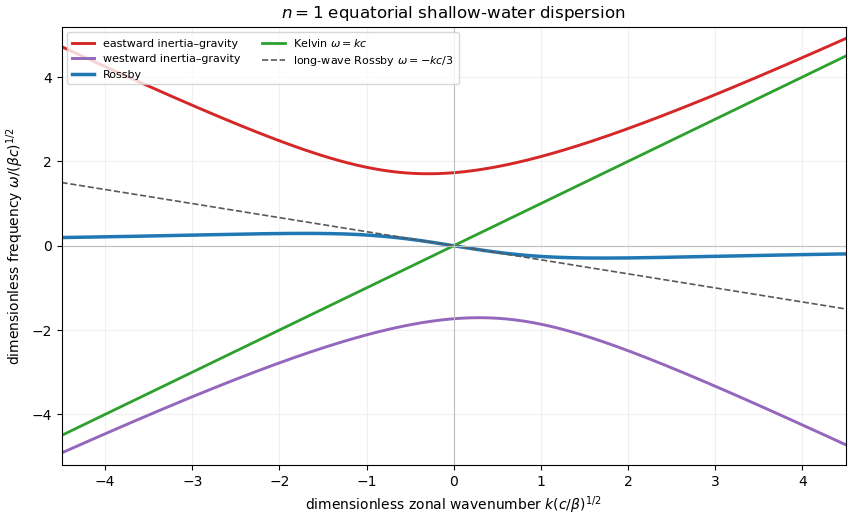

<h1 id="4/b/solution">Solution</h1>

↑ **Parent:** [B](../b.md)

For the [equatorial Kelvin wave](../../../../../../equatorial-kelvin-wave.md), set $\widehat V=0$. The zonal momentum and mass equations give $\omega^2=k^2c^2$. Meridional trapping selects the eastward branch

$$
\boxed{\omega=kc},
$$

for which

$$
\boxed{
\widehat U=U_0e^{-\beta y^2/(2c)},
\qquad
\widehat\Phi=cU_0e^{-\beta y^2/(2c)}}.
$$

The westward algebraic branch would grow away from the equator and is rejected.

For $\widehat V\ne0$, let $D=\omega^2-k^2c^2$. The zonal momentum and mass equations give

$$
\widehat U=\frac{i(\omega\beta y\widehat V-kc^2\widehat V_y)}D,
\qquad
\widehat\Phi=\frac{ic^2(k\beta y\widehat V-\omega\widehat V_y)}D.
$$

Substitution in meridional geostrophic balance and use of the stated [Hermite differential equation](../../../../../../hermite-differential-equation.md) gives the trapped [Equatorial Rossby-wave dispersion relation](../../../../../../equatorial-rossby-wave-dispersion-relation.md)

$$
\boxed{\omega=-\frac{kc}{2n+1}},
\qquad n=1,2,\ldots.
$$

For $n=1$, define $L_e=(c/\beta)^{1/2}$, $Y=y/L_e$, and take

$$
\widehat V=2V_0Y e^{-Y^2/2}.
$$

Then

$$
\boxed{
\widehat U=\frac{3iV_0}{4kL_e}(3-2Y^2)e^{-Y^2/2}},
$$

$$
\boxed{
\widehat\Phi=-\frac{3icV_0}{4kL_e}(1+2Y^2)e^{-Y^2/2}}.
$$

Without imposing meridional geostrophic balance, the equatorial shallow-water modes satisfy the Matsuno cubic

$$
\boxed{
\omega^3-[k^2c^2+(2n+1)\beta c]\omega
-\beta kc^2=0}.
$$

A [dispersion diagram](../../../../../../dispersion-diagram.md) therefore contains high-frequency eastward and westward [equatorial inertia--gravity waves](../../../../../../equatorial-inertia-gravity-wave.md) as well as westward [equatorial Rossby waves](../../../../../../equatorial-rossby-wave.md), plus the separate straight [equatorial Kelvin wave](../../../../../../equatorial-kelvin-wave.md) branch $\omega=kc$. The Rossby curves approach $-kc/(2n+1)$ only in the long-wave limit and bend toward zero like $-\beta/k$ at short wavelength. The geostrophic model retains the Kelvin and long-wave Rossby lines but filters the inertia--gravity modes and misses Rossby-wave dispersion at larger $|k|$.

**[Figure 1](#4/b/image-equatorial-shallow-water-dispersion-for-meridional-mode-n-equals-1). Equatorial shallow-water dispersion for meridional mode n equals 1**. The three roots of the Matsuno cubic give two inertia--gravity branches and one Rossby branch. The Kelvin line and the long-wave geostrophic Rossby approximation are shown separately.

## ↑ Ancestors (11)

1. [B](../b.md)
2. [4](../../4.md)
3. [Paper 333](../../../paper-333-split.md)
4. [Iii](../../../split.md)
5. [2023](../../../../split.md)
6. [Past exam of the mathematics course of the University of Cambridge](../../../../../split.md)
7. [Mathematics course of the University of Cambridge](../../../../../../mathematics-course-of-the-university-of-cambridge.md)
8. [Course of the University of Cambridge](../../../../../../course-of-the-university-of-cambridge.md)
9. [University of Cambridge](../../../../../../university-of-cambridge-split.md)
10. [List of universities](../../../../../../list-of-universities.md)
11. [Codex Wiki](../../../../../../split.md)
