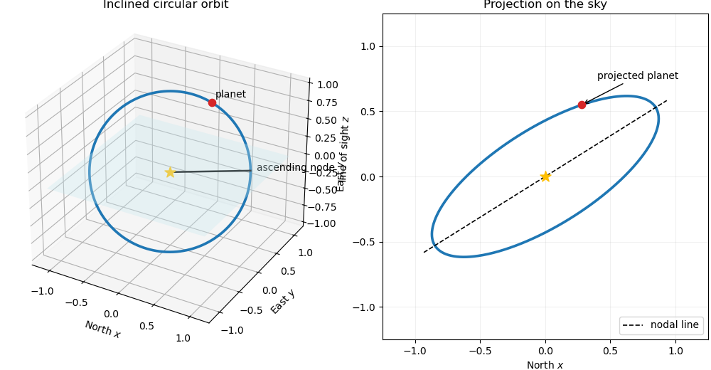

<h1 id="1/iii/solution">Solution</h1>

↑ **Parent:** [Iii](../iii.md)

The [projected separation](../../../../../../projected-separation.md) is

$$
\boxed{R_{\rm sky}=\sqrt{x^2+y^2}
=a\sqrt{\cos^2f+\cos^2I\sin^2f}
=a\sqrt{1-\sin^2I\sin^2f}}.
$$

Rotating the projected coordinates through $-\Omega$ gives components $a\cos f$ along the nodal line and $a\cos I\sin f$ perpendicular to it. The [position angle](../../../../../../position-angle.md) is therefore most safely written with the quadrant-preserving function

$$
\boxed{\phi=\Omega+operatorname{atan2}(\cos I\sin f,\cos f)},
$$

or, wherever the corresponding tangent is finite,

$$
\boxed{\tan(\phi-\Omega)=\cos I\tan f}.
$$

**[Figure 1](#1/iii/image-inclined-circular-orbit-and-its-projection-on-the-plane-of-the-sky). Inclined circular orbit and its projection on the plane of the sky**. The three-dimensional view labels the line of nodes and a planet on an inclined circular orbit. Projection along the line of sight turns the circle into an ellipse whose major axis is the nodal line.

## ↑ Ancestors (11)

1. [Iii](../iii.md)
2. [1](../../1.md)
3. [Paper 316](../../../paper-316-split.md)
4. [Iii](../../../split.md)
5. [2024](../../../../split.md)
6. [Past exam of the mathematics course of the University of Cambridge](../../../../../split.md)
7. [Mathematics course of the University of Cambridge](../../../../../../mathematics-course-of-the-university-of-cambridge.md)
8. [Course of the University of Cambridge](../../../../../../course-of-the-university-of-cambridge.md)
9. [University of Cambridge](../../../../../../university-of-cambridge-split.md)
10. [List of universities](../../../../../../list-of-universities.md)
11. [Codex Wiki](../../../../../../split.md)
