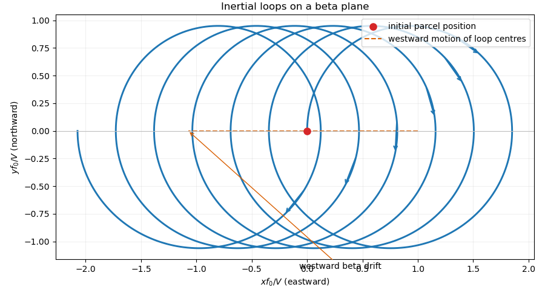

# Paper 333

↑ **Parent:** [Iii](../iii.md)

[https://www.maths.cam.ac.uk/postgrad/part-iii/files/pastpapers/2024/Paper_333.pdf](https://www.maths.cam.ac.uk/postgrad/part-iii/files/pastpapers/2024/Paper_333.pdf)

**Table of contents**

- [1](#1)
  - [a](#1/a)
    - [Solution](#1/a/solution)
  - [b](#1/b)
    - [Solution](#1/b/solution)
  - [c](#1/c)
    - [Solution](#1/c/solution)
- [2](#2)
  - [a](#2/a)
    - [Solution](#2/a/solution)
  - [b](#2/b)
    - [Solution](#2/b/solution)
  - [c](#2/c)
    - [Solution](#2/c/solution)
- [3](#3)
  - [a](#3/a)
    - [Solution](#3/a/solution)
  - [b](#3/b)
    - [Solution](#3/b/solution)
  - [c](#3/c)
    - [Solution](#3/c/solution)
  - [d](#3/d)
    - [Solution](#3/d/solution)
  - [e](#3/e)
    - [Solution](#3/e/solution)
  - [f](#3/f)
    - [Solution](#3/f/solution)
- [4](#4)
  - [a](#4/a)
    - [Solution](#4/a/solution)
  - [b](#4/b)
    - [Solution](#4/b/solution)
  - [c](#4/c)
    - [Solution](#4/c/solution)
  - [d](#4/d)
    - [Solution](#4/d/solution)
  - [e](#4/e)
    - [Solution](#4/e/solution)
  - [f](#4/f)
    - [Solution](#4/f/solution)

## 1

↑ **Parent:** [Paper 333](paper-333.md)

<h3 id="1/a">a</h3>

↑ **Parent:** [1](#1)

<h4 id="1/a/solution">Solution</h4>

↑ **Parent:** [A](#1/a)

At latitude $\theta_0$, resolve the planetary angular velocity as

$$
\boldsymbol\Omega=(0,\Omega\cos\theta_0,
\Omega\sin\theta_0).
$$

For velocity $(u,v,w)$, the [Coriolis acceleration](../../../physics.md#coriolis-acceleration) is

$$
2\boldsymbol\Omega\times\mathbf u
=2\Omega
\left(
w\cos\theta_0-v\sin\theta_0,
u\sin\theta_0,
-u\cos\theta_0
\right).
$$

The [traditional approximation](../../../geophysical-fluid-dynamics.md#traditional-approximation-geophysical-fluid-dynamics) drops the terms involving the horizontal rotation component $\Omega\cos\theta_0$. The retained horizontal force is therefore

$$
f\widehat{\mathbf z}\times\mathbf u_h,
\qquad
f=2\Omega\sin\theta_0.
$$

Its direct velocity-scale requirement is

$$
W\cos\theta_0\ll U\sin\theta_0.
$$

For an [incompressible flow](../../../fluid-mechanics.md#incompressible-flow), $W/U=O(H/L)$, so a sufficient condition is

$$
\boxed{\frac HL|\cot\theta_0|\ll1},
$$

together with the small aspect ratio that makes [hydrostatic pressure](../../../fluid-mechanics.md#hydrostatic-pressure) the leading vertical momentum balance. The approximation consequently becomes delicate near the equator.

The [beta plane](../../../geophysical-fluid-dynamics.md#beta-plane) is the local [Taylor expansion](../../../calculus.md#taylor-expansion)

$$
f(y)=2\Omega\sin(\theta_0+y/a)
=f_0+\beta y+O\!\left(\Omega L^2/a^2\right),
$$

where

$$
f_0=2\Omega\sin\theta_0,
\qquad
\beta=\frac{2\Omega\cos\theta_0}{a},
$$

and $a$ is the planetary radius. It requires a local Cartesian region,

$$
\boxed{L/a\ll1},
$$

and $H/a\ll1$. Away from the equator, treating the variation as a perturbation of an [f-plane](../../../geophysical-fluid-dynamics.md#f-plane) also requires $\beta L/|f_0|\ll1$; near the equator one instead retains the linear term as the leading Coriolis parameter.

<h3 id="1/b">b</h3>

↑ **Parent:** [1](#1)

<h4 id="1/b/solution">Solution</h4>

↑ **Parent:** [B](#1/b)

Assume an inviscid homogeneous ocean, no horizontal [pressure gradient](../../../fluid-mechanics.md#pressure-gradient), and no [wind stress](../../../geophysical-fluid-dynamics.md#wind-stress). Horizontal uniformity then removes advective acceleration, and the parcel equations on a [beta plane](../../../geophysical-fluid-dynamics.md#beta-plane) are

$$
\dot u-f(y)v=0,
\qquad
\dot v+f(y)u=0,
\qquad
f(y)=f_0+\beta y,
$$

with $u=\dot x$ and $v=\dot y$.

Since $\dot u=f(y)\dot y$, integration from the stated initial data gives

$$
\boxed{
\dot x=u=f_0y+\frac12\beta y^2}.
$$

This is conservation of the parcel's zonal canonical momentum: its zonal speed records the meridionally accumulated [Coriolis acceleration](../../../physics.md#coriolis-acceleration). Multiplying the two momentum equations by $u$ and $v$ and adding gives

$$
\frac d{dt}\frac{u^2+v^2}{2}=0.
$$

Thus [kinetic energy](../../../classical-mechanics.md#kinetic-energy) and speed are constant:

$$
\boxed{\dot x^2+\dot y^2=V^2}.
$$

Eliminating $\dot x$ gives the required [ordinary differential equation](../../../differential-equation.md#ordinary-differential-equation)

$$
\boxed{
\dot y^2=V^2-
\left(f_0y+\frac12\beta y^2\right)^2}.
$$

For $f_0,\beta>0$, the equator is at $y_e=-f_0/\beta$. There

$$
f_0y_e+\frac12\beta y_e^2
=-\frac{f_0^2}{2\beta}.
$$

The parcel must encounter a meridional turning point before reaching the equator if it is to remain strictly in the Northern Hemisphere. The energy relation therefore requires

$$
\boxed{
V<\frac{f_0^2}{2\beta}},
$$

or $\beta V/f_0^2<1/2$. Equality is the limiting trajectory that reaches the equator with zero meridional speed.

<h3 id="1/c">c</h3>

↑ **Parent:** [1](#1)

<h4 id="1/c/solution">Solution</h4>

↑ **Parent:** [C](#1/c)

Introduce

$$
\tau=f_0t,
\qquad
X=\frac{f_0x}{V},
\qquad
Y=\frac{f_0y}{V},
\qquad
\epsilon=\widetilde\beta=\frac{\beta V}{f_0^2}.
$$

Because the speed is $V$, write

$$
\dot x=V\sin\phi,
\qquad
\dot y=V\cos\phi.
$$

The momentum equations give

$$
\frac{d\phi}{d\tau}=1+\epsilon Y,
\qquad
\frac{dX}{d\tau}=\sin\phi,
\qquad
\frac{dY}{d\tau}=\cos\phi.
$$

Use an [asymptotic expansion](../../../analysis.md#asymptotic-expansion)

$$
\phi=\tau+\epsilon\phi_1+O(\epsilon^2),
\quad
X=X_0+\epsilon X_1+O(\epsilon^2),
\quad
Y=Y_0+\epsilon Y_1+O(\epsilon^2).
$$

The zeroth-order [inertial oscillation](../../../geophysical-fluid-dynamics.md#inertial-oscillation) is

$$
X_0=1-\cos\tau,
\qquad
Y_0=\sin\tau.
$$

At first order,

$$
\phi_1'=\sin\tau,
\qquad
\phi_1=1-\cos\tau,
$$

and integration with the initial conditions gives

$$
X_1=\sin\tau-\frac14\sin2\tau-\frac12\tau,
$$

$$
Y_1=\cos\tau-1+\frac12\sin^2\tau.
$$

Therefore

$$
\boxed{
x(t)=\frac V{f_0}
\left[
1-\cos\tau
+\widetilde\beta
\left(\sin\tau-\frac14\sin2\tau-\frac12\tau\right)
\right]
+O(\widetilde\beta^2)},
$$

$$
\boxed{
y(t)=\frac V{f_0}
\left[
\sin\tau
+\widetilde\beta
\left(\cos\tau-1+\frac12\sin^2\tau\right)
\right]
+O(\widetilde\beta^2)}.
$$

The periodic terms describe a slightly distorted clockwise circle. The secular term in $x$ is a westward drift with velocity

$$
\boxed{
U_{\rm drift}=-\frac{\beta V^2}{2f_0^2}}.
$$

This [beta drift of an inertial oscillation](../../../geophysical-fluid-dynamics.md#beta-drift-of-an-inertial-oscillation) occurs because the [Coriolis parameter](../../../geophysical-fluid-dynamics.md#coriolis-parameter), and hence the turning rate, is larger on the poleward half of the orbit than on its equatorward half. A trajectory sketch therefore consists of clockwise loops whose centers move steadily westward; the parcel starts at the westernmost point of its first loop and initially travels northward.

**[Figure 1](#1/c/image-westward-beta-drift-of-inertial-loops). Westward beta drift of inertial loops**. The first-order beta-plane trajectory forms slightly distorted clockwise loops. Their centers follow the dashed westward path because the Coriolis turning rate is stronger on the poleward side.

## 2

↑ **Parent:** [Paper 333](paper-333.md)

<h3 id="2/a">a</h3>

↑ **Parent:** [2](#2)

<h4 id="2/a/solution">Solution</h4>

↑ **Parent:** [A](#2/a)

Assume a steady, small-[Rossby number](../../../geophysical-fluid-dynamics.md#rossby-number) surface boundary layer, neglect horizontal viscosity and nonlinear acceleration, take the pressure gradient to be independent of depth, impose no normal flow at the surface, and let the viscous stress vanish at $z=-h$. Subtract the depth-independent [geostrophic balance](../../../physics.md#geostrophic-balance) from horizontal momentum. For the ageostrophic velocity,

$$
-fv_a=\nu u_{zz},
\qquad
fu_a=\nu v_{zz}.
$$

Integrating from $-h$ to $0$ and using

$$
\boldsymbol\tau=\rho\nu(u_z,v_z)|_{z=0}
$$

gives the [Ekman transport](../../../geophysical-fluid-dynamics.md#ekman-transport)

$$
\boxed{
\mathbf M_E=
\int_{-h}^0(u_a,v_a)\,dz
=\left(\frac{\tau_y}{\rho f},
-\frac{\tau_x}{\rho f}\right)
=\frac{\boldsymbol\tau\times\widehat{\mathbf z}}{\rho f}}.
$$

Depth-integrated [mass conservation](../../../continuum-mechanics.md#mass-conservation), with $w(0)=0$, gives

$$
\nabla_h\mathbin\cdot\mathbf M_E-w(-h)=0.
$$

Hence the vertical velocity entering the ocean interior is the [Ekman pumping](../../../geophysical-fluid-dynamics.md#ekman-pumping) velocity

$$
\boxed{
w_E\equiv w(-h)
=\widehat{\mathbf z}\mathbin\cdot
\nabla_h\times
\left(\frac{\boldsymbol\tau}{\rho f}\right)}.
$$

For constant $f$ this reduces to

$$
\boxed{w_E=\frac{\tau_{y,x}-\tau_{x,y}}{\rho f}.}
$$

<h3 id="2/b">b</h3>

↑ **Parent:** [2](#2)

<h4 id="2/b/solution">Solution</h4>

↑ **Parent:** [B](#2/b)

Let $D=H-h$ be the constant interior depth. Assume a homogeneous hydrostatic interior with depth-independent horizontal velocity, negligible friction, steady small-[Rossby number](../../../geophysical-fluid-dynamics.md#rossby-number) flow, and no normal flow through the flat bottom. The vertical velocity varies from $w(-H)=0$ to $w(-h)=w_E$, so [incompressible flow](../../../fluid-mechanics.md#incompressible-flow) gives

$$
u_x+v_y=-\frac{w_E}{D}.
$$

The leading horizontal momentum balance is [geostrophic balance](../../../physics.md#geostrophic-balance):

$$
-fv=-\frac1\rho p_x,
\qquad
fu=-\frac1\rho p_y.
$$

Taking its vertical curl on a [beta plane](../../../geophysical-fluid-dynamics.md#beta-plane) gives

$$
f(u_x+v_y)+\beta v=0.
$$

Combining the last two equations yields [Sverdrup balance](../../../geophysical-fluid-dynamics.md#sverdrup-balance)

$$
\boxed{
\beta Dv=fw_E},
\qquad
\boxed{
v=\frac{f}{\beta D}w_E}.
$$

The zonal velocity is then fixed, up to its value on one side boundary, by

$$
\boxed{
u_x=-\frac{w_E}{D}
-\frac{\partial}{\partial y}
\left(\frac{fw_E}{\beta D}\right)}.
$$

Equivalently, substituting part a gives the depth-integrated form

$$
\boxed{
\beta Dv
=\frac f\rho
\widehat{\mathbf z}\mathbin\cdot
\nabla_h\times\left(\frac{\boldsymbol\tau}{f}\right)}.
$$

A lateral boundary condition, normally supplied by matching to a boundary current, determines the remaining zonally uniform part of $u$.

<h3 id="2/c">c</h3>

↑ **Parent:** [2](#2)

<h4 id="2/c/solution">Solution</h4>

↑ **Parent:** [C](#2/c)

Put $D(x,y)=H(x,y)-h(x,y)$ and let $\mathbf u=(u,v)$ be the depth-independent interior velocity. The kinematic boundary conditions on the sloping upper and lower surfaces are

$$
w_t=w_E-\mathbf u\mathbin\cdot\nabla h,
\qquad
w_b=-\mathbf u\mathbin\cdot\nabla H.
$$

Integrating [mass conservation](../../../continuum-mechanics.md#mass-conservation) through the layer gives

$$
\frac{DD}{Dt}+D\nabla_h\mathbin\cdot\mathbf u=-w_E.
$$

The inviscid vertical-vorticity equation is

$$
\frac D{Dt}(f+\zeta)
=-(f+\zeta)\nabla_h\mathbin\cdot\mathbf u,
\qquad
\zeta=v_x-u_y.
$$

Consequently the [shallow-water potential vorticity](../../../geophysical-fluid-dynamics.md#shallow-water-potential-vorticity)

$$
q=\frac{f+\zeta}{D}
$$

obeys the forced evolution equation

$$
\boxed{
\frac{Dq}{Dt}=\frac{q}{D}w_E}.
$$

Positive upward [Ekman pumping](../../../geophysical-fluid-dynamics.md#ekman-pumping) removes layer thickness and raises the potential vorticity of the remaining column.

For a steady small-[Rossby number](../../../geophysical-fluid-dynamics.md#rossby-number) flow, $q\simeq f/D$, so

$$
\mathbf u\mathbin\cdot\nabla\left(\frac fD\right)
=\frac{f}{D^2}w_E.
$$

Equivalently,

$$
\boxed{
\beta Dv-f\mathbf u\mathbin\cdot\nabla D
=fw_E}.
$$

The same result follows from the integrated vortex-stretching balance

$$
\beta Dv=f(w_t-w_b).
$$

When $\nabla D=(c,0)$ with $c>0$,

$$
\beta Dv-fcu=fw_E.
$$

If the upper pumping is absent or weak and the upper surface is locally level, the impermeable-bottom condition is $w_b=-cu$. The stipulated $w_b<0$ then gives $u>0$, and in the Northern Hemisphere

$$
v\simeq\frac{fc}{\beta D}u>0.
$$

The steady interior flow is therefore directed northeastward, along contours of $f/D$ in the unforced limit. As a parcel moves eastward into deeper water, its vortex column stretches; a poleward displacement increases $f$ and preserves [potential vorticity](../../../geophysical-fluid-dynamics.md#potential-vorticity). Nonzero [Ekman pumping](../../../geophysical-fluid-dynamics.md#ekman-pumping) drives motion across the $f/D$ contours. This is [topographic potential-vorticity steering](../../../geophysical-fluid-dynamics.md#topographic-potential-vorticity-steering) and the associated [topographic Sverdrup balance](../../../geophysical-fluid-dynamics.md#topographic-sverdrup-balance).

## 3

↑ **Parent:** [Paper 333](paper-333.md)

<h3 id="3/a">a</h3>

↑ **Parent:** [3](#3)

<h4 id="3/a/solution">Solution</h4>

↑ **Parent:** [A](#3/a)

For an inviscid [Boussinesq approximation](../../../geophysical-fluid-dynamics.md#boussinesq-approximation) fluid in a nonrotating frame, write buoyancy as $\sigma$ and kinematic pressure as $p$. The governing equations are

$$
\frac{D\mathbf u}{Dt}=-\nabla p+\sigma\widehat{\mathbf z},
\qquad
\frac{D\sigma}{Dt}=0,
\qquad
\nabla\mathbin\cdot\mathbf u=0.
$$

They require density variations to be small compared with a constant reference density, while retaining those variations in [buoyancy](../../../fluid-mechanics.md#buoyancy); the flow scale must be small compared with the background density scale height. Ideal flow additionally neglects viscosity and scalar diffusion.

Linearize about

$$
\overline{\mathbf u}=\overline u(z)\widehat{\mathbf x},
\qquad
\frac{d\overline\sigma}{dz}=N^2(z)>0,
$$

where $N$ is the [buoyancy frequency](../../../gravity-wave.md#buoyancy-frequency), and define

$$
D_t=\partial_t+\overline u\,\partial_x.
$$

For two-dimensional disturbances, the linear equations are

$$
\boxed{D_tu'+\overline u_z w'=-p'_x},
$$

$$
\boxed{D_tw'=-p'_z+\sigma'},
$$

$$
\boxed{D_t\sigma'+N^2w'=0},
$$

$$
\boxed{u'_x+w'_z=0}.
$$

The condition $N^2>0$ expresses [stable density stratification](../../../gravity-wave.md#stable-density-stratification).

<h3 id="3/b">b</h3>

↑ **Parent:** [3](#3)

<h4 id="3/b/solution">Solution</h4>

↑ **Parent:** [B](#3/b)

Differentiate horizontal momentum with respect to $z$ and vertical momentum with respect to $x$. When the two equations are subtracted, the terms proportional to $\overline u_z(u'_x+w'_z)$ vanish by [incompressible flow](../../../fluid-mechanics.md#incompressible-flow). The pressure derivatives also cancel, leaving

$$
\boxed{
D_t(u'_z-w'_x)+\overline u_{zz}w'+\sigma'_x=0}.
$$

Differentiate this equation with respect to $x$. Since continuity gives

$$
(u'_z-w'_x)_x
=-(w'_{xx}+w'_{zz}),
$$

one obtains

$$
-D_t\nabla^2w'
+\overline u_{zz}w'_x+\sigma'_{xx}=0.
$$

Apply $D_t$ and use the buoyancy equation $D_t\sigma'=-N^2w'$. Multiplication by $-1$ then gives

$$
\boxed{
D_t^2(w'_{xx}+w'_{zz})
-\overline u_{zz}D_tw'_x
+N^2w'_{xx}=0}.
$$

<h3 id="3/c">c</h3>

↑ **Parent:** [3](#3)

<h4 id="3/c/solution">Solution</h4>

↑ **Parent:** [C](#3/c)

For the [normal mode](../../../wave-equation.md#normal-mode)

$$
w'=\widehat w(z)e^{ikx-i\omega t},
\qquad
c=\frac\omega k,
$$

the linear material derivative becomes

$$
D_t\longmapsto ik(\overline u-c).
$$

Substitution into the equation from part b and division by $-k^2(\overline u-c)^2$ gives the [Taylor–Goldstein equation](../../../gravity-wave.md#taylor-goldstein-equation)

$$
\boxed{
\widehat w_{zz}+m^2(z)\widehat w=0},
$$

where

$$
\boxed{m^2(z)=l^2(z)-k^2},
$$

and the [Scorer parameter](../../../gravity-wave.md#scorer-parameter) is

$$
\boxed{
l^2(z)=
\frac{N^2(z)}{[\overline u(z)-c]^2}
-\frac{\overline u_{zz}(z)}{\overline u(z)-c}}.
$$

<h3 id="3/d">d</h3>

↑ **Parent:** [3](#3)

<h4 id="3/d/solution">Solution</h4>

↑ **Parent:** [D](#3/d)

For a ridge-fixed disturbance, $c=0$. If the [Scorer parameter](../../../gravity-wave.md#scorer-parameter) varies on a height scale much longer than the vertical wavelength, the local [WKB approximation](../../../analysis.md#wkb-approximation) gives

$$
\widehat w\sim m^{-1/2}
\exp\left(\mathord\pm i\int^z m(s)\,ds\right)
$$

where $m^2=l^2-k^2>0$. The disturbance is vertically oscillatory there and can carry wave activity upward. Where $l^2<k^2$, $m$ is imaginary and the solution is vertically evanescent.

A rigid ridge supplies the lower [boundary condition](../../../differential-equation.md#boundary-condition) and an upper radiation or decay condition selects the physical solution. If $l^2$ decreases through $k^2$, the crossing is a turning level: the wave is reflected or decays above it and is trapped beneath it. Increasing $\overline u$ normally reduces $N^2/\overline u^2$, while decreasing $N^2$ reduces it directly; subject to the curvature term $-\overline u_{zz}/\overline u$, either change therefore promotes [vertical trapping of an atmospheric gravity wave](../../../gravity-wave.md#vertical-trapping-of-an-atmospheric-gravity-wave).

<h3 id="3/e">e</h3>

↑ **Parent:** [3](#3)

<h4 id="3/e/solution">Solution</h4>

↑ **Parent:** [E](#3/e)

Multiply

$$
\widehat w_{zz}+(l^2-k^2)\widehat w=0
$$

by $\widehat w$ and integrate from the rigid bottom to an upper endpoint $z$ at which $\widehat w\widehat w_z=0$. The bottom term also vanishes because $\widehat w(0)=0$. [Integration by parts](../../../calculus.md#integration-by-parts) gives

$$
-\int_0^z\widehat w_{z'}^2\,dz'
+\int_0^z(l^2-k^2)\widehat w^2\,dz'=0.
$$

Therefore the horizontal [wavenumber](../../../wave-equation.md#wavenumber) has the [Rayleigh quotient](../../../linear-operator-theory.md#rayleigh-quotient)

$$
\boxed{
k^2=
\frac{\displaystyle
\int_0^z
\left(l^2\widehat w^2-\widehat w_{z'}^2\right)dz'}
{\displaystyle\int_0^z\widehat w^2\,dz'}}.
$$

For a trapped wave the upper endpoint may be taken to infinity because the eigenfunction decays.

<h3 id="3/f">f</h3>

↑ **Parent:** [3](#3)

<h4 id="3/f/solution">Solution</h4>

↑ **Parent:** [F](#3/f)

Let

$$
I=\int\widehat w^2\,dz.
$$

Because the [Rayleigh quotient](../../../linear-operator-theory.md#rayleigh-quotient) is stationary with respect to first-order changes of its eigenfunction, only the explicit dependence of $l^2$ on $c=\omega/k$ contributes when the quotient is differentiated. Thus

$$
2k\,dk
=\frac1I\int
\frac{\partial l^2}{\partial c}
\widehat w^2\,dz\,dc,
$$

where

$$
\frac{\partial l^2}{\partial c}
=\frac{2N^2}{(\overline u-c)^3}
-\frac{\overline u_{zz}}{(\overline u-c)^2}.
$$

It follows that

$$
\frac{dc}{dk}
=\frac{2kI}
{\displaystyle\int
(\partial l^2/\partial c)\widehat w^2\,dz}.
$$

Since $\omega=kc$, the horizontal [group velocity](../../../wave-equation.md#group-velocity) is

$$
\boxed{
\frac{\partial\omega}{\partial k}
=c+
\frac{2k^2I}
{\displaystyle\int
\left[
\frac{2N^2}{(\overline u-c)^3}
-\frac{\overline u_{zz}}{(\overline u-c)^2}
\right]\widehat w^2\,dz}}.
$$

For a stationary ridge wave, $c=0$. Assume $\overline u>0$, so downstream is the positive $x$ direction. The stated inequality is

$$
l^2> -\frac{N^2}{\overline u^2}
\quad\Longleftrightarrow\quad
\frac{2N^2}{\overline u^3}
-\frac{\overline u_{zz}}{\overline u^2}>0.
$$

The denominator in the group-velocity formula is then positive, and

$$
\boxed{\partial\omega/\partial k>0}.
$$

The [atmospheric internal gravity waves](../../../gravity-wave.md#atmospheric-internal-gravity-wave) generated by the ridge consequently carry their wave packet downstream.

## 4

↑ **Parent:** [Paper 333](paper-333.md)

<h3 id="4/a">a</h3>

↑ **Parent:** [4](#4)

<h4 id="4/a/solution">Solution</h4>

↑ **Parent:** [A](#4/a)

Begin with the [Boussinesq approximation](../../../geophysical-fluid-dynamics.md#boussinesq-approximation) primitive equations on a [beta plane](../../../geophysical-fluid-dynamics.md#beta-plane), decompose every field into a zonal mean and a disturbance, and average over longitude. The zonal momentum equation then contains the divergence of the eddy momentum flux $\overline{u'v'}$, while the mean density equation contains the divergence of the eddy density flux $\overline{\rho'v'}$. At small [Rossby number](../../../geophysical-fluid-dynamics.md#rossby-number), use [geostrophic balance](../../../physics.md#geostrophic-balance), [hydrostatic pressure](../../../fluid-mechanics.md#hydrostatic-pressure), [thermal-wind balance](../../../geophysical-fluid-dynamics.md#thermal-wind), and the leading eddy equations to combine those fluxes.

Define

$$
A=\frac{\overline{\rho'v'}}{d\rho_s/dz}
$$

and introduce the [residual mean circulation](../../../geophysical-fluid-dynamics.md#residual-mean-circulation)

$$
\boxed{
\overline v_a^*=\overline v_a-A_z,
\qquad
\overline w_a^*=\overline w_a+A_y}.
$$

The added eddy-induced velocity is nondivergent, so

$$
\overline v_{a,y}^*+\overline w_{a,z}^*=0.
$$

It absorbs the eddy density-flux divergence into advection by the transformed circulation, giving

$$
\overline\rho_t+overline w_a^*\frac{d\rho_s}{dz}=0.
$$

The mean zonal momentum equation becomes

$$
\overline u_t-f_0\overline v_a^*
=\nabla\mathbin\cdot\overline{\mathbf F},
$$

where the zonally averaged [Eliassen–Palm flux](../../../geophysical-fluid-dynamics.md#eliassen-palm-flux) in the meridional-vertical plane is

$$
\boxed{
\overline F^{(y)}=-\overline{u'v'},
\qquad
\overline F^{(z)}
=f_0\frac{\overline{\rho'v'}}{d\rho_s/dz}}.
$$

**Thus the [transformed Eulerian mean](../../../geophysical-fluid-dynamics.md#transformed-eulerian-mean) gathers the wave forcing into one flux divergence and makes density evolve under one residual circulation.**

<h3 id="4/b">b</h3>

↑ **Parent:** [4](#4)

<h4 id="4/b/solution">Solution</h4>

↑ **Parent:** [B](#4/b)

Define the residual-circulation [stream function](../../../fluid-mechanics.md#stream-function) by

$$
\boxed{
(\overline v_a^*,\overline w_a^*)
=(\overline\chi_{a,z}^*,-\overline\chi_{a,y}^*)}.
$$

This satisfies residual [mass conservation](../../../continuum-mechanics.md#mass-conservation) identically. Let

$$
G=\nabla\mathbin\cdot\overline{\mathbf F},
\qquad
N^2=-\frac g{\rho_0}\frac{d\rho_s}{dz}.
$$

The momentum equation is

$$
\overline u_t-f_0\overline\chi_{a,z}^*=G.
$$

Differentiate [geostrophic balance](../../../physics.md#geostrophic-balance) vertically and [hydrostatic pressure](../../../fluid-mechanics.md#hydrostatic-pressure) meridionally to obtain [thermal-wind balance](../../../geophysical-fluid-dynamics.md#thermal-wind)

$$
f_0\overline u_z
=\frac g{\rho_0}\overline\rho_y.
$$

After a time derivative, the transformed density equation gives

$$
f_0\overline u_{tz}
=\frac g{\rho_0}\overline\rho_{ty}
=-N^2\overline\chi_{a,yy}^*.
$$

On the other hand, the $z$ derivative of momentum gives

$$
\overline u_{tz}
-f_0\overline\chi_{a,zz}^*=G_z.
$$

Eliminating $\overline u_{tz}$ yields the [Eliassen equation for residual circulation](../../../geophysical-fluid-dynamics.md#eliassen-equation-for-residual-circulation)

$$
\boxed{
f_0^2\overline\chi_{a,zz}^*
+N^2\overline\chi_{a,yy}^*
=-f_0(\nabla\mathbin\cdot\overline{\mathbf F})_z}.
$$

<h3 id="4/c">c</h3>

↑ **Parent:** [4](#4)

<h4 id="4/c/solution">Solution</h4>

↑ **Parent:** [C](#4/c)

Put $l=\pi/L$. For the specified [quasi-geostrophic streamfunction](../../../geophysical-fluid-dynamics.md#quasi-geostrophic-streamfunction), the complex amplitudes of the disturbance fields are

$$
\widehat u=-l\widehat\psi\cos(ly),
\qquad
\widehat v=ik\widehat\psi\sin(ly).
$$

The product of these two amplitudes is purely imaginary after one is conjugated, so its zonal mean vanishes:

$$
\overline{u'v'}
=\frac12\operatorname{Re}(\widehat u\widehat v^*)=0.
$$

Consequently

$$
\boxed{\overline F^{(y)}=0}.
$$

[Geostrophic balance](../../../physics.md#geostrophic-balance) and [hydrostatic pressure](../../../fluid-mechanics.md#hydrostatic-pressure) give

$$
\widehat\rho
=-\frac{\rho_0f_0}{g}
\widehat\psi_z\sin(ly).
$$

Therefore

$$
\overline{\rho'v'}
=-\frac{\rho_0f_0k}{2g}
\operatorname{Im}
(\widehat\psi_z\widehat\psi^*)
\sin^2(ly).
$$

Since $d\rho_s/dz=-\rho_0N^2/g$, the vertical [Eliassen–Palm flux](../../../geophysical-fluid-dynamics.md#eliassen-palm-flux) is

$$
\boxed{
\overline F^{(z)}
=\frac{f_0^2}{N^2}
\frac k2
\operatorname{Im}
(\widehat\psi_z\widehat\psi^*)
\sin^2\frac{\pi y}{L}}.
$$

Thus it has the stated form

$$
\boxed{
\overline F^{(z)}=F_0\Theta(z)
\sin^2\frac{\pi y}{L}},
\qquad
F_0=\frac{f_0^2}{N^2},
$$

with

$$
\boxed{
\Theta(z)=\frac k2
\operatorname{Im}
(\widehat\psi_z\widehat\psi^*)}.
$$

<h3 id="4/d">d</h3>

↑ **Parent:** [4](#4)

<h4 id="4/d/solution">Solution</h4>

↑ **Parent:** [D](#4/d)

Let

$$
l=\frac\pi L,
\qquad
\Theta(z)=1-\mathcal H(z-H),
$$

where $\mathcal H$ is the [Heaviside step function](../../../analysis.md#heaviside-step-function). Then

$$
\nabla\mathbin\cdot\overline{\mathbf F}
=-F_0\delta(z-H)\sin^2(ly),
$$

so the [Eliassen equation for residual circulation](../../../geophysical-fluid-dynamics.md#eliassen-equation-for-residual-circulation) is

$$
f_0^2\overline\chi_{a,zz}^*
+N^2\overline\chi_{a,yy}^*
=f_0F_0\delta'(z-H)\sin^2(ly).
$$

Take no normal residual flow at $y=0,L$ and $z=0$, decay as $z\to\infty$, and choose the streamfunction constant on the connected rigid boundary to be zero. Thus

$$
\overline\chi_a^*=0
\quad\text{on }y=0,L\text{ and }z=0,
\qquad
\overline\chi_a^*\to0
\quad(z\to\infty).
$$

The required [Fourier series](../../../fourier-series.md) in sine modes is

$$
\sin^2\frac{\pi y}{L}
=\sum_{\substack{n\geq1\\n\text{ odd}}}
b_n\sin\frac{n\pi y}{L},
\qquad
\boxed{
b_n=\frac8{\pi n(4-n^2)}}.
$$

Define

$$
\lambda_n=\frac{Nn\pi}{|f_0|L},
\qquad
C_n=\frac{F_0b_n}{f_0}.
$$

For each mode, the vertical equation is

$$
\chi_n''-\lambda_n^2\chi_n
=C_n\delta'(z-H).
$$

The [Dirac delta function](../../../distribution-theory.md#dirac-delta-function) requires

$$
[\chi_n]_{H^-}^{H^+}=C_n,
\qquad
[\chi_n']_{H^-}^{H^+}=0.
$$

The solution satisfying the boundary conditions is therefore

$$
\boxed{
\overline\chi_a^*(y,z)
=\frac{F_0}{f_0}
\sum_{\substack{n\geq1\\n\text{ odd}}}
b_nS_n(z)\sin\frac{n\pi y}{L}},
$$

where

$$
\boxed{
S_n(z)=
\begin{cases}
-e^{-\lambda_nH}\sinh(\lambda_nz),&0<z<H,\\
\cosh(\lambda_nH)e^{-\lambda_nz},&z>H.
\end{cases}}
$$

The momentum equation gives

$$
\overline u_t
=f_0\overline\chi_{a,z}^*
-F_0\delta(z-H)\sin^2\frac{\pi y}{L}.
$$

The jump of $\overline\chi_a^*$ supplies an equal positive delta function in $f_0\overline\chi_{a,z}^*$, so the singular terms cancel. The regular acceleration is

$$
\boxed{
\overline u_t
=-F_0
\sum_{\substack{n\geq1\\n\text{ odd}}}
b_n\lambda_nR_n(z)
\sin\frac{n\pi y}{L}},
$$

where

$$
R_n(z)=
\begin{cases}
e^{-\lambda_nH}\cosh(\lambda_nz),&0<z<H,\\
\cosh(\lambda_nH)e^{-\lambda_nz},&z>H.
\end{cases}
$$

Finally, the transformed density equation gives

$$
\boxed{
\overline\rho_t
=\frac{d\rho_s}{dz}
\overline\chi_{a,y}^*
=\frac{d\rho_s}{dz}
\frac{F_0}{f_0}
\sum_{\substack{n\geq1\\n\text{ odd}}}
b_n\frac{n\pi}{L}S_n(z)
\cos\frac{n\pi y}{L}}.
$$

These exponentially decaying modes are the balanced mean response to [wave-activity deposition](../../../geophysical-fluid-dynamics.md#wave-activity-deposition) at $z=H$.

<h3 id="4/e">e</h3>

↑ **Parent:** [4](#4)

<h4 id="4/e/solution">Solution</h4>

↑ **Parent:** [E](#4/e)

Define the Eulerian-mean streamfunction by

$$
(\overline v_a,\overline w_a)
=(\overline\chi_{a,z},-\overline\chi_{a,y}).
$$

With

$$
A=\frac{\overline{\rho'v'}}{d\rho_s/dz}
=\frac{\overline F^{(z)}}{f_0},
$$

the transformation in part a gives

$$
\overline v_a^*
=(\overline\chi_a-A)_z,
\qquad
\overline w_a^*
=-(\overline\chi_a-A)_y.
$$

Hence, up to an irrelevant additive constant,

$$
\boxed{
\overline\chi_a
=\overline\chi_a^*
+\frac{\overline F^{(z)}}{f_0}}.
$$

For the step-profile flux,

$$
\boxed{
\overline\chi_a
=\overline\chi_a^*
+\frac{F_0}{f_0}\Theta(z)
\sin^2\frac{\pi y}{L}}.
$$

The residual streamfunction $\overline\chi_a^*$ vanishes on the rigid boundaries, decays away from the absorption level, and has opposite-signed values immediately below and above $z=H$. Its vertical derivative gives a zonal acceleration $\overline u_t$ concentrated around $H$ and largest near the channel center. Its meridional derivative gives a dipolar density tendency: $\overline\rho_t$ changes sign across the channel center and reverses vertical structure across the absorption level.

The eddy term in $\overline\chi_a$ has a compensating downward jump at $H$, so the Eulerian-mean streamfunction is continuous even though $\overline\chi_a^*$ jumps in the idealized step limit. Below the critical layer, the Eulerian view contains a broad circulation associated with the eddy density flux; the transformed view subtracts that reversible eddy-induced motion and isolates the residual circulation forced where the waves dissipate.

In the Eulerian density budget, vertical advection by $\overline w_a$ and the divergence of $\overline{\rho'v'}$ can be individually large and largely cancel. The [transformed Eulerian mean](../../../geophysical-fluid-dynamics.md#transformed-eulerian-mean) combines them into advection by $\overline w_a^*$, making the irreversible mean response to [wave-activity deposition](../../../geophysical-fluid-dynamics.md#wave-activity-deposition) much clearer.

<h3 id="4/f">f</h3>

↑ **Parent:** [4](#4)

<h4 id="4/f/solution">Solution</h4>

↑ **Parent:** [F](#4/f)

Let the wave-forcing layer have vertical scale $D$ and meridional scale $L$. In the [Eliassen equation for residual circulation](../../../geophysical-fluid-dynamics.md#eliassen-equation-for-residual-circulation), the two restoring terms scale as

$$
f_0^2\frac{\chi^*}{D^2},
\qquad
N^2\frac{\chi^*}{L^2}.
$$

Their ratio is controlled by

$$
\Lambda=\frac{ND}{f_0L}.
$$

In the shallow-forcing limit $\Lambda\ll1$, the vertical derivative term dominates:

$$
f_0^2\chi_{zz}^*
\simeq-f_0(\nabla\mathbin\cdot\mathbf F)_z.
$$

After one vertical integration,

$$
f_0\overline v_a^*
\simeq-\nabla\mathbin\cdot\mathbf F.
$$

The Coriolis force on the [residual mean circulation](../../../geophysical-fluid-dynamics.md#residual-mean-circulation) therefore balances most of the wave forcing, and

$$
\overline u_t
=f_0\overline v_a^*
+\nabla\mathbin\cdot\mathbf F
$$

is small at leading order. The response is primarily an overturning circulation with an associated density tendency.

In the deep-forcing limit $\Lambda\gg1$, the meridional term dominates:

$$
N^2\chi_{yy}^*
\simeq-f_0(\nabla\mathbin\cdot\mathbf F)_z.
$$

Now

$$
\frac{f_0\overline v_a^*}
{\nabla\mathbin\cdot\mathbf F}
=O(\Lambda^{-2}),
$$

so the residual circulation is too weak to balance the forcing. The dominant momentum response is direct zonal acceleration,

$$
\boxed{
\overline u_t\simeq
\nabla\mathbin\cdot\mathbf F},
$$

with a comparatively weak overturning and density response.

## ↑ Ancestors (8)

1. [Iii](../iii.md)
2. [2024](../../2024.md)
3. [Past exam of the mathematics course of the University of Cambridge](../../../past-exam-of-the-mathematics-course-of-the-university-of-cambridge.md)
4. [Mathematics course of the University of Cambridge](../../../university-of-cambridge.md#mathematics-course-of-the-university-of-cambridge)
5. [Course of the University of Cambridge](../../../university-of-cambridge.md#course-of-the-university-of-cambridge)
6. [University of Cambridge](../../../university-of-cambridge.md)
7. [List of universities](../../../README.md#list-of-universities)
8. [Codex Wiki](../../../README.md)
