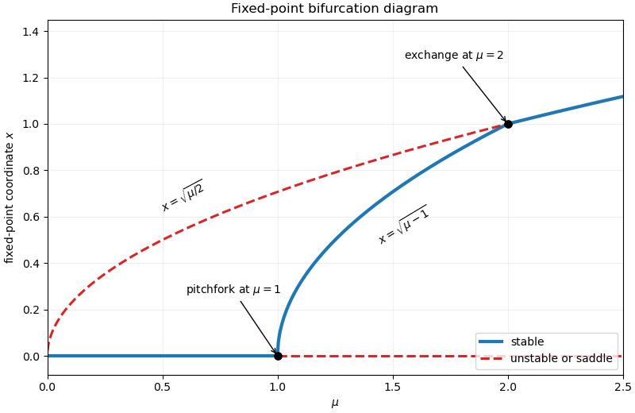

<h1 id="33a/d/solution">Solution</h1>

↑ **Parent:** [D](../d.md)

The [fixed point](../../../../../../fixed-point.md) branches and their stability are as follows.

- $(0,0)$ has [eigenvalues](../../../../../../eigenvalue.md) $\mu$ and $1$, so it is unstable for every $\mu>0$.
- $(0,1)$ has $x=0$ and is stable for $0<\mu<1$, then a saddle for $\mu>1$.
- $(\sqrt{\mu/2},0)$ exists for all $\mu>0$; it is a saddle for $0<\mu<2$ and stable for $\mu>2$.
- $(\sqrt{\mu-1},\sqrt{2-\mu})$ exists for $1<\mu<2$. Its [Jacobian matrix](../../../../../../jacobian-matrix.md) is

$$
J=-2\begin{pmatrix}2x^2&xy\\xy&y^2\end{pmatrix},
$$

which is a [negative-definite matrix](../../../../../../negative-definite-matrix.md), so this branch is stable.

Thus the $x$-versus-$\mu$ [bifurcation diagram](../../../../../../bifurcation-diagram.md) has the stable $x=0$ branch up to $\mu=1$, a stable branch $x=\sqrt{\mu-1}$ joining the bifurcation points $(1,0)$ and $(2,1)$, and the branch $x=\sqrt{\mu/2}$ changing from unstable to stable at $\mu=2$. The origin branch also lies at $x=0$ but remains unstable throughout.

**[Figure 1](#33a/d/image-fixed-point-bifurcation-diagram-for-the-2025-paper-ii-2-system). Fixed-point bifurcation diagram for the 2025 Paper II 2 system**. Stable branches are solid blue and unstable or saddle branches are dashed red. The interior branch emerges at mu equals 1 and joins the axial branch at mu equals 2.

## ↑ Ancestors (11)

1. [D](../d.md)
2. [33A](../../33a.md)
3. [Paper 2](../../../paper-2-split.md)
4. [Ii](../../../split.md)
5. [2025](../../../../split.md)
6. [Past exam of the mathematics course of the University of Cambridge](../../../../../split.md)
7. [Mathematics course of the University of Cambridge](../../../../../../mathematics-course-of-the-university-of-cambridge.md)
8. [Course of the University of Cambridge](../../../../../../course-of-the-university-of-cambridge.md)
9. [University of Cambridge](../../../../../../university-of-cambridge-split.md)
10. [List of universities](../../../../../../list-of-universities.md)
11. [Codex Wiki](../../../../../../split.md)
