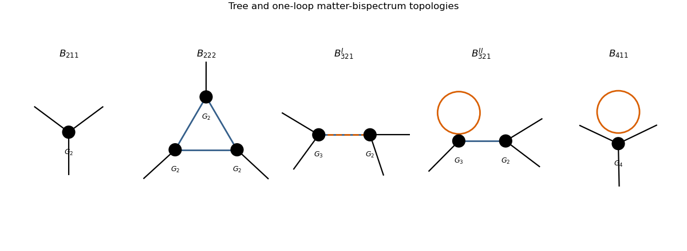

# Paper 312

↑ **Parent:** [Iii](../iii.md)

[https://www.maths.cam.ac.uk/postgrad/part-iii/files/pastpapers/2025/III_Paper_312.pdf](https://www.maths.cam.ac.uk/postgrad/part-iii/files/pastpapers/2025/III_Paper_312.pdf)

**Table of contents**

- [1](#1)
  - [i](#1/i)
    - [Solution](#1/i/solution)
  - [ii](#1/ii)
    - [Solution](#1/ii/solution)
  - [iii](#1/iii)
    - [Solution](#1/iii/solution)
  - [iv](#1/iv)
    - [Solution](#1/iv/solution)
  - [v](#1/v)
    - [Solution](#1/v/solution)
- [2](#2)
  - [i](#2/i)
    - [Solution](#2/i/solution)
  - [ii](#2/ii)
    - [Solution](#2/ii/solution)
  - [iii](#2/iii)
    - [Solution](#2/iii/solution)
  - [iv](#2/iv)
    - [Solution](#2/iv/solution)
  - [v](#2/v)
    - [Solution](#2/v/solution)
- [3](#3)
  - [i](#3/i)
    - [Solution](#3/i/solution)
  - [ii](#3/ii)
    - [Solution](#3/ii/solution)
  - [iii](#3/iii)
    - [a](#3/iii/a)
      - [Solution](#3/iii/a/solution)
    - [b](#3/iii/b)
      - [Solution](#3/iii/b/solution)
    - [c](#3/iii/c)
      - [Solution](#3/iii/c/solution)
- [4](#4)
  - [i](#4/i)
    - [Solution](#4/i/solution)
  - [ii](#4/ii)
    - [Solution](#4/ii/solution)
  - [iii](#4/iii)
    - [Solution](#4/iii/solution)
  - [iv](#4/iv)
    - [Solution](#4/iv/solution)

## 1

↑ **Parent:** [Paper 312](paper-312.md)

<h3 id="1/i">i</h3>

↑ **Parent:** [1](#1)

<h4 id="1/i/solution">Solution</h4>

↑ **Parent:** [I](#1/i)

[Conformal time](../../../cosmology.md#conformal-time) obeys $dt=a\,d\eta$, so $\dot\phi=a^{-1}\phi'$. Therefore

$$
\boxed{S_{\rm int}=\frac{\lambda}{3!}\int d^3x\,d\eta\,a(\eta)(\phi')^3}.
$$

For expanding [de Sitter spacetime](../../../general-relativity.md#de-sitter-spacetime), $a=-1/(H\eta)$ with $-\infty<\eta<0$.

<h3 id="1/ii">ii</h3>

↑ **Parent:** [1](#1)

<h4 id="1/ii/solution">Solution</h4>

↑ **Parent:** [Ii](#1/ii)

In one standard [Schwinger-Keldysh propagator](../../../quantum-field-theory.md#schwinger-keldysh-propagator) convention, suppressing the momentum delta function,

$$
G_{RR}(k;\eta,\eta')
=\theta(\eta-\eta')f(\eta)f^*(\eta')
+\theta(\eta'-\eta)f^*(\eta)f(\eta'),
$$

$$
G_{LL}(k;\eta,\eta')
=\theta(\eta'-\eta)f(\eta)f^*(\eta')
+\theta(\eta-\eta')f^*(\eta)f(\eta'),
$$

$$
G_{RL}(k;\eta,\eta')=f^*(\eta)f(\eta'),
\qquad
G_{LR}(k;\eta,\eta')=f(\eta)f^*(\eta').
$$

The two [bulk-to-boundary propagators](../../../quantum-field-theory.md#cosmological-bulk-to-boundary-propagator) to the late-time insertion are

$$
K_R(k,\eta)=f(k,0)f^*(k,\eta),
\qquad
K_L(k,\eta)=f^*(k,0)f(k,\eta).
$$

Interchanging every $L$ and $R$ gives the equivalent opposite contour-label convention. Direct differentiation of the supplied [Bunch-Davies vacuum](../../../cosmic-inflation.md#bunch-davies-vacuum) mode gives

$$
\boxed{f'(k,\eta)=\frac{Hk^2\eta}{\sqrt{2k^3}}e^{-ik\eta}
=\frac{H\sqrt k}{\sqrt2}\eta e^{-ik\eta}}.
$$

<h3 id="1/iii">iii</h3>

↑ **Parent:** [1](#1)

<h4 id="1/iii/solution">Solution</h4>

↑ **Parent:** [Iii](#1/iii)

Each differentiated external propagator contributes $H^2\eta/(2k)$, the differentiated internal propagator contributes $H^2s\eta\eta'/2$, and the two vertices contribute $a(\eta)a(\eta')=1/(H^2\eta\eta')$. The common factor is therefore

$$
\frac{\lambda^2H^8s}{32k_1k_2k_3k_4}.
$$

The ordered time integral needed on either same contour branch is

$$
I(p,q)=\int_{-\infty(1-i\epsilon)}^0d\eta\,\eta^2e^{ip\eta}
\int_{-\infty(1-i\epsilon)}^\eta d\eta'\,\eta'^2e^{iq\eta'}.
$$

Writing $K=p+q$ and integrating the polynomial exponential gives

$$
I(p,q)=-4\left(\frac1{K^3q^3}+\frac3{K^4q^2}+\frac6{K^5q}\right).
$$

The two time orderings have $K=E_T$ and respectively $q=E_R,E_L$. Combining the $RR$ and $LL$ contour signs and complex conjugates yields

$$
\boxed{
B_{4,s}^{(rr+ll)}
=\frac{\lambda^2H^8s}{4k_1k_2k_3k_4}
\left[
\frac1{E_T^3}\left(\frac1{E_R^3}+\frac1{E_L^3}\right)
+\frac3{E_T^4}\left(\frac1{E_R^2}+\frac1{E_L^2}\right)
+\frac6{E_T^5}\left(\frac1{E_R}+\frac1{E_L}\right)
\right]}.
$$

Thus $C_0=\lambda^2H^8/4$ and

$$
\boxed{(C_1,\alpha_1,\beta_1)=(1,3,3),
\quad
(C_2,\alpha_2,\beta_2)=(3,4,2),
\quad
(C_3,\alpha_3,\beta_3)=(6,5,1).}
$$

<h3 id="1/iv">iv</h3>

↑ **Parent:** [1](#1)

<h4 id="1/iv/solution">Solution</h4>

↑ **Parent:** [Iv](#1/iv)

For opposite contour branches the two vertex integrals factorize. Since

$$
\int_{-\infty(1-i\epsilon)}^0\eta^2e^{iE\eta}\,d\eta=\frac{2i}{E^3},
$$

their product contributes $4/(E_L^3E_R^3)$. The two assignments $LR$ and $RL$ then give

$$
\boxed{B_{4,s}^{(lr+rl)}
=\frac{\lambda^2H^8s}{4k_1k_2k_3k_4}
\frac1{(E_RE_L)^3}}.
$$

Consequently

$$
\boxed{C_4=\frac{\lambda^2H^8}{4},
\qquad \alpha_4=0,
\qquad \beta_4=3}.
$$

<h3 id="1/v">v</h3>

↑ **Parent:** [1](#1)

<h4 id="1/v/solution">Solution</h4>

↑ **Parent:** [V](#1/v)

A late-time connected four-point function of a scale-invariant field in three spatial dimensions, after removing its momentum-conserving delta function, must obey

$$
B_4(\Lambda\mathbf k_1,\ldots,\Lambda\mathbf k_4)
=\Lambda^{-9}B_4(\mathbf k_1,\ldots,\mathbf k_4).
$$

In both contributions, $s/(k_1k_2k_3k_4)$ scales as $\Lambda^{-3}$ and every energy-denominator term scales as $\Lambda^{-6}$. Hence the complete $s$-channel [primordial trispectrum](../../../cosmology.md#primordial-trispectrum) scales as $\Lambda^{-9}$, as required by scale invariance.

## 2

↑ **Parent:** [Paper 312](paper-312.md)

<h3 id="2/i">i</h3>

↑ **Parent:** [2](#2)

<h4 id="2/i/solution">Solution</h4>

↑ **Parent:** [I](#2/i)

The inverse [3+1 decomposition of spacetime](../../../numerical-relativity.md#3-plus-1-decomposition-of-spacetime) metric gives

$$
\boxed{X=\frac1{2N^2}(\dot\phi-N^i\partial_i\phi)^2
-\frac12h^{ij}\partial_i\phi\partial_j\phi}.
$$

The first term is the squared derivative along the hypersurface normal and the second is the spatial-gradient contribution.

<h3 id="2/ii">ii</h3>

↑ **Parent:** [2](#2)

<h4 id="2/ii/solution">Solution</h4>

↑ **Parent:** [Ii](#2/ii)

At fixed $N$ and $h_{ij}$, varying the shift gives

$$
\delta K_{ij}=-\frac1{2N}\left({}^{(3)}\nabla_i\delta N_j+{}^{(3)}\nabla_j\delta N_i\right)
$$

and

$$
\delta X=-\frac1{N^2}(\dot\phi-N^j\partial_j\phi)\partial_i\phi\,\delta N^i.
$$

Integration by parts in the gravitational term turns the variation of $K_{ij}K^{ij}-K^2$ into the spatial divergence of $K_i{}^j-\delta_i{}^jK$. Since the shift has no time derivative, its Euler-Lagrange equation is the [ADM momentum constraint for a P(X, phi) scalar field](../../../cosmology.md#adm-momentum-constraint-for-a-p-x-phi-scalar-field)

$$
\boxed{{}^{(3)}\nabla_j(K_i{}^j-\delta_i{}^jK)
+\frac{P_{,X}}{M_{\rm Pl}^2N}\partial_i\phi
(N^j\partial_j\phi-\dot\phi)=0}.
$$

<h3 id="2/iii">iii</h3>

↑ **Parent:** [2](#2)

<h4 id="2/iii/solution">Solution</h4>

↑ **Parent:** [Iii](#2/iii)

In [flat gauge in cosmology](../../../linear-cosmological-perturbation-theory.md#flat-gauge-in-cosmology), the supplied expressions imply

$$
K_i{}^j-\delta_i{}^jK
=-2H\delta_i{}^j+2H\delta N\,\delta_i{}^j
-\partial_i\partial^j\psi+\delta_i{}^j\partial^2\psi
$$

to first order. The last two terms cancel after taking $\partial_j$, so the geometric part of the momentum constraint is $2H\partial_i\delta N$. Its matter part is

$$
-\frac{P_{,X}\dot{\bar\phi}}{M_{\rm Pl}^2}\partial_i\varphi.
$$

Therefore

$$
2H\partial_i\delta N
-\frac{P_{,X}\dot{\bar\phi}}{M_{\rm Pl}^2}\partial_i\varphi=0,
$$

and, after discarding a spatially homogeneous lapse mode,

$$
\boxed{\delta N=C\varphi,
\qquad
C=\frac{P_{,X}\dot{\bar\phi}}{2HM_{\rm Pl}^2}}.
$$

<h3 id="2/iv">iv</h3>

↑ **Parent:** [2](#2)

<h4 id="2/iv/solution">Solution</h4>

↑ **Parent:** [Iv](#2/iv)

For the homogeneous background, $X=\dot{\bar\phi}^{,2}/2$. The second [Friedmann equation](../../../cosmology.md#friedmann-equations) gives

$$
\frac12P_{,X}\dot{\bar\phi}^{,2}
=-\dot H M_{\rm Pl}^2
=\epsilon H^2M_{\rm Pl}^2.
$$

Dividing by $H M_{\rm Pl}^2\dot{\bar\phi}$ shows that the coefficient found above is

$$
\boxed{C=\frac{H\epsilon}{\dot{\bar\phi}}}.
$$

<h3 id="2/v">v</h3>

↑ **Parent:** [2](#2)

<h4 id="2/v/solution">Solution</h4>

↑ **Parent:** [V](#2/v)

Substitution of $\delta N=C\varphi$ and conversion to [conformal time](../../../cosmology.md#conformal-time) turn the interaction into

$$
S_{\rm int}=-\int d\eta\,d^3x\,a^2C\varphi(\varphi')^2.
$$

Treat $C$ and $H$ as constant at leading slow-roll order and use the massless de Sitter mode

$$
f_k(\eta)=\frac{H}{\sqrt{2k^3}}(1+ik\eta)e^{-ik\eta}.
$$

For $K=k_1+k_2+k_3$, the [in-in formalism](../../../quantum-field-theory.md#keldysh-formalism) time integral at a vertex with leg $i$ undifferentiated is proportional to

$$
\int_{-\infty(1-i\epsilon)}^0(1-ik_i\eta)e^{iK\eta}\,d\eta
=-i\left(\frac1K+\frac{k_i}{K^2}\right).
$$

Summing the three choices of undifferentiated leg gives the [primordial bispectrum](../../../cosmology.md#primordial-bispectrum)

$$
\langle\varphi_{\mathbf k_1}\varphi_{\mathbf k_2}\varphi_{\mathbf k_3}\rangle
=(2\pi)^3\delta^{(3)}(\mathbf k_1+\mathbf k_2+\mathbf k_3)B_\varphi,
$$

$$
\boxed{B_\varphi
=-\frac{CH^4}{2(k_1k_2k_3)^3}
\sum_{\rm cyc}k_j^2k_l^2
\left(\frac1K+\frac{k_i}{K^2}\right)}.
$$

The sign follows from the interaction sign displayed in the question and $H_I=-L_{\rm int}$ at this order.

## 3

↑ **Parent:** [Paper 312](paper-312.md)

<h3 id="3/i">i</h3>

↑ **Parent:** [3](#3)

<h4 id="3/i/solution">Solution</h4>

↑ **Parent:** [I](#3/i)

Liouville transport of the phase-space density along the particle trajectories gives

$$
\frac{df}{d\eta}
=\frac{\partial f}{\partial\eta}
+\mathbf x'\mathbin\cdot\nabla_xf
+\mathbf p'\mathbin\cdot\nabla_pf=0.
$$

Using the equations of motion produces the [Collisionless dark-matter Vlasov equation](../../../large-scale-structure-of-the-universe.md#collisionless-dark-matter-vlasov-equation)

$$
\boxed{\frac{\partial f}{\partial\eta}
+\frac{\mathbf p}{am}\mathbin\cdot\nabla_xf
-am\nabla\phi\mathbin\cdot\nabla_pf=0}.
$$

<h3 id="3/ii">ii</h3>

↑ **Parent:** [3](#3)

<h4 id="3/ii/solution">Solution</h4>

↑ **Parent:** [Ii](#3/ii)

Integrating the [Collisionless dark-matter Vlasov equation](../../../large-scale-structure-of-the-universe.md#collisionless-dark-matter-vlasov-equation) over momentum makes the force term a vanishing momentum-space boundary term. Since $\rho=m a^{-3}\int f\,d^3p$, the zeroth moment is

$$
\boxed{\rho'+3\mathcal H\rho+\partial_i(\rho v^i)=0}.
$$

Multiplying by $p^i/(am)$ before integrating gives the first moment. Decompose the second velocity moment as

$$
\langle u^iu^j\rangle=v^iv^j+\sigma^{ij}
$$

using the [velocity-dispersion tensor of collisionless matter](../../../large-scale-structure-of-the-universe.md#velocity-dispersion-tensor-of-collisionless-matter). Combining the result with the continuity equation gives

$$
\boxed{v^{i\prime}+\mathcal Hv^i+v^j\partial_jv^i
=-\partial^i\phi-\frac1\rho\partial_j(\rho\sigma^{ij})}.
$$

The single-stream pressureless-fluid equations follow when $\sigma^{ij}=0$.

<h3 id="3/iii">iii</h3>

↑ **Parent:** [3](#3)

<h4 id="3/iii/a">a</h4>

↑ **Parent:** [Iii](#3/iii)

<h5 id="3/iii/a/solution">Solution</h5>

↑ **Parent:** [A](#3/iii/a)

Write a filled vertex with $n$ incoming linear fields for the $n$th-order [peculiar-velocity divergence](../../../cosmology.md#peculiar-velocity-divergence). Gaussian initial conditions require every linear field to be paired. Through sixth order in the linear density there are exactly five connected topologies: the tree diagram $B_{211}$ and the one-loop triangle $B_{222}$, vertex-correction diagram $B_{321}^{I}$, propagator-correction diagram $B_{321}^{II}$, and four-leg diagram $B_{411}$. These are the five diagrams of the [one-loop matter bispectrum](../../../large-scale-structure-of-the-universe.md#one-loop-matter-bispectrum).

<h4 id="3/iii/b">b</h4>

↑ **Parent:** [Iii](#3/iii)

<h5 id="3/iii/b/solution">Solution</h5>

↑ **Parent:** [B](#3/iii/b)

Define the [standard perturbation theory velocity kernel](../../../large-scale-structure-of-the-universe.md#standard-perturbation-theory-velocity-kernel) by

$$
\theta^{(n)}(\mathbf k)=\int_{\mathbf q_1\cdots\mathbf q_n}
(2\pi)^3\delta_D\left(\mathbf k-\sum_a\mathbf q_a\right)
G_n(\mathbf q_1,\ldots,\mathbf q_n)\prod_a\delta_1(\mathbf q_a),
$$

where $\int_{\mathbf q}=\int d^3q/(2\pi)^3$ and $P(q)=\langle|\delta_1(\mathbf q)|^2\rangle'$. For $\mathbf k_1+\mathbf k_2+\mathbf k_3=0$, one representative external labelling of the tree contribution is

$$
\boxed{B_{211}=2G_2(\mathbf k_1,\mathbf k_2)P(k_1)P(k_2)}.
$$

The four one-loop representatives are

$$
\boxed{B_{222}=8\int_{\mathbf q}
G_2(-\mathbf q,\mathbf q+\mathbf k_1)
G_2(-\mathbf q-\mathbf k_1,\mathbf q-\mathbf k_2)
G_2(\mathbf k_2-\mathbf q,\mathbf q)
P(q)P(|\mathbf q+\mathbf k_1|)P(|\mathbf q-\mathbf k_2|)},
$$

$$
\boxed{B_{321}^{I}=6P(k_3)\int_{\mathbf q}
G_3(-\mathbf k_3,-\mathbf q,\mathbf q-\mathbf k_2)
G_2(\mathbf q,\mathbf k_2-\mathbf q)
P(q)P(|\mathbf k_2-\mathbf q|)},
$$

$$
\boxed{B_{321}^{II}=6P(k_1)P(k_3)G_2(\mathbf k_1,\mathbf k_3)
\int_{\mathbf q}G_3(\mathbf k_1,\mathbf q,-\mathbf q)P(q)},
$$

$$
\boxed{B_{411}=12P(k_2)P(k_3)
\int_{\mathbf q}G_4(-\mathbf k_2,-\mathbf k_3,\mathbf q,-\mathbf q)P(q)}.
$$

The full answer adds the distinct permutations of the external labels; the question asks for only one labelling of each topology.

**[Figure 1](#3/iii/b/image-tree-and-one-loop-matter-bispectrum-topologies). Tree and one-loop matter-bispectrum topologies**. The five panels show representative external labellings of B211, B222, the two B321 topologies, and B411. Filled dots denote perturbation-theory vertices and colored internal lines make the loop structures visible.

<h4 id="3/iii/c">c</h4>

↑ **Parent:** [Iii](#3/iii)

<h5 id="3/iii/c/solution">Solution</h5>

↑ **Parent:** [C](#3/iii/c)

The ultraviolet part of the one-loop matter power spectrum is renormalized by the leading [effective field theory of large-scale structure](../../../large-scale-structure-of-the-universe.md#effective-field-theory-of-large-scale-structure) operator proportional to $k^2\delta^{(1)}$. The analogous velocity-divergence counterterm is

$$
\boxed{\theta_{\rm ct}^{(3)}(\mathbf k)
=-c_\theta^2k^2\theta^{(1)}(\mathbf k)},
$$

where the time dependence and the nonlinear reference scale may be absorbed into the renormalized coefficient $c_\theta^2$. In the bispectrum it supplies

$$
\langle\theta_{\rm ct}^{(3)}\theta^{(2)}\theta^{(1)}\rangle
$$

and permutations, with momentum shape $-c_\theta^2k^2B_{211}$ on the corrected leg. This cancels the local $k^2$ ultraviolet dependence of $\langle\theta^{(3)}\theta^{(2)}\theta^{(1)}\rangle$.

## 4

↑ **Parent:** [Paper 312](paper-312.md)

<h3 id="4/i">i</h3>

↑ **Parent:** [4](#4)

<h4 id="4/i/solution">Solution</h4>

↑ **Parent:** [I](#4/i)

Write $P^i=(\epsilon/a^2)\widehat p^i$ and set

$$
P^0=\frac\epsilon{a^2}(1+A)
$$

with $A$ first order. The photon on-shell condition is

$$
0=g_{\mu\nu}P^\mu P^\nu
=a^2\left[-(1+2\delta N)(P^0)^2
+2\partial_i\psi P^0P^i+\delta_{ij}P^iP^j\right].
$$

Using $\delta_{ij}\widehat p^i\widehat p^j=1$ and retaining linear terms gives $A=-\delta N+\widehat p^i\partial_i\psi$. Hence

$$
\boxed{P^0=\frac\epsilon{a^2}
\left(1-\delta N+\widehat{\mathbf p}\mathbin\cdot\nabla\psi\right)}.
$$

<h3 id="4/ii">ii</h3>

↑ **Parent:** [4](#4)

<h4 id="4/ii/solution">Solution</h4>

↑ **Parent:** [Ii](#4/ii)

Divide the time component of the [geodesic equation](../../../riemannian-geometry.md#geodesic-equation) by $(P^0)^2$ and use $d/d\lambda=P^0d/d\eta$. To first order, $P^i/P^0=\widehat p^i(1+\delta N-\widehat{\mathbf p}\mathbin\cdot\nabla\psi)$. Substitution of the supplied [Christoffel symbols](../../../riemannian-geometry.md#christoffel-symbol) makes the background $2\mathcal H$ terms cancel the derivative of $a^{-2}$. The derivatives of the lapse and shift also combine, leaving

$$
\boxed{\frac{\epsilon'}\epsilon
=-\widehat p^i\partial_i(\delta N+\psi')}.
$$

**Thus the comoving photon energy is conserved in the unperturbed spacetime and changes through the gradient of the scalar gravitational source.**

<h3 id="4/iii">iii</h3>

↑ **Parent:** [4](#4)

<h4 id="4/iii/solution">Solution</h4>

↑ **Parent:** [Iii](#4/iii)

The collisionless equation states that $f$ is constant along a photon geodesic:

$$
\frac{df}{d\eta}
=\partial_\eta f+\frac{dx^i}{d\eta}\partial_if
+\epsilon'\partial_\epsilon f
+\widehat p^{i\prime}\frac{\partial f}{\partial\widehat p^i}=0.
$$

At linear order $dx^i/d\eta=\widehat p^i$. The last term is second order because the background distribution is isotropic. Inserting the stated temperature parametrization into this [Free-streaming photon Boltzmann equation](../../../cosmic-microwave-background-anisotropy.md#free-streaming-photon-boltzmann-equation) and using the energy equation gives

$$
\boxed{\Theta'+\widehat p^i\partial_i\Theta
=-\widehat p^i\partial_i(\delta N+\psi')}.
$$

For a Fourier mode, with $\mu=\widehat{\mathbf k}\mathbin\cdot\widehat{\mathbf p}$, this is

$$
\boxed{\Theta_{\mathbf k}'+ik\mu\Theta_{\mathbf k}
=-ik\mu(\delta N_{\mathbf k}+\psi_{\mathbf k}')}.
$$

<h3 id="4/iv">iv</h3>

↑ **Parent:** [4](#4)

<h4 id="4/iv/solution">Solution</h4>

↑ **Parent:** [Iv](#4/iv)

The integrating factor for the Fourier-space transport equation is $e^{ik\mu\eta}$. Therefore the [line-of-sight solution for free-streaming photons](../../../cosmic-microwave-background-anisotropy.md#line-of-sight-solution-for-free-streaming-photons) between an initial time $\eta_i$ and observation at $\eta_0$ is

$$
\boxed{
\Theta_{\mathbf k}(\eta_0,\mu)
=e^{-ik\mu(\eta_0-\eta_i)}\Theta_{\mathbf k}(\eta_i,\mu)
-ik\mu\int_{\eta_i}^{\eta_0}d\eta\,
e^{-ik\mu(\eta_0-\eta)}
[\delta N_{\mathbf k}(\eta)+\psi_{\mathbf k}'(\eta)]}.
$$

The first term freely streams the initial angular distribution; the integral accumulates the lapse and shift source along the unperturbed photon path.

## ↑ Ancestors (8)

1. [Iii](../iii.md)
2. [2025](../../2025.md)
3. [Past exam of the mathematics course of the University of Cambridge](../../../past-exam-of-the-mathematics-course-of-the-university-of-cambridge.md)
4. [Mathematics course of the University of Cambridge](../../../university-of-cambridge.md#mathematics-course-of-the-university-of-cambridge)
5. [Course of the University of Cambridge](../../../university-of-cambridge.md#course-of-the-university-of-cambridge)
6. [University of Cambridge](../../../university-of-cambridge.md)
7. [List of universities](../../../README.md#list-of-universities)
8. [Codex Wiki](../../../README.md)
