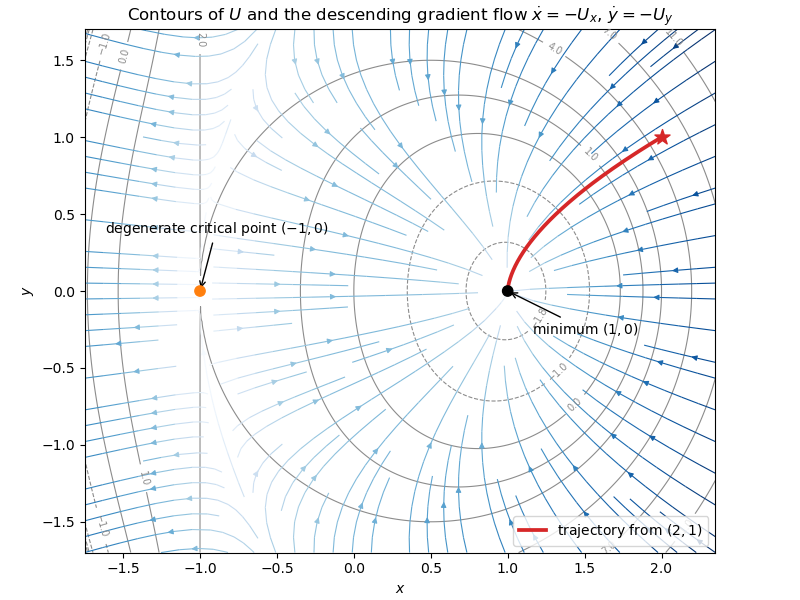

<h1 id="6c/iii/solution">Solution</h1>

↑ **Parent:** [Iii](../iii.md)

Writing $\xi=x-1$, $\eta=y$, the [linearization of a dynamical system](../../../../../../linearization-of-a-dynamical-system.md) is $\dot\xi=-6\xi$, $\dot\eta=-4\eta$. Eliminating $t$ gives $\eta=C\xi^{2/3}$.

**[Figure 1](#6c/iii/image-contours-and-descending-gradient-flow-for-the-2026-paper-ia-2-potential). Contours and descending gradient flow for the 2026 Paper IA 2 potential**. Contour lines of U equal x cubed minus 3x plus open parenthesis x plus 1 close parenthesis y squared are overlaid with the descending gradient field. The highlighted trajectory starts at open parenthesis 2 comma 1 close parenthesis and tends to the local minimum at open parenthesis 1 comma 0 close parenthesis; the other marked critical point is degenerate.

## ↑ Ancestors (11)

1. [Iii](../iii.md)
2. [6C](../../6c.md)
3. [Paper 2](../../../paper-2-split.md)
4. [Ia](../../../split.md)
5. [2026](../../../../split.md)
6. [Past exam of the mathematics course of the University of Cambridge](../../../../../split.md)
7. [Mathematics course of the University of Cambridge](../../../../../../mathematics-course-of-the-university-of-cambridge.md)
8. [Course of the University of Cambridge](../../../../../../course-of-the-university-of-cambridge.md)
9. [University of Cambridge](../../../../../../university-of-cambridge-split.md)
10. [List of universities](../../../../../../list-of-universities.md)
11. [Codex Wiki](../../../../../../split.md)
