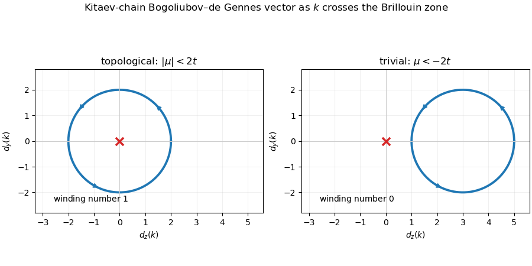

# Paper 342

↑ **Parent:** [Iii](../iii.md)

[https://www.maths.cam.ac.uk/postgrad/part-iii/files/pastpapers/2026/III%20Paper%20342.pdf](https://www.maths.cam.ac.uk/postgrad/part-iii/files/pastpapers/2026/III%20Paper%20342.pdf)

**Table of contents**

- [1](#1)
  - [a](#1/a)
    - [Solution](#1/a/solution)
  - [b](#1/b)
    - [Solution](#1/b/solution)
  - [c](#1/c)
    - [Solution](#1/c/solution)
  - [d](#1/d)
    - [Solution](#1/d/solution)
  - [e](#1/e)
    - [Solution](#1/e/solution)
  - [f](#1/f)
    - [Solution](#1/f/solution)
- [2](#2)
  - [a](#2/a)
    - [Solution](#2/a/solution)
  - [b](#2/b)
    - [Solution](#2/b/solution)
  - [c](#2/c)
    - [Solution](#2/c/solution)
  - [d](#2/d)
    - [Solution](#2/d/solution)
  - [e](#2/e)
    - [Solution](#2/e/solution)
- [3](#3)
  - [a](#3/a)
    - [Solution](#3/a/solution)
  - [b](#3/b)
    - [Solution](#3/b/solution)
  - [c](#3/c)
    - [Solution](#3/c/solution)
  - [d](#3/d)
    - [Solution](#3/d/solution)
  - [e](#3/e)
    - [Solution](#3/e/solution)
  - [f](#3/f)
    - [Solution](#3/f/solution)

## 1

↑ **Parent:** [Paper 342](paper-342.md)

<h3 id="1/a">a</h3>

↑ **Parent:** [1](#1)

<h4 id="1/a/solution">Solution</h4>

↑ **Parent:** [A](#1/a)

Varying the [Abelian Chern--Simons theory](../../../topological-quantum-matter.md#abelian-chern-simons-theory) with respect to $a^I_\alpha$ gives

$$
\boxed{
\frac1{2\pi\hbar}K_{IJ}
\epsilon^{\alpha\beta\gamma}
\partial_\beta a^J_\gamma=j_I^\alpha}.
$$

For a stationary quasiparticle of charge vector $q$, the time component implies that its enclosed gauge flux is

$$
\oint a^I_i\,dx^i
=2\pi\hbar(K^{-1}q)^I
$$

up to the orientation convention. Coupling a particle of charge $p$ to this flux produces the full-braid phase

$$
\boxed{
\exp\!\left(2\pi i\,p^TK^{-1}q\right)
=\exp(2i\theta_{pq})},
\qquad
\boxed{\theta_{pq}=\pi p^TK^{-1}q}.
$$

An exchange is half of the corresponding full braid. Reversing the orientation conjugates the phase.

<h3 id="1/b">b</h3>

↑ **Parent:** [1](#1)

<h4 id="1/b/solution">Solution</h4>

↑ **Parent:** [B](#1/b)

Under $a^I_\alpha\mapsto a^I_\alpha+\partial_\alpha\Lambda^I$, the Chern--Simons term changes by

$$
\frac1{4\pi\hbar}K_{IJ}
\epsilon^{\alpha\beta\gamma}
\partial_\alpha\Lambda^I\partial_\beta a^J_\gamma
=\partial_\alpha\left[
\frac1{4\pi\hbar}K_{IJ}
\epsilon^{\alpha\beta\gamma}
\Lambda^I\partial_\beta a^J_\gamma
\right],
$$

because the contraction with two commuting derivatives vanishes. The source term changes by

$$
-j_I^\alpha\partial_\alpha\Lambda^I
=-\partial_\alpha(j_I^\alpha\Lambda^I)
+\Lambda^I\partial_\alpha j_I^\alpha.
$$

[Current conservation](../../../physics.md#conservation-law) removes the last term, so

$$
\boxed{\delta\mathcal L=\text{a total derivative}}.
$$

<h3 id="1/c">c</h3>

↑ **Parent:** [1](#1)

<h4 id="1/c/solution">Solution</h4>

↑ **Parent:** [C](#1/c)

For a worldline winding once around a noncontractible torus cycle, a large gauge transformation can satisfy

$$
\Delta\Lambda^I=2\pi\hbar n^I,\qquad n^I\in\mathbb Z.
$$

The source action changes by

$$
\Delta S_c=-q_I\oint d\Lambda^I
=-2\pi\hbar q_In^I.
$$

Gauge invariance of the path-integral phase for every integer vector $n$ requires

$$
\exp\left(\frac{i\Delta S_c}{\hbar}\right)
=e^{-2\pi i q\cdot n}=1.
$$

Therefore

$$
\boxed{q\in\mathbb Z^n}.
$$

<h3 id="1/d">d</h3>

↑ **Parent:** [1](#1)

<h4 id="1/d/solution">Solution</h4>

↑ **Parent:** [D](#1/d)

If $W\in SL(n,\mathbb Z)$, then both $W$ and

$$
W^{-1}=\operatorname{adj}(W)
$$

have integer entries. Thus $q'=Wq$ maps $\mathbb Z^n$ into itself, and the inverse map shows that it maps onto all of $\mathbb Z^n$.

Writing the source contraction as $j^Ta$, with $j'=Wj$, invariance requires

$$
j'^Ta'=j^Ta.
$$

Hence

$$
j^TW^Ta'=j^Ta
$$

for every current, so

$$
\boxed{a'=W^{-T}a},
\qquad
\boxed{a=W^Ta'}.
$$

<h3 id="1/e">e</h3>

↑ **Parent:** [1](#1)

<h4 id="1/e/solution">Solution</h4>

↑ **Parent:** [E](#1/e)

Substituting $a=W^Ta'$ into the Chern--Simons term gives

$$
\boxed{K'=WKW^T}.
$$

This matrix is integral and symmetric. It is invertible because

$$
\det K'=(\det W)^2\det K=\det K\ne0.
$$

For $p'=Wp$ and $q'=Wq$,

$$
p'^TK'^{-1}q'
=p^TW^TW^{-T}K^{-1}W^{-1}Wq
=p^TK^{-1}q.
$$

Thus every [anyon](../../../topological-quantum-matter.md#anyon) braiding phase is unchanged, and bijectivity of $W$ on the charge lattice shows that the full sets coincide. The [torus ground-state degeneracy of an Abelian Chern--Simons theory](../../../topological-quantum-matter.md#torus-ground-state-degeneracy-of-an-abelian-chern-simons-theory) is also invariant:

$$
\boxed{|\det K'|=|\det K|}.
$$

<h3 id="1/f">f</h3>

↑ **Parent:** [1](#1)

<h4 id="1/f/solution">Solution</h4>

↑ **Parent:** [F](#1/f)

For

$$
K_1=\begin{pmatrix}0&2\\2&0\end{pmatrix},
\qquad
K_1^{-1}=
\begin{pmatrix}0&1/2\\1/2&0\end{pmatrix},
$$

the two basic particles have bosonic self-statistics and full mutual-braid phase $-1$. Moreover $|\det K_1|=4$. These are the electric and magnetic particles of the [surface code](../../../quantum-error-correction.md#surface-code).

For

$$
K_2=\begin{pmatrix}0&2\\2&4\end{pmatrix},
\qquad
K_2^{-1}=
\begin{pmatrix}-1&1/2\\1/2&0\end{pmatrix},
$$

the first basic particle is a fermion, the second is a boson, and they are [mutual semions](../../../topological-quantum-matter.md#mutual-semion); again $|\det K_2|=4$. They can be identified with $f=e\times m$ and $m$, so this is merely another integral basis for the same surface-code phase.

Finally,

$$
|\det K_3|
=\det\begin{pmatrix}4&2\\2&4\end{pmatrix}
=12,
$$

which already rules it out. Therefore

$$
\boxed{K_1\ \text{and}\ K_2\ \text{describe the surface code};\quad K_3\ \text{does not}.}
$$

## 2

↑ **Parent:** [Paper 342](paper-342.md)

<h3 id="2/a">a</h3>

↑ **Parent:** [2](#2)

<h4 id="2/a/solution">Solution</h4>

↑ **Parent:** [A](#2/a)

The [Knill--Laflamme condition](../../../quantum-error-correction.md#knill-laflamme-condition) for code projector $P$ and errors $\{E_a\}$ is

$$
\boxed{PE_a^\dagger E_bP=C_{ab}P}.
$$

For Pauli errors of weight at most $t$, the product $E_a^\dagger E_b$ has weight at most $2t$. If $d\geq2t+1$, such a product cannot be a nontrivial logical Pauli, because every such operator has weight at least the [distance of a stabilizer code](../../../quantum-error-correction.md#distance-of-a-stabilizer-code) $d$. It is therefore either a stabilizer, acting as a scalar on the code, or it anticommutes with some stabilizer and maps the code to an orthogonal syndrome space. These are exactly the two possibilities required by the displayed condition, so every error on at most $t$ qubits is correctable.

<h3 id="2/b">b</h3>

↑ **Parent:** [2](#2)

<h4 id="2/b/solution">Solution</h4>

↑ **Parent:** [B](#2/b)

The six displayed generators of the [Steane code](../../../quantum-error-correction.md#steane-code) are independent and commuting, so the common positive eigenspace has dimension

$$
2^{7-6}=2;
$$

it encodes one logical qubit. The binary columns of the underlying Hamming parity-check matrix are all nonzero and distinct. Hence no weight-one or weight-two Pauli lies in the stabilizer normalizer outside the stabilizer. On the other hand,

$$
\overline X=X_1X_2\cdots X_7
$$

is logical, and multiplying it by $X_1X_2X_3X_4$ gives the weight-three representative

$$
\overline X\sim X_5X_6X_7.
$$

The analogous statement holds for $\overline Z$, so

$$
\boxed{d=3}.
$$

Now include both $E_1=X_5$ and $E_2=X_6X_7$ in the proposed error set. Their product is

$$
E_1^\dagger E_2=X_5X_6X_7\sim\overline X,
$$

which is non-scalar on the code and violates the [Knill--Laflamme condition](../../../quantum-error-correction.md#knill-laflamme-condition). Since multiplying by a logical operator does not change commutation with stabilizers, $X_5$ and $X_6X_7$ have the same [error syndrome](../../../quantum-error-correction.md#error-syndrome). A decoder cannot know which occurred and may apply a correction that leaves a logical $\overline X$ error.

<h3 id="2/c">c</h3>

↑ **Parent:** [2](#2)

<h4 id="2/c/solution">Solution</h4>

↑ **Parent:** [C](#2/c)

All plaquette stabilizers commute and square to one. Every term in

$$
H=-\sum_P(S_P^{(X)}+S_P^{(Z)})
$$

is minimized by eigenvalue $+1$, so any ground state satisfies

$$
\boxed{S_P^{(X)}|\psi\rangle
=S_P^{(Z)}|\psi\rangle=|\psi\rangle}
$$

for every plaquette.

The R-edge operator $X_{e_R}$ commutes with every X-type stabilizer. It overlaps the two endpoint R plaquettes in an odd number of vertices and every other plaquette evenly, so it anticommutes only with the two endpoint Z-type stabilizers. It flips those two eigenvalues to $-1$, creating two $r_x$ particles. Multiplying by an adjacent R-edge operator toggles the shared endpoint twice, annihilating that excitation there while creating one at the new endpoint. Repetition forms a [string operator in a topological code](../../../quantum-error-correction.md#string-operator-in-a-topological-code) whose two excitations move farther apart.

<h3 id="2/d">d</h3>

↑ **Parent:** [2](#2)

<h4 id="2/d/solution">Solution</h4>

↑ **Parent:** [D](#2/d)

An $r_x$ string is a product of X operators, while a $g_z$ string is a product of Z operators. A process that carries $r_x$ once around $g_z$ can be represented by a closed red X string crossing the green Z string once. At the crossing qubit,

$$
XZ=-ZX,
$$

while all other factors commute. Reversing the order of the two string operators therefore multiplies the state by $-1$. The full braid phase is

$$
\boxed{-1},
$$

so $r_x$ and $g_z$ are [mutual semions](../../../topological-quantum-matter.md#mutual-semion).

<h3 id="2/e">e</h3>

↑ **Parent:** [2](#2)

<h4 id="2/e/solution">Solution</h4>

↑ **Parent:** [E](#2/e)

A green X, Y, or Z string may end on the bottom green boundary without leaving a violated green plaquette beyond the lattice. The top vertex is likewise a zero-length green boundary where such strings can terminate. Thus both locations absorb $g_x,g_y,g_z$: they exhibit [anyon condensation at a boundary](../../../topological-quantum-matter.md#anyon-condensation-at-a-boundary).

A string joining these two green condensers preserves every stabilizer but cannot be reduced to stabilizers, so it is logical. In the pictured lattice the shortest such path contains nine qubits. No shorter nontrivial string connects equivalent condensing boundaries, hence

$$
\boxed{d=9}.
$$

For example, the product of X operators along any shortest green path from the bottom boundary to the top corner is a logical $\overline X$, and the product of Z operators along a corresponding path is a logical $\overline Z$. They may be chosen to overlap on an odd number of vertices, so they anticommute as required for one encoded qubit.

## 3

↑ **Parent:** [Paper 342](paper-342.md)

<h3 id="3/a">a</h3>

↑ **Parent:** [3](#3)

<h4 id="3/a/solution">Solution</h4>

↑ **Parent:** [A](#3/a)

The inverse definitions are

$$
a_j=\frac12(c_{2j-1}+ic_{2j}),
\qquad
a_j^\dagger=\frac12(c_{2j-1}-ic_{2j}).
$$

Substitution into the hopping and pairing terms expresses the Hamiltonian as a bilinear in the [Majorana fermion operators](../../../topological-quantum-matter.md#majorana-fermion-operator). Hermiticity makes its off-diagonal coefficients purely imaginary in the Majorana bilinear, while

$$
c_jc_k=-c_kc_j\qquad(j\ne k)
$$

removes the symmetric part; diagonal terms are constants because $c_j^2=1$. Therefore, up to that additive constant,

$$
\boxed{
H=\frac i4\sum_{j,k=1}^{2M}A_{jk}c_jc_k},
$$

where

$$
\boxed{A_{jk}\in\mathbb R,\qquad A^T=-A}.
$$

Conversely every real antisymmetric $A$ makes this expression Hermitian, so this is the general Majorana form of a [quadratic fermion Hamiltonian](../../../topological-quantum-matter.md#quadratic-fermion-hamiltonian).

<h3 id="3/b">b</h3>

↑ **Parent:** [3](#3)

<h4 id="3/b/solution">Solution</h4>

↑ **Parent:** [B](#3/b)

Define

$$
\chi=Oc.
$$

Because $O$ is real orthogonal, the $\chi_j$ are again self-adjoint and satisfy the Majorana anticommutation relations. Using $A=O^T\varepsilon O$,

$$
H=\frac i4\chi^T\varepsilon\chi.
$$

Each two-dimensional block contributes twice the same ordered bilinear:

$$
\chi_{2j-1}\epsilon_j\chi_{2j}
+\chi_{2j}(-\epsilon_j)\chi_{2j-1}
=2\epsilon_j\chi_{2j-1}\chi_{2j}.
$$

Hence

$$
\boxed{
H=\frac12\sum_{j=1}^M
\epsilon_j\,i\chi_{2j-1}\chi_{2j}}
$$

up to the original additive constant.

<h3 id="3/c">c</h3>

↑ **Parent:** [3](#3)

<h4 id="3/c/solution">Solution</h4>

↑ **Parent:** [C](#3/c)

At $t=\Delta$ and $\mu=0$, direct substitution of

$$
a_j=\frac12(c_{2j-1}+ic_{2j})
$$

into the bond Hamiltonian makes the hopping and pairing terms cancel except for

$$
\boxed{h_j=it\,c_{2j}c_{2j+1}}.
$$

Thus

$$
\boxed{H_0=it\sum_jc_{2j}c_{2j+1}}.
$$

The terms pair disjoint Majoranas, so this is already Majorana diagonal, with nonzero single-particle values $\epsilon_j=2t$. For periodic boundaries the final pair closes around the chain; for open boundaries $c_1$ and $c_{2M}$ remain unpaired.

<h3 id="3/d">d</h3>

↑ **Parent:** [3](#3)

<h4 id="3/d/solution">Solution</h4>

↑ **Parent:** [D](#3/d)

Two local gapped Hamiltonians are [topologically equivalent](../../../topological-quantum-matter.md#topological-equivalence-of-gapped-hamiltonians) when a continuous path of local Hamiltonians joins them without closing the bulk gap. The [Bogoliubov--de Gennes Hamiltonian](../../../topological-quantum-matter.md#bogoliubov-de-gennes-hamiltonian) has energies

$$
E_\pm(k)=\pm\sqrt{(2t\cos k+\mu)^2+4\Delta^2\sin^2k}.
$$

For $t,\Delta>0$, this gap can close only at

$$
\mu=-2t\quad(k=0),
\qquad
\mu=2t\quad(k=\pi).
$$

The whole region $-2t<\mu<2t$ is connected and gapped, so its parameters can be continuously deformed to $t=\Delta,\mu=0$. Therefore

$$
\boxed{H\simeq H_0\quad\text{for }-2t<\mu<2t}.
$$

Writing

$$
H_{\rm BdG}(k)=d_y(k)\sigma_y+d_z(k)\sigma_z,
\qquad
d_y=-2\Delta\sin k,\quad
d_z=-2t\cos k-\mu,
$$

shows the topological distinction. As $k$ crosses the Brillouin zone, $(d_y,d_z)$ traces an ellipse. It encloses the origin once when $|\mu|<2t$, giving nonzero [winding number of a one-dimensional Bogoliubov--de Gennes Hamiltonian](../../../topological-quantum-matter.md#winding-number-of-a-one-dimensional-bogoliubov-de-gennes-hamiltonian). For $\mu<-2t$ it does not enclose the origin and has winding zero. Changing this integer requires the ellipse to pass through the origin, exactly the bulk gap closing.

**[Figure 1](#3/d/image-kitaev-chain-ellipse-and-its-winding-around-the-origin). Kitaev-chain ellipse and its winding around the origin**. For chemical potential zero the Bogoliubov--de Gennes vector traces an ellipse enclosing the origin once. For chemical potential minus 3t the translated ellipse misses the origin and has winding number zero.

<h3 id="3/e">e</h3>

↑ **Parent:** [3](#3)

<h4 id="3/e/solution">Solution</h4>

↑ **Parent:** [E](#3/e)

A [Majorana zero mode](../../../topological-quantum-matter.md#majorana-zero-mode) is a normalized self-adjoint fermion operator localized near a boundary and commuting with the Hamiltonian. With open boundaries,

$$
H_0=it\sum_{j=1}^{M-1}c_{2j}c_{2j+1}.
$$

Neither $c_1$ nor $c_{2M}$ appears. Each anticommutes with both factors in every displayed bilinear and consequently commutes with their product. Thus

$$
\boxed{[H_0,c_1]=[H_0,c_{2M}]=0},
$$

and $c_1,c_{2M}$ are Majorana zero modes localized exactly at the two end sites.

<h3 id="3/f">f</h3>

↑ **Parent:** [3](#3)

<h4 id="3/f/solution">Solution</h4>

↑ **Parent:** [F](#3/f)

Let $U$ be the quasi-local unitary carrying the ground space of $H_0$ to that of a topologically equivalent $H$. Define

$$
\gamma_1=Uc_1U^\dagger,
\qquad
\gamma_{2M}=Uc_{2M}U^\dagger.
$$

Unitary conjugation preserves self-adjointness and the Majorana algebra. Quasi-locality spreads each endpoint operator only into an exponentially decaying tail, and the two operators preserve the ground space because $c_1,c_{2M}$ preserve the ground space of $H_0$.

Diagonalize the quadratic Hamiltonian as

$$
H=\frac12\sum_j\epsilon_j i\chi_{2j-1}\chi_{2j}.
$$

The hint gives a real expansion $\gamma=\sum_jg_j\chi_j$. Any coefficient along a pair with $\epsilon_j>0$ would create or remove a positive-energy quasiparticle and send some ground state outside the two-lowest-state subspace. Ground-space preservation therefore forces $\gamma_1$ and $\gamma_{2M}$ to have support only in the zero-energy Majorana subspace. Hence

$$
\boxed{[H,\gamma_1]=[H,\gamma_{2M}]=0}
$$

in the ideal infinite-chain limit, with only exponentially small finite-size corrections. They are the exponentially localized endpoint [Majorana zero modes](../../../topological-quantum-matter.md#majorana-zero-mode) throughout the topological phase.

## ↑ Ancestors (8)

1. [Iii](../iii.md)
2. [2026](../../2026.md)
3. [Past exam of the mathematics course of the University of Cambridge](../../../past-exam-of-the-mathematics-course-of-the-university-of-cambridge.md)
4. [Mathematics course of the University of Cambridge](../../../university-of-cambridge.md#mathematics-course-of-the-university-of-cambridge)
5. [Course of the University of Cambridge](../../../university-of-cambridge.md#course-of-the-university-of-cambridge)
6. [University of Cambridge](../../../university-of-cambridge.md)
7. [List of universities](../../../README.md#list-of-universities)
8. [Codex Wiki](../../../README.md)
